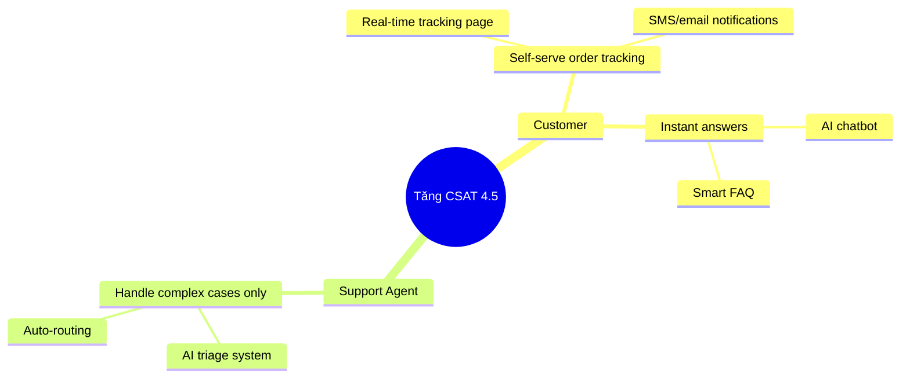

Một anti-pattern rất phổ biến trong product development là **feature factory**: team liên tục xây tính năng nhưng không thật sự biết những tính năng đó tác động thế nào tới business goal. Impact Mapping là kỹ thuật giúp BA thoát khỏi vòng lặp này.

## Impact Mapping là gì?

Impact Mapping là kỹ thuật strategic planning do Gojko Adzic đề xuất. Bản đồ này thường đi theo cấu trúc **WHY -> WHO -> HOW -> WHAT**:

```text
                    [GOAL]
                       |
        ┌──────────────┼──────────────┐
        ↓              ↓              ↓
    [Actor 1]      [Actor 2]      [Actor 3]
        |              |              |
    ┌───┴───┐      ┌───┴───┐      ┌───┴───┐
    ↓       ↓      ↓       ↓      ↓       ↓
[Impact] [Impact] [Impact][Impact][Impact][Impact]
    |       |
┌───┴┐  ┌───┴┐
↓    ↓  ↓    ↓
[Del][Del][Del][Del]
```

| Level | Câu hỏi | Ví dụ |
|-------|---------|-------|
| **Goal (WHY)** | Vì sao ta làm việc này? | Tăng doanh thu Q3 thêm 20% |
| **Actors (WHO)** | Ai tác động đến goal? | Customer, Sales, Support |
| **Impacts (HOW)** | Hành vi của họ cần thay đổi thế nào? | Khách tự phục vụ nhiều hơn |
| **Deliverables (WHAT)** | Cần build gì để tạo impact đó? | AI chatbot, self-service portal |

## Vì sao BA nên dùng Impact Mapping?

### Vấn đề cũ

- Stakeholder yêu cầu feature -> BA document -> Dev build -> feature lên production nhưng goal kinh doanh vẫn không đạt.
- Team không hiểu vì sao mình phải build tính năng đó.
- Prioritization bị chi phối bởi người nói to hơn thay vì business value.

### Impact Mapping giải quyết gì?

- **Traceability**: mỗi deliverable đều trace về được business goal.
- **Scope management**: cắt scope dễ hơn mà không phá hỏng goal.
- **Alignment**: cả team hiểu WHY.
- **Decision quality**: dễ nói “không” với các feature không map được về goal.

## Cách vẽ Impact Map cho dự án AI

### Bước 1: Xác định Goal

Goal phải là **business outcome**, không phải output.

❌ Không tốt: “Ra mắt AI chatbot”
✅ Tốt: “Giảm 40% support tickets trong vòng 6 tháng”

❌ Không tốt: “Triển khai recommendation engine”
✅ Tốt: “Tăng average order value thêm 15%”

Mẫu goal nên theo công thức: **[Metric] [Direction] [Value] [Timeframe]**

### Bước 2: Identify Actors

Liệt kê tất cả các bên có thể ảnh hưởng đến goal:

- **Primary actors**: end users, customers, employees
- **Secondary actors**: support, sales, operations, internal teams
- **Off-stage actors**: regulators, competitors, external systems

### Bước 3: Define Impacts

Với mỗi actor, hỏi: **“Họ cần thay đổi hành vi như thế nào để goal đạt được?”**

Impact phải là **behavior change**, không phải tên feature.

❌ “Dùng chatbot”
✅ “Tự giải quyết được vấn đề mà không cần gọi hotline”

❌ “Nhận recommendation email”
✅ “Mua thêm sản phẩm mà trước đó khách chưa biết tới”

### Bước 4: Brainstorm Deliverables

Sau khi rõ impact, mới hỏi tiếp: **“Ta có thể build gì để tạo ra impact này?”**

Các loại deliverables thường gặp trong AI project:

- Conversational AI
- Recommendation engine
- Predictive dashboard
- Automated classification / routing
- AI-assisted search
- Content hoặc process changes

### Bước 5: Dùng map để prioritize

Sau khi map xong, BA có thể dùng nó để:

1. Xác định **critical path**: deliverable nào ảnh hưởng goal lớn nhất.
2. Ước lượng **confidence**: ta chắc tới đâu rằng deliverable này sẽ tạo impact.
3. Đánh giá **effort vs impact**.
4. Chia nhỏ solution để test hypothesis trước.

## Ví dụ: AI Customer Support

```text
GOAL: Tăng CSAT từ 3.2 -> 4.5 trong Q3 2026

WHO: Customer
HOW:
  - Nhận câu trả lời trong < 2 phút
  - Tự track order status mà không cần chat
  - Hiểu rõ return policy ngay lần đầu
WHAT:
  - AI chatbot
  - Order tracking self-service
  - AI-powered FAQ

WHO: Support Agent
HOW:
  - Tập trung vào complex cases thay vì repetitive Q&A
  - Có đầy đủ context khi escalation xảy ra
WHAT:
  - AI triage & routing
  - AI-generated conversation summary
  - Suggested response templates
```

## Impact Mapping trong Agile

Impact Map thường được làm ở đầu initiative, nhưng BA không nên chỉ làm một lần rồi bỏ đó:

1. **Review theo quý** để xem business goal có đổi không.
2. **Cập nhật sau release** để xem impact có thực sự xuất hiện không.
3. **Dùng như backlog filter**: story mới phải map được về một impact nào đó.
4. **Dùng trong sprint review** để giải thích sprint vừa rồi đang đóng góp cho goal nào.

## Impact Mapping vs User Story Mapping

| | Impact Mapping | User Story Mapping |
|--|---|---|
| **Focus** | Business outcomes | User journey / workflow |
| **Level** | Strategic | Tactical |
| **When** | Early planning, quarterly review | Sprint planning |
| **Output** | Prioritized impacts & deliverables | Prioritized story backlog |

Best practice thường là: dùng **Impact Mapping** để xác định scope và priority, sau đó dùng **User Story Mapping** để tổ chức delivery.

## Tools để vẽ Impact Map

| Tool | Cách dùng |
|------|-----------|
| **Miro** | Whiteboard online có template sẵn |
| **Mermaid** | Code-based, dễ version control |
| **FigJam** | Hợp với team dùng Figma |
| **Draw.io / Lucidchart** | Dùng khi cần diagram formal |
| **Sticky notes** | Phù hợp workshop trực tiếp |

## Sai lầm thường gặp

1. **Goal quá mơ hồ**: “Improve customer experience” thì không đo được.
2. **Bỏ qua secondary actors**: nhiều khi internal team mới là mắt xích làm goal thành công.
3. **Nhảy thẳng tới WHAT**: thiếu HOW thì feature list chỉ là wish list.
4. **Không review sau launch**: map cũ rất nhanh mất giá trị.
5. **Đưa quá nhiều chi tiết**: Impact Map là strategic view, không phải backlog chi tiết.

## Kết luận

Impact Mapping rất hợp với BA thời AI vì AI features thường có ROI không rõ ràng và rất dễ bị build vì “trend”, không phải vì business need thật. Khi mỗi AI feature đều map về một goal cụ thể và đo được, BA sẽ có cơ sở tốt hơn để:

- justify AI investment với management
- cắt bớt những feature không có business case
- align product, data và engineering team
- đo success theo outcome thay vì chỉ theo output

Hãy bắt đầu đơn giản: một goal, hai hoặc ba actors, vài impacts thật sự quan trọng. Vậy là đủ để map có giá trị.---
id: 02760001-ba01-4001-a022-000000000001
title: "Impact Mapping cho BA: Kết nối tính năng với mục tiêu kinh doanh"
slug: impact-mapping-cho-ba
excerpt: >-
  Impact Mapping là kỹ thuật visual planning giúp BA kết nối feature với business
  goal thay vì build feature vì feature. Bài này hướng dẫn cách tạo Impact Map
  cho dự án AI và dùng nó để prioritize backlog một cách có căn cứ.
featured_image: /images/blog/impact-mapping-ba.png
type: blog
reading_time: 10
view_count: 0
meta: null
published_at: '2026-05-05T09:00:00.000000Z'
created_at: '2026-05-05T09:00:00.000000Z'
author: {id: 019c9616-d2b4-713f-9b2c-40e2e92a05cf, name: Duy Tran, avatar: avatars/7e8eb5c6-4cac-455b-a701-4060f085d501.jpeg}
category: {id: 019c9616-cat1-7001-a001-000000000001, name: AI, slug: ai}
tags: [{name: BA, slug: ba}, {name: Impact Mapping, slug: impact-mapping}, {name: Strategy, slug: strategy}, {name: Planning, slug: planning}]
comments: []
---

Một trong những anti-pattern phổ biến nhất trong phát triển sản phẩm là **feature factory** — team liên tục build features mà không rõ feature đó tác động thế nào đến business goal. Impact Mapping là kỹ thuật giúp BA và team thoát khỏi vòng lặp này.

## Impact Mapping là gì?

Impact Mapping là kỹ thuật strategic planning do Gojko Adzic phát triển, tạo ra một visual map theo cấu trúc **WHY → WHO → HOW → WHAT**:

```
                    [GOAL]
                       |
        ┌──────────────┼──────────────┐
        ↓              ↓              ↓
    [Actor 1]      [Actor 2]      [Actor 3]
        |              |              |
    ┌───┴───┐      ┌───┴───┐      ┌───┴───┐
    ↓       ↓      ↓       ↓      ↓       ↓
[Impact] [Impact] [Impact][Impact][Impact][Impact]
    |       |
┌───┴┐  ┌───┴┐
↓    ↓  ↓    ↓
[Del][Del][Del][Del]
```

| Level | Câu hỏi | Ví dụ |
|-------|---------|-------|
| **Goal (WHY)** | Tại sao ta làm cái này? | Tăng revenue 20% Q3 |
| **Actors (WHO)** | Ai tác động đến goal? | Customer, Sales team, Support |
| **Impacts (HOW)** | Họ cần thay đổi behavior thế nào? | Customer tự phục vụ nhiều hơn |
| **Deliverables (WHAT)** | Ta cần build gì để tạo impact đó? | AI chatbot, Self-service portal |

## Tại sao Impact Mapping quan trọng với BA?

### Vấn đề truyền thống:
- Stakeholder request feature → BA document → Dev build → Feature delivered but... business goal không đạt
- Team không biết tại sao mình build cái này
- Prioritization dựa trên "squeaky wheel" thay vì business value

### Impact Mapping giải quyết:
- **Traceability**: Mọi deliverable đều trace được về business goal
- **Scope management**: Dễ cut scope mà không ảnh hưởng goal
- **Alignment**: Mọi người trong team đều hiểu WHY
- **Out-of-scope decisions**: Dễ nói "không" với feature không map được về goal

## Cách tạo Impact Map cho dự án AI

### Bước 1: Xác định Goal (WHY)

Goal phải là **business outcome**, không phải output:

❌ **Không tốt**: "Ra mắt AI chatbot"
✅ **Tốt**: "Giảm 40% support tickets trong 6 tháng"

❌ **Không tốt**: "Implement recommendation engine"
✅ **Tốt**: "Tăng average order value lên 15%"

**Công thức viết goal**: [Metric] [Direction] [Value] [Timeframe]

### Bước 2: Identify Actors (WHO)

Liệt kê tất cả những người/hệ thống có thể ảnh hưởng đến goal:

**Primary Actors** (trực tiếp achieve goal):
- End users (khách hàng, nhân viên)
- Business stakeholders

**Secondary Actors** (hỗ trợ primary actors):
- Internal teams (support, sales, ops)
- External partners

**Off-stage Actors** (ảnh hưởng gián tiếp):
- Regulators
- Competitors
- External systems/APIs

### Bước 3: Define Impacts (HOW)

Với mỗi actor, hỏi: **"Họ cần làm gì KHÁC ĐI để goal được achieved?"**

Impact phải là **behavior change**, không phải feature:

❌ "Sử dụng chatbot" (action, không phải behavior change)
✅ "Tự giải quyết vấn đề mà không cần call hotline"

❌ "Nhận recommendation email"  
✅ "Mua thêm sản phẩm mà trước đây không biết"

**Framework viết impact**: "[Actor] sẽ [verb] [behavior change]"

### Bước 4: Brainstorm Deliverables (WHAT)

Với mỗi impact, hỏi: **"Ta có thể build gì để tạo ra impact này?"**

Đây là bước brainstorm — liệt kê nhiều options, không filter:
- AI features
- UX improvements
- Process changes
- Content/documentation
- Integrations

**AI-specific deliverables cần xem xét:**
- Conversational AI (chatbot, voice assistant)
- Recommendation engine
- Predictive analytics dashboard
- Automated classification/routing
- AI-assisted search
- Personalization engine

### Bước 5: Prioritize bằng Impact Map

Sau khi có map đầy đủ:

1. **Identify critical path**: Deliverable nào tạo impact lớn nhất cho goal?
2. **Estimate confidence**: Ba tin rằng deliverable này sẽ tạo ra impact với xác suất bao nhiêu?
3. **Consider effort**: Đây là high impact/low effort?
4. **Slice**: Có thể deliver một phần nhỏ hơn mà vẫn test hypothesis không?

## Ví dụ thực tế: AI Customer Support

**Scenario**: E-commerce muốn cải thiện customer experience

**Impact Map:**

```
GOAL: Tăng CSAT từ 3.2 → 4.5 trong Q3 2026

WHO: Customer
HOW: 
  - Nhận câu trả lời trong < 2 phút (không phải 24h)
  - Tự track order status mà không cần chat
  - Hiểu chính sách return rõ ràng ngay lần đầu
WHAT:
  - AI chatbot với instant response
  - Order tracking self-service
  - AI-powered FAQ with clear policy explanations

WHO: Support Agent
HOW:
  - Dành thời gian cho complex cases thay vì repetitive Q&A
  - Có context đầy đủ khi escalation xảy ra
WHAT:
  - AI triage & routing system
  - AI-generated conversation summary cho escalations
  - Suggested response templates

WHO: Product Manager  
HOW:
  - Biết pain points thực sự của customer
  - Prioritize roadmap dựa trên impact
WHAT:
  - AI analytics dashboard từ chat data
  - Automated pattern detection từ negative feedback
```

## Impact Mapping trong Agile Sprints

Impact Mapping thường được làm **một lần** ở đầu project, nhưng BA nên:

1. **Review quarterly** — Business goal có thay đổi không?
2. **Update sau each release** — Impact map có deliver được impacts đã expect?
3. **Use as backlog filter** — Mỗi story mới phải map về một impact trong map
4. **Present in sprint reviews** — Show stakeholders: "Sprint này ta achieve impact nào?"

## Impact Mapping vs User Story Mapping

| | Impact Mapping | User Story Mapping |
|--|---|---|
| **Focus** | Business outcomes | User journey/workflow |
| **Level** | Strategic | Tactical |
| **When** | Early planning, quarterly review | Sprint planning |
| **Output** | Prioritized impacts & deliverables | Prioritized story backlog |
| **Used by** | BA + Product + Business | BA + Dev + QA |

**Best practice**: Dùng Impact Mapping để define scope và priority, dùng User Story Mapping để plan delivery.

## Tools để tạo Impact Map

| Tool | Cách dùng |
|------|-----------|
| **Miro** | Digital whiteboard với template sẵn |
| **Mermaid diagram** | Code-based, versionable trong Git |
| **FigJam** | Collaborative với Figma team |
| **Draw.io / Lucidchart** | Formal diagrams |
| **Sticky notes** | Workshop với stakeholders |

**Mermaid template:**


## Sai lầm phổ biến khi làm Impact Mapping

1. **Goal quá vague**: "Improve customer experience" → không đo được
2. **Bỏ qua secondary actors**: Quên mất internal teams cũng cần thay đổi behavior
3. **Jump thẳng vào WHAT**: Thiếu bước HOW → deliverables không có narrative
4. **Không review sau launch**: Map một lần rồi để đó → mất giá trị
5. **Quá detailed ở WHAT**: Impact Map là strategic view, user stories mới là detailed

## Kết

Impact Mapping là công cụ đặc biệt mạnh cho BA trong thời đại AI vì AI features thường **không rõ ROI** và dễ bị build vì "trend" thay vì vì business need. Khi bạn map mọi AI feature về một business goal cụ thể với measurable impact, bạn có thể:

- Justify AI investment với executives
- Cut features không có business case
- Align data science và product teams về priorities
- Measure success một cách có ý nghĩa

Bắt đầu với một goal và 2-3 actors — đừng cố làm perfect map ngay từ đầu.
