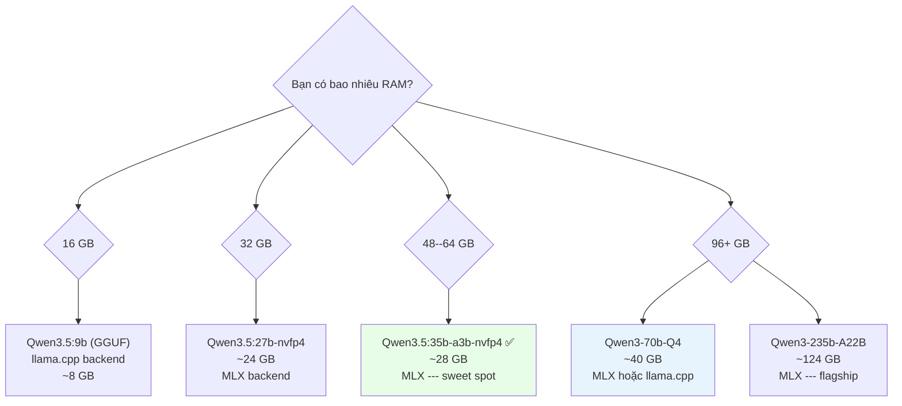
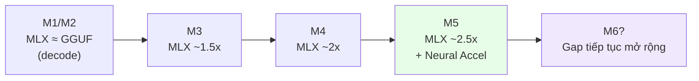

Ngày 30 tháng 3 năm 2026, Ollama tung ra bản preview **v0.19** với một thay đổi âm thầm nhưng có tác động lớn hơn bất kỳ tính năng nào trong hai năm qua: **MLX backend cho Apple Silicon**.

Kết quả thực tế? **93% tốc độ decode nhanh hơn**. **57% prefill nhanh hơn**. Và với các mô hình MoE như Qwen3.5-35B-A3B trên M4 Pro, so sánh MLX vs Ollama cũ là **130 tok/s vs 43 tok/s** --- hơn **3 lần**.

Bài viết này phân tích tại sao điều đó xảy ra, cách nó hoạt động ở tầng kỹ thuật, và cách bạn setup để chạy ngay hôm nay.

* * *

## 1. MLX là gì và tại sao nó quan trọng?

**MLX** là framework machine learning mã nguồn mở do đội nghiên cứu của Apple phát triển. Điểm khác biệt cốt lõi không phải ở API hay tính năng --- mà ở **triết lý thiết kế từ gốc**: MLX được xây dựng _xung quanh_ kiến trúc Unified Memory của Apple Silicon.

Các framework khác (PyTorch, TensorFlow) được port sang macOS --- chúng được thiết kế cho thế giới CPU RAM tách rời GPU VRAM, rồi thêm Metal backend về sau. MLX không có di sản đó.

### Đặc điểm kỹ thuật nổi bật

-   **Unified Memory từ đầu**: Array sống trong vùng nhớ dùng chung giữa CPU và GPU --- không copy, không transfer overhead
-   **Lazy computation**: Tính toán chỉ thực sự chạy khi kết quả được yêu cầu, cho phép tối ưu graph toàn cục
-   **Dynamic graph**: Thay đổi shape của input không kéo theo recompilation chậm
-   **Multi-device per-operation**: Mỗi operation có thể chỉ định CPU hay GPU riêng lẻ
-   **API quen thuộc**: Python API theo NumPy, `mlx.nn` theo PyTorch

**Tính đến đầu 2026**: 24.9k GitHub stars, 4,316 model pre-converted trên HuggingFace (mlx-community org), phiên bản v0.31.1 với 72 releases. Tại WWDC 2025, Apple dành 3 session riêng cho MLX --- khẳng định vị thế framework ưu tiên cho LLM inference trên Apple Silicon.

* * *

## 2. Ollama 0.19: MLX Backend hoạt động như thế nào?

### 2.1. Routing tự động theo format model

Kể từ v0.19, Ollama tự động chọn backend dựa trên format của model --- **không cần cấu hình thêm**:

    GGUF files       →  llama.cpp (Metal backend)   ← như cũ
    safetensors files →  MLX backend                ← mới

Không có flag `--backend mlx`. Không cần sửa config. Nếu bạn pull một model MLX-native (safetensors), Ollama 0.19 tự dùng MLX.

### 2.2. Những gì thay đổi dưới bề mặt

Trước v0.19, Ollama chạy trên Mac về cơ bản là **Go wrapper gọi llama.cpp** với Metal backend. Layer go wrapper này tiêu tốn đáng kể hiệu suất --- benchmark thực tế cho thấy:

-   Raw llama.cpp (không qua Ollama wrapper): **89.4 tok/s**
-   Ollama với llama.cpp backend: **43.5 tok/s** (mất ~51% so với raw!)
-   MLX trực tiếp (mlx-lm): **~130 tok/s**
-   **Ollama 0.19 với MLX**: **112 tok/s** (vẫn có chút overhead từ Go layer, nhưng gần với mlx-lm hơn nhiều)

Diagram thể hiện sự thay đổi kiến trúc:

```mermaid
graph TD
    subgraph "Ollama 0.18 (cũ)"
        A1[Client] --> B1[Go API Layer]
        B1 --> C1[llama.cpp]
        C1 --> D1[Metal shaders\n(dịch từ CUDA)]
        D1 --> E1[Apple GPU]
    end

    subgraph "Ollama 0.19 (mới --- MLX path)"
        A2[Client] --> B2[Go API Layer]
        B2 --> C2[MLX runner]
        C2 --> D2[Native Metal kernels\n+ Neural Accelerators]
        D2 --> E2[Apple Silicon\nGPU + Neural Engine]
    end

    style D1 fill:#fde8e8
    style D2 fill:#e8fde8
```

### 2.3. Kiến trúc hỗ trợ trong v0.19 preview

Ollama 0.19 MLX runner hỗ trợ **6 kiến trúc**:

-   Gemma 3
-   GLM-4 MoE Lite
-   Llama series (toàn bộ)
-   Qwen 3
-   Qwen 3.5
-   Qwen 3.5 MoE

So sánh: llama.cpp hỗ trợ hàng trăm kiến trúc. Đây là trade-off của preview --- hỗ trợ rộng hơn sẽ đến trong các bản tiếp theo.

* * *

## 3. Benchmark thực tế: Con số cụ thể

### 3.1. Dữ liệu chính thức từ Ollama (M5, Qwen3.5-35B-A3B)

| Metric          | Ollama 0.18 (llama.cpp) | Ollama 0.19 (MLX) | Cải thiện |
| --------------- | ----------------------- | ----------------- | --------- |
| Prefill (tok/s) | 1,154                   | 1,810             | **+57%**  |
| Decode (tok/s)  | 58                      | 112               | **+93%**  |
| Decode với int4 | ---                     | 134               | **+131%** |

### 3.2. Community benchmarks (nhiều chip khác nhau)

**M4 Pro MacBook Pro (48GB RAM)**:

| Model                  | Prompt Eval (tok/s) | Decode (tok/s) |
| ---------------------- | ------------------- | -------------- |
| qwen3.5:35b-a3b-q4_K_M | 6.6                 | 30.0           |
| qwen3.5:35b-a3b-nvfp4  | 13.2                | 66.5           |
| qwen3.5:35b-a3b-int4   | **59.4**            | **84.4**       |

**Mac mini M4 Pro (64GB) --- So sánh trực tiếp MLX vs Ollama cũ, Qwen3-Coder-30B-A3B-Instruct 4-bit**:

| Backend            | Decode tok/s | GPU Freq       | RAM dùng    |
| ------------------ | ------------ | -------------- | ----------- |
| MLX-LM             | **~130**     | 346 MHz        | **34.7 GB** |
| Ollama (llama.cpp) | ~43          | 1577 MHz (99%) | 40 GB       |

→ MLX nhanh **3x**, dùng ít RAM hơn **13%**, và chạy GPU ở **tần số thấp hơn 4.5 lần** --- ít nhiệt, ít tiếng quạt, tiết kiệm điện.

**M4 Max (128GB) --- cùng model**:

-   MLX: 130 tok/s
-   Ollama llama.cpp: 43.5 tok/s
-   Raw llama.cpp (không Ollama): 89.4 tok/s

**M1 Max** (caution --- MLX có điểm yếu prefill ở chip cũ):

-   MLX: ~13 tok/s effective (94% thời gian tốn vào prefill)
-   GGUF: ~20 tok/s
-   → Với M1, GGUF vẫn tốt hơn cho workload prefill-heavy

**M4 Max --- Llama 3.2 3B (model nhỏ)**:

-   MLX: hơn **1,100 tok/s** --- M4 Max đạt ngưỡng memory bandwidth saturation với model nhỏ

**M5 --- tăng tốc TTFT so với M4**:

-   Time-to-first-token: nhanh hơn **4.06x**
-   Token generation: nhanh hơn **1.19x**

### 3.3. Khi nào MLX KHÔNG tốt hơn

MLX không phải lúc nào cũng thắng:

    ✅ MLX tốt hơn: Decode dài (coding agent, text generation)
    ✅ MLX tốt hơn: MoE models (Qwen 3.x A3B) --- up to 3x
    ✅ MLX tốt hơn: M4/M5 chips
    ✅ MLX tốt hơn: Tiết kiệm memory

    ❌ GGUF tốt hơn: Short conversation (prefill advantage)
    ❌ GGUF tốt hơn: Context 30K+ token (Flash Attention trên llama.cpp)
    ❌ GGUF tốt hơn: M1 (MLX prefill chậm)
    ❌ GGUF tốt hơn: Model ngoài 6 kiến trúc hỗ trợ

* * *

## 4. Tại sao Unified Memory Architecture tạo ra sự khác biệt?

Đây là phần mà nhiều bài viết bỏ qua --- **tại sao về mặt kiến trúc** MLX nhanh hơn trên Apple Silicon.

### 4.1. Vấn đề của thế giới GPU rời

    ┌─────────────────────────────────────────┐
    │            Traditional System           │
    │                                         │
    │  ┌──────────┐         ┌──────────────┐  │
    │  │   RAM    │ PCIe 4x │  GPU VRAM    │  │
    │  │  64 GB   │◄───────►│  24 GB       │  │
    │  │ ~50 GB/s │         │  ~900 GB/s   │  │
    │  └──────────┘         └──────────────┘  │
    │                                         │
    │  RTX 4090: 24GB VRAM ceiling            │
    │  70B Q4 model = ~35GB → KHÔNG VỪA      │
    └─────────────────────────────────────────┘

RTX 4090 có VRAM 24GB. Model 70B (Q4 quantized ~35GB) không vừa. Bạn phải offload layers sang RAM --- qua PCIe bandwidth hạn chế (~64 GB/s) --- performance sụt thảm.

### 4.2. Unified Memory của Apple Silicon

    ┌─────────────────────────────────────────┐
    │         Apple Silicon (M3/M4/M5)        │
    │                                         │
    │  ┌──────────────────────────────────┐   │
    │  │        Unified Memory Pool        │   │
    │  │           (32--192 GB)            │   │
    │  │     ~400 GB/s (M4 Max)           │   │
    │  │                                  │   │
    │  │  CPU  ◄──────────────►  GPU      │   │
    │  │  ANE  ◄──────────────►  NPU      │   │
    │  │                                  │   │
    │  │  Zero-copy, same address space   │   │
    │  └──────────────────────────────────┘   │
    │                                         │
    │  M2 Ultra: 192GB → 70B Q4 vừa thoải mái│
    └─────────────────────────────────────────┘

**Không có PCIe bottleneck**. Không có VRAM ceiling. Tensor operations hoàn toàn zero-copy giữa CPU và GPU. MLX khai thác điều này từ thiết kế.

### 4.3. Tiết kiệm bộ nhớ thực tế

| Model               | MLX     | GGUF   | Tiết kiệm |
| ------------------- | ------- | ------ | --------- |
| Qwen3-Coder-30B-A3B | 34.7 GB | 40 GB  | **13%**   |
| Qwen3-235B-A22B     | 124 GB  | 133 GB | **7%**    |

### 4.4. M5 Neural Accelerators --- bước nhảy phần cứng

Apple đã thêm **Neural Accelerators chuyên dụng bên trong mỗi GPU core** của M5 --- không chỉ chip nhanh hơn, mà là mạch phần cứng được thiết kế đặc biệt cho compute graph của MLX. 

llama.cpp Metal backend không tự động được hưởng lợi từ hardware mới này vì nó dịch ngược từ CUDA patterns. MLX được tối ưu cho chính xác kiến trúc mới đó.

* * *

## 5. NVFP4 --- Format lượng tử hóa mới

Ollama 0.19 cũng giới thiệu **NVFP4** --- format 4-bit floating point của NVIDIA. Trên Mac/MLX, nó chạy như FP4 compute (không cần GPU Blackwell):

-   **3.5x giảm model footprint** so với FP16
-   **1.8x nhỏ hơn** FP8
-   Chưa đến 1% accuracy loss trên language tasks
-   **Cùng weights** với NVIDIA GPU inference → production parity khi deploy

Thực tế: `qwen3.5:35b-a3b-nvfp4` trên M4 Pro 48GB cho **66.5 tok/s decode** --- gấp đôi so với GGUF Q4 (30 tok/s).

* * *

## 6. Setup thực tế --- Bắt đầu ngay

### 6.1. Yêu cầu

-   Mac với Apple Silicon (M1 trở lên)
-   **>32GB unified memory** (yêu cầu của preview cho model featured --- Qwen3.5-35B-A3B)
-   macOS hiện tại

### 6.2. Cài đặt Ollama 0.19

```bash
# Download tại https://ollama.com/download
# Hoặc update nếu đã cài:
ollama update
```

### 6.3. Kéo model MLX-native

```bash
# Model coding (thinking enabled mặc định)
ollama pull qwen3.5:35b-a3b-coding-nvfp4

# Model chat (presence penalty on, ít over-thinking hơn)
ollama pull qwen3.5:35b-a3b-nvfp4
# (không download lại weights --- chỉ pull config)

# Format int4 --- nhanh nhất cho decode
ollama pull qwen3.5:35b-a3b-int4
```

### 6.4. Chạy lần đầu

```bash
# Chat trực tiếp
ollama run qwen3.5:35b-a3b-nvfp4

# Tắt thinking mode (cho câu hỏi đơn giản)
/set nothink

# Dùng API (OpenAI-compatible)
curl http://localhost:11434/v1/chat/completions \
  -H "Content-Type: application/json" \
  -d '{
    "model": "qwen3.5:35b-a3b-nvfp4",
    "messages": [{"role": "user", "content": "Hello"}]
  }'
```

### 6.5. Dùng với Claude Code / AI coding tools

```bash
# Tích hợp với Claude Code
ollama launch claude --model qwen3.5:35b-a3b-coding-nvfp4

# Kiểm tra backend đang dùng
ollama ps
# Output sẽ cho thấy "mlx" hay "llama.cpp"
```

### 6.6. Kiểm tra hiệu suất thực tế

Dùng `--verbose` trong CLI để thấy tok/s:

```bash
ollama run qwen3.5:35b-a3b-nvfp4 --verbose "Viết một REST API cơ bản"
```

Tìm dòng:

    eval rate:         XX.XX tokens/s   ← đây là decode speed
    prompt eval rate:  XX.XX tokens/s   ← đây là prefill speed

* * *

## 7. Chọn model phù hợp với RAM của bạn



**Gợi ý thực tế**:

| RAM       | Model khuyến nghị     | Backend | Decode est. |
| --------- | --------------------- | ------- | ----------- |
| 16 GB     | qwen3.5:9b            | GGUF    | ~40 tok/s   |
| 32 GB     | qwen3.5:27b-nvfp4     | MLX     | ~55 tok/s   |
| 48--64 GB | qwen3.5:35b-a3b-nvfp4 | MLX     | ~66 tok/s   |
| 96+ GB    | qwen3:70b-q4          | MLX     | ~30 tok/s   |
| 128+ GB   | qwen3.5:35b-a3b-int4  | MLX     | ~130 tok/s  |

**Lưu ý**: 16GB dùng GGUF vì model nhỏ phù hợp với llama.cpp hơn khi prefill-heavy, và RAM giới hạn MLX model choice.

* * *

## 8. Cải tiến caching trong Ollama 0.19

Ngoài MLX, Ollama 0.19 cũng nâng cấp hệ thống **KV cache** đáng kể:

-   **Cross-conversation cache reuse**: Nếu nhiều conversation dùng cùng system prompt (ví dụ định nghĩa tools), cache được tái sử dụng --- ít memory hơn, prefill nhanh hơn
-   **Intelligent checkpoints**: Tự động đánh dấu các điểm quan trọng trong prompt để tái sử dụng
-   **Smarter eviction**: Shared prefix sống lâu hơn ngay cả khi các nhánh cũ bị drop

Thực tế với coding agents quản lý nhiều conversation song song: **giảm đáng kể TTFT** lần thứ 2 trở đi khi context tương tự.

* * *

## 9. Hệ sinh thái MLX rộng hơn

Trước khi Ollama tích hợp, đã có 8 MLX inference server cạnh tranh. Đây là landscape:

| Tool                        | Điểm mạnh                      | Tốc độ vs Ollama 0.18                 |
| --------------------------- | ------------------------------ | ------------------------------------- |
| **mlx-lm** (Apple official) | Ổn định nhất, LoRA fine-tuning | ~3x                                   |
| **Rapid-MLX**               | Drop-in Ollama replacement     | 2--4.2x trên M3 Ultra                 |
| **vLLM-MLX**                | Continuous batching            | 3.4x throughput (5 concurrent)        |
| **oMLX**                    | SSD KV cache persistence       | TTFT từ 30--90s → 1--3s (50K context) |
| **LM Studio**               | GUI + auto MLX/GGUF switching  | Tương đương                           |

Ollama mang lợi thế dễ dùng và model library rộng vào hệ sinh thái MLX --- win-win.

* * *

## 10. Nhìn về tương lai

Điều đáng chú ý nhất không phải các con số benchmark hôm nay --- mà là **trajectory**:

Mỗi thế hệ Apple Silicon mới (M3 → M4 → M5) đều mang thêm phần cứng chuyên biệt cho MLX. M5 Neural Accelerators trong mỗi GPU core là ví dụ rõ nhất: TTFT nhanh hơn 4x chỉ trong một thế hệ.

llama.cpp Metal backend dịch từ CUDA patterns --- nó không tự động khai thác hardware mới này. MLX thì có, vì Ollama giờ route thẳng vào native MLX kernels.

**Kết quả dự đoán**: Khoảng cách hiệu suất sẽ _tăng_ theo từng thế hệ chip mới. Những người dùng Mac để chạy AI local hôm nay đang đầu tư vào kiến trúc đúng hướng.



* * *

## Tóm tắt

Ollama 0.19 + MLX không phải bản cập nhật thông thường. Đây là sự chuyển dịch kiến trúc từ "CUDA patterns dịch sang Metal" sang "native Apple Silicon inference" --- và kết quả là **57--93% nhanh hơn trên benchmark chính thức**, **3x nhanh hơn trong thực tế với MoE models**, và tiêu thụ ít tài nguyên hơn.

**Bắt đầu ngay**:

1.  Update Ollama lên 0.19
2.  `ollama pull qwen3.5:35b-a3b-nvfp4` (nếu có ≥48GB RAM)
3.  Chạy với `--verbose` để xem tok/s thực tế của máy bạn
4.  So sánh với model GGUF cũ --- sự khác biệt sẽ nói lên tất cả

* * *

_Nguồn tham khảo: Ollama 0.19 Release Notes (March 30, 2026), Apple MLX GitHub (ml-explore/mlx v0.31.1), Ars Technica "Running local models on Macs gets faster with Ollama's MLX support" (March 2026), HackerNews discussion, r/LocalLLM & r/LocalLLaMA community benchmarks._
