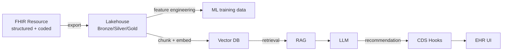
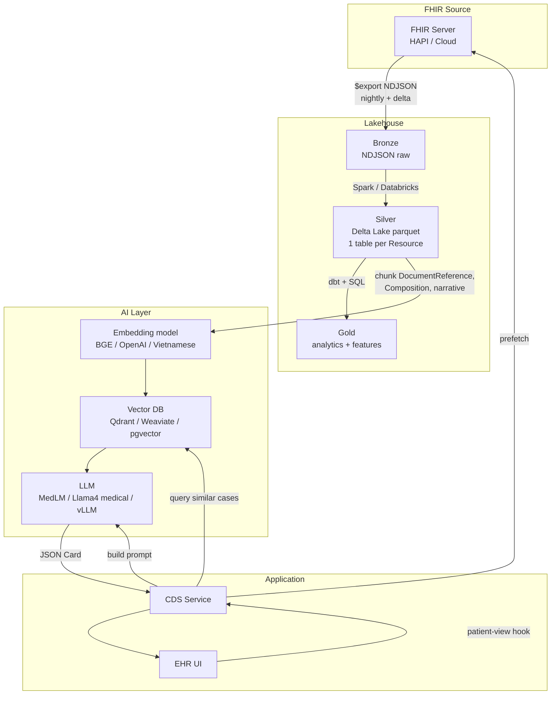
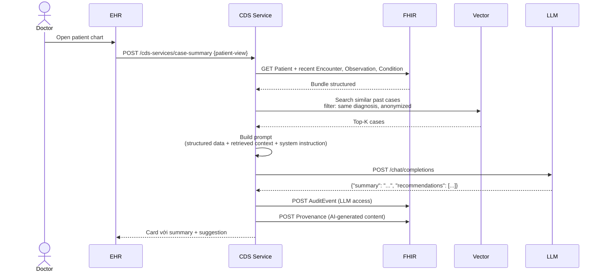
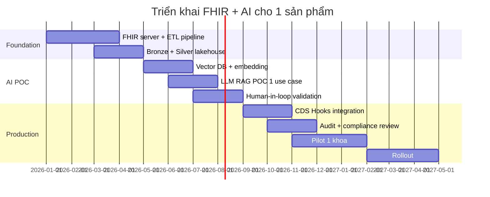

LLM y khoa (MedLM, GPT-4o medical, Llama 4 fine-tuned) đang thay đổi cách bác sĩ làm việc. Nhưng để AI hữu ích trong lâm sàng, nó cần truy cập **data thật của patient** — và đó là lúc FHIR + RAG vào cuộc. Bài này hướng dẫn pipeline đầy đủ.

## 1. Vì sao FHIR là nền tảng tốt cho AI y khoa



5 lý do:
1. **Structured**: code (LOINC/SNOMED/ICD) chuẩn → AI hiểu nhất quán
2. **Versioned**: mọi thay đổi có lịch sử → tránh data leakage
3. **Provenance**: biết data từ đâu → reproducibility
4. **Consent**: AI tôn trọng quyền patient
5. **Bulk Export**: pipeline ETL chuẩn

## 2. Architecture tham khảo



## 3. Pipeline ETL từ FHIR

### 3.1 Bronze: Bulk Export

Đã cover ở [Bulk Data Export](/blog/fhir-bulk-data-export-cds-hooks). Setup nightly job:

```python
import requests, time

def kickoff_export(base, token, types):
    r = requests.get(f"{base}/$export",
        params={"_type": ",".join(types), "_since": "2026-05-06T00:00:00Z"},
        headers={"Authorization": f"Bearer {token}", "Accept": "application/fhir+json", "Prefer": "respond-async"})
    return r.headers["Content-Location"]

def poll(status_url, token):
    while True:
        r = requests.get(status_url, headers={"Authorization": f"Bearer {token}"})
        if r.status_code == 200:
            return r.json()
        time.sleep(30)
```

Output ndjson → Bronze layer (S3 / Azure Blob / GCS / HDFS).

### 3.2 Silver: Delta Lake parquet

Spark transform, schema theo từng Resource type:

```python
from pyspark.sql import SparkSession
spark = SparkSession.builder.appName("fhir-silver").getOrCreate()

df_patient = spark.read.json("s3://bronze/2026-05-06/Patient*.ndjson")

# Flatten
df_patient_flat = df_patient.select(
    "id", "gender", "birthDate",
    "name[0].family".alias("family_name"),
    "address[0].city".alias("city"),
    "meta.lastUpdated"
)

df_patient_flat.write \
    .format("delta") \
    .mode("append") \
    .partitionBy("city") \
    .save("s3://silver/Patient")
```

Tương tự cho Observation, Condition, etc. Lưu schema partition theo year/month.

### 3.3 Gold: feature engineering

```sql
-- Hb1Ac latest per patient
WITH ranked AS (
  SELECT
    subject.reference AS patient,
    valueQuantity.value AS hba1c,
    effectiveDateTime,
    ROW_NUMBER() OVER (PARTITION BY subject.reference ORDER BY effectiveDateTime DESC) AS rn
  FROM silver.Observation
  WHERE code.coding[0].code = '4548-4'
)
SELECT patient, hba1c, effectiveDateTime AS last_hba1c_date
FROM ranked
WHERE rn = 1
```

Gold table dành cho BI dashboard và ML training.

## 4. Embedding clinical notes

DocumentReference + Composition + Observation.note + Condition.note chứa text giàu thông tin.

### 4.1 Chunking strategy

```python
def chunk_clinical_note(text, max_tokens=400, overlap=50):
    # 1. Tách theo section header (### Subjective, ### Objective, ### Assessment, ### Plan)
    # 2. Trong section, tách theo paragraph
    # 3. Greedy merge tới max_tokens
    # 4. Overlap 50 token để giữ context
    ...
```

Đặc thù tiếng Việt: word segmentation (vncorenlp / underthesea) trước khi tokenize.

### 4.2 Embedding model

| Model | Note |
|---|---|
| `text-embedding-3-large` (OpenAI) | Mạnh, đắt, gửi PHI ra ngoài → không cho VN |
| `BAAI/bge-large-en-v1.5` | Free, multilingual ổn |
| `intfloat/multilingual-e5-large` | Tiếng Việt tốt |
| **`vinai/phobert-base-v2`** | Pretrain VN, fine-tune được cho clinical |
| `vietnamese-bi-encoder` | Specialized VN |

**Khuyến nghị**: dùng VN-pretrained + fine-tune trên clinical corpus để giữ PHI on-prem.

### 4.3 Metadata trên embedding

Quan trọng — không chỉ vector:

```python
{
    "id": "doc-123#chunk-2",
    "vector": [0.012, -0.034, ...],
    "payload": {
        "patient_pseudo_id": "hash(CCCD)",
        "resource_type": "DocumentReference",
        "fhir_id": "DocumentReference/dr-456",
        "encounter_id": "Encounter/enc-789",
        "section": "assessment",
        "code": ["E11.9", "44054006"],
        "date": "2026-04-15",
        "consent_id": "Consent/con-001"
    }
}
```

Metadata để filter retrieval theo patient (must match), date range, code.

## 5. RAG architecture



## 6. Prompt template ví dụ

```text
Bạn là trợ lý lâm sàng cho bác sĩ nội khoa. Phân tích thông tin bệnh nhân dưới đây
và đề xuất 3 hướng xử trí ưu tiên cao nhất theo guideline VN.

[CONTEXT - Cấu trúc]
- Patient: 36 tuổi, nam
- Active conditions:
  - E11.9 (Diabetes type 2) — 2 năm
  - I10 (Tăng huyết áp) — 1 năm
- Latest HbA1c: 8.2% (cao, mục tiêu <7%)
- BP gần nhất: 145/95 mmHg
- Đang dùng: Metformin 500mg 2v/ngày

[CONTEXT - Cases tương tự (đã anonymize)]
1. Bệnh nhân tương tự, sau khi tăng Metformin lên 1000mg + thêm Empagliflozin 10mg, HbA1c giảm về 7.1% sau 3 tháng.
2. Bệnh nhân tương tự, thêm ACE-i (Lisinopril 10mg) cho THA không kiểm soát, BP về 130/80 sau 2 tháng.

[YÊU CẦU]
- Chỉ đề xuất phác đồ có trong danh mục thuốc Bộ Y tế VN
- Mỗi đề xuất kèm: lý do, mức bằng chứng, theo dõi cần thiết
- Kết quả JSON tuân theo schema CDSCard

[OUTPUT JSON]
{
  "summary": "...",
  "recommendations": [
    {"action": "...", "rationale": "...", "evidence_level": "A|B|C", "monitoring": "..."}
  ],
  "warnings": []
}
```

## 7. Privacy & compliance khi dùng LLM

### 7.1 Phân loại model theo PHI exposure

| Loại | Có gửi PHI? | OK với VN? |
|---|---|---|
| LLM on-prem (vLLM + Llama 4 medical) | Không (data ở DC nội bộ) | OK |
| Cloud LLM với BAA + region VN/Singapore | Có (mã hoá) | OK với DPIA |
| Public API (ChatGPT, Claude) không BAA | KHÔNG GỬI PHI | Cấm |

### 7.2 Kỹ thuật pseudonymize trước khi gửi LLM

```python
import re

def pseudonymize_text(text, mapping):
    # mapping: dict {real_value: pseudo_token}
    for real, pseudo in mapping.items():
        text = re.sub(re.escape(real), pseudo, text, flags=re.IGNORECASE)
    return text

def restore_text(text, mapping):
    inverse = {v: k for k, v in mapping.items()}
    for pseudo, real in inverse.items():
        text = text.replace(pseudo, real)
    return text
```

Hoặc dùng NER PHI (vd `presidio-analyzer`) phát hiện auto.

### 7.3 Audit + Provenance cho AI output

Mỗi response từ LLM phải:
- Tạo `AuditEvent` (who triggered, model used, timestamp)
- Tạo `Provenance` linked với resource AI-generated (vd `Composition` summary)
- Lưu prompt + response (encrypted) cho 7 năm

```json
{
  "resourceType": "Provenance",
  "target": [{"reference": "Composition/ai-summary-123"}],
  "recorded": "2026-05-07T14:00:00+07:00",
  "agent": [{
    "type": {"coding": [{"code": "author"}]},
    "who": {"display": "AI: gpt-4o-medical-2025-12 via vLLM internal"},
    "onBehalfOf": {"reference": "Practitioner/dr-nguyen"}
  }],
  "entity": [{
    "role": "source",
    "what": {"reference": "Bundle/prefetch-context-123"}
  }],
  "extension": [{
    "url": "http://example.org/StructureDefinition/llm-prompt-id",
    "valueIdentifier": {"value": "prompt-log-uuid"}
  }]
}
```

## 8. Đánh giá chất lượng AI clinical

Không bao giờ deploy AI clinical mà không evaluate:

| Test set | Mục đích |
|---|---|
| **Retrospective** | Predict outcome từ data cũ, so với ground truth |
| **Hallucination check** | Đếm số lượng claim không có trong context |
| **Citation faithfulness** | Mỗi recommendation có evidence trong retrieved context không? |
| **Bias** | Performance theo gender/age/dân tộc/region |
| **Adversarial** | PHI leak qua prompt injection |
| **Human-in-the-loop** | Bác sĩ chấm điểm clinical relevance |

## 9. Use case tiếng Việt khả thi

1. **Tổng kết bệnh án** (discharge summary draft) — bác sĩ chỉnh sửa, ký
2. **Cảnh báo tương tác thuốc** với danh mục VN
3. **Sàng lọc bệnh dịch tễ** (sốt xuất huyết, COVID) theo hướng dẫn Bộ Y tế
4. **Mã hoá ICD-10 từ note tiếng Việt** (autocoding cho thanh toán BHYT)
5. **Hỏi đáp lâm sàng dựa trên hướng dẫn Bộ Y tế** (RAG over guideline PDF)
6. **Patient summary cho VNeID Sổ SKĐT** (giải thích kết quả XN cho công dân)

## 10. Anti-pattern

- ❌ Gửi PHI thật cho ChatGPT public
- ❌ Train LLM trên data thật mà không de-identify
- ❌ AI tự ký đơn thuốc / chẩn đoán cuối cùng (legal liability!)
- ❌ Không có human review cho recommendation cấp cứu
- ❌ Cache AI response permanently (consent có thể rút)
- ❌ Quên versioning model — không reproduce được khi audit

## 11. Stack đề xuất cho VN startup y tế

| Layer | Open-source | Cloud managed |
|---|---|---|
| FHIR Server | HAPI FHIR JPA | Azure Health Data Services |
| Lakehouse | Delta Lake / Iceberg + Spark | Databricks / Synapse |
| Vector DB | Qdrant / Milvus / pgvector | Pinecone / Vertex AI |
| Embedding | bge-m3 / Vietnamese-BERT | OpenAI text-embedding-3 |
| LLM | Llama 4 + vLLM on-prem | Azure OpenAI / Vertex MedLM |
| Orchestration | LangChain / LlamaIndex | Vertex AI Agent Builder |
| CDS | Custom Java/Python service | n/a |

## 12. Timeline triển khai



## Kết luận

FHIR là cách bài bản nhất để đưa data y tế cho AI. Pipeline Bulk Export → Lakehouse → Vector DB → RAG → CDS Hooks vừa scale tốt vừa tôn trọng privacy. Quan trọng nhất: human-in-the-loop và audit đầy đủ trước khi deploy lâm sàng.

Bạn đã hoàn thành toàn bộ roadmap [HL7 FHIR Practitioner](/roadmap/hl7-fhir). Bước tiếp theo: thực hành dự án thật + đóng góp vào VN Core IG cộng đồng.
