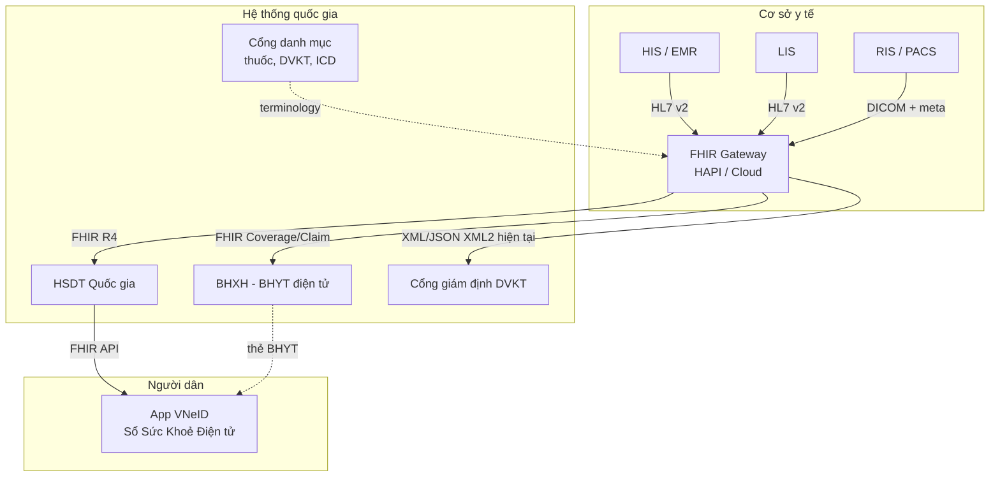
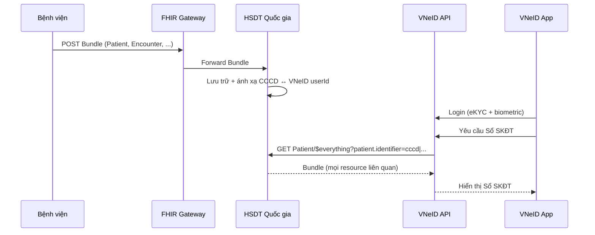
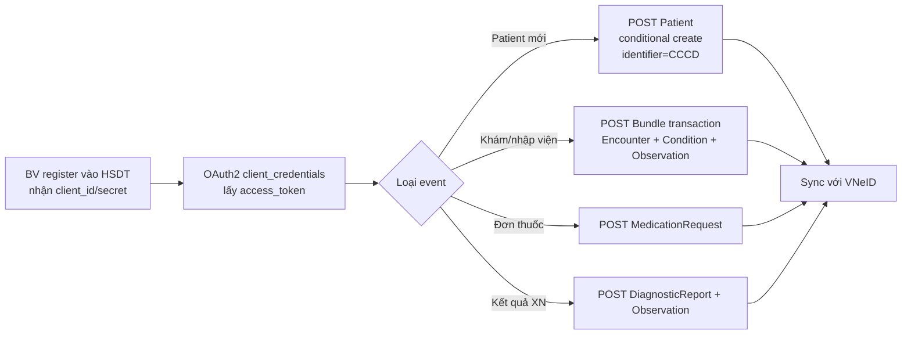
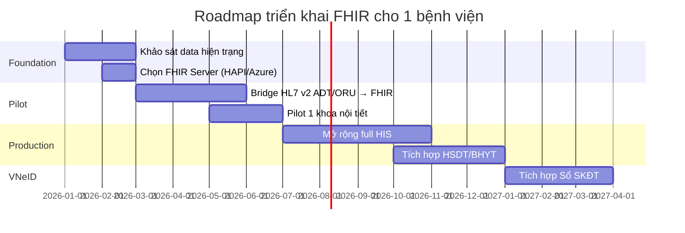

Quyết định 3516/QĐ-BYT (11/2025) đặt nền cho hệ sinh thái dữ liệu y tế Việt Nam giai đoạn 2025-2030 với data làm trung tâm. Bài này tập trung vào áp dụng FHIR thực tế cho **3 trụ cột**: BHYT, VNeID Sổ Sức Khoẻ Điện tử, và HSDT quốc gia.

## 1. Bức tranh tổng



## 2. Mã định danh quốc gia

Việt Nam có nhiều ID, mỗi loại có namespace URI riêng (đề xuất):

| ID | URI system đề xuất | Resource |
|---|---|---|
| **CCCD** (Căn cước công dân) | `http://moh.gov.vn/sid/cccd` | Patient.identifier (use=official) |
| **Số định danh cá nhân (12 số trong CCCD)** | `urn:oid:CCCD-PIN` | Như trên |
| **Mã thẻ BHYT** | `http://moh.gov.vn/sid/bhyt` | Coverage.identifier |
| **Mã hồ sơ y tế (MR nội bộ)** | `http://benhvien.vn/<id>/sid/mr` | Patient.identifier (use=usual) |
| **CCPHN** (chứng chỉ hành nghề) | `http://moh.gov.vn/sid/ccphn` | Practitioner.identifier |
| **Mã cơ sở y tế** | `http://moh.gov.vn/sid/cosoyte` | Organization.identifier |
| **Mã VNeID** | `http://vneid.gov.vn/sid/userid` | Patient.identifier (link Sổ SKĐT) |

```json
"identifier": [
  {"use": "official", "system": "http://moh.gov.vn/sid/cccd", "value": "001234567890"},
  {"use": "secondary", "system": "http://moh.gov.vn/sid/bhyt", "value": "DN1234567890123"},
  {"use": "secondary", "system": "http://vneid.gov.vn/sid/userid", "value": "vne-abc-123"},
  {"use": "usual", "system": "http://benhvien.vn/CSY-001/sid/mr", "value": "HN12345"}
]
```

## 3. BHYT — Coverage

Thẻ BHYT mang nhiều thông tin: nhóm đối tượng, mức hưởng, thời hạn, nơi đăng ký KCB ban đầu.

```json
{
  "resourceType": "Coverage",
  "status": "active",
  "type": {"coding": [{"system": "http://moh.gov.vn/CodeSystem/loai-bao-hiem", "code": "BHYT"}]},
  "policyHolder": {"reference": "Patient/vn-001"},
  "subscriber": {"reference": "Patient/vn-001"},
  "subscriberId": "DN1234567890123",
  "beneficiary": {"reference": "Patient/vn-001"},
  "relationship": {"coding": [{"code": "self"}]},
  "period": {"start": "2026-01-01", "end": "2026-12-31"},
  "payor": [{"reference": "Organization/bhxh-vn"}],
  "class": [
    {
      "type": {"coding": [{"system": "http://moh.gov.vn/CodeSystem/nhom-dt", "code": "DN", "display": "Doanh nghiệp"}]},
      "value": "DN"
    },
    {
      "type": {"coding": [{"code": "muc-huong"}]},
      "value": "80"
    }
  ],
  "extension": [
    {
      "url": "http://moh.gov.vn/StructureDefinition/noi-dk-kcb-ban-dau",
      "valueReference": {"reference": "Organization/bv-cho-ray"}
    },
    {
      "url": "http://moh.gov.vn/StructureDefinition/ngay-du-5nam",
      "valueDate": "2031-01-01"
    }
  ]
}
```

## 4. Hồ sơ thanh toán — Claim

```json
{
  "resourceType": "Claim",
  "status": "active",
  "type": {"coding": [{"system": "http://moh.gov.vn/CodeSystem/loai-claim", "code": "BHYT-OUTPATIENT"}]},
  "use": "claim",
  "patient": {"reference": "Patient/vn-001"},
  "billablePeriod": {"start": "2026-05-07T08:00:00+07:00", "end": "2026-05-07T11:00:00+07:00"},
  "created": "2026-05-07T11:30:00+07:00",
  "insurer": {"reference": "Organization/bhxh-vn"},
  "provider": {"reference": "Organization/bv-cho-ray"},
  "priority": {"coding": [{"code": "normal"}]},
  "diagnosis": [{
    "sequence": 1,
    "diagnosisCodeableConcept": {"coding": [{"system": "http://hl7.org/fhir/sid/icd-10", "code": "E11.9"}]},
    "type": [{"coding": [{"code": "principal"}]}]
  }],
  "insurance": [{"sequence": 1, "focal": true, "coverage": {"reference": "Coverage/cov-001"}}],
  "item": [
    {
      "sequence": 1,
      "productOrService": {"coding": [{"system": "http://moh.gov.vn/CodeSystem/dvkt", "code": "21.0001", "display": "Khám lâm sàng nội tiết"}]},
      "servicedDate": "2026-05-07",
      "quantity": {"value": 1},
      "unitPrice": {"value": 50000, "currency": "VND"},
      "net": {"value": 50000, "currency": "VND"}
    },
    {
      "sequence": 2,
      "productOrService": {"coding": [{"system": "http://moh.gov.vn/CodeSystem/dvkt", "code": "23.1234", "display": "HbA1c"}]},
      "servicedDate": "2026-05-07",
      "quantity": {"value": 1},
      "unitPrice": {"value": 80000, "currency": "VND"},
      "net": {"value": 80000, "currency": "VND"}
    }
  ],
  "total": {"value": 130000, "currency": "VND"}
}
```

Currency `VND` (ISO 4217). DVKT codes ánh xạ từ Thông tư danh mục DVKT của Bộ Y tế.

Lưu ý: cổng giám định BHYT hiện tại (XML 4210) chưa nhận FHIR native — bạn cần một bước transform FHIR Claim → XML schema BHYT. Đây là cơ hội để Bộ ban hành chuẩn FHIR-based trong tương lai.

## 5. VNeID Sổ Sức Khoẻ Điện tử

VNeID là app công dân, được Thủ tướng phát động Sổ Sức Khoẻ Điện tử 10/2024. Tới 1/2026 đã có 34+ triệu Sổ.

### 5.1 Architecture đề xuất



### 5.2 Consent

VNeID app sẽ là kênh consent chính cho công dân:

```json
{
  "resourceType": "Consent",
  "status": "active",
  "scope": {"coding": [{"system": "...consent-scope", "code": "patient-privacy"}]},
  "category": [{"coding": [{"system": "...consent-category", "code": "INFAO"}]}],
  "patient": {"reference": "Patient/vn-001"},
  "dateTime": "2026-05-07T11:00:00+07:00",
  "performer": [{"reference": "Patient/vn-001"}],
  "policy": [{"uri": "https://vneid.gov.vn/policy/share-medical-record"}],
  "provision": {
    "type": "permit",
    "period": {"start": "2026-05-07", "end": "2027-05-07"},
    "actor": [{
      "role": {"coding": [{"code": "PRCP", "display": "recipient"}]},
      "reference": {"reference": "Organization/bv-cho-ray"}
    }],
    "action": [{"coding": [{"code": "access"}]}, {"coding": [{"code": "disclose"}]}]
  }
}
```

## 6. Phòng khám/bệnh viện kết nối HSDT

### 6.1 Profile khuyến nghị

Việt Nam nên kế thừa **IPS (International Patient Summary)** + thêm extension VN. Cấu trúc IG đề xuất:

- `http://moh.gov.vn/fhir/ig/vn-core/StructureDefinition/VN-Patient` — extends Patient, must-support `identifier (CCCD)`, `extension (dan-toc, ton-giao, noi-sinh)`
- `VN-Encounter` — must-support `class`, `serviceProvider`, extension `nguon-kinh-phi (BHYT/Tự túc/Bảo hiểm khác)`
- `VN-Condition-BHYT` — bind `code` vào ValueSet ICD-10 BHYT
- `VN-MedicationRequest` — bind vào danh mục thuốc BHYT
- `VN-Coverage-BHYT` — bind các code đối tượng/mức hưởng

### 6.2 Extension phổ biến cần định nghĩa

```json
[
  {"url": ".../dan-toc", "valueCoding": {"system": "...", "code": "01"}},
  {"url": ".../ton-giao", "valueCoding": {...}},
  {"url": ".../nghe-nghiep", "valueCoding": {...}},
  {"url": ".../noi-sinh", "valueAddress": {...}},
  {"url": ".../vneid-userid", "valueIdentifier": {"system": "http://vneid.gov.vn/sid/userid", "value": "..."}}
]
```

## 7. Quy trình tích hợp HSDT



## 8. Mapping HL7 v2 → FHIR cho VN

Hầu hết HIS bệnh viện gửi HL7 v2. Ví dụ ADT^A04 (registration ngoại trú):

| Segment | Resource FHIR | Note VN |
|---|---|---|
| MSH | (metadata) | source = sending facility |
| EVN | (event) | A04 → Encounter.status="arrived" |
| PID | Patient | identifier CCCD ưu tiên |
| PD1 | Patient.generalPractitioner | bác sĩ gia đình |
| NK1 | Patient.contact | người liên hệ khẩn |
| PV1 | Encounter | class=AMB, location, attender |
| IN1 | Coverage | mã BHYT, mức hưởng |
| GT1 | Account | thông tin thanh toán |

Mirth Connect script JavaScript transform v2 → FHIR Bundle là kỹ năng có giá trị cao trên thị trường VN.

## 9. Roadmap triển khai cho 1 bệnh viện



## 10. Câu hỏi thường gặp

**Q: Bộ Y tế đã ban hành IG FHIR chưa?**  
A: Tới 5/2026 chưa có IG chính thức cho VN. Cộng đồng đang khởi xướng VN Core IG dựa trên IPS. Quyết định 3516/QĐ-BYT mở đường cho việc này.

**Q: Khi nào có FHIR API của BHXH?**  
A: BHXH vẫn dùng schema XML giám định 4210 (XML2). Chuyển sang FHIR là roadmap dài hạn theo chiến lược chuyển đổi số.

**Q: VNeID có FHIR endpoint công khai cho ứng dụng bên thứ 3?**  
A: Hiện tại VNeID chưa public FHIR API cho third-party. Theo dõi Cục C06 và Bộ Y tế để cập nhật.

**Q: Phí license SNOMED CT cho VN?**  
A: VN chưa là member SNOMED International. Có thể dùng cho R&D miễn phí, production cần đàm phán license hoặc dùng cloud có sẵn license (Azure).

## Kết luận

FHIR là chuẩn để Việt Nam liên thông y tế quốc gia thực sự. Hôm nay: bridge v2 → FHIR ở edge bệnh viện, nắm chặt CCCD/BHYT/VNeID identifier, viết VN Core IG. Mai: full FHIR-native từ HIS đến BHXH.

Bài tiếp: [FHIR Profiling và Implementation Guide với FSH/SUSHI](/blog/fhir-profiling-implementation-guide-fsh-sushi).
