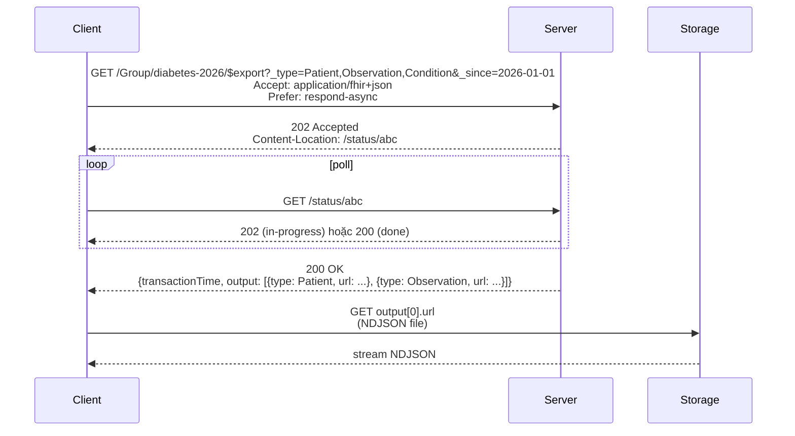
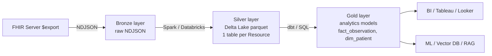
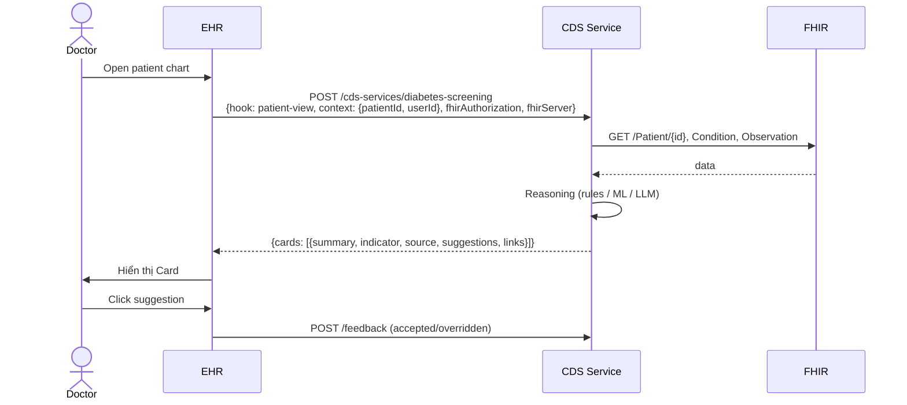
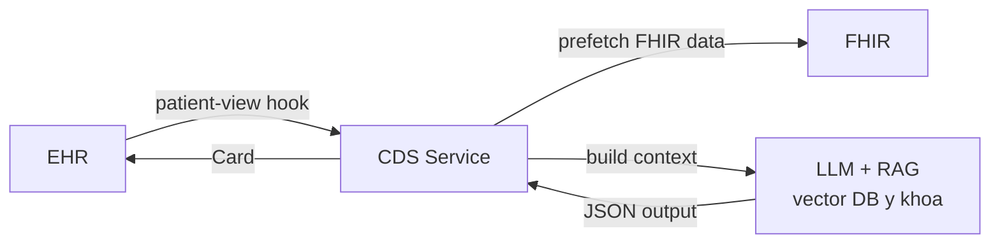

REST FHIR phù hợp cho UI và transaction nhỏ. Khi cần hàng triệu Resource cho analytics/AI, hoặc khi cần đưa khuyến nghị real-time vào màn hình bác sĩ, bạn cần 2 chuẩn riêng: **Bulk Data Export** và **CDS Hooks**.

## Phần 1 — Bulk Data Export

### 1. Vì sao không dùng search bình thường?

Search có pagination, mỗi page max ~1000. Để export 1 triệu Patient bằng search → 1000+ requests, hours nếu chained `_include`. Không khả thi.

Bulk Data thiết kế cho:
- Async (server background process)
- NDJSON (newline-delimited JSON, 1 resource/line) — streaming-friendly
- Output qua URL cloud storage (S3/Azure Blob)
- Group filter, since filter

### 2. 3 loại $export

```http
GET /$export                        # System-level: mọi resource
GET /Group/{id}/$export              # Group-level: 1 group bệnh nhân
GET /Patient/$export                 # Patient-level: tất cả patient mà client có quyền
```

### 3. Flow



### 4. Kick-off request

```http
GET /Group/diabetes-2026/$export?
  _type=Patient,Observation,Condition&
  _since=2026-01-01T00:00:00Z&
  _typeFilter=Observation%3Fcategory%3Dlaboratory
HTTP/1.1
Accept: application/fhir+json
Prefer: respond-async
Authorization: Bearer <token with system/*.read scope>
```

Header `Prefer: respond-async` bắt buộc.

### 5. Status response

Khi xong:

```json
{
  "transactionTime": "2026-05-07T13:00:00Z",
  "request": "https://fhir.example.org/Group/diabetes-2026/$export?...",
  "requiresAccessToken": true,
  "output": [
    {"type": "Patient", "url": "https://output.example.org/Patient.ndjson"},
    {"type": "Patient", "url": "https://output.example.org/Patient-2.ndjson"},
    {"type": "Observation", "url": "https://output.example.org/Observation.ndjson"},
    {"type": "Condition", "url": "https://output.example.org/Condition.ndjson"}
  ],
  "deleted": [
    {"type": "Bundle", "url": "https://output.example.org/Deleted.ndjson"}
  ],
  "error": []
}
```

`deleted` chứa các tombstone (resource đã bị xoá kể từ `_since`) — quan trọng cho delta sync.

### 6. NDJSON content

```ndjson
{"resourceType":"Patient","id":"vn-001","name":[{"family":"Trần"}]}
{"resourceType":"Patient","id":"vn-002","name":[{"family":"Nguyễn"}]}
{"resourceType":"Patient","id":"vn-003","name":[{"family":"Lê"}]}
```

Streaming parse — không load file full RAM.

### 7. Ingest sang lakehouse



Pattern Bronze/Silver/Gold của Lakehouse rất phù hợp với FHIR.

### 8. Cấu hình HAPI Bulk Export

HAPI có module Bulk Export:

```yaml
hapi:
  fhir:
    bulk_export_enabled: true
    bulk_export_chunk_size: 500
binary_storage_enabled: true
```

Output mặc định Binary resource hoặc S3-compatible storage.

### 9. Cloud managed Bulk

| Service | Bulk support |
|---|---|
| **Azure Health Data Services** | Native $export, output Azure Blob |
| **GCP Healthcare API** | `fhirStores.export` → Cloud Storage |
| **AWS HealthLake** | `StartFHIRExportJob` → S3 |
| **Smile CDR** | Bulk Export với chunking nâng cao |

### 10. Bulk Import

Ngược lại — load NDJSON vào server. Spec `$import` (R5 Asynchronous Bulk Data Status). Use case: migrate data từ EHR cũ.

## Phần 2 — CDS Hooks

### 11. Khái niệm

CDS Hooks (clinical decision support) là chuẩn của HL7 cho external decision support service. EHR gọi service tại các "hook" trong workflow → service trả "Card" hiển thị trên UI bác sĩ.



### 12. Hook phổ biến

| Hook | Khi nào trigger |
|---|---|
| `patient-view` | Bác sĩ mở hồ sơ patient |
| `encounter-discharge` | Sắp xuất viện |
| `order-sign` | Bác sĩ chuẩn bị ký order (thuốc, XN) |
| `order-select` | Bác sĩ chọn order trước khi sign |
| `appointment-book` | Đặt lịch hẹn |
| `medication-prescribe` (legacy) | Kê đơn |

### 13. Discovery — `/cds-services`

```http
GET https://cds.example.org/cds-services
```

```json
{
  "services": [{
    "hook": "patient-view",
    "title": "Diabetes Screening",
    "description": "Khuyến nghị test HbA1c nếu chưa test trong 6 tháng và có risk factor",
    "id": "diabetes-screening",
    "prefetch": {
      "patient": "Patient/{{context.patientId}}",
      "conditions": "Condition?patient={{context.patientId}}&clinical-status=active",
      "lastHbA1c": "Observation?patient={{context.patientId}}&code=4548-4&_sort=-date&_count=1"
    }
  }]
}
```

`prefetch` cho phép EHR query trước rồi đính vào request → giảm round-trip.

### 14. Service request từ EHR

```http
POST https://cds.example.org/cds-services/diabetes-screening
Content-Type: application/json

{
  "hookInstance": "uuid-...",
  "fhirServer": "https://fhir.example.org",
  "hook": "patient-view",
  "fhirAuthorization": {
    "access_token": "eyJ...",
    "token_type": "Bearer",
    "expires_in": 3600,
    "scope": "patient/Patient.read patient/Observation.read patient/Condition.read",
    "subject": "diabetes-screening-cds"
  },
  "context": {
    "userId": "Practitioner/dr-nguyen",
    "patientId": "vn-001",
    "encounterId": "enc-123"
  },
  "prefetch": {
    "patient": {"resourceType": "Patient", ...},
    "conditions": {"resourceType": "Bundle", ...},
    "lastHbA1c": {"resourceType": "Bundle", "entry": []}
  }
}
```

### 15. Service response — Card

```json
{
  "cards": [{
    "summary": "Bệnh nhân nên test HbA1c",
    "detail": "Bệnh nhân có ĐTĐ type 2 active nhưng chưa có HbA1c trong 6 tháng. Hướng dẫn ADA khuyến nghị test mỗi 3-6 tháng.",
    "indicator": "warning",
    "source": {
      "label": "Hướng dẫn ADA 2026",
      "url": "https://diabetes.org/standards-of-care",
      "icon": "https://cds.example.org/logo.png"
    },
    "suggestions": [{
      "label": "Đặt order HbA1c",
      "uuid": "sug-1",
      "actions": [{
        "type": "create",
        "description": "Tạo ServiceRequest HbA1c",
        "resource": {
          "resourceType": "ServiceRequest",
          "status": "draft",
          "intent": "order",
          "code": {"coding": [{"system": "http://loinc.org", "code": "4548-4"}]},
          "subject": {"reference": "Patient/vn-001"}
        }
      }]
    }],
    "links": [{
      "label": "Standards of Care 2026",
      "url": "https://diabetes.org/standards-of-care",
      "type": "absolute"
    }],
    "selectionBehavior": "any"
  }]
}
```

`indicator`: `info` | `warning` | `critical`.

### 16. Feedback endpoint

EHR báo cho service biết user accept/override:

```http
POST /cds-services/diabetes-screening/feedback

{
  "feedback": [{
    "card": "<card-uuid>",
    "outcome": "accepted",
    "outcomeTimestamp": "2026-05-07T13:30:00Z",
    "acceptedSuggestions": [{"id": "sug-1"}]
  }]
}
```

Dữ liệu này cực giá trị để cải thiện model/rule.

### 17. CDS + LLM/AI

Pattern hiện đại: CDS service dùng LLM (RAG y khoa) để tổng hợp khuyến nghị:



Lưu ý: PHI **không được** gửi nguyên text ra LLM bên ngoài. Pseudonymize hoặc dùng LLM on-prem (Llama 4, Gemma 3) — chi tiết ở [FHIR cho AI/RAG](/blog/fhir-ai-rag-clinical-llm).

### 18. Security CDS Hooks

- TLS bắt buộc
- `fhirAuthorization` chứa SMART access_token đã scoped — CDS service dùng để gọi FHIR
- Nếu CDS service không cần FHIR → không gửi token
- Validate JWT signed request từ EHR (optional spec extension)
- Audit mọi prompt + response của LLM

### 19. Tools

- [CDS Hooks Sandbox](https://sandbox.cds-hooks.org/)
- [HAPI CDS Hooks Java SDK](https://github.com/cds-hooks/cds-hooks-java)
- [Inferno CDS Hooks tests](https://inferno.healthit.gov/)

### 20. Use case Việt Nam

- Cảnh báo tương tác thuốc (drug-drug interaction) khi `order-sign`
- Sàng lọc COVID/cúm theo hướng dẫn Bộ Y tế khi `patient-view`
- Theo dõi tuân thủ phác đồ ĐTĐ/THA tại tuyến cơ sở
- Cảnh báo phơi nhiễm dịch tễ dựa trên data Bộ Y tế (vùng dịch)

## Kết luận

Bulk Data đưa FHIR ra khỏi giới hạn transactional, mở cửa cho analytics và AI. CDS Hooks đưa decision support trở lại lâm sàng real-time. Cả 2 đều quan trọng cho hệ sinh thái y tế thông minh.

Bài tiếp: [FHIR Security & Privacy theo Nghị định 13/2023 và HIPAA](/blog/fhir-security-privacy-vietnam-nd13).
