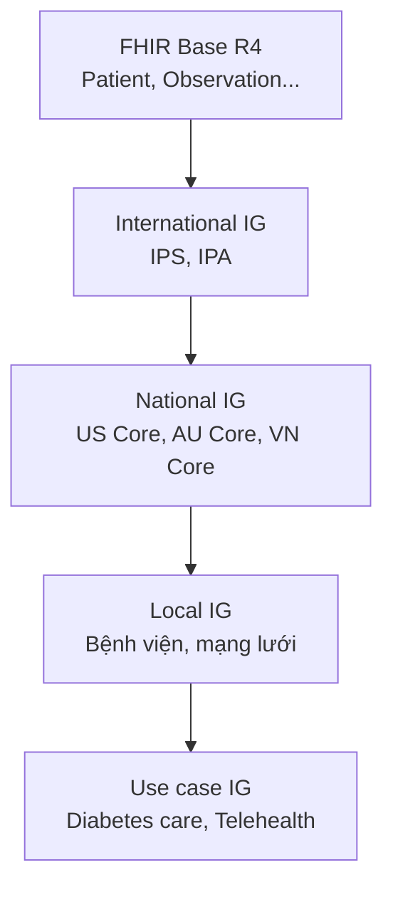
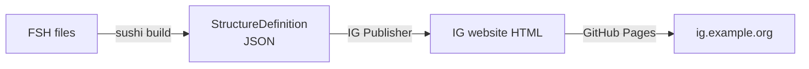
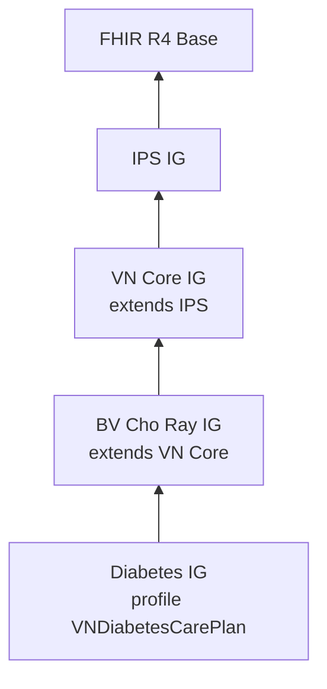

FHIR base spec chứa 150+ Resource với hàng nghìn field, hầu hết optional. Nếu mỗi bệnh viện gửi data theo cách khác nhau thì interoperability vẫn fail. **Profile** là cách bạn nói: "ở context của tôi, Patient.identifier là bắt buộc và phải có CCCD". **Implementation Guide (IG)** đóng gói nhiều profile + ví dụ + tài liệu lại thành 1 spec hoàn chỉnh.

## 1. Bức tranh



Profiling = customize một Resource theo nhu cầu cụ thể, ràng buộc thêm chứ không thay đổi cấu trúc gốc.

## 2. StructureDefinition — cốt lõi của profile

Mỗi profile là 1 resource `StructureDefinition`. Ví dụ ngắn (JSON):

```json
{
  "resourceType": "StructureDefinition",
  "url": "http://moh.gov.vn/fhir/ig/vn-core/StructureDefinition/VN-Patient",
  "name": "VNPatient",
  "status": "draft",
  "fhirVersion": "4.0.1",
  "kind": "resource",
  "abstract": false,
  "type": "Patient",
  "baseDefinition": "http://hl7.org/fhir/StructureDefinition/Patient",
  "derivation": "constraint",
  "differential": {
    "element": [
      {"id": "Patient.identifier", "path": "Patient.identifier", "min": 1, "mustSupport": true},
      {"id": "Patient.identifier:cccd", "path": "Patient.identifier", "sliceName": "cccd", "min": 1, "max": "1"},
      {"id": "Patient.identifier:cccd.system", "path": "Patient.identifier.system", "fixedUri": "http://moh.gov.vn/sid/cccd"},
      {"id": "Patient.gender", "path": "Patient.gender", "min": 1},
      {"id": "Patient.birthDate", "path": "Patient.birthDate", "min": 1},
      {"id": "Patient.address.country", "path": "Patient.address.country", "fixedCode": "VN"}
    ]
  }
}
```

Viết JSON tay → cực dễ sai. Đó là lý do có **FSH**.

## 3. FSH — FHIR Shorthand

FSH là DSL viết profile bằng cú pháp giống Markdown/Python. Tương đương với JSON trên:

```fsh
Profile: VNPatient
Parent: Patient
Id: VN-Patient
Title: "VN Patient"
Description: "Patient profile cho hệ sinh thái y tế Việt Nam"

* identifier 1..* MS
* identifier ^slicing.discriminator.type = #pattern
* identifier ^slicing.discriminator.path = "system"
* identifier ^slicing.rules = #open
* identifier contains
    cccd 1..1 MS and
    bhyt 0..1 MS and
    mr 0..1
* identifier[cccd].system = "http://moh.gov.vn/sid/cccd" (exactly)
* identifier[bhyt].system = "http://moh.gov.vn/sid/bhyt" (exactly)
* gender 1..1
* birthDate 1..1
* address.country = "VN"
* extension contains
    DanToc named danToc 0..1 and
    TonGiao named tonGiao 0..1
```

Kèm extension:

```fsh
Extension: DanToc
Id: dan-toc
Title: "Dân tộc"
Description: "Dân tộc theo danh mục Bộ Y tế VN"
* value[x] only Coding
* valueCoding from VS_DanToc (required)
```

ValueSet và CodeSystem:

```fsh
CodeSystem: CS_DanToc
Id: cs-dan-toc
Title: "Danh mục Dân tộc VN"
* #01 "Kinh"
* #02 "Tày"
* #03 "Thái"
* #04 "Mường"
// ... 54 dân tộc

ValueSet: VS_DanToc
Id: vs-dan-toc
Title: "Bộ giá trị Dân tộc VN"
* include codes from system CS_DanToc
```

Instance ví dụ (dùng làm test data trong IG):

```fsh
Instance: PatientExample01
InstanceOf: VNPatient
Title: "Trần Duy"
* identifier[cccd].value = "001234567890"
* identifier[bhyt].value = "DN1234567890123"
* name.family = "Trần"
* name.given = "Duy"
* gender = #male
* birthDate = "1990-05-12"
* address.line = "123 Lê Lợi"
* address.city = "Hồ Chí Minh"
* address.country = "VN"
* extension[danToc].valueCoding = CS_DanToc#01 "Kinh"
```

## 4. SUSHI — biên dịch FSH sang JSON

[SUSHI](https://github.com/FHIR/sushi) là tool Node.js compile FSH → StructureDefinition/ValueSet/CodeSystem JSON.

### 4.1 Cài đặt

```bash
npm install -g fsh-sushi
```

### 4.2 Cấu trúc project

```
vn-core-ig/
├── sushi-config.yaml          # config IG
├── input/
│   ├── fsh/
│   │   ├── profiles/
│   │   │   ├── VNPatient.fsh
│   │   │   └── VNEncounter.fsh
│   │   ├── extensions/
│   │   │   └── DanToc.fsh
│   │   ├── valuesets/
│   │   │   └── VS_DanToc.fsh
│   │   ├── codesystems/
│   │   │   └── CS_DanToc.fsh
│   │   └── instances/
│   │       └── PatientExample01.fsh
│   ├── pagecontent/
│   │   ├── index.md
│   │   ├── changes.md
│   │   └── overview.md
│   └── images/
└── fsh-generated/             # output từ sushi
```

### 4.3 sushi-config.yaml

```yaml
id: moh.vn.fhir.vn-core
canonical: http://moh.gov.vn/fhir/ig/vn-core
version: 0.1.0
fhirVersion: 4.0.1
name: VNCoreIG
title: "Vietnam Core Implementation Guide"
status: draft
publisher:
  name: Bộ Y tế Việt Nam
  url: https://moh.gov.vn
license: CC0-1.0
copyrightYear: 2026+

dependencies:
  hl7.fhir.uv.ips: 1.1.0

pages:
  index.md:
    title: VN Core IG
  overview.md:
    title: Tổng quan
  changes.md:
    title: Lịch sử thay đổi
```

Chạy:

```bash
sushi build .
```

Output `fsh-generated/resources/` chứa StructureDefinition JSON sẵn sàng dùng.

## 5. IG Publisher

[IG Publisher](https://github.com/HL7/fhir-ig-publisher) (Java) tạo website HTML từ IG. Quy trình:

```bash
# Lần đầu
curl -O https://github.com/HL7/sample-ig/raw/master/_genonce.sh
chmod +x _genonce.sh
./_genonce.sh

# Hoặc dùng Docker
docker run --rm -v $(pwd):/data hl7fhir/ig-publisher:latest
```

Output ở `output/` — bạn có thể publish lên GitHub Pages.



## 6. Slicing — chia field thành nhiều "lát"

`Patient.identifier` là `0..*`. Profile muốn nói "phải có 1 identifier system=CCCD và optional 1 system=BHYT". Slicing giải quyết:

```fsh
* identifier ^slicing.discriminator.type = #pattern
* identifier ^slicing.discriminator.path = "system"
* identifier ^slicing.rules = #open
* identifier contains
    cccd 1..1 MS and
    bhyt 0..1 MS
* identifier[cccd].system = "http://moh.gov.vn/sid/cccd" (exactly)
* identifier[bhyt].system = "http://moh.gov.vn/sid/bhyt" (exactly)
```

Tương tự cho `Observation.component` (huyết áp), `Encounter.location`, ...

## 7. Binding ValueSet

4 strength binding:

| Strength | Ý nghĩa |
|---|---|
| `required` | PHẢI dùng code trong ValueSet |
| `extensible` | Dùng code trong ValueSet trừ khi không có; có thể thêm code khác |
| `preferred` | Khuyến nghị nhưng không bắt buộc |
| `example` | Chỉ là ví dụ |

```fsh
* code from VS_DiabetesCodes (required)
```

## 8. Invariant — ràng buộc business

Dùng FHIRPath:

```fsh
Invariant: vn-pat-1
Description: "Patient phải có ít nhất CCCD hoặc BHYT identifier"
Severity: #error
Expression: "identifier.where(system='http://moh.gov.vn/sid/cccd' or system='http://moh.gov.vn/sid/bhyt').exists()"

Profile: VNPatient
Parent: Patient
* obeys vn-pat-1
```

## 9. Validation

### 9.1 FHIR Validator (CLI)

```bash
java -jar validator_cli.jar \
  -ig http://moh.gov.vn/fhir/ig/vn-core \
  -profile http://moh.gov.vn/fhir/ig/vn-core/StructureDefinition/VN-Patient \
  patient-example.json
```

### 9.2 Inferno

[Inferno](https://inferno.healthit.gov/) chạy bộ test conformance. Có docker version:

```bash
docker run -p 4567:4567 onc/inferno-fhir-validator
```

### 9.3 Validate trong HAPI

```java
FhirValidator validator = ctx.newValidator();
ValidationResult result = validator.validateWithResult(patient);
```

## 10. CI/CD với GitHub Actions

`.github/workflows/build-ig.yml`:

```yaml
name: Build IG

on:
  push:
    branches: [main]
  pull_request:

jobs:
  build:
    runs-on: ubuntu-latest
    steps:
      - uses: actions/checkout@v4
      - uses: actions/setup-node@v4
        with: { node-version: '20' }
      - uses: actions/setup-java@v4
        with: { java-version: '17', distribution: 'temurin' }
      
      - name: Install SUSHI
        run: npm install -g fsh-sushi
      
      - name: SUSHI build
        run: sushi build .
      
      - name: Validate examples
        run: |
          curl -L -o validator_cli.jar https://github.com/hapifhir/org.hl7.fhir.core/releases/latest/download/validator_cli.jar
          for f in fsh-generated/resources/*.json; do
            java -jar validator_cli.jar -version 4.0.1 "$f"
          done
      
      - name: IG Publisher
        run: |
          curl -L -o publisher.jar https://github.com/HL7/fhir-ig-publisher/releases/latest/download/publisher.jar
          java -jar publisher.jar -ig .
      
      - name: Deploy to GitHub Pages
        if: github.ref == 'refs/heads/main'
        uses: peaceiris/actions-gh-pages@v4
        with:
          github_token: ${{ secrets.GITHUB_TOKEN }}
          publish_dir: ./output
```

## 11. Pattern thiết kế IG

### 11.1 Layered IG



Đừng nhồi tất cả vào 1 IG. Tách layer giúp reuse và bảo trì.

### 11.2 Naming convention

- Canonical URL: `http://moh.gov.vn/fhir/ig/vn-core/StructureDefinition/VN-Patient`
- Profile name: `VN-Patient`, `VN-Encounter` (PascalCase với prefix `VN-`)
- Extension URL: `http://moh.gov.vn/fhir/ig/vn-core/StructureDefinition/dan-toc` (kebab-case)
- Code system: `http://moh.gov.vn/CodeSystem/dan-toc`
- ValueSet: `http://moh.gov.vn/ValueSet/vs-dan-toc`

### 11.3 Versioning

Semantic versioning. Thay đổi backward-incompatible → major version. Publish ở multiple URL `/v1`, `/v2`.

## 12. Pitfall thường gặp

- ❌ Quên `mustSupport` — server không biết field nào quan trọng
- ❌ `slicing.rules = #closed` quá sớm → không mở rộng được
- ❌ Đặt `min=1` cho field mà data legacy không có → fail validation hàng loạt
- ❌ Không có example → không kiểm thử được
- ❌ Profile chồng chéo nhiều layer mà không document inheritance

## 13. Checklist publish IG

- [ ] sushi build pass không warning
- [ ] IG Publisher run ok
- [ ] Mọi profile có ≥1 example
- [ ] Mọi example pass validation
- [ ] Pages: index.md, overview.md, changes.md, security.md
- [ ] Versioning rõ ràng (semver)
- [ ] License (CC0 hoặc CC-BY)
- [ ] Publish lên GitHub Pages + canonical URL
- [ ] Đăng ký vào FHIR Registry (nếu công khai)

## Kết luận

Profile + IG là cách bạn biến FHIR base thành chuẩn cụ thể cho ngữ cảnh của mình. FSH + SUSHI + IG Publisher + GitHub Actions là pipeline chuẩn — không cần tự tạo bánh xe.

Bài tiếp: [SMART on FHIR — OAuth2 cho ứng dụng y tế và Backend Services](/blog/smart-on-fhir-oauth2-backend-services).
