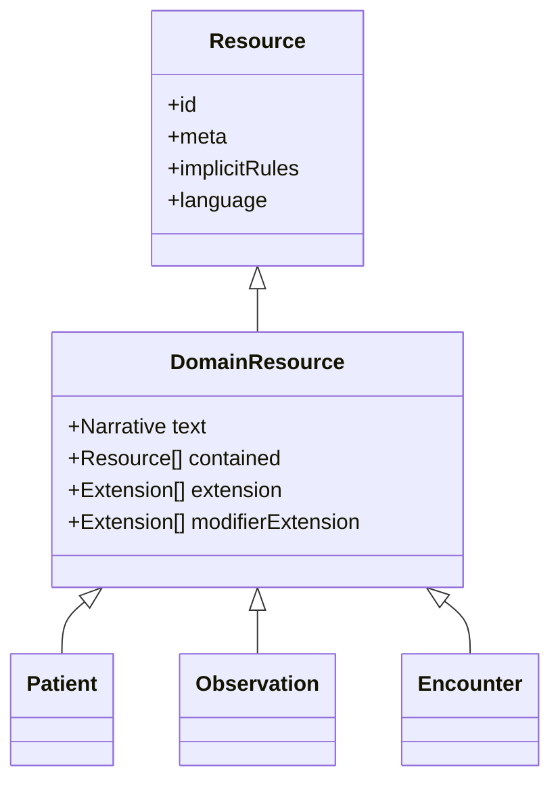

FHIR có 150+ Resource và rất nhiều khái niệm. Nhưng nếu bạn nắm vững 4 thứ — **Resource anatomy, Datatype, Reference, Bundle** — thì 80% công việc còn lại chỉ là tra cứu.

## 1. Anatomy của một Resource

Mọi Resource đều có cấu trúc:



Một Patient đầy đủ:

```json
{
  "resourceType": "Patient",
  "id": "vn-001",
  "meta": {
    "versionId": "3",
    "lastUpdated": "2026-05-07T08:30:00+07:00",
    "profile": ["http://moh.gov.vn/StructureDefinition/VN-Patient"],
    "tag": [{"system": "http://example.org/tags", "code": "vip"}]
  },
  "text": {
    "status": "generated",
    "div": "<div xmlns='http://www.w3.org/1999/xhtml'>Trần Duy, nam, 1990</div>"
  },
  "extension": [{
    "url": "http://moh.gov.vn/StructureDefinition/dan-toc",
    "valueCoding": {
      "system": "http://moh.gov.vn/CodeSystem/dan-toc",
      "code": "01", "display": "Kinh"
    }
  }],
  "identifier": [
    {"use": "official", "system": "urn:oid:CCCD", "value": "001234567890"},
    {"use": "usual", "system": "http://benhvien.vn/mr", "value": "HN12345"}
  ],
  "active": true,
  "name": [{"use": "official", "family": "Trần", "given": ["Duy"]}],
  "telecom": [
    {"system": "phone", "value": "+84901234567", "use": "mobile"},
    {"system": "email", "value": "duy@example.com"}
  ],
  "gender": "male",
  "birthDate": "1990-05-12",
  "address": [{
    "use": "home",
    "line": ["123 Lê Lợi"],
    "city": "Hồ Chí Minh",
    "district": "Quận 1",
    "country": "VN"
  }]
}
```

### 1.1 `meta` — metadata của resource

- `versionId`: FHIR là versioned, mỗi update tăng version
- `lastUpdated`: server tự set
- `profile`: URI của StructureDefinition mà resource này tuân theo
- `tag`, `security`: metadata phụ

### 1.2 `text` — narrative

Mỗi DomainResource phải có narrative (HTML render được) để **đọc bằng mắt** kể cả khi không hiểu structured data. Đây là yêu cầu accessibility quan trọng.

### 1.3 `extension` vs `modifierExtension`

| | extension | modifierExtension |
|---|---|---|
| Có thay đổi nghĩa resource? | Không | **Có** |
| Consumer chưa hiểu thì? | Có thể bỏ qua | **PHẢI từ chối xử lý** |
| Khi nào dùng? | Thêm dữ liệu phụ | Khi field thay đổi semantic (vd: hasOverride, isException) |

**Quy tắc vàng**: dùng `extension` mặc định. Chỉ dùng `modifierExtension` khi việc bỏ qua field này có thể gây HIỂU SAI (như "Patient này đã chết" — nếu consumer không hiểu, hiển thị sai sẽ nguy hiểm).

## 2. Datatype quan trọng nhất

FHIR có ~30 datatype. Phần lớn dùng tới 10 cái sau:

### 2.1 Identifier

```json
{
  "use": "official",       // usual | official | temp | secondary | old
  "type": {"coding": [{"system": "...", "code": "MR"}]},  // loại ID
  "system": "urn:oid:CCCD",  // namespace
  "value": "001234567890",
  "period": {"start": "2010-01-01"}
}
```

System nên là URI duy nhất toàn cầu. Ví dụ:
- CCCD VN: `urn:oid:CCCD` hoặc `http://moh.gov.vn/sid/cccd`
- BHYT: `http://moh.gov.vn/sid/bhyt`
- MR nội bộ: `http://benhvien.vn/sid/mr`

### 2.2 HumanName

```json
{
  "use": "official",       // usual | official | nickname...
  "family": "Trần",
  "given": ["Duy"],
  "prefix": ["BS."],
  "suffix": ["MD"]
}
```

Tên Việt Nam thường lưu nguyên `family = "Trần Văn"` và `given = ["Duy"]` hoặc `family = "Trần"` và `given = ["Văn", "Duy"]`. Cần thống nhất convention trong IG nội bộ.

### 2.3 CodeableConcept

Đã cover ở [bài terminology](/blog/terminology-y-te-icd-snomed-loinc-rxnorm). Tóm lại:

```json
{
  "coding": [
    {"system": "http://snomed.info/sct", "code": "44054006"},
    {"system": "http://hl7.org/fhir/sid/icd-10", "code": "E11"}
  ],
  "text": "Đái tháo đường type 2"
}
```

### 2.4 Quantity

```json
{
  "value": 7.5,
  "comparator": "<",          // < | <= | >= | > (tuỳ chọn)
  "unit": "%",
  "system": "http://unitsofmeasure.org",
  "code": "%"
}
```

### 2.5 Period & Range

```json
{"period": {"start": "2026-05-07T08:00:00+07:00", "end": "2026-05-07T08:30:00+07:00"}}
{"range": {"low": {"value": 70, "unit": "mg/dL"}, "high": {"value": 110, "unit": "mg/dL"}}}
```

### 2.6 Reference

```json
{
  "reference": "Patient/vn-001",
  "type": "Patient",
  "identifier": {"system": "urn:oid:CCCD", "value": "001234567890"},
  "display": "Trần Duy"
}
```

Có 4 cách reference:

1. **Literal**: `"reference": "Patient/vn-001"` (relative) hoặc `"http://server/Patient/vn-001"` (absolute)
2. **Logical**: chỉ dùng `identifier` không có `reference` — khi resource đích chưa tồn tại trong server hiện tại
3. **Internal**: `"reference": "#contained-1"` (trỏ tới contained resource)
4. **Version-specific**: `"Patient/vn-001/_history/3"` (lock vào version cụ thể)

### 2.7 Annotation, Attachment, ContactPoint, Address

Đọc nhanh trên spec khi cần. Pattern thường gặp:

```json
{"telecom": [{"system": "phone", "value": "+84901234567", "use": "mobile"}]}
{"address": [{"line": ["123 Lê Lợi"], "city": "HCM", "country": "VN"}]}
```

## 3. Reference — xương sống của FHIR

```mermaid
flowchart LR
    P[Patient/1] <--subject-- E[Encounter/100]
    P <--subject-- O[Observation/200]
    E <--encounter-- O
    P <--patient-- M[MedicationRequest/300]
    P <--patient-- C[Condition/400]
    E <--encounter-- C
```

### 3.1 Khi nào dùng `contained`?

Dùng `contained` khi:
- Resource phụ chỉ có nghĩa khi đi cùng resource cha
- Không cần access độc lập
- Không cần share với resource khác

Ví dụ: 1 `Practitioner` ad-hoc làm reviewer cho 1 `DiagnosticReport`. Nếu Practitioner đã có trong hệ thống thì KHÔNG nên contained — dùng reference.

### 3.2 Conditional reference

Trong transaction Bundle, có thể tham chiếu bằng identifier:

```json
{"reference": "Patient?identifier=urn:oid:CCCD|001234567890"}
```

Server tìm patient theo identifier; nếu không tìm thấy hoặc tìm thấy >1 thì lỗi.

## 4. Bundle — gói nhiều resource

`Bundle` là collection của resource. 6 type:

| Bundle.type | Mục đích | Atomic? |
|---|---|---|
| `searchset` | Kết quả search trả từ server | n/a (read) |
| `transaction` | POST/PUT/DELETE nhiều resource cùng lúc | **Có (rollback nếu lỗi)** |
| `transaction-response` | Response của transaction | n/a |
| `batch` | Như transaction nhưng độc lập từng entry | Không |
| `batch-response` | Response của batch | n/a |
| `document` | Clinical document (như CDA nhưng FHIR) | n/a |
| `message` | Message-style (giống HL7 v2) | n/a |
| `collection` | Tự do gói nhiều resource | n/a |

### 4.1 Transaction Bundle ví dụ

Tạo cùng lúc Patient + Encounter + Observation, link nhau bằng `urn:uuid:` tạm:

```json
{
  "resourceType": "Bundle",
  "type": "transaction",
  "entry": [
    {
      "fullUrl": "urn:uuid:patient-tmp",
      "resource": {
        "resourceType": "Patient",
        "identifier": [{"system": "urn:oid:CCCD", "value": "001234567890"}],
        "name": [{"family": "Trần", "given": ["Duy"]}]
      },
      "request": {
        "method": "POST",
        "url": "Patient",
        "ifNoneExist": "identifier=urn:oid:CCCD|001234567890"
      }
    },
    {
      "fullUrl": "urn:uuid:encounter-tmp",
      "resource": {
        "resourceType": "Encounter",
        "status": "finished",
        "class": {"system": "http://terminology.hl7.org/CodeSystem/v3-ActCode", "code": "AMB"},
        "subject": {"reference": "urn:uuid:patient-tmp"},
        "period": {"start": "2026-05-07T08:00:00+07:00", "end": "2026-05-07T08:30:00+07:00"}
      },
      "request": {"method": "POST", "url": "Encounter"}
    },
    {
      "fullUrl": "urn:uuid:obs-tmp",
      "resource": {
        "resourceType": "Observation",
        "status": "final",
        "code": {"coding": [{"system": "http://loinc.org", "code": "4548-4"}]},
        "subject": {"reference": "urn:uuid:patient-tmp"},
        "encounter": {"reference": "urn:uuid:encounter-tmp"},
        "effectiveDateTime": "2026-05-07T08:15:00+07:00",
        "valueQuantity": {"value": 7.5, "unit": "%", "system": "http://unitsofmeasure.org", "code": "%"}
      },
      "request": {"method": "POST", "url": "Observation"}
    }
  ]
}
```

POST lên `[base]/`. Server sẽ:
1. Resolve `urn:uuid:` → ID thật
2. Tạo resource theo thứ tự, replace reference
3. Nếu bất kỳ entry nào lỗi → **rollback toàn bộ**

### 4.2 `ifNoneExist` — conditional create

Dòng `"ifNoneExist": "identifier=..."` nghĩa là: nếu đã có Patient với identifier này, **không tạo mới**, dùng resource cũ. Đây là pattern quan trọng để tránh duplicate.

### 4.3 Transaction-response ví dụ

```json
{
  "resourceType": "Bundle",
  "type": "transaction-response",
  "entry": [
    {
      "response": {
        "status": "201 Created",
        "location": "Patient/123/_history/1",
        "etag": "W/\"1\"",
        "lastModified": "2026-05-07T09:00:00+07:00"
      }
    }
  ]
}
```

Client cần parse `location` để biết ID thật.

### 4.4 Document Bundle vs CDA

Document Bundle đầu là `Composition` resource — đóng vai trò như `<ClinicalDocument>` của CDA. Có signature, immutable, dùng để lưu trữ pháp lý.

### 4.5 Message Bundle

Đầu là `MessageHeader`. Dùng cho event-driven workflow giống HL7 v2 nhưng với cú pháp FHIR. Ít phổ biến hơn REST.

## 5. URL pattern và HTTP method

| URL | Method | Ý nghĩa |
|---|---|---|
| `[base]/Patient` | POST | Tạo mới |
| `[base]/Patient/123` | GET | Đọc latest |
| `[base]/Patient/123/_history/2` | GET | Đọc version cụ thể (vread) |
| `[base]/Patient/123` | PUT | Update toàn bộ |
| `[base]/Patient/123` | PATCH | Update từng field |
| `[base]/Patient/123` | DELETE | Xoá (logical) |
| `[base]/Patient?name=Tran` | GET | Search |
| `[base]/Patient/123/_history` | GET | Lịch sử của 1 resource |
| `[base]/Patient/_history` | GET | Lịch sử mọi Patient |
| `[base]/_history` | GET | Lịch sử toàn server |
| `[base]/metadata` | GET | CapabilityStatement |
| `[base]/` | POST + Bundle | Transaction/batch |

## 6. CapabilityStatement — server tự khai báo

```http
GET [base]/metadata
```

Trả về CapabilityStatement chỉ ra:
- FHIR version (R4 / R5)
- Resource nào server hỗ trợ
- Search params nào
- Operation nào (`$expand`, `$validate`, `$export`...)
- Security: SMART on FHIR endpoints, OAuth2 URLs

Đây là "khai báo HĐSD" — client nên đọc trước khi gọi.

## 7. ID, version và history

- ID: server-assigned (POST) hoặc client-assigned (PUT với client ID)
- Version: tự tăng mỗi update; lưu lịch sử
- vread: `GET Patient/123/_history/2` đọc version 2
- Optimistic concurrency: dùng `ETag: W/"3"` + `If-Match: W/"3"` khi update để tránh lost update

```http
PUT /Patient/123 HTTP/1.1
If-Match: W/"3"
Content-Type: application/fhir+json

{"resourceType": "Patient", "id": "123", ...}
```

Server trả `412 Precondition Failed` nếu version không khớp.

## 8. OperationOutcome — error chuẩn

Khi lỗi, server trả Resource `OperationOutcome`:

```json
{
  "resourceType": "OperationOutcome",
  "issue": [{
    "severity": "error",
    "code": "invariant",
    "diagnostics": "Patient.identifier is required by profile VN-Patient",
    "location": ["Patient.identifier"]
  }]
}
```

`severity`: fatal | error | warning | information.

## 9. Checklist Resource production-ready

- [ ] Có `meta.profile` chỉ ra IG đang theo
- [ ] Có narrative `text.div` đọc được
- [ ] `identifier` có `system` URI duy nhất
- [ ] Mọi `code/CodeableConcept` có `system` chuẩn (LOINC/SNOMED/ICD)
- [ ] Mọi `valueQuantity` có UCUM `code`
- [ ] Reference dùng literal, không lạm dụng contained
- [ ] Pass FHIR Validator + IG validator
- [ ] Có `meta.tag` cho traceability nếu cần

## Kết luận

4 khái niệm này bạn sẽ chạm vào TẤT CẢ ngày nếu làm FHIR. Hãy thực hành: dựng HAPI FHIR local, POST 1 transaction Bundle 3 resource, GET search, GET _history. Khi đã quen tay, đọc tiếp [REST API & Search Mastery](/blog/fhir-rest-api-search-mastery).
