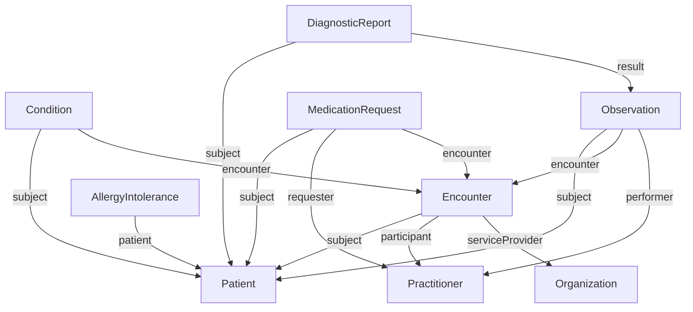
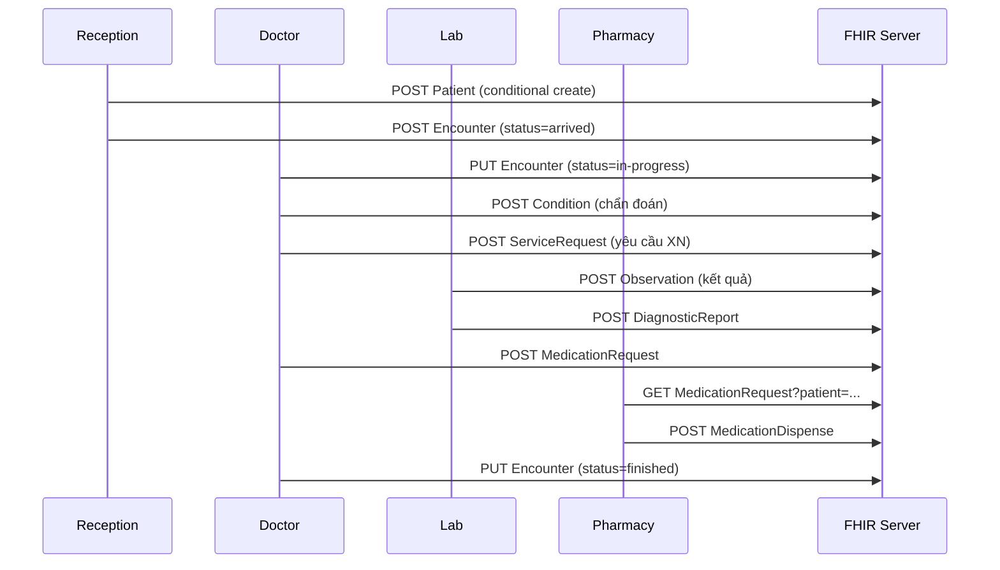

Biết Resource và Bundle thôi chưa đủ — bạn cần biết **mô hình hoá** thông tin lâm sàng đúng cách. Bài này đi qua 9 Resource quan trọng nhất với ví dụ thật từ workflow bệnh viện Việt Nam.

## 1. Bản đồ quan hệ giữa các Resource



## 2. Patient — gốc của mọi thứ

```json
{
  "resourceType": "Patient",
  "id": "vn-001",
  "identifier": [
    {"use": "official", "system": "urn:oid:CCCD", "value": "001234567890"},
    {"use": "secondary", "system": "http://moh.gov.vn/sid/bhyt", "value": "DN1234567890123"},
    {"use": "usual", "system": "http://benhvien.vn/sid/mr", "value": "HN12345"}
  ],
  "active": true,
  "name": [{"use": "official", "family": "Trần", "given": ["Duy"]}],
  "telecom": [{"system": "phone", "value": "+84901234567"}],
  "gender": "male",
  "birthDate": "1990-05-12",
  "address": [{"line": ["123 Lê Lợi"], "city": "HCM", "country": "VN"}],
  "maritalStatus": {"coding": [{"system": "...marital-status", "code": "M"}]},
  "contact": [{
    "relationship": [{"coding": [{"code": "C", "display": "Emergency Contact"}]}],
    "name": {"family": "Trần", "given": ["Hoa"]},
    "telecom": [{"system": "phone", "value": "+84902345678"}]
  }],
  "communication": [{"language": {"coding": [{"system": "urn:ietf:bcp:47", "code": "vi-VN"}]}, "preferred": true}],
  "generalPractitioner": [{"reference": "Practitioner/dr-nguyen"}],
  "managingOrganization": {"reference": "Organization/bv-cho-ray"}
}
```

**Mẹo Việt Nam**:
- Nhiều identifier là chuẩn (CCCD, BHYT, MR nội bộ)
- `name.use=official` cho tên chính thức theo CCCD
- `address.country="VN"` (ISO 3166)
- Extension `dan-toc`, `ton-giao`, `noi-sinh`, `nghe-nghiep` qua IG VN

## 3. Practitioner và PractitionerRole

`Practitioner` = thông tin cá nhân của 1 nhân viên y tế. `PractitionerRole` = vai trò tại 1 organization (1 bác sĩ có thể làm việc ở nhiều nơi).

```json
{
  "resourceType": "Practitioner",
  "id": "dr-nguyen",
  "identifier": [{"system": "http://moh.gov.vn/sid/ccphn", "value": "VN-12345"}],
  "name": [{"family": "Nguyễn", "given": ["Minh"], "prefix": ["BS."]}],
  "qualification": [{
    "code": {"coding": [{"system": "...qualification", "code": "MD"}]},
    "issuer": {"reference": "Organization/bo-y-te"}
  }]
}
```

```json
{
  "resourceType": "PractitionerRole",
  "practitioner": {"reference": "Practitioner/dr-nguyen"},
  "organization": {"reference": "Organization/bv-cho-ray"},
  "code": [{"coding": [{"system": "...practitioner-role", "code": "doctor"}]}],
  "specialty": [{"coding": [{"system": "...practice-codes", "code": "419772000", "display": "Family Medicine"}]}],
  "telecom": [{"system": "email", "value": "minh.nguyen@bvchoray.vn"}]
}
```

## 4. Organization và Location

```json
{
  "resourceType": "Organization",
  "id": "bv-cho-ray",
  "identifier": [{"system": "http://moh.gov.vn/sid/cosoyte", "value": "CSY-001"}],
  "active": true,
  "type": [{"coding": [{"system": "...organization-type", "code": "prov", "display": "Healthcare Provider"}]}],
  "name": "Bệnh viện Chợ Rẫy",
  "address": [{"line": ["201B Nguyễn Chí Thanh"], "city": "HCM", "country": "VN"}]
}
```

`Location` cho phòng khám/giường bệnh cụ thể, link với Organization.

## 5. Encounter — lượt khám/nhập viện

```json
{
  "resourceType": "Encounter",
  "status": "in-progress",
  "class": {
    "system": "http://terminology.hl7.org/CodeSystem/v3-ActCode",
    "code": "IMP", "display": "inpatient encounter"
  },
  "type": [{"coding": [{"system": "...encounter-type", "code": "ADMS", "display": "Annual diabetes screening"}]}],
  "priority": {"coding": [{"system": "...priority", "code": "EM", "display": "emergency"}]},
  "subject": {"reference": "Patient/vn-001"},
  "participant": [{
    "type": [{"coding": [{"code": "ATND", "display": "attender"}]}],
    "individual": {"reference": "Practitioner/dr-nguyen"}
  }],
  "period": {"start": "2026-05-07T08:00:00+07:00"},
  "reasonCode": [{"text": "Khó thở, đau ngực"}],
  "diagnosis": [{
    "condition": {"reference": "Condition/dx-1"},
    "use": {"coding": [{"code": "AD", "display": "admission"}]},
    "rank": 1
  }],
  "location": [{
    "location": {"reference": "Location/icu-101"},
    "status": "active",
    "period": {"start": "2026-05-07T08:30:00+07:00"}
  }],
  "serviceProvider": {"reference": "Organization/bv-cho-ray"}
}
```

`class` quan trọng:
- AMB = ambulatory (ngoại trú)
- IMP = inpatient (nội trú)
- EMER = emergency
- HH = home health
- VR = virtual (telehealth)

## 6. Condition — chẩn đoán

```json
{
  "resourceType": "Condition",
  "clinicalStatus": {"coding": [{"system": "...condition-clinical", "code": "active"}]},
  "verificationStatus": {"coding": [{"system": "...condition-ver-status", "code": "confirmed"}]},
  "category": [{"coding": [{"system": "...condition-category", "code": "encounter-diagnosis"}]}],
  "severity": {"coding": [{"system": "http://snomed.info/sct", "code": "24484000", "display": "Severe"}]},
  "code": {
    "coding": [
      {"system": "http://hl7.org/fhir/sid/icd-10", "code": "E11.9"},
      {"system": "http://snomed.info/sct", "code": "44054006"}
    ],
    "text": "Đái tháo đường type 2"
  },
  "bodySite": [{"coding": [{"system": "http://snomed.info/sct", "code": "113331007", "display": "Endocrine system"}]}],
  "subject": {"reference": "Patient/vn-001"},
  "encounter": {"reference": "Encounter/123"},
  "onsetDateTime": "2024-01-15",
  "recordedDate": "2026-05-07T08:30:00+07:00",
  "recorder": {"reference": "Practitioner/dr-nguyen"}
}
```

## 7. Observation — đo lường, kết quả XN

### 7.1 Single value

HbA1c result:

```json
{
  "resourceType": "Observation",
  "status": "final",
  "category": [{"coding": [{"system": "...observation-category", "code": "laboratory"}]}],
  "code": {"coding": [{"system": "http://loinc.org", "code": "4548-4", "display": "HbA1c"}]},
  "subject": {"reference": "Patient/vn-001"},
  "encounter": {"reference": "Encounter/123"},
  "effectiveDateTime": "2026-05-07T07:30:00+07:00",
  "issued": "2026-05-07T08:00:00+07:00",
  "performer": [{"reference": "Practitioner/lab-tech-1"}],
  "valueQuantity": {"value": 7.5, "unit": "%", "system": "http://unitsofmeasure.org", "code": "%"},
  "interpretation": [{"coding": [{"system": "...observation-interpretation", "code": "H", "display": "High"}]}],
  "referenceRange": [{"low": {"value": 4}, "high": {"value": 5.6}, "type": {"text": "Normal"}}]
}
```

### 7.2 Component (huyết áp)

```json
{
  "resourceType": "Observation",
  "status": "final",
  "category": [{"coding": [{"code": "vital-signs"}]}],
  "code": {"coding": [{"system": "http://loinc.org", "code": "85354-9", "display": "Blood pressure panel"}]},
  "subject": {"reference": "Patient/vn-001"},
  "effectiveDateTime": "2026-05-07T08:00:00+07:00",
  "component": [
    {
      "code": {"coding": [{"system": "http://loinc.org", "code": "8480-6", "display": "Systolic"}]},
      "valueQuantity": {"value": 145, "unit": "mmHg", "system": "http://unitsofmeasure.org", "code": "mm[Hg]"}
    },
    {
      "code": {"coding": [{"system": "http://loinc.org", "code": "8462-4", "display": "Diastolic"}]},
      "valueQuantity": {"value": 95, "unit": "mmHg", "system": "http://unitsofmeasure.org", "code": "mm[Hg]"}
    }
  ]
}
```

### 7.3 Khi nào dùng `valueX` nào

| Loại data | Dùng |
|---|---|
| Số có đơn vị | `valueQuantity` |
| Code (positive/negative) | `valueCodeableConcept` |
| Boolean | `valueBoolean` |
| Range (180-200) | `valueRange` |
| Ratio (1:200) | `valueRatio` |
| Sample data | `valueSampledData` |
| Free text | `valueString` |

Chỉ chọn 1 trong các `valueX`.

## 8. DiagnosticReport — báo cáo XN/CĐHA

```json
{
  "resourceType": "DiagnosticReport",
  "status": "final",
  "category": [{"coding": [{"system": "...diagnostic-service-sections", "code": "LAB"}]}],
  "code": {"coding": [{"system": "http://loinc.org", "code": "24317-0", "display": "Hemoglobin A1c panel"}]},
  "subject": {"reference": "Patient/vn-001"},
  "encounter": {"reference": "Encounter/123"},
  "effectiveDateTime": "2026-05-07T07:30:00+07:00",
  "issued": "2026-05-07T08:00:00+07:00",
  "performer": [{"reference": "Organization/lab-cho-ray"}],
  "result": [{"reference": "Observation/hba1c-1"}],
  "conclusion": "HbA1c 7.5% — kiểm soát đường huyết kém, cân nhắc chỉnh liều thuốc",
  "presentedForm": [{
    "contentType": "application/pdf",
    "url": "https://lab.example.org/reports/r-001.pdf",
    "title": "Báo cáo HbA1c"
  }]
}
```

DiagnosticReport gói các Observation con + kết luận. Quan trọng cho LIS/RIS.

## 9. MedicationRequest

```json
{
  "resourceType": "MedicationRequest",
  "status": "active",
  "intent": "order",
  "medicationCodeableConcept": {
    "coding": [
      {"system": "http://www.nlm.nih.gov/research/umls/rxnorm", "code": "860975", "display": "Metformin 500 MG Oral Tablet"},
      {"system": "http://moh.gov.vn/CodeSystem/danh-muc-thuoc", "code": "VD-12345-67"}
    ]
  },
  "subject": {"reference": "Patient/vn-001"},
  "encounter": {"reference": "Encounter/123"},
  "authoredOn": "2026-05-07T08:30:00+07:00",
  "requester": {"reference": "Practitioner/dr-nguyen"},
  "reasonReference": [{"reference": "Condition/dx-1"}],
  "dosageInstruction": [{
    "text": "1 viên uống sau ăn sáng và tối",
    "timing": {
      "repeat": {
        "frequency": 2, "period": 1, "periodUnit": "d",
        "when": ["PCM", "PCV"]
      }
    },
    "route": {"coding": [{"system": "...route-codes", "code": "26643006", "display": "Oral"}]},
    "doseAndRate": [{
      "doseQuantity": {"value": 1, "unit": "tablet", "system": "http://unitsofmeasure.org", "code": "{tbl}"}
    }]
  }],
  "dispenseRequest": {
    "validityPeriod": {"start": "2026-05-07", "end": "2026-06-07"},
    "numberOfRepeatsAllowed": 2,
    "quantity": {"value": 60, "unit": "tablet"},
    "expectedSupplyDuration": {"value": 30, "unit": "d", "system": "http://unitsofmeasure.org", "code": "d"}
  }
}
```

## 10. AllergyIntolerance

```json
{
  "resourceType": "AllergyIntolerance",
  "clinicalStatus": {"coding": [{"system": "...allergyintolerance-clinical", "code": "active"}]},
  "verificationStatus": {"coding": [{"system": "...allergyintolerance-verification", "code": "confirmed"}]},
  "type": "allergy",
  "category": ["medication"],
  "criticality": "high",
  "code": {"coding": [{"system": "http://snomed.info/sct", "code": "294505008", "display": "Allergy to penicillin"}]},
  "patient": {"reference": "Patient/vn-001"},
  "recordedDate": "2024-03-10",
  "reaction": [{
    "manifestation": [{"coding": [{"system": "http://snomed.info/sct", "code": "247472004", "display": "Hives"}]}],
    "severity": "moderate"
  }]
}
```

Hiển thị nổi bật ở mọi UI lâm sàng — đây là PHI quan trọng cho an toàn bệnh nhân.

## 11. Workflow tổng — bệnh nhân ngoại trú



## 12. Best practice

- **Conditional create** với identifier để idempotent
- **Bundle transaction** cho workflow đa-resource
- **Reference dùng literal** (Patient/123) hơn contained khi có thể
- **Profile hoá**: viết IG để ràng buộc Required field cho VN
- **Dual coding**: ICD + SNOMED, MOH thuốc + RxNorm
- **Identifier system** dùng URI ổn định, đăng ký namespace

## 13. Anti-pattern

- ❌ Lưu chẩn đoán vào `Patient.extension` thay vì Condition
- ❌ Tạo nhiều Patient cho cùng người (thiếu conditional create)
- ❌ Quên `meta.profile` → không validate được
- ❌ Dùng `valueString` cho số có đơn vị (mất khả năng query)
- ❌ Quên `effectiveDateTime` cho Observation (mọi data y tế cần thời gian)

## Kết luận

9 Resource trên cover 80% workflow bệnh viện. Master chúng kèm pattern Bundle transaction, bạn đã có thể build EHR thực tế.

Bài tiếp: [FHIR cho BHYT, VNeID và hệ sinh thái Việt Nam](/blog/fhir-bhyt-vneid-viet-nam).
