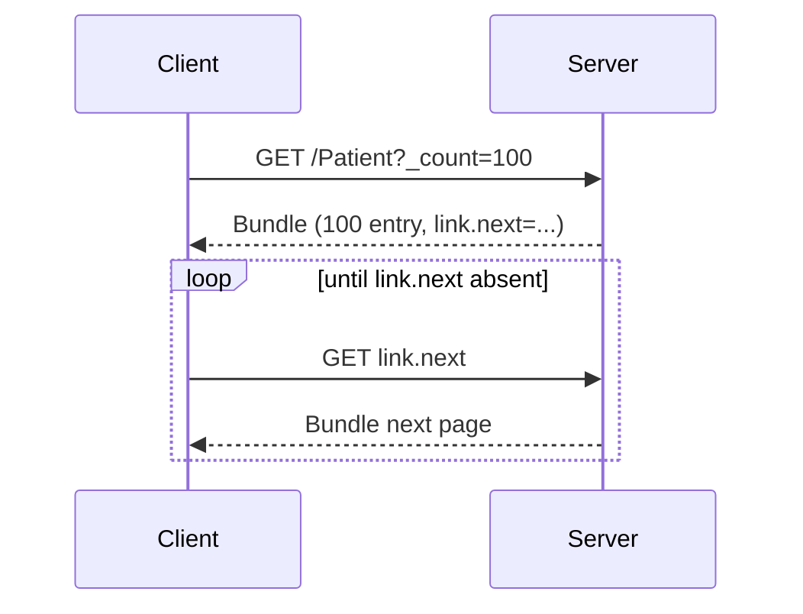

REST của FHIR có nhiều thứ "đặc thù" mà REST thông thường không có. Bài này đi từ CRUD cơ bản đến chained search và GraphQL — bạn cần master hết để làm production.

## 1. CRUD cơ bản

Giả sử base URL `https://fhir.example.org/baseR4`.

### 1.1 Create

```http
POST /Patient HTTP/1.1
Content-Type: application/fhir+json

{"resourceType": "Patient", "name": [{"family": "Trần", "given": ["Duy"]}]}
```

Response:
```http
HTTP/1.1 201 Created
Location: https://fhir.example.org/baseR4/Patient/123/_history/1
ETag: W/"1"
Last-Modified: ...
```

### 1.2 Read

```http
GET /Patient/123 HTTP/1.1
Accept: application/fhir+json
```

### 1.3 Vread (read version cụ thể)

```http
GET /Patient/123/_history/2
```

### 1.4 Update

```http
PUT /Patient/123 HTTP/1.1
Content-Type: application/fhir+json
If-Match: W/"2"

{"resourceType": "Patient", "id": "123", ...}
```

### 1.5 Patch

```http
PATCH /Patient/123 HTTP/1.1
Content-Type: application/json-patch+json
If-Match: W/"3"

[
  {"op": "replace", "path": "/active", "value": false},
  {"op": "add", "path": "/telecom/-", "value": {"system": "email", "value": "x@y.com"}}
]
```

FHIR cũng hỗ trợ `application/fhir+json` PATCH (FHIRPath patch) phong phú hơn.

### 1.6 Delete (logical)

```http
DELETE /Patient/123
```

Server thường giữ lịch sử nhưng đánh dấu deleted. Vread vẫn lấy được version cũ.

## 2. Conditional operations

### 2.1 Conditional Create

```http
POST /Patient HTTP/1.1
If-None-Exist: identifier=urn:oid:CCCD|001234567890
Content-Type: application/fhir+json

{...}
```

Nếu đã tồn tại → 200 + Location resource cũ. Nếu chưa → 201. Nếu match >1 → 412.

### 2.2 Conditional Update

```http
PUT /Patient?identifier=urn:oid:CCCD|001234567890
```

- Match 0 → tạo mới
- Match 1 → update
- Match >1 → 412

### 2.3 Conditional Delete

```http
DELETE /Patient?identifier=urn:oid:CCCD|001234567890
```

## 3. CapabilityStatement

```http
GET /metadata
```

Cần đọc trước khi tích hợp:

```json
{
  "resourceType": "CapabilityStatement",
  "fhirVersion": "4.0.1",
  "format": ["application/fhir+json", "application/fhir+xml"],
  "rest": [{
    "mode": "server",
    "security": {
      "service": [{"coding": [{"system": "...", "code": "SMART-on-FHIR"}]}],
      "extension": [{
        "url": "http://fhir-registry.smarthealthit.org/StructureDefinition/oauth-uris",
        "extension": [
          {"url": "authorize", "valueUri": "https://auth.example.org/authorize"},
          {"url": "token", "valueUri": "https://auth.example.org/token"}
        ]
      }]
    },
    "resource": [{
      "type": "Patient",
      "interaction": [{"code": "read"}, {"code": "search-type"}],
      "searchParam": [
        {"name": "identifier", "type": "token"},
        {"name": "name", "type": "string"},
        {"name": "birthdate", "type": "date"}
      ]
    }]
  }]
}
```

## 4. Search — phần quan trọng nhất

### 4.1 Cú pháp cơ bản

```
GET [base]/[ResourceType]?[param1]=[value]&[param2]=[value]
```

Ví dụ:

```http
GET /Patient?name=Tran&birthdate=ge1990-01-01&birthdate=le1990-12-31
```

Tìm Patient tên Tran sinh năm 1990.

### 4.2 7 loại search param

| Type | Mô tả | Ví dụ |
|---|---|---|
| **string** | Text matching, default startsWith | `name=Tran` |
| **token** | Code/identifier (system\|code) | `identifier=urn:oid:CCCD\|001234` |
| **date** | Ngày/giờ với prefix | `birthdate=ge1990-01-01` |
| **number** | Số với prefix | `value-quantity=gt100` |
| **quantity** | Số + đơn vị | `value-quantity=7.5\|http://unitsofmeasure.org\|%` |
| **reference** | Trỏ tới resource khác | `subject=Patient/123` |
| **uri** | URI exact match | `url=http://example.org/...` |
| **composite** | Nhiều param ghép `$` | `code-value-quantity=85354-9$gt140` |
| **special** | Đặc biệt (vd `near` cho location) | `near=10.776\|106.700\|5\|km` |

### 4.3 Modifier

Thêm sau `:`. Một số modifier phổ biến:

| Modifier | Áp dụng | Ví dụ |
|---|---|---|
| `:exact` | string | `name:exact=Tran` (case-sensitive, exact) |
| `:contains` | string | `name:contains=ran` |
| `:missing` | mọi type | `gender:missing=true` |
| `:not` | token | `code:not=12345` |
| `:in`, `:not-in` | token | `code:in=http://example.org/ValueSet/diabetes` |
| `:identifier` | reference | `subject:identifier=urn:oid:CCCD\|001234` |
| `:type` | reference | `subject:Patient=123` |
| `:above`, `:below` | token (SNOMED hierarchy) | `code:below=44054006` |

### 4.4 Prefix cho date/number/quantity

| Prefix | Ý nghĩa |
|---|---|
| `eq` | Equal (default) |
| `ne` | Not equal |
| `gt`, `lt`, `ge`, `le` | >, <, >=, <= |
| `sa` | Starts after |
| `eb` | Ends before |
| `ap` | Approximate |

```http
GET /Observation?date=ge2026-01-01&date=le2026-12-31
GET /Observation?value-quantity=gt7
```

### 4.5 Chained search

Tìm Observation của Patient tên Tran:

```http
GET /Observation?subject:Patient.name=Tran
```

Đọc: `Observation` có `subject` trỏ tới `Patient`, `Patient` có `name` = Tran.

Nhiều cấp:

```http
GET /Observation?subject:Patient.general-practitioner.name=Nguyen
```

Cảnh báo: chained search có thể nặng cho server. HAPI có cấu hình giới hạn.

### 4.6 Reverse chained (`_has`)

Tìm Patient có ít nhất 1 Observation HbA1c > 7%:

```http
GET /Patient?_has:Observation:patient:code=4548-4&_has:Observation:patient:value-quantity=gt7
```

### 4.7 `_include` và `_revinclude`

`_include`: kéo theo resource mà entry trỏ tới.

```http
GET /Observation?code=4548-4&_include=Observation:subject
```

Trả về Observation + Patient liên quan trong cùng Bundle.

`_revinclude`: kéo theo resource trỏ tới entry.

```http
GET /Patient/123?_revinclude=Observation:subject
```

Trả Patient 123 + mọi Observation trỏ tới patient này.

`_include:iterate` để chain nhiều cấp.

### 4.8 Sort, summary, paging

```http
GET /Patient?_sort=birthdate&_count=20&_summary=true&_elements=name,birthDate
```

- `_sort`: dùng dấu `-` để sort desc: `_sort=-birthdate`
- `_count`: page size (server có thể giới hạn max)
- `_summary`: `true | text | data | count | false`
- `_elements`: chỉ trả về field cần (giảm payload)

Server trả `Bundle.link` với `relation=next/prev/self`:

```json
"link": [
  {"relation": "self", "url": "https://.../Patient?_count=20"},
  {"relation": "next", "url": "https://.../Patient?_count=20&_getpages=abc&_offset=20"}
]
```

### 4.9 `_total`

```http
GET /Patient?_total=accurate
```

Yêu cầu server đếm chính xác (có thể slow). `accurate | estimate | none`.

## 5. History

```http
GET /Patient/123/_history?_count=10&_since=2026-01-01
GET /Patient/_history
GET /_history
```

History dùng cho:
- Audit trail
- Sync (delta) sang hệ thống khác

## 6. Pattern paging an toàn



KHÔNG construct page URL bằng tay — luôn follow `link.next` server cấp.

## 7. Operation ($)

Custom operation định nghĩa với `$` prefix:

```http
POST /Patient/123/$everything
GET /ValueSet/$expand?url=...
GET /CodeSystem/$lookup?system=http://loinc.org&code=4548-4
POST /$validate
```

Operation phổ biến:

| Operation | Mô tả |
|---|---|
| `$everything` (Patient) | Mọi resource liên quan đến patient |
| `$expand` (ValueSet) | Liệt kê code trong ValueSet |
| `$validate` (Resource) | Validate theo profile |
| `$lookup` (CodeSystem) | Tra cứu code |
| `$translate` (ConceptMap) | Map giữa code system |
| `$export` (Bulk Data) | Export NDJSON |
| `$apply` (PlanDefinition) | Workflow execution |

## 8. GraphQL

FHIR R4+ có GraphQL endpoint `/$graphql`. Lấy patient + observations trong 1 query:

```graphql
{
  Patient(id: "123") {
    name { family given }
    ObservationList(_reference: subject, code: "4548-4") {
      effectiveDateTime
      valueQuantity { value unit }
    }
  }
}
```

Hữu ích cho mobile app cần shape dữ liệu tuỳ ý, giảm round-trip.

## 9. Async + Bulk Data ngắn gọn

Khi data lớn:

```http
GET /Patient/$everything?_outputFormat=ndjson
Prefer: respond-async
```

Server trả `202 Accepted` + `Content-Location: /status/abc`. Client poll status; khi xong nhận URL NDJSON files.

Chi tiết ở bài [FHIR Bulk Data Export & CDS Hooks](/blog/fhir-bulk-data-export-cds-hooks).

## 10. Format negotiation

```http
GET /Patient/123 HTTP/1.1
Accept: application/fhir+json; fhirVersion=4.0
```

Hoặc:

```http
GET /Patient/123?_format=application/fhir+xml
GET /Patient/123?_pretty=true
```

## 11. Error model — OperationOutcome

```json
{
  "resourceType": "OperationOutcome",
  "issue": [{
    "severity": "error",
    "code": "not-found",
    "diagnostics": "Patient/999 not found",
    "expression": ["Patient.id"]
  }]
}
```

HTTP status mapping:

| Status | Khi nào |
|---|---|
| 200 | OK (read, update, search) |
| 201 | Created |
| 204 | No Content (delete) |
| 304 | Not Modified (conditional read với ETag) |
| 400 | Bad request, validation lỗi structural |
| 401 | Authentication thiếu/invalid |
| 403 | Authorization từ chối |
| 404 | Not found |
| 409 | Conflict (vd update version cũ) |
| 410 | Gone (đã delete) |
| 412 | Precondition failed (If-Match/If-None-Exist) |
| 422 | Unprocessable (business rule) |

## 12. Checklist gọi FHIR API

- [ ] Set `Accept: application/fhir+json`
- [ ] Set `Authorization: Bearer ...` (SMART/OAuth2)
- [ ] Dùng `If-Match` khi update để tránh lost update
- [ ] Follow `link.next` cho paging
- [ ] Handle `OperationOutcome` cho lỗi
- [ ] Cache `CapabilityStatement` (TTL 5-15 min)
- [ ] Implement retry với exponential backoff cho 5xx
- [ ] Logging request/response với redact PHI

## 13. Tools test FHIR API

- **HAPI FHIR test server**: `https://hapi.fhir.org/baseR4`
- **Inferno**: certification suite
- **Postman + FHIR collection**: dễ start
- **Synthea**: generate synthetic data tiếng Anh
- **Touchstone**: official conformance test

## Kết luận

REST + Search là nơi bạn dành 60% thời gian khi tích hợp FHIR. Học `_include/_revinclude`, chained search, conditional ops, và pattern paging là chìa khoá performance.

Bài tiếp: [FHIR Resource Modeling lâm sàng — Patient, Encounter, Observation đến MedicationRequest](/blog/fhir-resource-modeling-clinical-domain).
