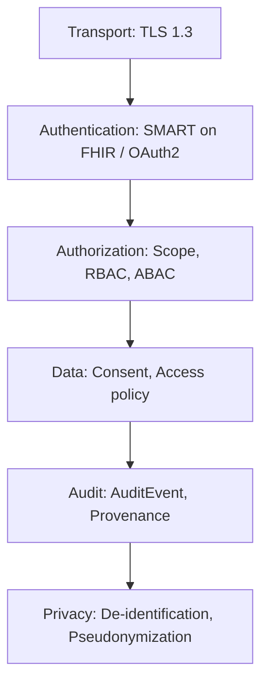
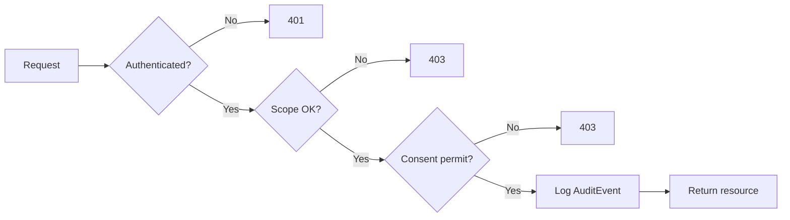
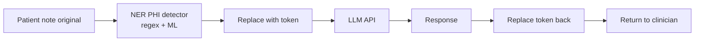

PHI (Protected Health Information) là loại dữ liệu nhạy cảm bậc nhất. Vi phạm có thể dẫn tới phạt tiền lớn (HIPAA fine $50k/incident, GDPR đến 4% doanh thu, Nghị định 13/2023 đến 100 triệu VND/lần) và quan trọng hơn — thiệt hại uy tín và an toàn bệnh nhân. Bài này cover security & privacy trong FHIR.

## 1. Layer model



Mỗi layer độc lập nhưng đều bắt buộc.

## 2. Khung pháp lý

| Khu vực | Văn bản | Trọng tâm |
|---|---|---|
| **Mỹ** | HIPAA + HITECH | PHI definition, Privacy Rule, Security Rule, Breach Notification |
| **EU** | GDPR + EHDS | Right to access, erasure, portability; consent có thể rút |
| **Việt Nam** | Nghị định 13/2023/NĐ-CP về bảo vệ dữ liệu cá nhân | Dữ liệu cá nhân nhạy cảm bao gồm sức khoẻ; cần consent rõ ràng |
| **Việt Nam y tế** | Thông tư 54/2017/TT-BYT, Quyết định 3516/QĐ-BYT | Bảo mật HIS/EHR, audit, backup |

### 2.1 Nghị định 13/2023 — điểm chính cho dự án FHIR

- Dữ liệu sức khoẻ là **dữ liệu cá nhân nhạy cảm** → consent đặc biệt
- Phải có **đánh giá tác động** xử lý dữ liệu cá nhân (DPIA)
- Phải có **DPO** (Data Protection Officer) hoặc bộ phận tương đương
- Báo cáo **vi phạm trong 72h**
- Lưu trữ trong nước cho dữ liệu nhạy cảm — cần cẩn thận khi dùng cloud nước ngoài

## 3. Transport security

- **TLS 1.3** bắt buộc, disable TLS 1.0/1.1
- **HSTS** + cert valid (Let's Encrypt OK)
- **Cert pinning** cho mobile app

## 4. Authentication & Authorization

Đã cover ở [SMART on FHIR](/blog/smart-on-fhir-oauth2-backend-services). Recap:

- OAuth2 + OIDC qua SMART on FHIR
- Scope theo nguyên tắc least privilege
- Backend Services dùng JWT RS384 + JWKS rotation
- DPoP / mTLS cho high-security

## 5. Resource Consent

Consent ghi rõ ai được làm gì với data của patient nào.

```json
{
  "resourceType": "Consent",
  "status": "active",
  "scope": {"coding": [{"system": "http://terminology.hl7.org/CodeSystem/consentscope", "code": "patient-privacy"}]},
  "category": [{"coding": [{"system": "http://terminology.hl7.org/CodeSystem/consentcategorycodes", "code": "INFAO", "display": "information access"}]}],
  "patient": {"reference": "Patient/vn-001"},
  "dateTime": "2026-05-07T08:00:00+07:00",
  "performer": [{"reference": "Patient/vn-001"}],
  "policy": [{"uri": "https://benhvien.vn/policy/share-medical-record-v2"}],
  "provision": {
    "type": "permit",
    "period": {"start": "2026-05-07", "end": "2027-05-07"},
    "actor": [{
      "role": {"coding": [{"system": "...consentaction", "code": "PRCP"}]},
      "reference": {"reference": "Organization/bv-cho-ray"}
    }],
    "action": [{"coding": [{"code": "access"}]}, {"coding": [{"code": "disclose"}]}],
    "purpose": [{"system": "...purpose-of-use", "code": "TREAT"}],
    "class": [{"system": "urn:ietf:bcp:13", "code": "application/fhir+json"}],
    "code": [
      {"coding": [{"system": "http://snomed.info/sct", "code": "44054006", "display": "Diabetes mellitus type 2"}]}
    ],
    "provision": [{
      "type": "deny",
      "actor": [{"role": {"coding": [{"code": "PRCP"}]}, "reference": {"reference": "Organization/insurance-x"}}]
    }]
  }
}
```

Provision lồng nhau — outer permit, inner deny. Server cần evaluate consent tree mỗi request.

## 6. AuditEvent

Mọi access đến PHI phải audit. AuditEvent ghi:

```json
{
  "resourceType": "AuditEvent",
  "type": {"system": "http://terminology.hl7.org/CodeSystem/audit-event-type", "code": "rest"},
  "subtype": [{"system": "http://hl7.org/fhir/restful-interaction", "code": "read"}],
  "action": "R",
  "recorded": "2026-05-07T13:30:00+07:00",
  "outcome": "0",
  "agent": [{
    "type": {"coding": [{"system": "http://terminology.hl7.org/CodeSystem/v3-RoleClass", "code": "PROV"}]},
    "who": {"reference": "Practitioner/dr-nguyen"},
    "requestor": true,
    "network": {"address": "10.0.1.123", "type": "2"}
  }, {
    "type": {"coding": [{"code": "client"}]},
    "who": {"identifier": {"value": "ehr-app"}},
    "requestor": false
  }],
  "source": {
    "site": "BV-CHO-RAY-HCM",
    "observer": {"display": "FHIR Server"}
  },
  "entity": [{
    "what": {"reference": "Patient/vn-001"},
    "type": {"system": "...audit-entity-type", "code": "1", "display": "Person"},
    "role": {"system": "...object-role", "code": "1", "display": "Patient"}
  }, {
    "what": {"reference": "Observation/hba1c-1"},
    "type": {"system": "...audit-entity-type", "code": "2", "display": "System Object"}
  }]
}
```

Tối thiểu cần lưu:
- **Who**: user + client app
- **What**: resource accessed
- **When**: timestamp
- **Where**: IP, hostname
- **Why**: purpose of use
- **Outcome**: success/fail

Nên lưu AuditEvent **vào storage tách biệt** (tamper-evident, append-only). Khi production lớn, dùng SIEM (Splunk, Elastic, Sentinel).

## 7. Provenance

Khác AuditEvent (tracking access), Provenance tracking **nguồn gốc** của data:

```json
{
  "resourceType": "Provenance",
  "target": [{"reference": "Observation/hba1c-1"}],
  "recorded": "2026-05-07T08:00:00+07:00",
  "agent": [{
    "type": {"coding": [{"code": "performer"}]},
    "who": {"reference": "Practitioner/lab-tech-1"},
    "onBehalfOf": {"reference": "Organization/lab-cho-ray"}
  }],
  "entity": [{
    "role": "source",
    "what": {"reference": "DiagnosticReport/dr-1"}
  }],
  "signature": [{
    "type": [{"system": "urn:iso-astm:E1762-95:2013", "code": "1.2.840.10065.1.12.1.1"}],
    "when": "2026-05-07T08:00:00+07:00",
    "who": {"reference": "Practitioner/dr-nguyen"},
    "data": "<base64 signature>"
  }]
}
```

Quan trọng cho dữ liệu legal-grade và AI training (data lineage).

## 8. Authorization patterns

### 8.1 RBAC qua scope

SMART scope đã là RBAC layer 1.

### 8.2 ABAC + Consent

Layer 2: kiểm tra consent động:



HAPI có `ConsentInterceptor` framework cho việc này.

### 8.3 Break-the-glass

Trong cấp cứu, bác sĩ cần access bypass consent. Phải:
- Log đặc biệt (purpose-of-use = `ETREAT` emergency treatment)
- Notification cho compliance officer
- Review sau 24h

## 9. De-identification

Khi đưa data ra analytics/AI, phải de-identify. 18 HIPAA Safe Harbor identifier (áp dụng tương tự cho VN):

1. Tên
2. Địa chỉ chi tiết hơn state/tỉnh
3. Mọi date trừ year (vd birthDate → birthYear)
4. Số điện thoại
5. Fax
6. Email
7. SSN/CCCD
8. MR
9. Số BHYT
10. Số tài khoản
11. License number
12. Phương tiện ID (xe)
13. Device ID/serial
14. URL
15. IP
16. Biometric (fingerprint, voice)
17. Photo
18. Mọi mã số duy nhất khác

### 9.1 Operation `$de-identify` (Azure Health Data Services)

Azure cung cấp built-in:

```http
POST /Patient/$de-identify HTTP/1.1
Content-Type: application/fhir+json

{
  "resourceType": "Parameters",
  "parameter": [{
    "name": "config",
    "valueString": "{...redact rules...}"
  }, {
    "name": "input",
    "resource": {...}
  }]
}
```

### 9.2 Pseudonymization

Thay identifier bằng hash (không reversible) hoặc token (reversible với key):

```python
import hashlib, hmac

KEY = b"secret-do-not-leak"

def pseudonymize_cccd(cccd: str) -> str:
    return hmac.new(KEY, cccd.encode(), hashlib.sha256).hexdigest()[:12]
```

Pseudonymize không phải anonymize — vẫn có rủi ro re-identification nếu có đủ context.

### 9.3 k-anonymity, differential privacy

Cho dataset publish: đảm bảo mỗi record có ít nhất k-1 record khác giống nó trên quasi-identifier (age range, gender, district).

## 10. PHI redaction cho AI/LLM

Khi gửi prompt cho LLM external:



Pattern này cho phép tận dụng LLM mạnh mà không leak PHI. Tuy nhiên, nguyên tắc an toàn nhất là: **dùng LLM on-prem** (Llama 4, Gemma 3, vLLM) cho dữ liệu lâm sàng.

## 11. Compliance checklist cho FHIR project tại VN

- [ ] DPIA (đánh giá tác động) viết trước go-live
- [ ] Bổ nhiệm DPO hoặc compliance lead
- [ ] TLS 1.3 mọi endpoint
- [ ] OAuth2/SMART implementation
- [ ] Consent resource cho mọi share data
- [ ] AuditEvent log mọi PHI access, SIEM ingest
- [ ] Encryption at rest (DB + backup + storage)
- [ ] Backup test định kỳ + offsite
- [ ] BCP/DRP với RTO/RPO defined
- [ ] Vendor risk assessment cho cloud
- [ ] Pen-test annual
- [ ] Breach response plan + 72h notification
- [ ] Training nhân viên y tế về privacy
- [ ] Review consent + audit hàng quý

## 12. Lưu ý cloud cho VN

- **Azure (East Asia, Southeast Asia)**: HIPAA + ISO 27001/27017/27018 compliant; có Azure Vietnam (preview) sắp ra
- **GCP**: tương tự, có region Singapore/Jakarta
- **AWS**: HealthLake region us-east hiện tại; cần cân nhắc Nghị định 13 với data sensitive

Khi data nhạy cảm bậc cao (CCCD, BHYT đầy đủ), cân nhắc on-prem hoặc Azure Stack/private cloud trong VN.

## 13. Pattern thực tế HAPI + Spring Security

```java
@Component
public class FhirAuthInterceptor extends InterceptorAdapter {
    @Override
    public boolean incomingRequestPostProcessed(...) {
        // 1. Verify JWT, extract scope, patient context
        // 2. Check scope vs requested resource
        // 3. Evaluate Consent
        // 4. Persist AuditEvent (async)
        // 5. Allow or throw AuthenticationException
    }
}
```

## 14. Pitfall

- ❌ Lưu PHI trong log application (developer thường log `request.body`)
- ❌ Quên redact PHI khi gửi error message (stack trace có patient data)
- ❌ Backup không encrypt
- ❌ Test/staging dùng PHI thật → leak qua dev laptop
- ❌ Print giấy không shred
- ❌ Email PHI không encrypt
- ❌ Long-lived OAuth token → khó revoke khi user nghỉ việc

## Kết luận

Security & Privacy không phải chương cuối — phải là chương đầu. Mỗi feature mới hỏi: ai access? Có consent? Có audit? Có PII leak qua log không? Compliance không tốn nhiều thời gian nếu shift-left từ đầu.

Bài tiếp: [HAPI FHIR & Cloud FHIR Production — vận hành quy mô triệu bệnh nhân](/blog/hapi-fhir-azure-gcp-aws-production).
