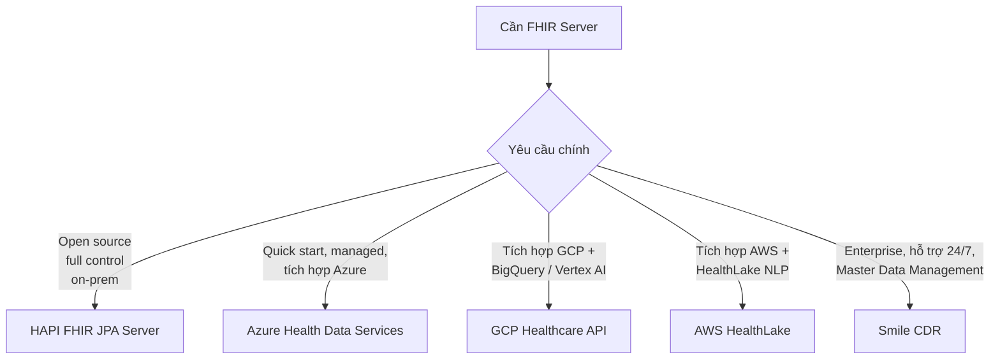
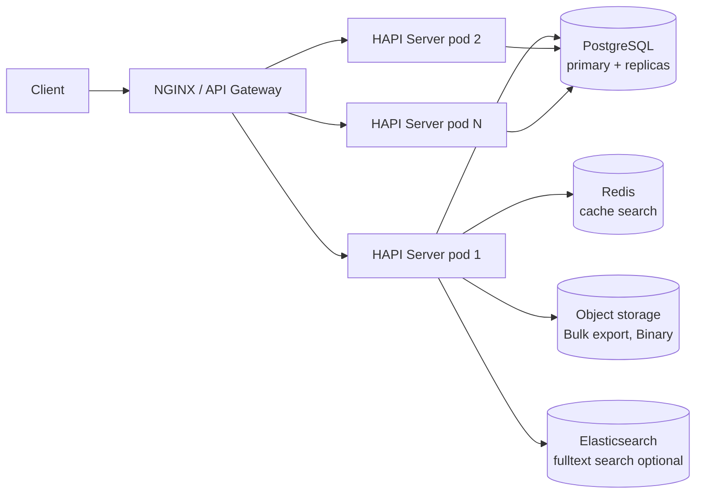
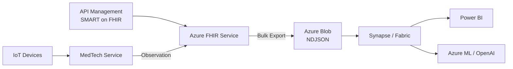
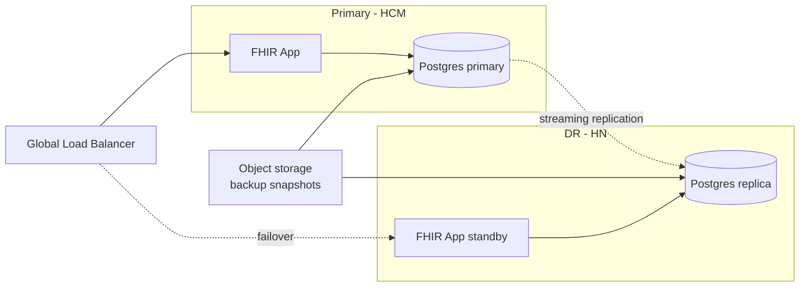
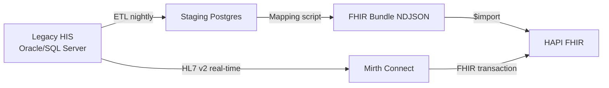

Học FHIR rồi triển khai 1 server demo là dễ. Vận hành production với hàng triệu bệnh nhân, traffic cao, SLA 99.9% là chuyện hoàn toàn khác. Bài này so sánh các option và chia sẻ kinh nghiệm thực chiến.

## 1. Bản đồ lựa chọn



## 2. HAPI FHIR JPA Server

### 2.1 Kiến trúc



### 2.2 Postgres tuning

- **Partition** bảng lớn theo Resource type và year:
  ```sql
  CREATE TABLE hfj_resource (...) PARTITION BY LIST (res_type);
  CREATE TABLE hfj_resource_patient PARTITION OF hfj_resource FOR VALUES IN ('Patient');
  ```
- **Indexes** trên search params được dùng nhiều (`HFJ_SPIDX_TOKEN`, `HFJ_SPIDX_STRING`, `HFJ_SPIDX_DATE`)
- **Vacuum + analyze** định kỳ
- **Connection pool** (HikariCP) với size = (CPU * 2) + spindles
- **Read replicas** cho search-heavy workload
- **Logical replication** sang data lake nếu cần

### 2.3 Indexing strategy

HAPI tự index dựa trên search param. Custom search param:

```yaml
hapi:
  fhir:
    custom_search_params:
      - resource: Patient
        name: cccd
        type: token
        path: Patient.identifier.where(system='http://moh.gov.vn/sid/cccd')
```

Reindex sau khi thêm:

```http
POST /$reindex
```

### 2.4 Interceptor — extension point chính

```java
@Interceptor
public class VnAuditInterceptor {
    @Hook(Pointcut.STORAGE_PRESHOW_RESOURCES)
    public void preShow(IPreResourceShowDetails details, ServletRequestDetails req) {
        // Filter resource theo consent + scope
    }
    
    @Hook(Pointcut.STORAGE_PRECOMMIT_RESOURCE_CREATED)
    public void preCreate(IBaseResource resource, ServletRequestDetails req) {
        // Validate, enrich extension
    }
    
    @Hook(Pointcut.SERVER_OUTGOING_RESPONSE)
    public void audit(ServletRequestDetails req, IBaseResource resource) {
        // Persist AuditEvent async
    }
}
```

### 2.5 Subscription

HAPI hỗ trợ Subscription (R4) và SubscriptionTopic (R4B/R5) — webhook khi resource thay đổi:

```json
{
  "resourceType": "Subscription",
  "status": "active",
  "criteria": "Observation?code=4548-4&value-quantity=gt9",
  "channel": {"type": "rest-hook", "endpoint": "https://my-app/webhook", "payload": "application/fhir+json"}
}
```

Pattern phổ biến: subscribe lab kết quả abnormal → push notification cho bác sĩ.

### 2.6 Deploy HAPI

Helm chart official:

```bash
helm repo add hapi-fhir-jpaserver https://hapifhir.github.io/hapi-fhir-jpaserver-starter
helm install hapi hapi-fhir-jpaserver/hapi-fhir-jpaserver \
  --set postgresql.enabled=true \
  --set postgresql.auth.password=changeme \
  --set replicaCount=3 \
  --set resources.requests.memory=2Gi
```

Hoặc tự dựng K8s manifest với readiness/liveness probe `/fhir/metadata`.

### 2.7 Scaling

| Metric | Action |
|---|---|
| CPU > 70% | HPA scale pod |
| Latency p95 > 500ms | Add replica, tune index |
| DB connections saturated | Tăng pool, thêm read replica |
| Disk full | Partition + archive old version |
| Search timeout | Cache hot query, dùng Elasticsearch |

## 3. Azure Health Data Services

### 3.1 Tổng quan

Managed service từ Microsoft:
- **FHIR service** (R4)
- **DICOM service**
- **MedTech service** (IoMT → FHIR)
- **De-identify operation**
- **Bulk export** native ra Azure Blob

### 3.2 Khi nào chọn

- Đã có Azure tenant, AD (Entra ID) cho auth
- Cần SLA 99.95% không tự vận hành
- Cần SNOMED CT license sẵn (Azure đã đàm phán)
- Cần tích hợp Synapse/Fabric cho analytics

### 3.3 Cost (rough)

- Storage: $0.5/GB/month
- Operations: $0.5/1000 ops
- Một dự án 10M resource, 1M ops/day: ~$2-5k/month

### 3.4 Tích hợp với Azure ecosystem



## 4. GCP Healthcare API

### 4.1 Tổng quan

- FHIR stores (R4, R5)
- HL7 v2 + DICOM stores
- Streaming sang BigQuery (gần real-time)
- DLP (Data Loss Prevention) cho de-identify

### 4.2 Strength

- **BigQuery streaming** cực mạnh cho analytics
- **Vertex AI** integration cho ML
- **MedLM** model dành riêng y khoa

### 4.3 Streaming sang BigQuery

```bash
gcloud healthcare fhir-stores update STORE_ID \
  --dataset=DATASET \
  --location=LOCATION \
  --add-stream-config=streamConfigs[].bigqueryDestination.datasetUri=bq://project.dataset
```

Mỗi resource update → row trong BigQuery — mỗi resource type 1 table. SQL query trực tiếp như data warehouse.

## 5. AWS HealthLake

### 5.1 Tổng quan

- FHIR R4 store
- **NLP integration** built-in (extract entity từ DocumentReference text)
- Export sang S3
- Comprehend Medical cho phân tích sâu hơn

### 5.2 Use case

Tốt nhất khi cần xử lý unstructured clinical notes (tiếng Anh chủ yếu).

### 5.3 Hạn chế

- API set giới hạn hơn HAPI/Azure
- Region limited (us-east, us-west chính)
- Tiếng Việt NLP chưa mạnh

## 6. Smile CDR

Enterprise version của HAPI bởi cùng đội:

- 24/7 support
- Master Data Management (MDM) — patient matching
- Multi-tenancy
- Connect (HL7 v2 ↔ FHIR transform)
- Pricing license thương lượng

Phù hợp cho tổ chức lớn cần SLA enterprise mà không muốn build team vận hành riêng.

## 7. So sánh nhanh

| Tiêu chí | HAPI self-host | Azure | GCP | AWS HealthLake | Smile CDR |
|---|---|---|---|---|---|
| Cost | Thấp (infra + người) | Trung bình | Trung bình | Cao | Cao |
| Control | Cao nhất | Trung | Trung | Thấp | Cao |
| Time-to-prod | 3-6 tháng | 1 tháng | 1 tháng | 2 tuần | 1-2 tháng |
| Scale | Tự xử | Auto | Auto | Auto | Auto |
| Compliance VN (Nghị định 13) | OK on-prem | OK Singapore region, cần đánh giá | Tương tự Azure | Region xa | Self-host hoặc cloud chosen |
| FHIR features | Full | Full + de-id | Full + BQ stream | Limited + NLP | Full + MDM |
| SNOMED license | Cần tự lo | Có sẵn | Có sẵn | Có sẵn | Có thể bundle |

## 8. Multi-region & DR



RPO target: 15 phút. RTO: 1h cho non-critical, 15 min cho critical.

## 9. Observability

Bắt buộc:
- **Metrics**: latency p50/p95/p99, error rate, search QPS, DB conn
- **Logs**: structured, redact PHI, ship sang ELK/Loki
- **Traces**: OpenTelemetry, sample 1-10%
- **Health check**: `/fhir/metadata`, `/actuator/health`
- **Alerts**: latency, error rate, DB lag, disk

Tools: Prometheus + Grafana + Loki + Tempo (open source) hoặc Datadog/New Relic.

## 10. Performance benchmark thực tế (HAPI 6.x)

Trên hệ thống tham khảo (4 vCPU, 16 GB RAM, Postgres 16 cùng spec):

| Operation | QPS sustainable | p95 latency |
|---|---|---|
| `GET /Patient/{id}` (cached) | 5000+ | 5 ms |
| `GET /Patient?identifier=...` | 2000 | 30 ms |
| `POST /Patient` | 500 | 80 ms |
| `POST /` (Bundle 5 entry transaction) | 100 | 250 ms |
| `GET /Patient/$everything` | 50 | 1500 ms |
| `GET /$export` (Group 100k patient) | 1 job | 30+ min async |

Numbers thay đổi theo tuning. Always benchmark cho workload cụ thể.

## 11. Migration từ legacy HIS



Pattern dual-write trong giai đoạn chuyển đổi: HIS gửi cả vào Oracle cũ và FHIR mới, đối soát hàng đêm. Khi confidence đủ, cut-over.

## 12. Cost optimization

- **Cold tier** cho version cũ + AuditEvent > 90 ngày
- **Compress** Bulk export NDJSON (gzip → 10x giảm)
- **Cache** CapabilityStatement, $expand result
- **Right-size** pod (đo bằng VPA recommendation)
- **Reserved instance** cho baseline, autoscale cho peak
- **Archive** patient inactive (vd Patient.active=false 5+ năm) sang S3 Glacier

## 13. Production-ready checklist

### Security
- [ ] TLS 1.3 + HSTS
- [ ] OAuth2/SMART implemented
- [ ] AuditEvent persisted to SIEM
- [ ] Pen-test trước go-live

### Performance
- [ ] Load test với 2x peak expected
- [ ] Index search params thường dùng
- [ ] DB read replica nếu read-heavy
- [ ] Cache layer (Redis) cho hot data

### Reliability
- [ ] HA: ≥2 pod app, DB primary + replica
- [ ] Backup automated + restore test hàng tháng
- [ ] DR plan với RTO/RPO defined
- [ ] Circuit breaker với downstream

### Observability
- [ ] Metrics + alerts
- [ ] Centralized log
- [ ] Distributed tracing
- [ ] Synthetic monitoring (uptime check)

### Compliance
- [ ] Consent enforcement
- [ ] Data retention policy
- [ ] Encryption at rest
- [ ] DPIA + DPO

### Operations
- [ ] Runbook cho incident phổ biến
- [ ] On-call rotation
- [ ] Change management
- [ ] Capacity planning hàng quý

## 14. Đề xuất cho Việt Nam

Dựa trên Nghị định 13 và Quyết định 3516/QĐ-BYT:

| Quy mô | Đề xuất |
|---|---|
| Bệnh viện 1 cơ sở (<100k bệnh nhân) | HAPI on-prem hoặc Azure Stack VN |
| Mạng lưới bệnh viện (1-10M bệnh nhân) | HAPI multi-tenant + Postgres cluster, on-prem hoặc Smile CDR |
| Quốc gia (HSDT 100M+) | Multi-region HAPI custom + Bulk pipeline sang lakehouse |
| Telemedicine startup | Azure FHIR (Singapore) + SMART on FHIR + VNeID OAuth |

## Kết luận

Production FHIR là full-stack: app + DB + cache + observability + compliance. HAPI là lựa chọn open-source linh hoạt nhất; cloud managed phù hợp khi cần move nhanh và có ngân sách. Bắt đầu nhỏ, đo, scale.

Bài tiếp: [FHIR cho AI/RAG y khoa — Bulk export đến vector DB và clinical LLM](/blog/fhir-ai-rag-clinical-llm).
