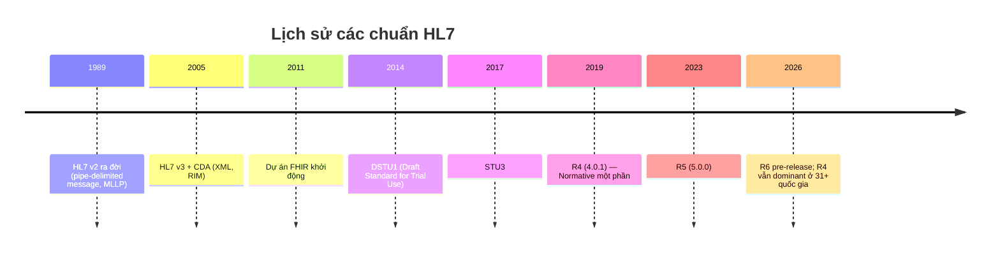
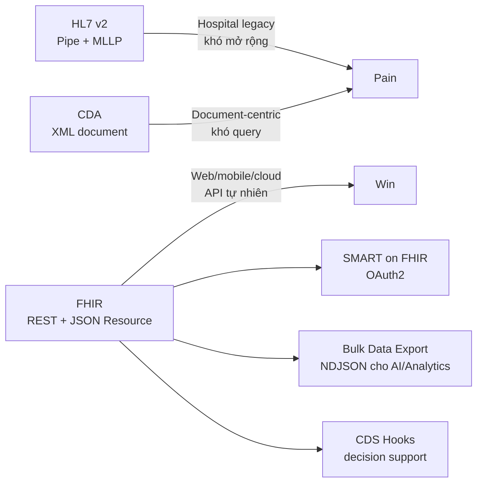
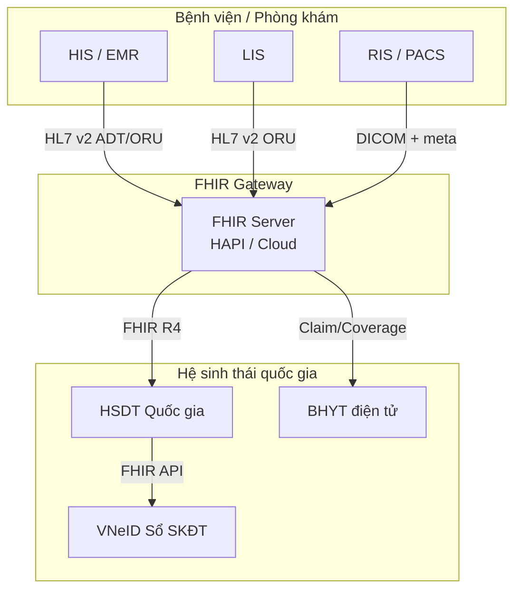

Nếu bạn đang làm phần mềm y tế tại Việt Nam năm 2026, có 3 thứ bạn sẽ chạm vào sớm muộn: **HL7 FHIR**, **VNeID Sổ Sức Khoẻ Điện tử** và **Quyết định 3516/QĐ-BYT**. Bài viết này giải thích vì sao chúng liên quan đến nhau và vì sao FHIR đáng để bạn đầu tư học bài bản.

## 1. FHIR là gì — nói ngắn gọn

**FHIR** (Fast Healthcare Interoperability Resources) là chuẩn trao đổi dữ liệu y tế do tổ chức **HL7 International** phát triển. Khác với các chuẩn HL7 cũ (v2, v3, CDA), FHIR đưa dữ liệu y tế lên mô hình:

- **Resource**: mỗi khái niệm lâm sàng (bệnh nhân, lượt khám, kết quả xét nghiệm) là một resource độc lập
- **RESTful API**: CRUD/search bằng HTTP + JSON/XML chuẩn web
- **Tách biệt rõ ràng**: dữ liệu (Resource) — ràng buộc (Profile) — quy tắc (Rule) — terminology (CodeSystem/ValueSet)

Một POST đơn giản tạo bệnh nhân:

```http
POST /Patient HTTP/1.1
Content-Type: application/fhir+json

{
  "resourceType": "Patient",
  "identifier": [{"system": "urn:oid:CCCD", "value": "001234567890"}],
  "name": [{"family": "Trần", "given": ["Duy"]}],
  "gender": "male",
  "birthDate": "1990-05-12"
}
```

So sánh với HL7 v2 ADT^A01 cùng nội dung — bạn sẽ thấy FHIR tự nhiên hơn rất nhiều với developer hiện đại.

## 2. Lịch sử HL7: từ v2 đến FHIR



Hiện tại 2026:

| Phiên bản | Trạng thái | Khuyến nghị |
|---|---|---|
| **R4 (4.0.1)** | Normative cho nhiều phần, ổn định nhất | **Production mới: dùng R4** |
| R4B (4.3.0) | Bridge sang một số R5 module | Khi cần SubscriptionTopic mà chưa nhảy sang R5 |
| R5 (5.0.0) | Stable, đang được áp dụng dần | Use case mới có yêu cầu R5 (clinical reasoning, subscription nâng cao) |
| R6 | Pre-release | Tracking, chưa production |

**Lý do**: hầu hết Implementation Guide quan trọng (US Core, IPS, AU Core, IPA) và cloud services (Azure Health Data Services, GCP Healthcare API, AWS HealthLake) hỗ trợ R4 ổn định nhất.

## 3. Vì sao FHIR thắng các chuẩn cũ?



5 lý do FHIR vượt trội:

1. **API tự nhiên**: developer không cần học cú pháp riêng — REST + JSON là đủ
2. **Resource modular**: lấy đúng phần cần (Patient hoặc Observation), không phải parse cả document
3. **Hệ sinh thái**: SMART on FHIR cho OAuth2, Bulk Data cho analytics/AI, CDS Hooks cho decision support
4. **Cloud-native**: Azure/GCP/AWS đều có managed service
5. **AI-ready**: Bulk export ra NDJSON cực kỳ thân thiện với data lake và RAG y khoa

## 4. Bối cảnh Việt Nam 2026

### 4.1 Chính sách

| Văn bản | Thời điểm | Nội dung chính cho FHIR |
|---|---|---|
| Quyết định 749/QĐ-TTg (Chương trình Chuyển đổi số quốc gia) | 2020 | Y tế là lĩnh vực ưu tiên, mục tiêu 100% cơ sở y tế dùng EHR |
| Thông tư 46/2018/TT-BYT (EMR) | 2018 | Quy định bệnh án điện tử thay thế giấy |
| Thông tư 54/2017/TT-BYT (Bộ tiêu chí HIT) | 2017 | Yêu cầu tối thiểu cho HIS/LIS |
| **Quyết định 3516/QĐ-BYT** | **11/2025** | **Chiến lược chuyển đổi số y tế 2025-2030, lấy data làm trung tâm** |
| Nghị định 13/2023/NĐ-CP | 2023 | Bảo vệ dữ liệu cá nhân (áp dụng cho PHI) |

Đặc biệt: hướng dẫn liên thông 2013 vẫn yêu cầu **HL7 v2/v3 + DICOM** là bắt buộc, **CDA + LOINC** là khuyến nghị. Tới Quyết định 3516/QĐ-BYT, **FHIR** được định vị là chuẩn nền cho hệ sinh thái mới.

### 4.2 VNeID Sổ Sức Khoẻ Điện tử

- Khởi động 10/2024 bởi Thủ tướng Phạm Minh Chính
- Tới 1/2026: **34+ triệu** Sổ Sức Khoẻ Điện tử đã tạo trong VNeID
- Mục tiêu: mỗi công dân có 1 hồ sơ sức khoẻ số

VNeID là cửa ngõ cho công dân, còn **HSDT (Hồ sơ Sức khoẻ Điện tử)** là backend dữ liệu. FHIR đóng vai trò chuẩn trao đổi giữa HIS bệnh viện ↔ HSDT quốc gia ↔ VNeID app.



### 4.3 Cơ hội nghề nghiệp

Việt Nam đang thiếu nghiêm trọng người có thể:

- Viết Implementation Guide nội địa (kế thừa IPS) cho danh mục Bộ Y tế
- Migrate HL7 v2 ↔ FHIR cho hệ thống bệnh viện cũ
- Triển khai SMART on FHIR + OAuth2 cho ứng dụng doctor/patient
- Vận hành HAPI FHIR / Azure FHIR ở quy mô triệu bệnh nhân

Đó là lý do roadmap [HL7 FHIR Practitioner](/roadmap/hl7-fhir) ra đời.

## 5. FHIR có gì khác với REST API thông thường?

Nhìn thì giống REST nhưng FHIR có thêm:

- **Resource type chuẩn hoá**: bạn không tự đặt schema, dùng 150+ Resource định nghĩa sẵn
- **Search params chuẩn**: `Patient?name=Tran&birthdate=ge1990-01-01` — mọi server tuân theo
- **Bundle**: gói nhiều resource trong 1 request (transaction atomic)
- **CapabilityStatement**: server tự khai báo nó hỗ trợ gì
- **Profile + Validation**: ràng buộc dữ liệu theo chuẩn ngành/quốc gia
- **Terminology binding**: code phải thuộc ValueSet (vd: status='active|inactive|...')

## 6. Khi nào KHÔNG dùng FHIR?

Đừng tôn sùng FHIR. Có những trường hợp KHÔNG nên (hoặc chưa cần):

- Hệ thống nội bộ thuần tuý của 1 bệnh viện, không cần liên thông → REST riêng có thể đơn giản hơn
- Streaming HL7 v2 real-time ổn định và đối tác chỉ chấp nhận v2 → giữ v2, chỉ bridge sang FHIR khi cần
- DICOM ảnh y tế → vẫn dùng DICOM gốc, FHIR chỉ giữ metadata qua `ImagingStudy`

## 7. Lộ trình đề xuất

Nếu bạn là developer/BA mới:

1. **Tuần 1-2**: đọc bài này + [So sánh HL7 v2/CDA/FHIR](/blog/hl7-v2-cda-fhir-so-sanh) + [Terminology y tế](/blog/terminology-y-te-icd-snomed-loinc-rxnorm)
2. **Tuần 3-6**: học [Resource & Bundle core](/blog/fhir-resource-bundle-reference-cot-loi) và dựng HAPI FHIR local
3. **Tuần 7-10**: master [REST API & Search](/blog/fhir-rest-api-search-mastery) + [Resource Modeling lâm sàng](/blog/fhir-resource-modeling-clinical-domain)
4. **Tuần 11-16**: học [FHIR cho Việt Nam (BHYT/VNeID)](/blog/fhir-bhyt-vneid-viet-nam) và [Profiling + IG bằng FSH/SUSHI](/blog/fhir-profiling-implementation-guide-fsh-sushi)
5. **Tuần 17-24**: nâng cao với [SMART on FHIR](/blog/smart-on-fhir-oauth2-backend-services), [Bulk Data + CDS Hooks](/blog/fhir-bulk-data-export-cds-hooks), [Security/Compliance](/blog/fhir-security-privacy-vietnam-nd13)
6. **Tuần 25+**: production với [HAPI/Cloud FHIR](/blog/hapi-fhir-azure-gcp-aws-production) và [FHIR cho AI](/blog/fhir-ai-rag-clinical-llm)

Toàn bộ roadmap cùng quiz và project: [Roadmap HL7 FHIR Practitioner](/roadmap/hl7-fhir).

## 8. Tài nguyên chính thức (chỉ tham khảo spec)

Khi bạn đã hiểu khái niệm, hãy đọc spec gốc:

- [HL7 FHIR R4 spec](https://www.hl7.org/fhir/R4/) — chuẩn chính, dùng làm bible
- [HL7 FHIR R5 spec](https://www.hl7.org/fhir/R5/) — bản mới
- [chat.fhir.org](https://chat.fhir.org/) — cộng đồng hỏi đáp
- [HAPI FHIR](https://hapifhir.io/) — implementation Java mã nguồn mở

Nhưng để hiểu BẢN CHẤT và cách áp dụng vào Việt Nam, hãy đọc tiếp loạt bài trong roadmap — nội dung tiếng Việt, có ví dụ thực tế và kèm code mẫu.

## Kết luận

FHIR không còn là "chuẩn mới nổi" — năm 2026 nó đã là chuẩn de facto cho mọi hệ thống y tế hiện đại. Việt Nam đang đẩy mạnh chuyển đổi số y tế và FHIR là lớp xương sống. Đầu tư học FHIR bài bản bây giờ là quyết định đúng cho 5-10 năm tới.

Bài tiếp theo: [So sánh HL7 v2, CDA và FHIR — chọn chuẩn nào cho dự án y tế Việt Nam](/blog/hl7-v2-cda-fhir-so-sanh).
