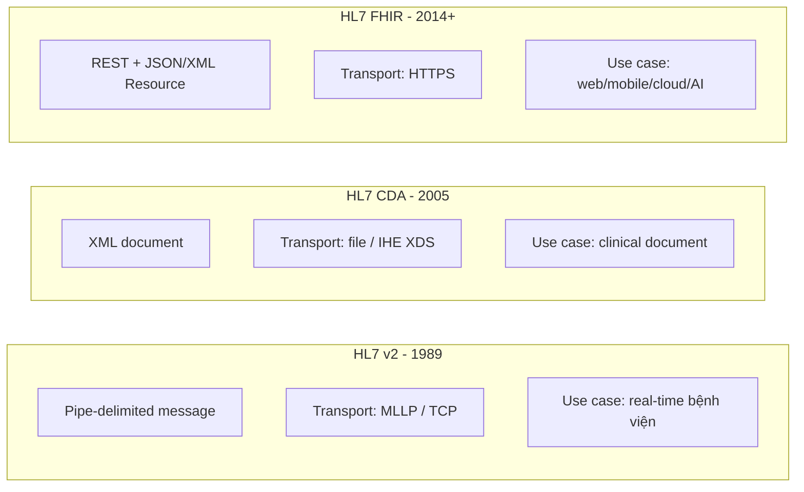
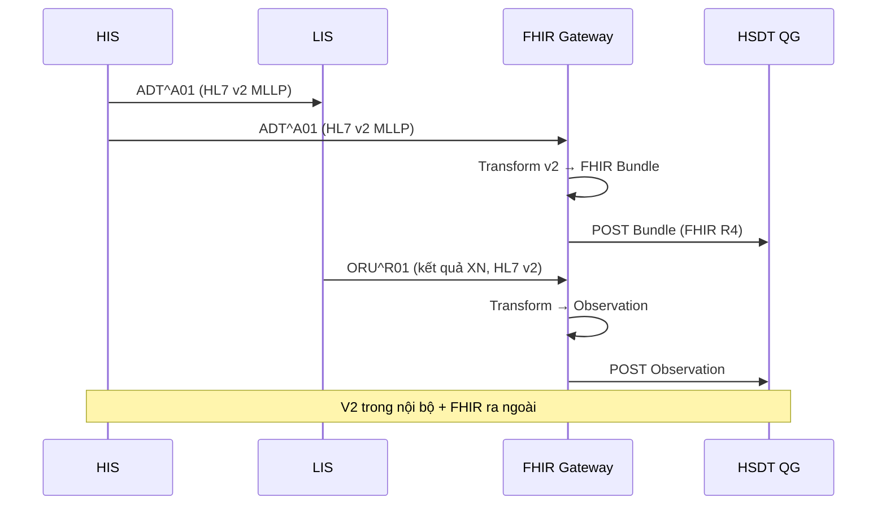
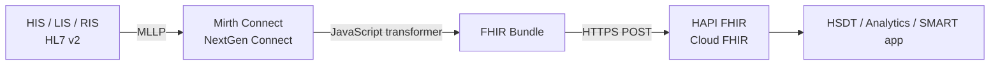

Nhiều dự án y tế Việt Nam đang đứng trước câu hỏi: hệ thống bệnh viện hiện tại đang chạy HL7 v2, đối tác mới yêu cầu FHIR, một vài đối tác EU lại gửi CDA. Chọn chuẩn nào, giữ chuẩn nào, dịch chuẩn nào sang chuẩn nào? Bài này làm rõ.

## 1. Tổng quan 3 chuẩn



| Tiêu chí | HL7 v2 | CDA | FHIR |
|---|---|---|---|
| Năm ra mắt | 1989 | 2005 | 2014 (DSTU1), 2019 (R4) |
| Mô hình | Message segments | XML document | RESTful Resource |
| Transport | MLLP / TCP | File / IHE XDS / SOAP | HTTPS REST |
| Payload | Pipe-delimited text | XML (RIM-based) | JSON / XML / Turtle |
| Versioning | v2.3, v2.4, ..., v2.9 | R1.1, R2 | DSTU1-3, R4, R5, R6 |
| Phổ biến hiện nay | **Rất phổ biến trong bệnh viện** | Phổ biến ở Mỹ/EU cho clinical document | **Chuẩn de facto cho dự án mới** |

## 2. HL7 v2 — chuẩn "huyền thoại" trong bệnh viện

### 2.1 Cấu trúc message

Một ADT (Admit/Discharge/Transfer) message điển hình:

```
MSH|^~\&|HIS|BV-CHO-RAY|HSDT|MOH|20260507083000||ADT^A01|MSG00001|P|2.5.1
EVN|A01|20260507083000
PID|1||001234567890^^^CCCD~HN12345^^^MR||TRAN^DUY^^^Mr.||19900512|M|||123 Le Loi^^Q1^HCM^700000^VN
PV1|1|I|ICU^101^A|||DR123^NGUYEN^MINH|||MED|||||||A0|V123||||||||||||||||||||||20260507083000
```

- **MSH**: Message Header — sender, receiver, message type, timestamp
- **EVN**: Event — A01 = admission
- **PID**: Patient Identification — CCCD, tên, giới tính, địa chỉ
- **PV1**: Patient Visit — phòng, bác sĩ, thời điểm

Triggers thường gặp: A01 (admit), A03 (discharge), A04 (register outpatient), A08 (update info), ORU^R01 (lab result).

### 2.2 Transport MLLP

MLLP (Minimal Lower Layer Protocol) bọc message v2 bằng `<VT>` (start) và `<FS><CR>` (end), gửi qua TCP socket:

```
<VT>MSH|^~\&|...<CR>PID|...<CR><FS><CR>
```

Ưu điểm: cực nhanh, low-latency, đơn giản. Nhược điểm: không có authentication mạnh, khó debug, không HTTP firewall-friendly.

### 2.3 Khi nào vẫn dùng v2

- **Hệ thống bệnh viện hiện hữu** đã chạy v2 ổn định
- **Real-time event streaming** trong nội bộ bệnh viện (ADT, ORU)
- **Đối tác legacy** (LIS, RIS, billing) chỉ nói v2

Nguyên tắc: **đừng vứt v2**. Hãy bridge v2 → FHIR ở edge bằng [Mirth Connect](https://github.com/nextgenhealthcare/connect) hoặc Microsoft FHIR Converter.

## 3. CDA — clinical document chuẩn XML

### 3.1 Cấu trúc

CDA là document XML có structured body. Một Continuity of Care Document (CCD) chứa các section: Allergies, Medications, Problems, Procedures, Results, Vital Signs.

```xml
<ClinicalDocument xmlns="urn:hl7-org:v3">
  <typeId root="2.16.840.1.113883.1.3" extension="POCD_HD000040"/>
  <templateId root="2.16.840.1.113883.10.20.22.1.2"/>
  <id root="..." extension="CCD-001"/>
  <code code="34133-9" codeSystem="2.16.840.1.113883.6.1"
        displayName="Summarization of Episode Note"/>
  <recordTarget>
    <patientRole>
      <id extension="001234567890" root="urn:oid:CCCD"/>
      <patient>
        <name><family>Trần</family><given>Duy</given></name>
        <birthTime value="19900512"/>
      </patient>
    </patientRole>
  </recordTarget>
  <component>
    <structuredBody>
      <component>
        <section>
          <code code="11450-4" displayName="Problem List"/>
          <entry>...</entry>
        </section>
      </component>
    </structuredBody>
  </component>
</ClinicalDocument>
```

### 3.2 Khi nào dùng CDA

- **Clinical document trao đổi giữa cơ sở y tế** (chuyển viện, tổng kết episode)
- **Khu vực Mỹ/EU** đã chuẩn hoá CDA (Meaningful Use)
- **Lưu trữ pháp lý** vì document có chữ ký số, immutable

### 3.3 Hạn chế

- Khó query dữ liệu trong document (phải parse XML đầy đủ)
- Document-centric, không phù hợp với mobile/web modular UI
- Khó kết hợp với REST API hiện đại

## 4. FHIR — chuẩn cho thời đại API

### 4.1 Cấu trúc Resource

Cùng nội dung ADT^A01 trên, FHIR sẽ là transaction Bundle:

```json
{
  "resourceType": "Bundle",
  "type": "transaction",
  "entry": [
    {
      "fullUrl": "urn:uuid:patient-1",
      "resource": {
        "resourceType": "Patient",
        "identifier": [
          {"system": "urn:oid:CCCD", "value": "001234567890"},
          {"system": "http://benhvien.vn/mr", "value": "HN12345"}
        ],
        "name": [{"family": "Trần", "given": ["Duy"]}],
        "gender": "male",
        "birthDate": "1990-05-12"
      },
      "request": {"method": "POST", "url": "Patient"}
    },
    {
      "fullUrl": "urn:uuid:encounter-1",
      "resource": {
        "resourceType": "Encounter",
        "status": "in-progress",
        "class": {
          "system": "http://terminology.hl7.org/CodeSystem/v3-ActCode",
          "code": "IMP", "display": "inpatient encounter"
        },
        "subject": {"reference": "urn:uuid:patient-1"},
        "period": {"start": "2026-05-07T08:30:00+07:00"},
        "location": [{"location": {"display": "ICU-101-A"}}]
      },
      "request": {"method": "POST", "url": "Encounter"}
    }
  ]
}
```

POST cả Bundle này lên `[base]/` — server sẽ tạo cả Patient và Encounter atomic.

### 4.2 Khi nào dùng FHIR

- **Dự án mới**, đặc biệt cần tích hợp web/mobile/cloud
- **Cần SMART on FHIR** cho auth chuẩn OAuth2
- **Cần Bulk Data** cho analytics/AI
- **Tích hợp HSDT/VNeID** ở Việt Nam (Quyết định 3516/QĐ-BYT)

## 5. So sánh chi tiết

### 5.1 Use case bệnh nhân nhập viện



Đây là pattern **co-existence** phổ biến — không bắt buộc thay v2 ngay, chỉ bridge khi ra ngoài.

### 5.2 Bảng tóm tắt khi nào chọn gì

| Tình huống | Chuẩn khuyên dùng |
|---|---|
| HIS-LIS-RIS streaming nội bộ bệnh viện | HL7 v2 (MLLP) |
| Tích hợp với HSDT/VNeID Việt Nam | **FHIR R4** |
| Trao đổi clinical document EU/Mỹ | CDA hoặc FHIR Document Bundle |
| Dự án telemedicine mới | **FHIR + SMART on FHIR** |
| Analytics + AI/RAG y khoa | **FHIR Bulk Data Export** |
| Imaging | DICOM (FHIR ImagingStudy chỉ giữ meta) |
| BHYT điện tử Việt Nam | **FHIR Coverage/Claim** + extension VN |

## 6. Migration HL7 v2 → FHIR

Pattern phổ biến trong dự án Việt Nam:



Mapping ví dụ:

| HL7 v2 segment | FHIR Resource | Field chính |
|---|---|---|
| MSH | MessageHeader (nếu cần) | event, source, destination |
| PID | Patient | identifier, name, gender, birthDate, address |
| PV1 | Encounter | class, status, period, location, participant |
| OBX | Observation | code (LOINC), value, effective |
| ORC + RXE | MedicationRequest | medication, dosage, requester |
| AL1 | AllergyIntolerance | code, reaction |
| DG1 | Condition | code (ICD-10), clinicalStatus |

Microsoft FHIR Converter và Mirth có template sẵn cho các message phổ biến.

## 7. Câu hỏi thường gặp

**Q: Bệnh viện tôi đang chạy v2, có cần migrate sang FHIR không?**  
A: Không cần migrate ngay. Giữ v2 trong nội bộ, dùng FHIR Gateway để giao tiếp với HSDT, BHYT, app bệnh nhân. Khi nâng cấp HIS thì chọn vendor hỗ trợ FHIR native.

**Q: Có cần biết v2 nếu chỉ làm FHIR?**  
A: Có. Hầu hết dự án Việt Nam đều phải bridge v2 nên hiểu cấu trúc v2 (MSH, PID, PV1, OBX) là kỹ năng bắt buộc cho integration engineer.

**Q: CDA có còn cần thiết?**  
A: Cần nếu bạn làm với hệ thống Mỹ (Meaningful Use), EU eHealth Network, hoặc legal record. Còn lại FHIR Document Bundle có thể thay thế cho hầu hết use case mới.

## Kết luận

3 chuẩn không loại trừ nhau — chúng phục vụ use case khác nhau. Chiến lược thực tế:

- **Trong bệnh viện**: giữ HL7 v2 cho real-time
- **Ra ngoài**: dùng FHIR cho mọi tích hợp mới
- **Document chính thức**: cân nhắc CDA hoặc FHIR Document
- **Bridge**: Mirth/NextGen Connect, Microsoft FHIR Converter

Bài tiếp: [Terminology y tế cho FHIR — ICD, SNOMED CT, LOINC, RxNorm, UCUM](/blog/terminology-y-te-icd-snomed-loinc-rxnorm).
