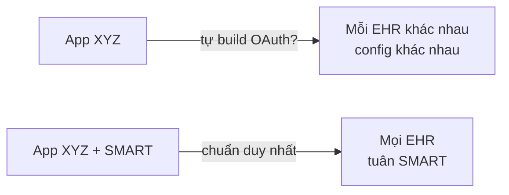
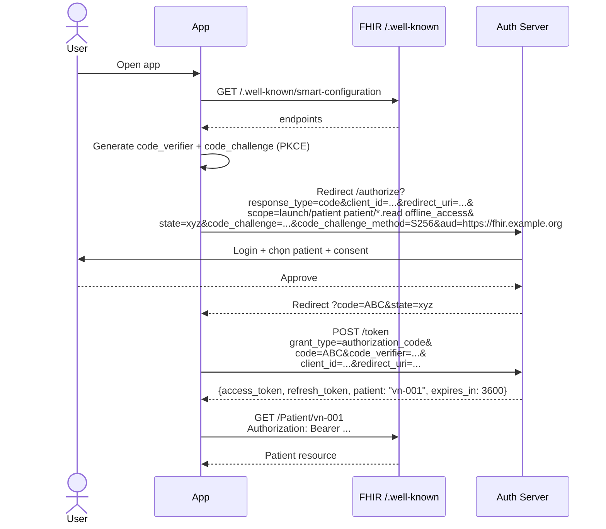
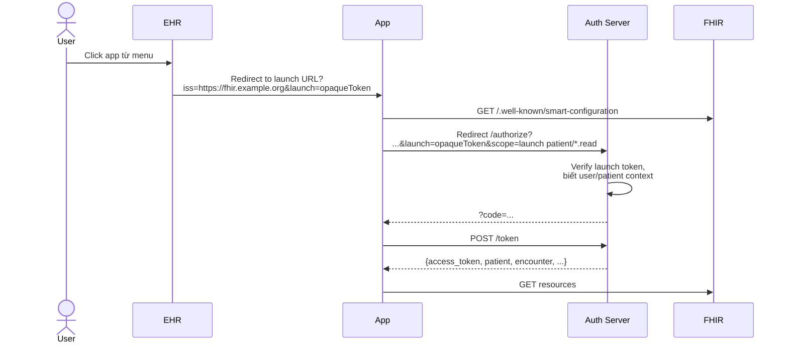

Authentication trong y tế phức tạp hơn web app thông thường: cần biết user là ai, role gì, đang treat patient nào, scope quyền tới đâu. **SMART on FHIR** là chuẩn của HL7 mở rộng OAuth2 + OIDC để giải quyết. Đây là chuẩn bắt buộc nếu bạn làm app cho EHR Mỹ và là khuyến nghị cho mọi app y tế hiện đại.

## 1. Tại sao cần SMART on FHIR



3 vấn đề SMART giải quyết:
1. **Discovery chuẩn**: app biết tìm OAuth endpoint ở đâu (qua CapabilityStatement)
2. **Scope y tế**: `patient/Observation.read` chuẩn hoá
3. **Launch context**: app biết "đang trong context patient nào, encounter nào, user nào"

## 2. Discovery — `.well-known/smart-configuration`

```http
GET https://fhir.example.org/.well-known/smart-configuration
```

```json
{
  "issuer": "https://fhir.example.org",
  "authorization_endpoint": "https://auth.example.org/authorize",
  "token_endpoint": "https://auth.example.org/token",
  "introspection_endpoint": "https://auth.example.org/introspect",
  "revocation_endpoint": "https://auth.example.org/revoke",
  "jwks_uri": "https://auth.example.org/.well-known/jwks.json",
  "scopes_supported": [
    "openid", "profile", "fhirUser",
    "launch", "launch/patient", "launch/encounter",
    "patient/*.read", "user/*.read",
    "system/*.read", "offline_access"
  ],
  "response_types_supported": ["code"],
  "grant_types_supported": ["authorization_code", "client_credentials"],
  "code_challenge_methods_supported": ["S256"],
  "capabilities": [
    "launch-ehr", "launch-standalone",
    "client-public", "client-confidential-symmetric", "client-confidential-asymmetric",
    "permission-patient", "permission-user", "permission-offline",
    "sso-openid-connect"
  ]
}
```

CapabilityStatement cũng pointer tới các endpoint này.

## 3. Scope syntax

```
<context>/<resource>.<permission>
```

| Phần | Giá trị | Mô tả |
|---|---|---|
| context | `patient`, `user`, `system` | Phạm vi data |
| resource | `Patient`, `Observation`, `*` | Loại resource |
| permission | `read`, `write`, `*` (R4) — `read`, `write`, `c`, `r`, `u`, `d`, `s` (v2 granular) | Quyền |

Ví dụ:

| Scope | Ý nghĩa |
|---|---|
| `patient/Observation.read` | Đọc Observation của patient hiện tại |
| `patient/*.read` | Đọc mọi resource của patient hiện tại |
| `user/Patient.read` | Đọc mọi Patient mà user được phép |
| `system/Patient.read` | Backend services — không gắn với user |
| `launch` | EHR launch context |
| `launch/patient` | Standalone launch chọn patient |
| `offline_access` | Refresh token |
| `openid profile fhirUser` | OIDC user info |

SMART v2 thêm granular hơn (`patient/Observation.rs?category=laboratory`).

## 4. Standalone Launch (app tự khởi động)



Bắt buộc dùng **PKCE** cho public client (mobile/SPA).

### 4.1 Authorization URL

```
https://auth.example.org/authorize?
  response_type=code&
  client_id=my-app&
  redirect_uri=https://myapp.com/callback&
  scope=launch%2Fpatient%20patient%2F*.read%20offline_access%20openid%20fhirUser&
  state=random-csrf-token&
  code_challenge=base64url(sha256(verifier))&
  code_challenge_method=S256&
  aud=https%3A%2F%2Ffhir.example.org
```

`aud` quan trọng — nói rõ token này dành cho FHIR server nào (chống token confusion).

### 4.2 Token response

```json
{
  "access_token": "eyJ...",
  "token_type": "Bearer",
  "expires_in": 3600,
  "refresh_token": "tGzv...",
  "scope": "launch/patient patient/*.read offline_access openid fhirUser",
  "patient": "vn-001",
  "encounter": "enc-123",
  "id_token": "eyJ..."
}
```

`patient`/`encounter` là launch context — app dùng làm scoped subject cho mọi request.

## 5. EHR Launch (EHR mở app)



Khác Standalone: app không hỏi user chọn patient — context được EHR cấp qua `launch` parameter.

## 6. Backend Services — JWT client assertion

Dành cho server-to-server (analytics, AI, integration). Không có user.

### 6.1 Đăng ký

App đăng ký trước với FHIR server:
- `client_id`
- Public key (JWK) hoặc URL `jwks_uri`

### 6.2 Token request

App tạo JWT signed bằng private key:

```json
// JWT header
{"alg": "RS384", "kid": "key-1", "typ": "JWT"}

// JWT payload
{
  "iss": "my-backend-service",        // = client_id
  "sub": "my-backend-service",        // = client_id
  "aud": "https://auth.example.org/token",
  "exp": 1735689600,                  // ≤ now + 5 min
  "jti": "random-unique-id"
}
```

POST tới token endpoint:

```http
POST /token HTTP/1.1
Content-Type: application/x-www-form-urlencoded

grant_type=client_credentials&
scope=system%2FPatient.read%20system%2FObservation.read&
client_assertion_type=urn%3Aietf%3Aparams%3Aoauth%3Aclient-assertion-type%3Ajwt-bearer&
client_assertion=eyJhbGciOiJSUzM4NC...
```

Server verify JWT qua public key, trả access_token (không có refresh_token).

### 6.3 Code mẫu (Python)

```python
import jwt, time, requests, uuid

def make_assertion(client_id, token_url, private_key):
    now = int(time.time())
    return jwt.encode({
        "iss": client_id, "sub": client_id, "aud": token_url,
        "exp": now + 240, "jti": str(uuid.uuid4())
    }, private_key, algorithm="RS384", headers={"kid": "key-1"})

def get_token(client_id, token_url, private_key, scope):
    assertion = make_assertion(client_id, token_url, private_key)
    r = requests.post(token_url, data={
        "grant_type": "client_credentials",
        "scope": scope,
        "client_assertion_type": "urn:ietf:params:oauth:client-assertion-type:jwt-bearer",
        "client_assertion": assertion,
    })
    r.raise_for_status()
    return r.json()["access_token"]
```

## 7. Refresh token

```http
POST /token
Content-Type: application/x-www-form-urlencoded

grant_type=refresh_token&
refresh_token=tGzv...&
scope=patient/*.read offline_access&
client_id=my-app
```

Lưu trữ refresh token an toàn (encrypted at rest, server-side hoặc keychain).

## 8. Token introspection

Resource server (FHIR) có thể verify token với auth server:

```http
POST /introspect
Authorization: Basic <client_id:client_secret>
Content-Type: application/x-www-form-urlencoded

token=eyJ...
```

```json
{
  "active": true,
  "scope": "patient/Observation.read",
  "client_id": "my-app",
  "patient": "vn-001",
  "exp": 1735689600
}
```

Hoặc verify JWT locally bằng JWKS (nhanh hơn, không round-trip).

## 9. OIDC integration

Khi scope có `openid profile fhirUser`, response chứa `id_token`:

```json
{
  "iss": "https://auth.example.org",
  "sub": "user-123",
  "aud": "my-app",
  "exp": ..., "iat": ...,
  "fhirUser": "https://fhir.example.org/Practitioner/dr-nguyen"
}
```

`fhirUser` claim cho biết user là Practitioner/Patient/RelatedPerson nào trong FHIR.

## 10. Security best practice

- **Bắt buộc TLS** cho mọi endpoint
- **PKCE S256** cho public client (mobile, SPA)
- **`aud` claim** trong cả authorization request và JWT
- **Validate `state`** chống CSRF
- **Token expiry ngắn** (1h cho access, dài hơn cho refresh)
- **Rotate refresh token** mỗi lần refresh
- **JWKS rotation** cho backend services
- **Rate limiting** ở token endpoint
- **Audit log** mọi token issue + revoke

## 11. SMART v2 mới gì so với v1

- Granular permissions: `patient/Observation.rs?category=laboratory`
- `Asymmetric client authentication` (JWT) thay symmetric
- Refresh token rotation
- DPoP (Demonstration of Proof-of-Possession) — token bound với key
- Strict `aud` validation

## 12. Tích hợp với hệ thống VN

VNeID + HSDT có thể đóng vai trò:
- **Auth server** cho ứng dụng y tế công dân (giống Apple Health)
- **OIDC provider** với eKYC mạnh

Pattern đề xuất:
1. App health của bệnh viện đăng ký với cổng VNeID
2. User login VNeID → cấp authorization code → app exchange ra access_token
3. App gọi HSDT FHIR API với token, scope `patient/*.read` (chỉ data của user đó)
4. Consent quản lý qua VNeID UI

## 13. Tools test SMART

- [SMART App Launcher (sandbox)](https://launch.smarthealthit.org/)
- [Inferno SMART tests](https://inferno.healthit.gov/)
- [HAPI FHIR + Spring Security OAuth2](https://hapifhir.io/)

## 14. Pitfall

- ❌ Lưu access_token trong localStorage (XSS risk) — dùng httpOnly cookie hoặc memory
- ❌ Quên `aud` → token gửi nhầm server
- ❌ Public client với client_secret (chỉ dùng PKCE)
- ❌ Scope quá rộng (`user/*.*`) — luôn least privilege
- ❌ Long-lived access_token → tăng risk khi leak

## Kết luận

SMART on FHIR là chuẩn auth cho mọi ứng dụng y tế hiện đại. Backend Services + JWT là pattern bắt buộc cho integration server-side. Khi build app cho VNeID/HSDT, hãy theo SMART v2.

Bài tiếp: [Bulk Data Export & CDS Hooks — đưa FHIR vào analytics và workflow lâm sàng](/blog/fhir-bulk-data-export-cds-hooks).
