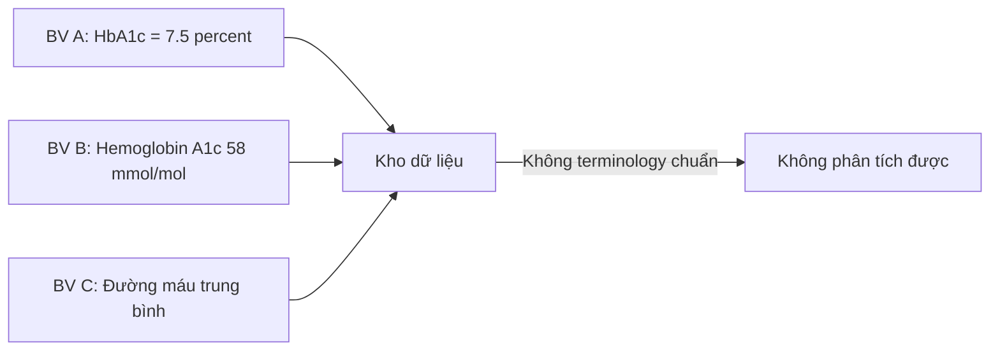
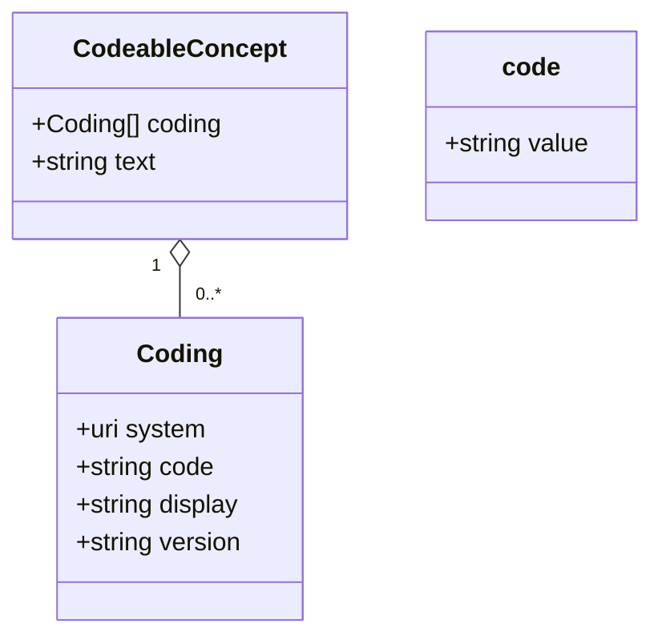
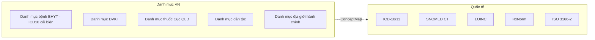

Khi 2 bệnh viện cùng gửi `Observation` cho "đường huyết", một bên dùng `glucose-blood`, một bên dùng `BG`, một bên gửi mmol/L, một bên gửi mg/dL — đó là **structural interoperability** mà không có **semantic interoperability**. Để giải quyết, FHIR yêu cầu dùng các bộ terminology chuẩn quốc tế. Bài này cover 5 bộ quan trọng nhất.

## 1. Vì sao terminology lại quan trọng



Cả 3 đang nói về **cùng 1 xét nghiệm** nhưng khác cách gọi và khác đơn vị. Nếu cả 3 đều gửi `LOINC code 4548-4` (Hemoglobin A1c/Hemoglobin.total in Blood) với UCUM `%`, server chỉ cần convert đơn vị (1% ≈ 10.929 mmol/mol) là phân tích được.

FHIR quy định mọi `code` phải đi kèm `system` (định danh code system) và nên đi kèm `display`:

```json
{
  "code": {
    "coding": [{
      "system": "http://loinc.org",
      "code": "4548-4",
      "display": "Hemoglobin A1c/Hemoglobin.total in Blood"
    }],
    "text": "HbA1c"
  }
}
```

## 2. Bảng tổng quan

| Bộ mã | Mục đích | URI system trong FHIR | Ví dụ |
|---|---|---|---|
| **ICD-10 / ICD-11** | Chẩn đoán bệnh, classification | `http://hl7.org/fhir/sid/icd-10` hoặc `icd-11` | E11 — Type 2 diabetes |
| **SNOMED CT** | Mọi khái niệm lâm sàng (chẩn đoán, triệu chứng, procedure, body site...) | `http://snomed.info/sct` | 44054006 — Diabetes mellitus type 2 |
| **LOINC** | Lab observation, clinical measurement, document type | `http://loinc.org` | 4548-4 — HbA1c |
| **RxNorm** | Thuốc, ingredient, brand | `http://www.nlm.nih.gov/research/umls/rxnorm` | 860975 — Metformin 500 MG |
| **UCUM** | Đơn vị đo lường | `http://unitsofmeasure.org` | mg/dL, mmHg, kg |

## 3. ICD-10 / ICD-11

### 3.1 Vai trò

ICD (International Classification of Diseases) là chuẩn của **WHO**, dùng để:
- Phân loại chẩn đoán bệnh (clinical & administrative)
- Báo cáo dịch tễ
- **Thanh toán BHYT** — Việt Nam vẫn dùng ICD-10 cho danh mục bệnh BHYT

ICD-11 đã được WHO ban hành 2022 nhưng VN và phần lớn châu Á vẫn dùng ICD-10. Strategy: dùng ICD-10 hôm nay, có sẵn extension chuyển sang ICD-11 khi MOH yêu cầu.

### 3.2 Ví dụ trong FHIR Condition

```json
{
  "resourceType": "Condition",
  "subject": {"reference": "Patient/1"},
  "code": {
    "coding": [
      {
        "system": "http://hl7.org/fhir/sid/icd-10",
        "code": "E11",
        "display": "Type 2 diabetes mellitus"
      },
      {
        "system": "http://snomed.info/sct",
        "code": "44054006",
        "display": "Diabetes mellitus type 2"
      }
    ],
    "text": "Đái tháo đường type 2"
  },
  "clinicalStatus": {
    "coding": [{
      "system": "http://terminology.hl7.org/CodeSystem/condition-clinical",
      "code": "active"
    }]
  }
}
```

**Best practice**: gửi đồng thời 2 coding (ICD + SNOMED) — bên kia muốn dùng cái nào cũng được.

## 4. SNOMED CT

### 4.1 Vai trò

SNOMED CT (Systematized Nomenclature of Medicine — Clinical Terms) là bộ mã **toàn diện nhất** cho khái niệm lâm sàng:

- 350.000+ concept với hierarchical relationship
- Có cả chẩn đoán, triệu chứng, body site, procedure, organism, substance, qualifier...
- Khả năng **subsumption** (cha-con): "diabetes mellitus" bao gồm type 1, type 2, gestational...

### 4.2 Quyền sử dụng

SNOMED CT cần license. Việt Nam **chưa là thành viên SNOMED International** (tới 2026). Tuy nhiên:
- Có thể dùng cho R&D
- Một số cloud (như Azure Health Data Services) đã có license sẵn
- Nếu cần production trong VN, dùng ICD-10 + custom code system của bệnh viện cho concept không có trong ICD

### 4.3 Edition và branch

- **International edition**: bộ chuẩn quốc tế
- **National extensions**: US, UK, AU... có concept riêng
- VN có thể tạo "Vietnam extension" trong tương lai

## 5. LOINC

### 5.1 Vai trò

LOINC (Logical Observation Identifiers Names and Codes) là chuẩn cho **observation/measurement**:

- Lab tests (glucose, HbA1c, CBC...)
- Clinical measurements (huyết áp, nhịp tim, BMI...)
- Document types (discharge summary, progress note...)
- Survey instruments (PHQ-9, MMSE...)

LOINC **miễn phí** và có Vietnamese translation. Đây là bộ mã quan trọng nhất cho `Observation` resource.

### 5.2 Cấu trúc 6-axis

Mỗi LOINC code có 6 axis:
1. **Component** (gì được đo): Hemoglobin A1c
2. **Property** (loại đo): MFr (Mass fraction)
3. **Time** (thời điểm): Pt (point in time)
4. **System** (mẫu vật): Bld (blood)
5. **Scale** (định lượng): Qn (quantitative)
6. **Method** (phương pháp): tuỳ chọn

Code 4548-4 = HbA1c/Hgb.total:MFr:Pt:Bld:Qn

### 5.3 Ví dụ Observation huyết áp

```json
{
  "resourceType": "Observation",
  "status": "final",
  "category": [{"coding": [{
    "system": "http://terminology.hl7.org/CodeSystem/observation-category",
    "code": "vital-signs"
  }]}],
  "code": {"coding": [{
    "system": "http://loinc.org",
    "code": "85354-9",
    "display": "Blood pressure panel"
  }]},
  "subject": {"reference": "Patient/1"},
  "effectiveDateTime": "2026-05-07T09:00:00+07:00",
  "component": [
    {
      "code": {"coding": [{"system": "http://loinc.org", "code": "8480-6", "display": "Systolic"}]},
      "valueQuantity": {"value": 120, "unit": "mmHg", "system": "http://unitsofmeasure.org", "code": "mm[Hg]"}
    },
    {
      "code": {"coding": [{"system": "http://loinc.org", "code": "8462-4", "display": "Diastolic"}]},
      "valueQuantity": {"value": 80, "unit": "mmHg", "system": "http://unitsofmeasure.org", "code": "mm[Hg]"}
    }
  ]
}
```

**Pattern quan trọng**: huyết áp dùng 1 Observation panel (LOINC 85354-9) với 2 component, không phải 2 Observation riêng.

## 6. RxNorm và danh mục thuốc

### 6.1 RxNorm

RxNorm là chuẩn của **NLM (Mỹ)** cho thuốc:
- Ingredient: thành phần hoạt chất (Metformin)
- Strength: nồng độ (500 MG)
- Dose form: dạng bào chế (oral tablet)
- SCD (Semantic Clinical Drug): "Metformin 500 MG Oral Tablet" — ID 860975

### 6.2 Việt Nam: Danh mục thuốc Bộ Y tế

Việt Nam có danh mục thuốc/biệt dược do Cục Quản lý Dược ban hành. Trong FHIR, dùng custom CodeSystem:

```json
{
  "code": {
    "coding": [
      {
        "system": "http://www.nlm.nih.gov/research/umls/rxnorm",
        "code": "860975",
        "display": "Metformin 500 MG Oral Tablet"
      },
      {
        "system": "http://moh.gov.vn/CodeSystem/danh-muc-thuoc",
        "code": "VD-12345-67",
        "display": "Glucophage 500mg viên"
      }
    ]
  }
}
```

Lý do dùng cả 2: RxNorm để liên thông quốc tế, danh mục MOH để tracking thanh toán BHYT.

## 7. UCUM — đơn vị đo lường

UCUM (Unified Code for Units of Measure) chuẩn hoá đơn vị:

| Đơn vị thông thường | UCUM code |
|---|---|
| mg/dL | `mg/dL` |
| mmHg | `mm[Hg]` |
| kg | `kg` |
| beats/min | `/min` (hoặc `{beats}/min`) |
| Cells/microL | `10*3/uL` |

Mọi `valueQuantity` trong FHIR nên có:

```json
{
  "valueQuantity": {
    "value": 7.5,
    "unit": "%",      // human-readable
    "system": "http://unitsofmeasure.org",
    "code": "%"       // UCUM code
  }
}
```

## 8. CodeableConcept vs code vs Coding

3 datatype dễ nhầm:



- **`code`** (datatype primitive): chuỗi từ ValueSet đóng (vd `gender = male|female|other|unknown`)
- **`Coding`**: 1 cặp system+code+display
- **`CodeableConcept`**: chứa nhiều Coding (cùng nghĩa, khác system) + free text

## 9. Mapping danh mục Bộ Y tế Việt Nam



Chiến lược: viết **ConceptMap** ánh xạ giữa danh mục Việt Nam và bộ mã quốc tế, host trên terminology server (Snowstorm, Ontoserver). Mỗi Resource có thể chứa cả 2 coding để tối đa khả năng liên thông.

## 10. Terminology Service trong FHIR

FHIR có 4 operation chuẩn cho terminology:

| Operation | Mục đích |
|---|---|
| `$lookup` | Tra cứu thông tin 1 code |
| `$validate-code` | Kiểm tra code có thuộc ValueSet không |
| `$expand` | Lấy danh sách code trong ValueSet (có filter, paging) |
| `$translate` | Dịch giữa 2 code system qua ConceptMap |

Ví dụ:

```http
GET [base]/ValueSet/$expand?url=http://example.org/ValueSet/diabetes-codes
```

[Snowstorm](https://github.com/IHTSDO/snowstorm) (open source SNOMED) và [Ontoserver](https://ontoserver.csiro.au/) (commercial, có free tier R&D) là 2 lựa chọn phổ biến.

## 11. Checklist khi chọn coding

Trước khi viết Resource, hỏi:

1. Concept này thuộc loại gì? (chẩn đoán → ICD/SNOMED, lab → LOINC, thuốc → RxNorm)
2. Có ValueSet nào ràng buộc trong profile không?
3. Có cần dual-coding để liên thông quốc tế không?
4. Đơn vị đo có UCUM code không?
5. Server đích có terminology server để validate không?

## Kết luận

Semantic interoperability là phần khó nhất của FHIR. Đầu tư terminology nghiêm túc ngay từ đầu sẽ tiết kiệm rất nhiều cost migration sau này.

Bài tiếp: [FHIR Core Concepts — Resource, Datatype, Reference và Bundle](/blog/fhir-resource-bundle-reference-cot-loi).
