## 1. Bối cảnh: Làm thế nào để đọc source code của một npm package đóng?

Claude Code (`@anthropic-ai/claude-code`) là công cụ AI coding agent nổi tiếng của Anthropic, được phân phối dưới dạng **npm package**. Điểm đặc biệt: Anthropic **không mở source code TypeScript gốc** --- họ chỉ ship một bundle đã được build bằng Bun.

### 1.1. Tại sao bundle npm có thể đọc được?

Bun bundle Claude Code theo kiểu **tree-shaken ESM** --- không dùng heavy obfuscator như Terser với mangling tối đa. Kết quả: tên hàm, tên biến, cấu trúc module gần như nguyên vẹn. Comment trong source TypeScript cũng còn nguyên sau quá trình build.

    npm install @anthropic-ai/claude-code
    # → Unpacked: 43MB, chỉ 19 files, bundle chính ~40MB

Pipeline trích xuất tổng quan:

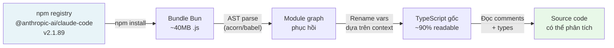

Kết quả: hàng trăm file `.ts` / `.tsx` với cấu trúc thư mục rõ ràng, comments kỹ thuật còn nguyên, type annotations đầy đủ. Rất hiếm khi một closed-source npm package lại để lộ nhiều đến vậy.

> **Lưu ý kỹ thuật:** Đây không phải hack. Khi bạn publish lên npm, code là artifact công khai. Reverse engineer một npm package là hợp pháp miễn bạn không vi phạm ToS hay copyright khi dùng kết quả.

### 1.2. Cấu trúc thư mục recovered

    claude-code-code/
    ├── main.tsx              ← Entry point chính
    ├── QueryEngine.ts        ← Core conversation loop
    ├── buddy/                ← 🐾 Virtual pet system (MỚI!)
    │   ├── companion.ts      ← Roll logic (PRNG + rarity)
    │   ├── CompanionSprite.tsx ← ASCII renderer (Ink/React)
    │   ├── sprites.ts        ← 18 loài × 3 frames
    │   ├── types.ts          ← Species/Rarity/Stats types
    │   ├── prompt.ts         ← LLM companion intro
    │   └── useBuddyNotification.tsx ← Teaser window
    ├── bridge/               ← Remote session system
    │   ├── bridgeMain.ts     ← Bridge loop (reconnect/backoff)
    │   ├── sessionRunner.ts  ← Child process spawner
    │   ├── workSecret.ts     ← JWT + WebSocket URLs
    │   └── types.ts          ← Protocol types
    ├── commands/
    │   ├── ultraplan.tsx     ← 🚀 Multi-agent planning
    │   ├── stickers/         ← Easter egg: StickerMule
    │   └── [35+ commands]
    ├── coordinator/
    │   └── coordinatorMode.ts ← Multi-agent coordinator
    └── tasks/
        ├── LocalAgentTask/   ← Sub-agent (local)
        ├── RemoteAgentTask/  ← Sub-agent (cloud CCR)
        ├── DreamTask/        ← Background async task
        └── InProcessTeammateTask/ ← In-process agent

* * *

## 2. Kiến trúc tổng thể Claude Code

### 2.1. Stack công nghệ

Trước khi đi vào tính năng cụ thể, cần hiểu rõ Claude Code được xây dựng trên gì:

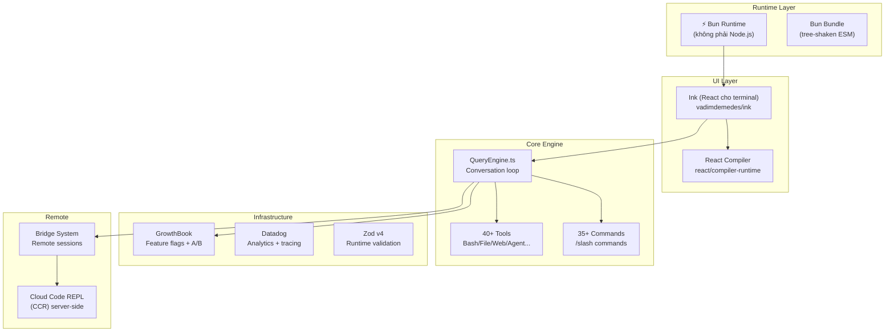

### 2.2. Startup optimization --- đến từng millisecond

Nhìn vào đầu file `main.tsx`:

```typescript
// Side-effects chạy NGAY khi file được import:
// 1. profileCheckpoint --- bắt đầu đo thời gian
// 2. startMdmRawRead --- fire MDM subprocesses (plutil/reg query) song song
//    với 135ms còn lại của import chain
// 3. startKeychainPrefetch --- fire cả 2 macOS keychain reads song song
//    (~65ms tiết kiệm trên mỗi lần khởi động macOS)

profileCheckpoint('main_tsx_entry');
startMdmRawRead();        // parallel: đọc MDM config
startKeychainPrefetch();  // parallel: đọc keychain OAuth tokens
```

Đây là "speculative execution" cho I/O: ngay khi file bắt đầu load, 3 side effects được fire song song --- tất cả chạy trong khi JS đang parse 135ms import chain còn lại. Khi import xong, kết quả đã sẵn sàng.

```mermaid
gantt
    title Startup Timeline Claude Code (macOS, ước tính)
    dateFormat X
    axisFormat %Lms

    section Sequential (cũ)
    Parse imports          : 0, 135
    Keychain read #1       : 135, 200
    Keychain read #2       : 200, 265
    MDM read               : 265, 310
    App ready              : 310, 315

    section Parallel (thực tế)
    Parse imports          : 0, 135
    Keychain #1 + #2 + MDM : crit, 0, 65
    App ready              : 135, 140
```

Kết quả: **~175ms tiết kiệm** mỗi lần khởi động. Với developer gõ `claude` hàng chục lần mỗi ngày --- đây là UX win thực sự.

* * *

## 3. Tính năng ẩn #1: Hệ thống "Buddy" --- Thú cưng ảo trong terminal

Đây là phát hiện gây sốt nhất. Ẩn sâu trong thư mục `buddy/` là một hệ thống **virtual pet companion** hoàn chỉnh, được nhúng thẳng vào terminal.

### 3.1. Buddy trông như thế nào?


Companion ngồi cạnh input box và đôi khi xuất hiện speech bubble. Toàn bộ UI được render bằng **ASCII art** qua Ink (React terminal):

    ╭─────────────────────────────────╮
    │ coding this is fun actually :3  │
    ╰─────────────────────────────────╯
                  │
        __
      <(· )___    ← companion (duck, frame 0)
       (  ._>
        `--´
    ───────────────────────────────────
      > |                              ← input cursor

Ba frame idle animation (tick mỗi 500ms):

    Frame 0 (rest):    Frame 1 (fidget):   Frame 2 (move):
        __                 __                  __
      <(· )___           <(· )___            <(· )___
       (  ._>             (  ._>              (  .__>
        `--´               `--´~              `--´

### 3.2. 18 loài với sprite riêng

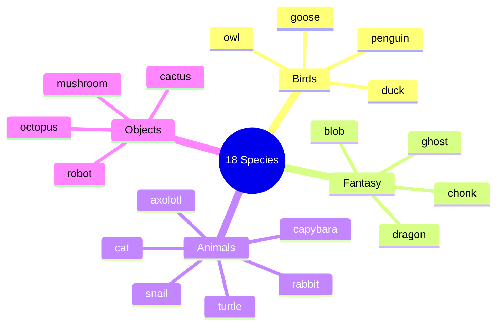

Mỗi loài có bộ sprite 5 dòng × 12 ký tự × 3 frames. Ví dụ con goose:

    Frame 0:          Frame 1:          Frame 2:
         ({E}>              ({E}>              ({E}>>
         ||               ||               ||
       _(__)_           _(__)_           _(__)_
        ^^^^             ^^^^             ^^^^

_(`{E}` là placeholder cho mắt --- được thay bằng ký tự eye type khi render)_

### 3.3. Pipeline sinh companion --- Phân tích chi tiết

Đây là phần kỹ thuật quan trọng nhất. Mỗi user có **một companion cố định, xác định hoàn toàn bởi userId** của họ:

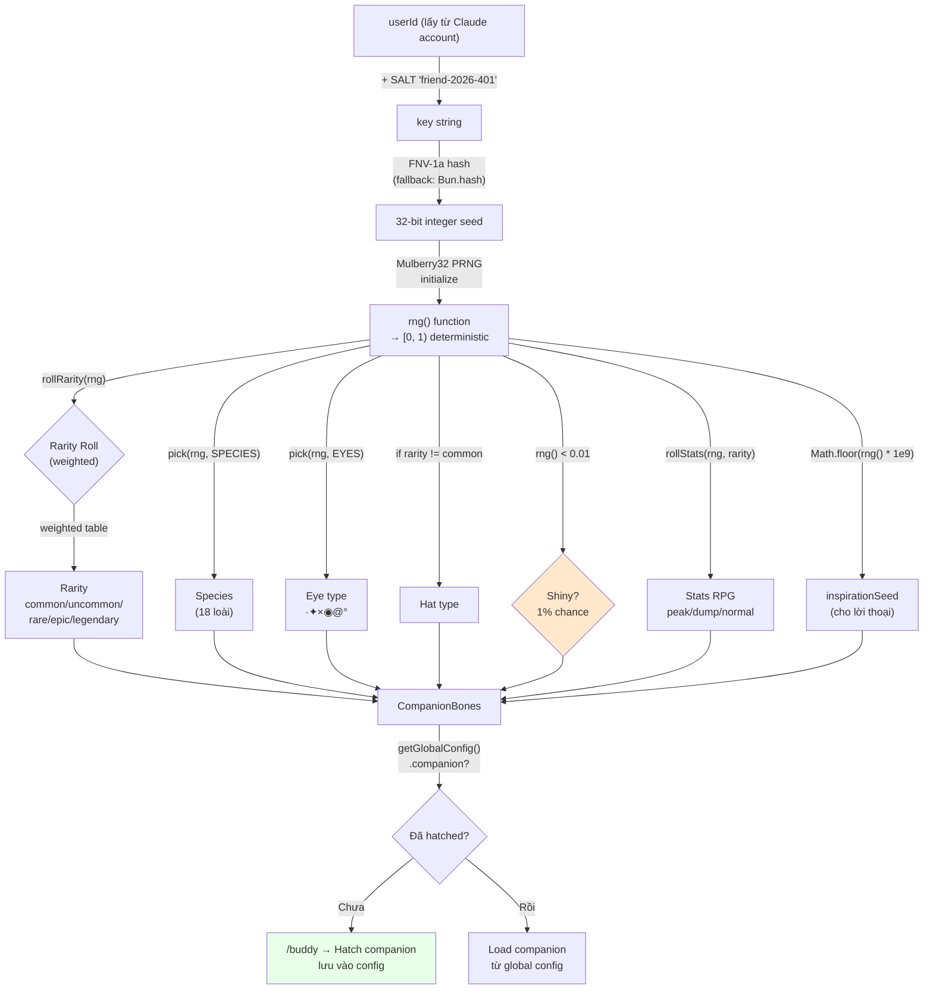

### 3.4. Mulberry32 PRNG --- Tại sao chọn nó?

```typescript
function mulberry32(seed: number): () => number {
  let a = seed >>> 0
  return function () {
    a |= 0
    a = (a + 0x6d2b79f5) | 0          // additive step
    let t = Math.imul(a ^ (a >>> 15), 1 | a)
    t = (t + Math.imul(t ^ (t >>> 7), 61 | t)) ^ t
    return ((t ^ (t >>> 14)) >>> 0) / 4294967296
  }
}
```

Tại sao Mulberry32 thay vì `Math.random()`?

|               | `Math.random()` | Mulberry32                 |
| ------------- | --------------- | -------------------------- |
| Seed          | ❌ Không thể     | ✅ Có                       |
| Deterministic | ❌               | ✅ Cùng seed → cùng kết quả |
| Size          | built-in        | ~10 dòng code              |
| Speed         | nhanh           | nhanh tương đương          |
| Use case      | random chung    | **seeded roll**            |

Với `Math.random()`, mỗi lần restart Claude Code bạn sẽ ra companion khác nhau. Với Mulberry32 + userId seed, companion là **vĩnh viễn của bạn** --- như một avatar.

### 3.5. Hệ thống Rarity --- Giải mã xác suất


Source code không công khai RARITY_WEIGHTS trực tiếp, nhưng từ floor values và rollRarity logic, ta có thể suy ra phân phối:

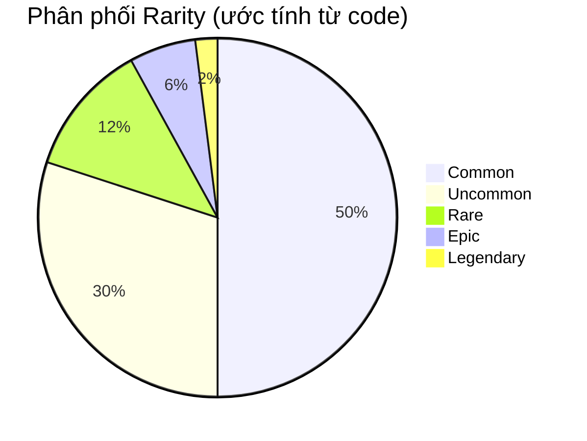

**Stats floor theo rarity:**

    common    ░░░░░░░░░░ floor:  5  (stats range:  5-75)
    uncommon  ░░░░░░░░░░░░░░░ floor: 15  (stats range: 15-85)
    rare      ░░░░░░░░░░░░░░░░░░░░ floor: 25  (stats range: 25-95)
    epic      ░░░░░░░░░░░░░░░░░░░░░░░░░ floor: 35  (stats range: 35-100)
    legendary ░░░░░░░░░░░░░░░░░░░░░░░░░░░░░░ floor: 50  (stats range: 50-100)

Legendary peak stat có thể đạt `min(100, 50 + 50 + rand*30) = 100` --- **cap out**!

### 3.6. Speech bubble và hệ thống tương tác

    Cách speech bubble render (CompanionSprite.tsx):

      ╭──────────────────────────────────╮
      │ Nội dung wrap tại 30 chars/dòng. │
      │ Italic text, dimColor khi fading │
      ╰──────────────────────────────────╯
                   ↑ tail: "top" hoặc "bottom"

    Bubble lifecycle:
      ┌─────────────┐    ┌────────────────────┐    ┌──────────────┐
      │ addNotif    │───▶│ BUBBLE_SHOW = 20   │───▶│ FADE_WINDOW  │
      │ (trigger)   │    │ ticks (~10 giây)   │    │ = 6 ticks    │
      └─────────────┘    └────────────────────┘    └──────┬───────┘
                                                           │ dimColor=true
                                                           ▼
                                                     ┌──────────────┐
                                                     │ bubble ẩn    │
                                                     └──────────────┘

Khi user gọi companion **bằng tên** trong chat, LLM được inject system prompt:

```typescript
`When the user addresses ${name} directly (by name), 
its bubble will answer. Your job in that moment is to 
stay out of the way: respond in ONE line or less.
Don't explain that you're not ${name} --- they know.`
```

Thiết kế khéo léo: Claude (LLM chính) **không đóng giả companion** --- nó chỉ "làm thinh" khi user nói chuyện với companion. Companion tự trả lời qua speech bubble riêng, được drive bởi một prompt context khác.

### 3.7. `/buddy pet` --- 5 frames animation trái tim nổi

```typescript
const PET_HEARTS = [
  `   ♥    ♥   `,   // frame 0: 2 tim xa nhau
  `  ♥  ♥   ♥  `,   // frame 1: tim dày hơn
  ` ♥   ♥  ♥   `,   // frame 2: tim trải rộng
  `♥  ♥      ♥ `,   // frame 3: tim bay ra hai bên
  '·    ·   ·  ',   // frame 4: fade thành dấu chấm
];
// PET_BURST_MS = 2500ms tổng → ~500ms/frame
```

Visualized:

    t=0ms:     t=500ms:   t=1000ms:  t=1500ms:  t=2000ms:
      ♥  ♥      ♥ ♥ ♥     ♥  ♥ ♥    ♥ ♥    ♥   ·  ·  ·
      companion sprite phía dưới

### 3.8. Teaser window và logic rollout

```typescript
// Local date, not UTC --- 24h rolling wave across timezones.
// Teaser window: April 1-7, 2026 only. Command stays live forever after.
export function isBuddyTeaserWindow(): boolean {
  if ("external" === 'ant') return true;  // Anthropic internal: luôn true
  const d = new Date();
  return d.getFullYear() === 2026 && d.getMonth() === 3 && d.getDate() <= 7;
}
```

Đây là một design decision rất thú vị về rollout:

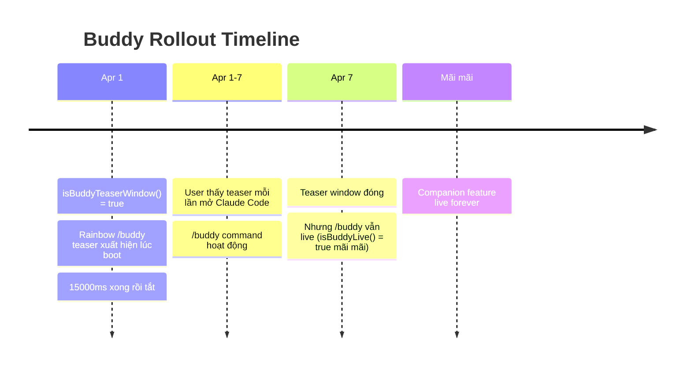

Lý do dùng **local time** thay vì UTC: nếu dùng UTC, tất cả user trên toàn cầu cùng nhận teaser tại một thời điểm UTC → spike tải server. Dùng local time → load trải đều 24h liên tục.

* * *

## 4. Tính năng ẩn #2: UltraPlan --- Multi-agent Planning Engine

### 4.1. UltraPlan là gì?


`/ultraplan` là slash command mạnh nhất của Claude Code, nhưng ẩn kỹ nhất. Thay vì Claude Code tự lên kế hoạch, nó **teleport task lên cloud**, nơi **nhiều agent chạy song song** trong tối đa 30 phút để tạo kế hoạch toàn diện.

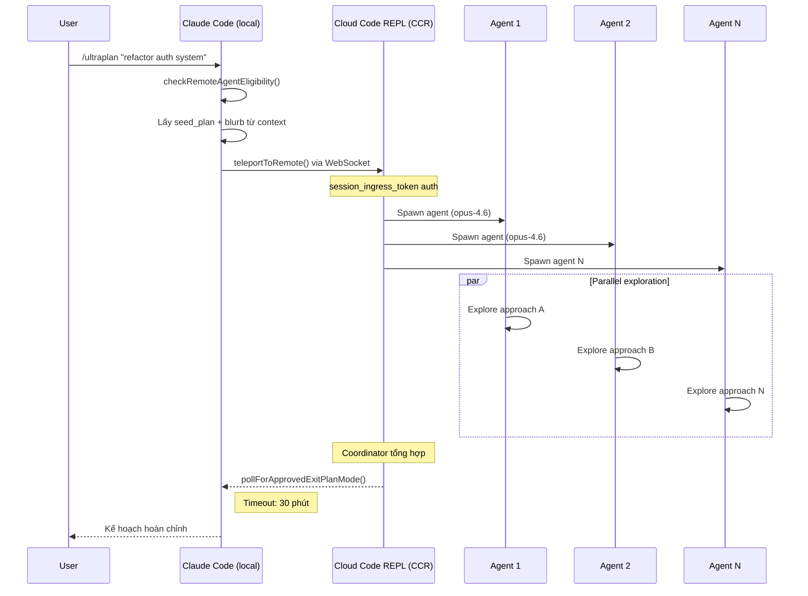

### 4.2. Kiến trúc CCR Session

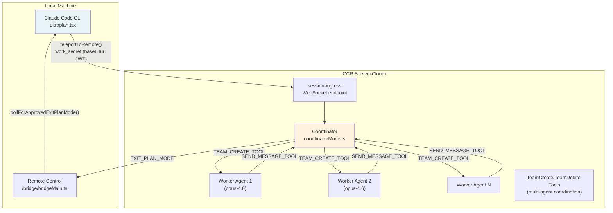

### 4.3. WorkSecret --- Cơ chế xác thực session

```typescript
type WorkSecret = {
  version: number
  session_ingress_token: string  // JWT cho WebSocket auth
  api_base_url: string           // CCR server URL
  sources: Array<{
    type: string
    git_info?: { type: string; repo: string; ref?: string; token?: string }
  }>
  auth: Array<{ type: string; token: string }>
  claude_code_args?: Record<string, string> | null
  mcp_config?: unknown | null
  environment_variables?: Record<string, string> | null
  use_code_sessions?: boolean   // CCR v2 selector
}
```

WorkSecret được **base64url-encode** và truyền qua `--work-secret` flag khi spawn child process. Flow:

    1. /ultraplan trigger
    2. CLI lấy work_secret từ bridge API
    3. Decode base64url → JSON → validate version === 1
    4. buildSdkUrl(api_base_url, sessionId)
       → wss://host/v1/session_ingress/ws/{id}  (production)
       → ws://host/v2/session_ingress/ws/{id}   (localhost)
    5. Connect WebSocket với session_ingress_token

### 4.4. Anti-self-trigger technique

```typescript
// Phrasing deliberately avoids the feature name because
// the remote CCR CLI runs keyword detection on raw input before
// any tag stripping, and a bare "ultraplan" in the prompt would
// self-trigger as /ultraplan, which is filtered out of headless mode
// as "Unknown skill"

// prompt.txt là <system-reminder> để CCR browser ẩn scaffolding
// nhưng model vẫn thấy full text
const _rawPrompt = require('../utils/ultraplan/prompt.txt');
```

Vấn đề: CCR chạy một Claude Code CLI khác (headless). Nếu prompt chứa từ "ultraplan", CLI đó sẽ trigger `/ultraplan` lên chính nó → infinite loop. Giải pháp: wrap prompt trong `<system-reminder>` tags và phrasing tránh từ khoá.

    User → /ultraplan "build auth"
             │
             ▼
    CCR (headless CC) nhận prompt:
      <system-reminder>
        Create a detailed plan for: build auth
        [Không dùng từ "ultraplan" ở đây]
      </system-reminder>
             │
             ▼  CCR browser strips <system-reminder> khỏi UI
      Model thấy: "Create a detailed plan..."
      CCR filter: sees "ultraplan" → filtered lý do "Unknown skill"? Không!
                  vì từ "ultraplan" KHÔNG có trong prompt actual

* * *

## 5. Bridge System --- Remote Code Sessions

### 5.1. Tổng quan

Bridge là hệ thống cho phép Claude Code **nhận task nhiều session đồng thời** từ claude.ai web interface. Một developer có thể assign nhiều repo task cho Claude Code đang chạy trên máy local.

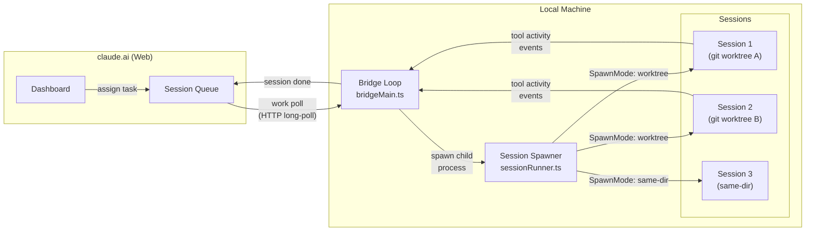

### 5.2. SpawnMode --- 3 cách quản lý working directory

```typescript
type SpawnMode = 'single-session' | 'worktree' | 'same-dir'
```

| SpawnMode        | Mô tả                                             | Dùng khi                         |
| ---------------- | ------------------------------------------------- | -------------------------------- |
| `single-session` | 1 session trong cwd, bridge dừng khi session xong | Remote control đơn giản          |
| `worktree`       | Mỗi session có git worktree riêng biệt (isolated) | Multi-task parallel an toàn      |
| `same-dir`       | Tất cả session chung cwd                          | Có thể conflict, dùng thận trọng |

### 5.3. Backoff & Reconnect logic

```typescript
const DEFAULT_BACKOFF: BackoffConfig = {
  connInitialMs: 2_000,      // thử lại lần đầu sau 2s
  connCapMs: 120_000,        // tối đa wait 2 phút giữa các lần retry
  connGiveUpMs: 600_000,     // bỏ cuộc sau 10 phút
  generalInitialMs: 500,
  generalCapMs: 30_000,
  generalGiveUpMs: 600_000,  // 10 phút
}
```

Có thêm **sleep detection** thông minh:

```typescript
function pollSleepDetectionThresholdMs(backoff: BackoffConfig): number {
  return backoff.connCapMs * 2  // = 240_000ms = 4 phút
}
```

Nếu khoảng cách giữa 2 poll vượt quá 4 phút → hệ thống assume máy đã sleep. Khi wake up, budget lỗi được reset thay vì tích lũy tiếp.

### 5.4. Session ID compatibility layer

```typescript
// CCR v2 compat layer gây ra mismatch session IDs:
// - công việc poll trả về "session_xxxx" (v1 format)
// - worker thực tế dùng "cse_xxxx" (v2 format)
// Cả hai cùng UUID body, chỉ khác prefix

export function sameSessionId(a: string, b: string): boolean {
  if (a === b) return true
  const aBody = a.slice(a.lastIndexOf('_') + 1)
  const bBody = b.slice(b.lastIndexOf('_') + 1)
  return aBody.length >= 4 && aBody === bBody
}
```

Ví dụ: `session_abc123` và `cse_staging_abc123` được coi là **cùng session**.

* * *

## 6. Task System --- Kiến trúc đa agent

### 6.1. Tất cả loại Task

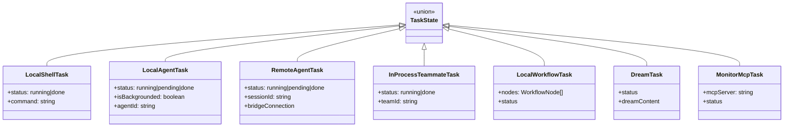

### 6.2. Coordinator Mode --- Điều phối đa agent

```typescript
export function isCoordinatorMode(): boolean {
  if (feature('COORDINATOR_MODE')) {
    return isEnvTruthy(process.env.CLAUDE_CODE_COORDINATOR_MODE)
  }
  return false
}
```

Coordinator mode là chế độ đặc biệt nơi một Claude Code instance đóng vai **orchestrator** --- nó dùng `TeamCreateTool` để sinh worker agents, `SendMessageTool` để communicate với chúng, và `TeamDeleteTool` để cleanup.

    Coordinator (CLAUDE_CODE_COORDINATOR_MODE=1)
        │
        ├─ TEAM_CREATE_TOOL → spawn Worker 1
        ├─ TEAM_CREATE_TOOL → spawn Worker 2
        │
        ├─ SEND_MESSAGE_TOOL → "Research approach A"
        ├─ SEND_MESSAGE_TOOL → "Research approach B"
        │
        │  [Workers hoạt động parallel]
        │
        ├─ receive results từ Worker 1
        ├─ receive results từ Worker 2
        │
        ├─ tổng hợp
        ├─ TEAM_DELETE_TOOL → cleanup Worker 1
        ├─ TEAM_DELETE_TOOL → cleanup Worker 2
        └─ return final plan

* * *

## 7. Anti-Canary Obfuscation --- Kỹ thuật bảo vệ codename nội bộ

### 7.1. Vấn đề

Anthropic có CI/CD pipeline chạy **canary detection**: scan output bundle để phát hiện nếu tên codename model nội bộ (như `tengu`, `opus46`, v.v.) bị leak vào artifact công khai.

Vấn đề: **Một species name trong Buddy system trùng với một model codename nội bộ**. Nếu để string literal, scanner sẽ báo lỗi mỗi lần build.

### 7.2. Giải pháp

```typescript
// buddy/types.ts
const c = String.fromCharCode

// Mỗi species được encode bằng hex charcode
export const duck     = c(0x64,0x75,0x63,0x6b)             as 'duck'
export const goose    = c(0x67,0x6f,0x6f,0x73,0x65)         as 'goose'
export const octopus  = c(0x6f,0x63,0x74,0x6f,0x70,0x75,0x73) as 'octopus'
// ... 18 species đều bị encode tương tự
```

**Tại sao encode TẤT CẢ 18 species chứ không chỉ cái bị conflict?**

```typescript
// Comment giải thích:
// "All species encoded uniformly; `as` casts are type-position only (erased pre-bundle)."
```

Nếu chỉ encode một species, ta ngay lập tức biết species nào là codename nội bộ → reverse engineer ra tên codename model. Encode tất cả đồng đều → không thể biết cái nào bị conflict.

### 7.3. Diagram cơ chế

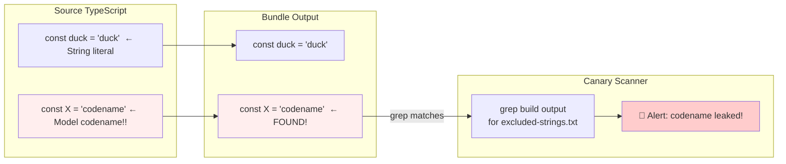

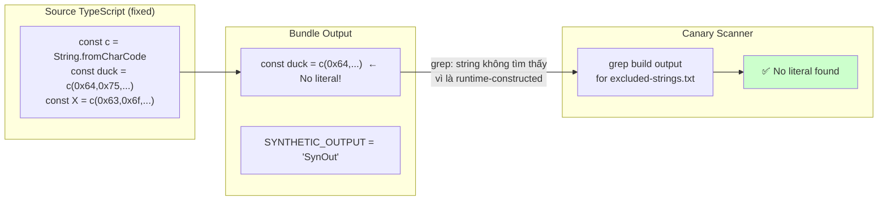

Canary check vẫn hoạt động cho **codename thật** (vẫn là string literal ở nơi khác), trong khi species animal được encode để tránh false positive.

* * *

## 8. Danh sách đầy đủ slash commands ẩn

    commands/
    ├── ultraplan.tsx        🚀 Multi-agent planning (30 min cloud)
    ├── buddy/               🐾 Virtual pet system
    ├── stickers/            🎨 StickerMule redirect
    ├── teleport/            📡 Teleport session to remote
    ├── voice/               🎤 Voice input
    ├── thinkback/           🔄 Replay thinking steps
    ├── thinkback-play/      ▶️  Play back thinking animation
    ├── bughunter/           🐛 Auto bug hunting agent
    ├── ctx_viz/             📊 Context window visualization
    ├── heapdump/            🔍 V8 heap dump (debug memory)
    ├── perf-issue/          ⚡ Report perf issue with profile
    ├── sandbox-toggle/      🔒 Toggle sandbox mode
    ├── rewind/              ⏪ Rewind conversation to checkpoint
    ├── dream/               💭 (DreamTask system)
    ├── share/               🔗 Share session
    ├── insights/            📈 Usage insights
    ├── brief/               📝 Summarize conversation
    ├── compact/             🗜️  Compact context window
    ├── ultraplan.tsx        📋 UltraPlan
    ├── advisor/             🤖 Model advisor setting
    ├── desktop/             🖥️  Desktop integration
    ├── mobile/              📱 Mobile companion
    ├── good-claude/         👍 Mark good response
    ├── ant-trace/           🔬 Internal Anthropic tracing
    └── ...

**Đặc biệt: `/stickers`**

```typescript
export async function call(): Promise<LocalCommandResult> {
  const url = 'https://www.stickermule.com/claudecode'
  await openBrowser(url)
  return { type: 'text', value: 'Opening sticker page in browser...' }
}
```

Một marketing Easter Egg nhẹ nhàng. Gõ `/stickers` → browser mở shop sticker Claude Code.

* * *

## 9. Feature Flag System --- GrowthBook + Statsig

### 9.1. Hai hệ thống feature flags song song

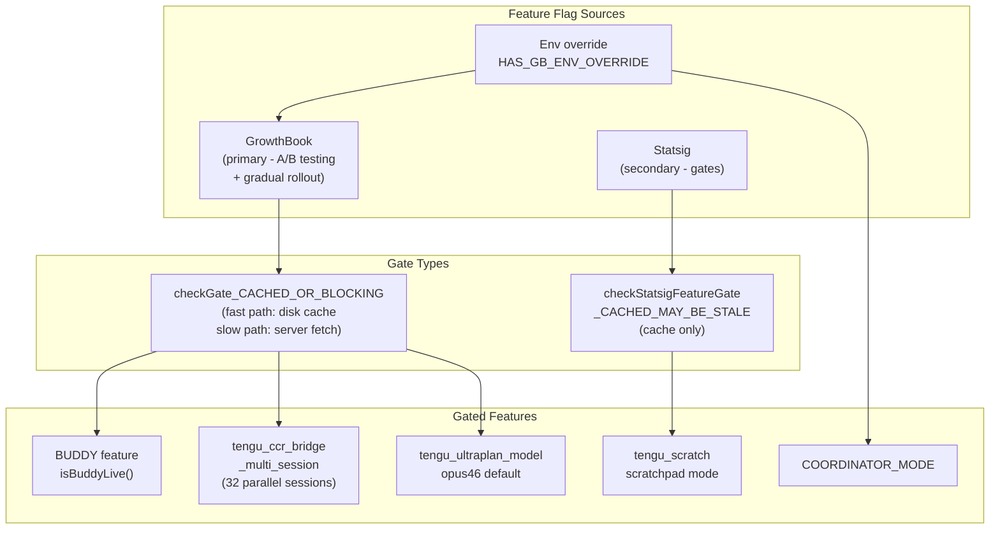

### 9.2. Rollout strategy cho multi-session Bridge

```typescript
/**
 * GrowthBook gate cho multi-session spawn modes.
 * Rollout staged via targeting rules: ants first, then gradual external.
 * Uses BLOCKING check (không dùng stale cache) để không từ chối nhầm.
 */
async function isMultiSessionSpawnEnabled(): Promise<boolean> {
  return checkGate_CACHED_OR_BLOCKING('tengu_ccr_bridge_multi_session')
}

const SPAWN_SESSIONS_DEFAULT = 32  // max 32 sessions song song
```

Anthropic rollout multi-session cho internal users ("ants") trước, rồi mới gradually rollout ra external. Đây là best practice: chính Anthropic là guinea pig đầu tiên.

* * *

## 10. Những chi tiết implementation đáng học hỏi

### 10.1. safeFilenameId --- Path traversal prevention

```typescript
export function safeFilenameId(id: string): string {
  // Sanitize session ID cho filename, ngăn path traversal (../, /)
  return id.replace(/[^a-zA-Z0-9_-]/g, '_')
}
```

Đơn giản nhưng đúng. Session ID từ server không được trust --- phải sanitize trước khi dùng làm tên file.

### 10.2. PermissionRequest --- Per-invocation tool permission

```typescript
// Control request từ child CLI khi cần permission cho tool cụ thể
type PermissionRequest = {
  type: 'control_request'
  request_id: string
  request: {
    subtype: 'can_use_tool'
    tool_name: string
    input: Record<string, unknown>  // Parameters của tool call
    tool_use_id: string
  }
}
```

Bridge forward permission request lên server (claude.ai UI) để user approve/deny **từng tool invocation cụ thể**, không phải approve toàn bộ tool class. Granular permission model.

### 10.3. SessionActivity --- Real-time status display

```typescript
const TOOL_VERBS: Record<string, string> = {
  Read: 'Reading',
  Write: 'Writing',
  Edit: 'Editing',
  MultiEdit: 'Editing',
  Bash: 'Running',
  Glob: 'Searching',
  Grep: 'Searching',
  WebFetch: 'Fetching',
  WebSearch: 'Searching',
  Task: 'Running task',
}
// STATUS_UPDATE_INTERVAL_MS = 1_000
```

Dashboard update mỗi 1 giây với verb dạng tiến hành: "Reading package.json", "Editing src/auth.ts" --- UX nhỏ nhưng đáng học.

* * *

## 11. Kết luận: Những bài học rút ra

### Về product design

Buddy/Companion là ví dụ về **gamification thông minh**: không phải mini-game rời rạc, mà là một companion tích hợp tự nhiên vào workflow. Roll từ userId → companion vĩnh viễn → user có attachment. Rarity system → social sharing ("tôi có legendary capybara"). Speech bubble → companion cảm giác "có mặt" mà không ruin focus.

### Về kỹ thuật

**3 kỹ thuật nên áp dụng ngay:**

1.  **Speculative I/O**: Kick off async operations ngay khi app bắt đầu load, trước khi cần kết quả. Claude Code saves 175ms/startup bằng cách này.

2.  **Seeded PRNG cho deterministic randomness**: Khi muốn random nhưng reproducible (avatar, companion, test data), Mulberry32 + userId seed là pattern đúng.

3.  **Canary detection trong CI/CD**: Scan build artifacts cho leaked secrets/codenames là lớp bảo vệ hiệu quả và rẻ tiền.

### Về security

> **Nguyên tắc**: Code trong npm package là **công khai**. Dù minified hay obfuscated đến đâu, vẫn có thể reverse engineer được.

Anthropic biết điều này --- đó là lý do:

-   Secrets nằm trong server-side config (GrowthBook), không trong bundle
-   Session tokens được fetch dynamically, không hard-code
-   Canary detection CI pipeline

Nếu bạn đang ship npm package với business logic nhạy cảm: hãy giả định rằng đối thủ đọc được code của bạn và thiết kế security model phù hợp.

* * *

_Bài viết dựa trên phân tích trực tiếp source code được trích xuất từ npm package `@anthropic-ai/claude-code` v2.1.89 (phát hành ngày 31/3/2026). Tất cả code snippet là từ artifact công khai trên npm registry._
