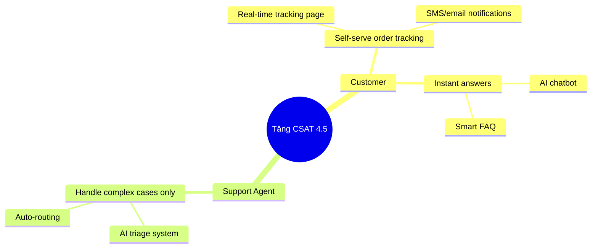

One of the most common anti-patterns in product development is the **feature factory** - teams keep building features without understanding how those features affect business goals. Impact Mapping is the technique that helps BA and teams break out of that loop.

## What is Impact Mapping?

Impact Mapping is a strategic planning technique created by Gojko Adzic. It creates a visual map structured as **WHY -> WHO -> HOW -> WHAT**:

```
                    [GOAL]
                       |
        ┌──────────────┼──────────────┐
        ↓              ↓              ↓
    [Actor 1]      [Actor 2]      [Actor 3]
        |              |              |
    ┌───┴───┐      ┌───┴───┐      ┌───┴───┐
    ↓       ↓      ↓       ↓      ↓       ↓
[Impact] [Impact] [Impact][Impact][Impact][Impact]
    |       |
┌───┴┐  ┌───┴┐
↓    ↓  ↓    ↓
[Del][Del][Del][Del]
```

| Level | Question | Example |
|-------|---------|-------|
| **Goal (WHY)** | Why are we doing this? | Increase Q3 revenue by 20% |
| **Actors (WHO)** | Who influences the goal? | Customer, Sales team, Support |
| **Impacts (HOW)** | How do their behaviors need to change? | Customers self-serve more |
| **Deliverables (WHAT)** | What do we need to build to create that impact? | AI chatbot, Self-service portal |

## Why is Impact Mapping important for BA?

### Traditional problem:
- Stakeholder requests a feature -> BA documents it -> Dev builds it -> Feature is delivered but... the business goal is still not met
- The team does not know why it is building this
- Prioritization is driven by the "squeaky wheel" instead of business value

### What Impact Mapping solves:
- **Traceability**: Every deliverable can be traced back to a business goal
- **Scope management**: Easier to cut scope without hurting the goal
- **Alignment**: Everyone on the team understands the WHY
- **Out-of-scope decisions**: Easier to say "no" to features that cannot be mapped back to a goal

## How to create an Impact Map for AI projects

### Step 1: Define the Goal (WHY)

The goal must be a **business outcome**, not an output:

❌ **Not good**: "Launch an AI chatbot"
✅ **Good**: "Reduce support tickets by 40% within 6 months"

❌ **Not good**: "Implement a recommendation engine"
✅ **Good**: "Increase average order value by 15%"

**Goal formula**: [Metric] [Direction] [Value] [Timeframe]

### Step 2: Identify Actors (WHO)

List all people/systems that can influence the goal:

**Primary Actors** (directly achieve the goal):
- End users (customers, employees)
- Business stakeholders

**Secondary Actors** (support primary actors):
- Internal teams (support, sales, ops)
- External partners

**Off-stage Actors** (indirect influence):
- Regulators
- Competitors
- External systems/APIs

### Step 3: Define Impacts (HOW)

For each actor, ask: **"What do they need to do DIFFERENTLY for the goal to be achieved?"**

An impact must be a **behavior change**, not a feature:

❌ "Use the chatbot" (an action, not a behavior change)
✅ "Resolve problems independently without calling the hotline"

❌ "Receive recommendation email"
✅ "Buy additional products they previously did not know about"

**Impact template**: "[Actor] will [verb] [behavior change]"

### Step 4: Brainstorm Deliverables (WHAT)

For each impact, ask: **"What could we build to create that impact?"**

This is the brainstorming step - list many options, do not filter yet:
- AI features
- UX improvements
- Process changes
- Content/documentation
- Integrations

**AI-specific deliverables to consider:**
- Conversational AI (chatbot, voice assistant)
- Recommendation engine
- Predictive analytics dashboard
- Automated classification/routing
- AI-assisted search
- Personalization engine

### Step 5: Prioritize using the Impact Map

Once the map is complete:

1. **Identify the critical path**: Which deliverable creates the largest impact on the goal?
2. **Estimate confidence**: How confident are we that this deliverable will create that impact?
3. **Consider effort**: Is this high impact / low effort?
4. **Slice it**: Can we deliver a smaller part that still tests the hypothesis?

## Real example: AI Customer Support

**Scenario**: An e-commerce company wants to improve customer experience

**Impact Map:**

```
GOAL: Tăng CSAT từ 3.2 → 4.5 trong Q3 2026

WHO: Customer
HOW: 
  - Nhận câu trả lời trong < 2 phút (không phải 24h)
  - Tự track order status mà không cần chat
  - Hiểu chính sách return rõ ràng ngay lần đầu
WHAT:
  - AI chatbot với instant response
  - Order tracking self-service
  - AI-powered FAQ with clear policy explanations

WHO: Support Agent
HOW:
  - Dành thời gian cho complex cases thay vì repetitive Q&A
  - Có context đầy đủ khi escalation xảy ra
WHAT:
  - AI triage & routing system
  - AI-generated conversation summary cho escalations
  - Suggested response templates

WHO: Product Manager  
HOW:
  - Biết pain points thực sự của customer
  - Prioritize roadmap dựa trên impact
WHAT:
  - AI analytics dashboard từ chat data
  - Automated pattern detection từ negative feedback
```

## Impact Mapping in Agile Sprints

Impact Mapping is often done **once** at the beginning of a project, but BA should:

1. **Review quarterly** - Has the business goal changed?
2. **Update after each release** - Did the map deliver the expected impacts?
3. **Use it as a backlog filter** - Every new story must map to an impact in the map
4. **Present it in sprint reviews** - Show stakeholders: "Which impact did this sprint achieve?"

## Impact Mapping vs User Story Mapping

| | Impact Mapping | User Story Mapping |
|--|---|---|
| **Focus** | Business outcomes | User journey/workflow |
| **Level** | Strategic | Tactical |
| **When** | Early planning, quarterly review | Sprint planning |
| **Output** | Prioritized impacts & deliverables | Prioritized story backlog |
| **Used by** | BA + Product + Business | BA + Dev + QA |

**Best practice**: Use Impact Mapping to define scope and priority, and use User Story Mapping to plan delivery.

## Tools for creating an Impact Map

| Tool | How to use it |
|------|-----------|
| **Miro** | Digital whiteboard with ready-made templates |
| **Mermaid diagram** | Code-based, versionable in Git |
| **FigJam** | Collaborative tool for Figma teams |
| **Draw.io / Lucidchart** | Formal diagrams |
| **Sticky notes** | Workshops with stakeholders |

**Mermaid template:**


## Common mistakes in Impact Mapping

1. **Goal is too vague**: "Improve customer experience" -> not measurable
2. **Ignoring secondary actors**: Forgetting that internal teams also need behavior change
3. **Jumping straight to WHAT**: Missing the HOW step -> deliverables have no narrative
4. **Not reviewing after launch**: Build the map once and leave it there -> it loses value
5. **Too much detail in WHAT**: Impact Map is a strategic view; user stories hold the details

## Conclusion

Impact Mapping is especially powerful for BA in the AI era because AI features often have **unclear ROI** and are easy to build because of "trend pressure" rather than business need. When you map every AI feature to a specific business goal with measurable impact, you can:

- Justify AI investment to executives
- Cut features that have no business case
- Align data science and product teams on priorities
- Measure success in a meaningful way

Start with one goal and 2-3 actors - do not try to build the perfect map from day one.