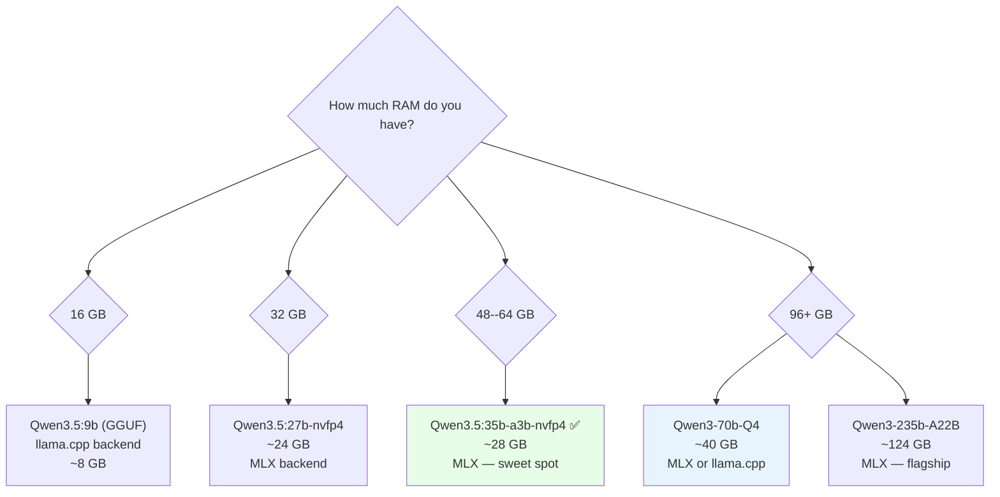
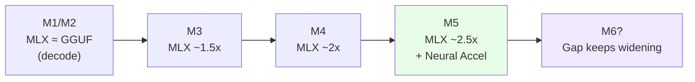

On March 30, 2026, Ollama released the **v0.19** preview with a quiet change that has more impact than any feature in the past two years: **MLX backend for Apple Silicon**.

Real-world results? **93% faster decode speed**. **57% faster prefill**. And for MoE models like Qwen3.5-35B-A3B on M4 Pro, comparing MLX vs the old Ollama is **130 tok/s vs 43 tok/s** — more than **3x faster**.

This article analyzes why this happens, how it works at a technical level, and how to set it up to run today.

* * *

## 1. What Is MLX and Why Does It Matter?

**MLX** is an open-source machine learning framework developed by Apple's research team. The core differentiator isn't the API or features — it's the **design philosophy from the ground up**: MLX is built _around_ Apple Silicon's Unified Memory architecture.

Other frameworks (PyTorch, TensorFlow) were ported to macOS — they were designed for a world with separate CPU RAM and GPU VRAM, then added a Metal backend later. MLX carries no such legacy.

### Key Technical Characteristics

-   **Unified Memory from the start**: Arrays live in shared memory between CPU and GPU — no copying, no transfer overhead
-   **Lazy computation**: Operations only actually run when results are requested, enabling global graph optimization
-   **Dynamic graph**: Changing input shapes doesn't trigger slow recompilation
-   **Per-operation multi-device**: Each operation can individually specify CPU or GPU
-   **Familiar API**: Python API follows NumPy, `mlx.nn` follows PyTorch

**As of early 2026**: 24.9k GitHub stars, 4,316 pre-converted models on HuggingFace (mlx-community org), version v0.31.1 with 72 releases. At WWDC 2025, Apple devoted 3 dedicated sessions to MLX — cementing its status as the priority framework for LLM inference on Apple Silicon.

* * *

## 2. Ollama 0.19: How the MLX Backend Works

### 2.1. Automatic Routing Based on Model Format

Starting from v0.19, Ollama automatically selects the backend based on model format — **no additional configuration needed**:

    GGUF files        →  llama.cpp (Metal backend)   ← as before
    safetensors files →  MLX backend                 ← new

No `--backend mlx` flag. No config changes needed. If you pull an MLX-native model (safetensors), Ollama 0.19 automatically uses MLX.

### 2.2. What Changed Under the Hood

Before v0.19, Ollama on Mac was essentially a **Go wrapper calling llama.cpp** with the Metal backend. This Go wrapper layer consumed significant performance — real benchmarks show:

-   Raw llama.cpp (without Ollama wrapper): **89.4 tok/s**
-   Ollama with llama.cpp backend: **43.5 tok/s** (loses ~51% vs raw!)
-   MLX direct (mlx-lm): **~130 tok/s**
-   **Ollama 0.19 with MLX**: **112 tok/s** (still some overhead from Go layer, but much closer to mlx-lm)

Diagram showing the architectural change:

```mermaid
graph TD
    subgraph "Ollama 0.18 (old)"
        A1[Client] --> B1[Go API Layer]
        B1 --> C1[llama.cpp]
        C1 --> D1[Metal shaders\n(translated from CUDA)]
        D1 --> E1[Apple GPU]
    end

    subgraph "Ollama 0.19 (new — MLX path)"
        A2[Client] --> B2[Go API Layer]
        B2 --> C2[MLX runner]
        C2 --> D2[Native Metal kernels\n+ Neural Accelerators]
        D2 --> E2[Apple Silicon\nGPU + Neural Engine]
    end

    style D1 fill:#fde8e8
    style D2 fill:#e8fde8
```

### 2.3. Architectures Supported in v0.19 Preview

Ollama 0.19 MLX runner supports **6 architectures**:

-   Gemma 3
-   GLM-4 MoE Lite
-   Llama series (all)
-   Qwen 3
-   Qwen 3.5
-   Qwen 3.5 MoE

For comparison: llama.cpp supports hundreds of architectures. This is the trade-off of a preview — broader support will come in future releases.

* * *

## 3. Real Benchmarks: Specific Numbers

### 3.1. Official Data from Ollama (M5, Qwen3.5-35B-A3B)

| Metric          | Ollama 0.18 (llama.cpp) | Ollama 0.19 (MLX) | Improvement |
| --------------- | ----------------------- | ----------------- | --------- |
| Prefill (tok/s) | 1,154                   | 1,810             | **+57%**  |
| Decode (tok/s)  | 58                      | 112               | **+93%**  |
| Decode with int4 | ---                    | 134               | **+131%** |

### 3.2. Community Benchmarks (Various Chips)

**M4 Pro MacBook Pro (48GB RAM)**:

| Model                  | Prompt Eval (tok/s) | Decode (tok/s) |
| ---------------------- | ------------------- | -------------- |
| qwen3.5:35b-a3b-q4_K_M | 6.6                 | 30.0           |
| qwen3.5:35b-a3b-nvfp4  | 13.2                | 66.5           |
| qwen3.5:35b-a3b-int4   | **59.4**            | **84.4**       |

**Mac mini M4 Pro (64GB) — Direct MLX vs old Ollama comparison, Qwen3-Coder-30B-A3B-Instruct 4-bit**:

| Backend            | Decode tok/s | GPU Freq       | RAM Used    |
| ------------------ | ------------ | -------------- | ----------- |
| MLX-LM             | **~130**     | 346 MHz        | **34.7 GB** |
| Ollama (llama.cpp) | ~43          | 1577 MHz (99%) | 40 GB       |

→ MLX is **3x faster**, uses **13% less RAM**, and runs the GPU at **4.5x lower frequency** — less heat, less fan noise, lower power consumption.

**M4 Max (128GB) — same model**:

-   MLX: 130 tok/s
-   Ollama llama.cpp: 43.5 tok/s
-   Raw llama.cpp (without Ollama): 89.4 tok/s

**M1 Max** (caution — MLX has a prefill weakness on older chips):

-   MLX: ~13 tok/s effective (94% of time spent on prefill)
-   GGUF: ~20 tok/s
-   → For M1, GGUF is still better for prefill-heavy workloads

**M4 Max — Llama 3.2 3B (small model)**:

-   MLX: over **1,100 tok/s** — M4 Max hits memory bandwidth saturation with small models

**M5 — TTFT improvement vs M4**:

-   Time-to-first-token: **4.06x faster**
-   Token generation: **1.19x faster**

### 3.3. When MLX Is NOT Better

MLX doesn't always win:

    ✅ MLX better: Long decode (coding agent, text generation)
    ✅ MLX better: MoE models (Qwen 3.x A3B) — up to 3x
    ✅ MLX better: M4/M5 chips
    ✅ MLX better: Memory savings

    ❌ GGUF better: Short conversations (prefill advantage)
    ❌ GGUF better: Context 30K+ tokens (Flash Attention on llama.cpp)
    ❌ GGUF better: M1 (MLX prefill is slow)
    ❌ GGUF better: Models outside the 6 supported architectures

* * *

## 4. Why Unified Memory Architecture Makes the Difference

This is the part most articles skip — **why architecturally** MLX is faster on Apple Silicon.

### 4.1. The Problem with Discrete GPU Systems

    ┌─────────────────────────────────────────┐
    │            Traditional System           │
    │                                         │
    │  ┌──────────┐         ┌──────────────┐  │
    │  │   RAM    │ PCIe 4x │  GPU VRAM    │  │
    │  │  64 GB   │◄───────►│  24 GB       │  │
    │  │ ~50 GB/s │         │  ~900 GB/s   │  │
    │  └──────────┘         └──────────────┘  │
    │                                         │
    │  RTX 4090: 24GB VRAM ceiling            │
    │  70B Q4 model = ~35GB → DOESN'T FIT    │
    └─────────────────────────────────────────┘

The RTX 4090 has 24GB VRAM. A 70B model (Q4 quantized ~35GB) doesn't fit. You must offload layers to RAM — through limited PCIe bandwidth (~64 GB/s) — and performance plummets.

### 4.2. Apple Silicon's Unified Memory

    ┌─────────────────────────────────────────┐
    │         Apple Silicon (M3/M4/M5)        │
    │                                         │
    │  ┌──────────────────────────────────┐   │
    │  │        Unified Memory Pool        │   │
    │  │           (32--192 GB)            │   │
    │  │     ~400 GB/s (M4 Max)           │   │
    │  │                                  │   │
    │  │  CPU  ◄──────────────►  GPU      │   │
    │  │  ANE  ◄──────────────►  NPU      │   │
    │  │                                  │   │
    │  │  Zero-copy, same address space   │   │
    │  └──────────────────────────────────┘   │
    │                                         │
    │  M2 Ultra: 192GB → 70B Q4 fits easily  │
    └─────────────────────────────────────────┘

**No PCIe bottleneck**. No VRAM ceiling. Tensor operations are completely zero-copy between CPU and GPU. MLX exploits this from its design.

### 4.3. Real Memory Savings

| Model               | MLX     | GGUF   | Savings |
| ------------------- | ------- | ------ | --------- |
| Qwen3-Coder-30B-A3B | 34.7 GB | 40 GB  | **13%**   |
| Qwen3-235B-A22B     | 124 GB  | 133 GB | **7%**    |

### 4.4. M5 Neural Accelerators — A Hardware Leap

Apple added **dedicated Neural Accelerators inside each GPU core** of the M5 — not just a faster chip, but hardware circuits specifically designed for MLX's compute graph.

The llama.cpp Metal backend doesn't automatically benefit from this new hardware because it translates from CUDA patterns. MLX does, because Ollama now routes directly into native MLX kernels.

* * *

## 5. NVFP4 — A New Quantization Format

Ollama 0.19 also introduces **NVFP4** — NVIDIA's 4-bit floating point format. On Mac/MLX, it runs as FP4 compute (no Blackwell GPU required):

-   **3.5x smaller model footprint** vs FP16
-   **1.8x smaller** than FP8
-   Less than 1% accuracy loss on language tasks
-   **Same weights** as NVIDIA GPU inference → production parity when deploying

In practice: `qwen3.5:35b-a3b-nvfp4` on M4 Pro 48GB gives **66.5 tok/s decode** — double the GGUF Q4 (30 tok/s).

* * *

## 6. Practical Setup — Start Today

### 6.1. Requirements

-   Mac with Apple Silicon (M1 or later)
-   **>32GB unified memory** (preview requirement for the featured model — Qwen3.5-35B-A3B)
-   Current macOS

### 6.2. Install Ollama 0.19

```bash
# Download at https://ollama.com/download
# Or update if already installed:
ollama update
```

### 6.3. Pull MLX-Native Models

```bash
# Coding model (thinking enabled by default)
ollama pull qwen3.5:35b-a3b-coding-nvfp4

# Chat model (presence penalty on, less over-thinking)
ollama pull qwen3.5:35b-a3b-nvfp4
# (doesn't re-download weights — just pulls config)

# int4 format — fastest for decode
ollama pull qwen3.5:35b-a3b-int4
```

### 6.4. First Run

```bash
# Direct chat
ollama run qwen3.5:35b-a3b-nvfp4

# Disable thinking mode (for simple questions)
/set nothink

# Use API (OpenAI-compatible)
curl http://localhost:11434/v1/chat/completions \
  -H "Content-Type: application/json" \
  -d '{
    "model": "qwen3.5:35b-a3b-nvfp4",
    "messages": [{"role": "user", "content": "Hello"}]
  }'
```

### 6.5. Use with Claude Code / AI Coding Tools

```bash
# Integrate with Claude Code
ollama launch claude --model qwen3.5:35b-a3b-coding-nvfp4

# Check which backend is being used
ollama ps
# Output will show "mlx" or "llama.cpp"
```

### 6.6. Check Real Performance

Use `--verbose` in CLI to see tok/s:

```bash
ollama run qwen3.5:35b-a3b-nvfp4 --verbose "Write a basic REST API"
```

Look for:

    eval rate:         XX.XX tokens/s   ← this is decode speed
    prompt eval rate:  XX.XX tokens/s   ← this is prefill speed

* * *

## 7. Choosing the Right Model for Your RAM



**Practical recommendations**:

| RAM       | Recommended Model     | Backend | Est. Decode |
| --------- | --------------------- | ------- | ----------- |
| 16 GB     | qwen3.5:9b            | GGUF    | ~40 tok/s   |
| 32 GB     | qwen3.5:27b-nvfp4     | MLX     | ~55 tok/s   |
| 48--64 GB | qwen3.5:35b-a3b-nvfp4 | MLX     | ~66 tok/s   |
| 96+ GB    | qwen3:70b-q4          | MLX     | ~30 tok/s   |
| 128+ GB   | qwen3.5:35b-a3b-int4  | MLX     | ~130 tok/s  |

**Note**: 16GB uses GGUF because small models suit llama.cpp better when prefill-heavy, and limited RAM constrains MLX model choice.

* * *

## 8. KV Cache Improvements in Ollama 0.19

Beyond MLX, Ollama 0.19 also significantly upgraded the **KV cache** system:

-   **Cross-conversation cache reuse**: If multiple conversations use the same system prompt (e.g., tool definitions), the cache is reused — less memory, faster prefill
-   **Intelligent checkpoints**: Automatically marks important points in the prompt for reuse
-   **Smarter eviction**: Shared prefixes persist longer even when old branches are dropped

In practice with coding agents managing multiple parallel conversations: **significantly reduced TTFT** from the second request onward when context is similar.

* * *

## 9. The Broader MLX Ecosystem

Before Ollama integrated MLX, there were already 8 competing MLX inference servers. Here's the landscape:

| Tool                        | Strengths                      | Speed vs Ollama 0.18                 |
| --------------------------- | ------------------------------ | ------------------------------------- |
| **mlx-lm** (Apple official) | Most stable, LoRA fine-tuning | ~3x                                   |
| **Rapid-MLX**               | Drop-in Ollama replacement     | 2--4.2x on M3 Ultra                   |
| **vLLM-MLX**                | Continuous batching            | 3.4x throughput (5 concurrent)        |
| **oMLX**                    | SSD KV cache persistence       | TTFT from 30--90s → 1--3s (50K context) |
| **LM Studio**               | GUI + auto MLX/GGUF switching  | Comparable                            |

Ollama brings the advantage of ease-of-use and a wide model library to the MLX ecosystem — a win-win.

* * *

## 10. Looking Ahead

What's most notable isn't today's benchmark numbers — it's the **trajectory**:

Each new generation of Apple Silicon (M3 → M4 → M5) brings more dedicated hardware for MLX. M5 Neural Accelerators inside each GPU core are the clearest example: TTFT improved 4x in just one generation.

The llama.cpp Metal backend translates from CUDA patterns — it doesn't automatically exploit this new hardware. MLX does, because Ollama now routes directly into native MLX kernels.

**Predicted outcome**: The performance gap will _increase_ with each new chip generation. Mac users running AI locally today are investing in the right architecture.



* * *

## Summary

Ollama 0.19 + MLX is not an ordinary update. This is an architectural shift from "CUDA patterns translated to Metal" to "native Apple Silicon inference" — and the result is **57–93% faster on official benchmarks**, **3x faster in real-world MoE models**, and lower resource consumption.

**Get started now**:

1.  Update Ollama to 0.19
2.  `ollama pull qwen3.5:35b-a3b-nvfp4` (if you have ≥48GB RAM)
3.  Run with `--verbose` to see your machine's actual tok/s
4.  Compare with the old GGUF model — the difference will speak for itself

* * *

_Sources: Ollama 0.19 Release Notes (March 30, 2026), Apple MLX GitHub (ml-explore/mlx v0.31.1), Ars Technica "Running local models on Macs gets faster with Ollama's MLX support" (March 2026), HackerNews discussion, r/LocalLLM & r/LocalLLaMA community benchmarks._
