## 1. Background: How to read the source code of a closed npm package?

Claude Code (`@anthropic-ai/claude-code`) is Anthropic's famous AI coding agent tool, distributed as **npm package**. Special point: Anthropic **does not open the original TypeScript source code** --- they only ship a bundle that has been built with Bun.

### 1.1. Why is npm bundle readable?

Bun bundle Claude Code in **tree-shaken ESM** style --- without using heavy obfuscator like Terser with maximum mangling. Result: function names, variable names, and module structure are almost intact. Comments in the TypeScript source also remain intact after the build process.

    npm install @anthropic-ai/claude-code
    # → Unpacked: 43MB, only 19 files, main bundle ~40MB

Overview extraction pipeline:

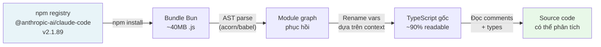

Result: hundreds of files `.ts` / `.tsx` with clear directory structure, intact technical comments, and complete type annotations. It's very rare for a closed-source npm package to reveal so much.

> **Technical note:** This is not a hack. When you publish to npm, the code is a public artifact. Reverse engineering an npm package is legal as long as you do not violate the ToS or copyright when using the results.

### 1.2. Recovered folder structure

    claude-code-code/
    ├── main.tsx ← Main entry point
    ├── QueryEngine.ts ← Core conversation loop
    ├── buddy/ ← 🐾 Virtual pet system (NEW!)
    │ ├── companion.ts ← Roll logic (PRNG + rarity)
    │ ├── CompanionSprite.tsx ← ASCII renderer (Ink/React)
    │ ├── sprites.ts ← 18 species × 3 frames
    │ ├── types.ts ← Species/Rarity/Stats types
    │ ├── prompt.ts ← LLM companion intro
    │ └── useBuddyNotification.tsx ← Teaser window
    ├── bridge/ ← Remote session system
    │ ├── bridgeMain.ts ← Bridge loop (reconnect/backoff)
    │ ├── sessionRunner.ts ← Child process spawner
    │ ├── workSecret.ts ← JWT + WebSocket URLs
    │ └── types.ts ← Protocol types
    ├── commands/
    │ ├── ultraplan.tsx ← 🚀 Multi-agent planning
    │ ├── stickers/ ← Easter egg: StickerMule
    │ └── [35+ commands]
    ├── coordinator/
    │ └── coordinatorMode.ts ← Multi-agent coordinator
    └── tasks/
        ├── LocalAgentTask/ ← Sub-agent (local)
        ├── RemoteAgentTask/ ← Sub-agent (cloud CCR)
        ├── DreamTask/ ← Background async task
        └── InProcessTeammateTask/ ← In-process agent

* * *

## 2. Claude Code overall architecture

### 2.1. Technology stack

Before going into specific features, it is necessary to clearly understand what Claude Code is built on:

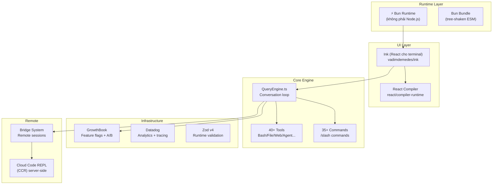

### 2.2. Startup optimization --- down to every millisecond

Look at the beginning of the file `main.tsx`:

```typescript
// Side-effects chạy NGAY khi file được import:
// 1. profileCheckpoint --- bắt đầu đo thời gian
// 2. startMdmRawRead --- fire MDM subprocesses (plutil/reg query) song song
//    với 135ms còn lại của import chain
// 3. startKeychainPrefetch --- fire cả 2 macOS keychain reads song song
//    (~65ms tiết kiệm trên mỗi lần khởi động macOS)

profileCheckpoint('main_tsx_entry');
startMdmRawRead();        // parallel: đọc MDM config
startKeychainPrefetch();  // parallel: đọc keychain OAuth tokens
```

This is "speculative execution" for I/O: as soon as the file starts loading, the 3 side effects are fired in parallel --- all running while the JS is parsing the remaining 135ms import chain. Once the import is complete, the result is ready.

```mermaid
gantt
    title Startup Timeline Claude Code (macOS, ước tính)
    dateFormat X
    axisFormat %Lms

    section Sequential (cũ)
    Parse imports          : 0, 135
    Keychain read #1       : 135, 200
    Keychain read #2       : 200, 265
    MDM read               : 265, 310
    App ready              : 310, 315

    section Parallel (thực tế)
    Parse imports          : 0, 135
    Keychain #1 + #2 + MDM : crit, 0, 65
    App ready              : 135, 140
```

Result: **~175ms saved** per boot. With developer typing `claude` dozens of times every day --- this is real UX win.

* * *

## 3. Hidden feature #1: "Buddy" system --- Virtual pet in terminal

This is the most shocking discovery. Hidden deep in the folder `buddy/` is a complete **virtual pet companion** system, embedded directly into the terminal.

### 3.1. What does Buddy look like?


Companion sits next to the input box and sometimes a speech bubble appears. The entire UI is rendered using **ASCII art** via Ink (React terminal):

    ╭─────────────────────────────────╮
    │ coding this is fun actually :3 │
    ╰─────────────────────────────────╯
                  │
        __
      <(· )___    ← companion (duck, frame 0)
       (  ._>
        `--´
    ───────────────────────────────────
      > |                              ← input cursor

Ba frame idle animation (tick mỗi 500ms):

    Frame 0 (rest):    Frame 1 (fidget):   Frame 2 (move):
        __                 __                  __
      <(· )___           <(· )___            <(· )___
       (  ._>             (  ._>              (  .__>
        `--´               `--´~              `--´

### 3.2. 18 species with their own sprites

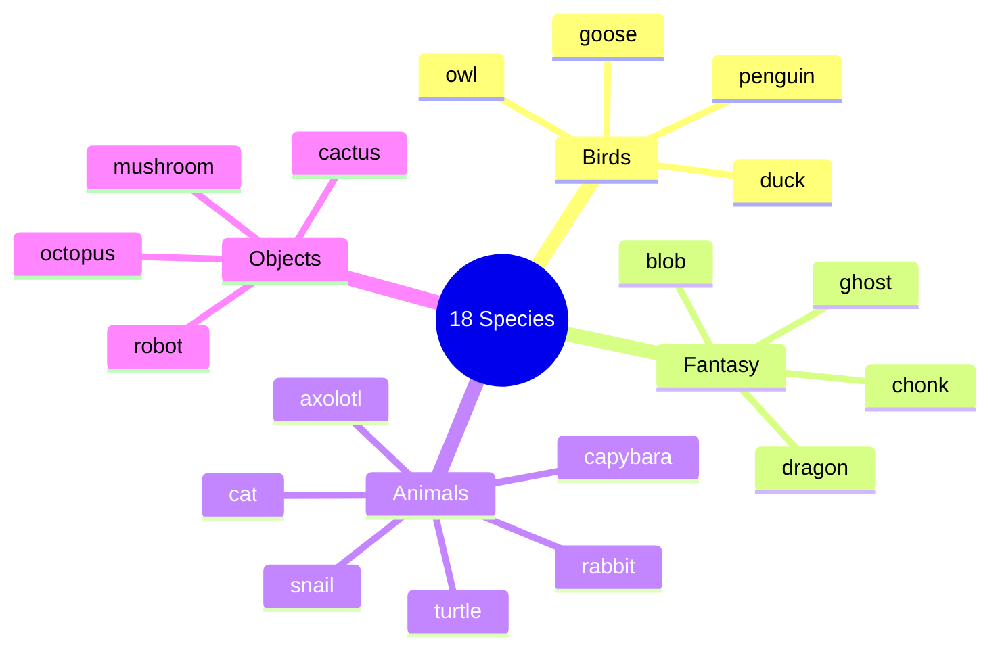

Each species has a sprite set of 5 lines × 12 characters × 3 frames. Goose example:

    Frame 0: Frame 1: Frame 2:
         ({E}> ({E}> ({E}>>
         ||               ||               ||
       _(__)_ _(__)_ _(__)_
        ^^^^ ^^^^ ^^^^

_(`{E}` is a placeholder for eyes --- replaced by eye type character when rendering)_

### 3.3. Pipeline birth companion --- Detailed analysis

This is the most important technical part. Each user has **a permanent companion, identified entirely by their userId**:

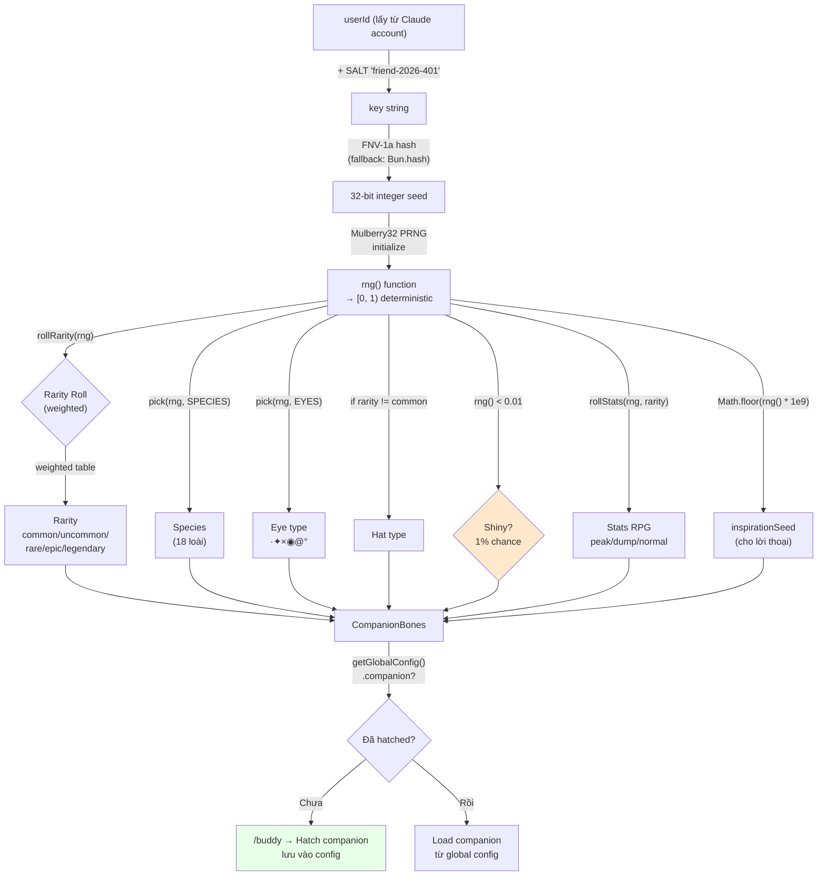

### 3.4. Mulberry32 PRNG --- Why choose it?

```typescript
function mulberry32(seed: number): () => number {
  let a = seed >>> 0
  return function () {
    a |= 0
    a = (a + 0x6d2b79f5) | 0          // additive step
    let t = Math.imul(a ^ (a >>> 15), 1 | a)
    t = (t + Math.imul(t ^ (t >>> 7), 61 | t)) ^ t
    return ((t ^ (t >>> 14)) >>> 0) / 4294967296
  }
}
```

Why Mulberry32 instead `Math.random()`?

|               | `Math.random()` | Mulberry32 |
| ------------- | --------------- | -------------------------- |
| Seed | ❌ Impossible | ✅ Yes |
| Deterministic | ❌ | ✅ Same seed → same result |
| Size | built-in | ~10 lines of code |
| Speed | fast | equivalent fast |
| Use cases | general random | **seeded roll** |

With `Math.random()`, every time you restart Claude Code you will get a different companion. With Mulberry32 + userId seed, the companion is **yours forever** --- like an avatar.

### 3.5. Rarity System --- Probability decoding


The source code does not declare RARITY_WEIGHTS directly, but from floor values and rollRarity logic, we can infer the distribution:

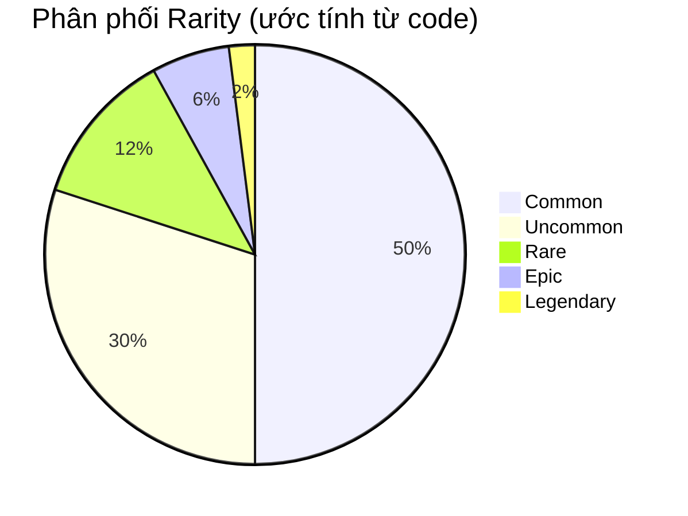

**Stats floor by ratio:**

    common ░░░░░░░░░░ floor: 5 (stats range: 5-75)
    uncommon ░░░░░░░░░░░░░░░ floor: 15 (stats range: 15-85)
    rare ░░░░░░░░░░░░░░░░░░░░ floor: 25 (stats range: 25-95)
    epic ░░░░░░░░░░░░░░░░░░░░░░░░░ floor: 35 (stats range: 35-100)
    legendary ░░░░░░░░░░░░░░░░░░░░░░░░░░░░░░ floor: 50 (stats range: 50-100)

Legendary peak stat can be reached `min(100, 50 + 50 + rand*30) = 100` --- **cap out**!

### 3.6. Speech bubble and interactive system

    How speech bubble render (CompanionSprite.tsx):

      ╭──────────────────────────────────╮
      │ Wrap content at 30 chars/line. │
      │ Italic text, dimColor when fading │
      ╰──────────────────────────────────╯
                   ↑ tail: "top" or "bottom"

    Bubble lifecycle:
      ┌─────────────┐ ┌────────────────────┐ ┌──────────────┐
      │ addNotif │───▶│ BUBBLE_SHOW = 20 │───▶│ FADE_WINDOW │
      │ (trigger) │ │ ticks (~10 seconds) │ │ = 6 ticks │
      └─────────────┘ └────────────────────┘ └──────┬───────┘
                                                           │ dimColor=true
                                                           ▼
                                                     ┌──────────────┐
                                                     │ hidden bubble │
                                                     └──────────────┘

When the user calls the companion **by name** in chat, LLM is injected with a system prompt:

```typescript
`When the user addresses ${name} directly (by name), 
its bubble will answer. Your job in that moment is to 
stay out of the way: respond in ONE line or less.
Don't explain that you're not ${name} --- they know.`
```

Clever design: Claude (main LLM) **does not pretend to be a companion** --- he only "silences" when the user talks to the companion. Companion responds via its own speech bubble, driven by another prompt context.

### 3.7. `/buddy pet` --- 5 floating heart animation frames

```typescript
const PET_HEARTS = [
  `   ♥    ♥   `,   // frame 0: 2 tim xa nhau
  `  ♥  ♥   ♥  `,   // frame 1: tim dày hơn
  ` ♥   ♥  ♥   `,   // frame 2: tim trải rộng
  `♥  ♥      ♥ `,   // frame 3: tim bay ra hai bên
  '·    ·   ·  ',   // frame 4: fade thành dấu chấm
];
// PET_BURST_MS = 2500ms tổng → ~500ms/frame
```

Visualized:

    t=0ms: t=500ms: t=1000ms: t=1500ms: t=2000ms:
      ♥ ♥ ♥ ♥ ♥ ♥ ♥ ♥ ♥ ♥ ♥ · · ·
      companion sprite below

### 3.8. Teaser window and rollout logic

```typescript
// Local date, not UTC --- 24h rolling wave across timezones.
// Teaser window: April 1-7, 2026 only. Command stays live forever after.
export function isBuddyTeaserWindow(): boolean {
  if ("external" === 'ant') return true;  // Anthropic internal: luôn true
  const d = new Date();
  return d.getFullYear() === 2026 && d.getMonth() === 3 && d.getDate() <= 7;
}
```

Here's a very interesting design decision about rollout:

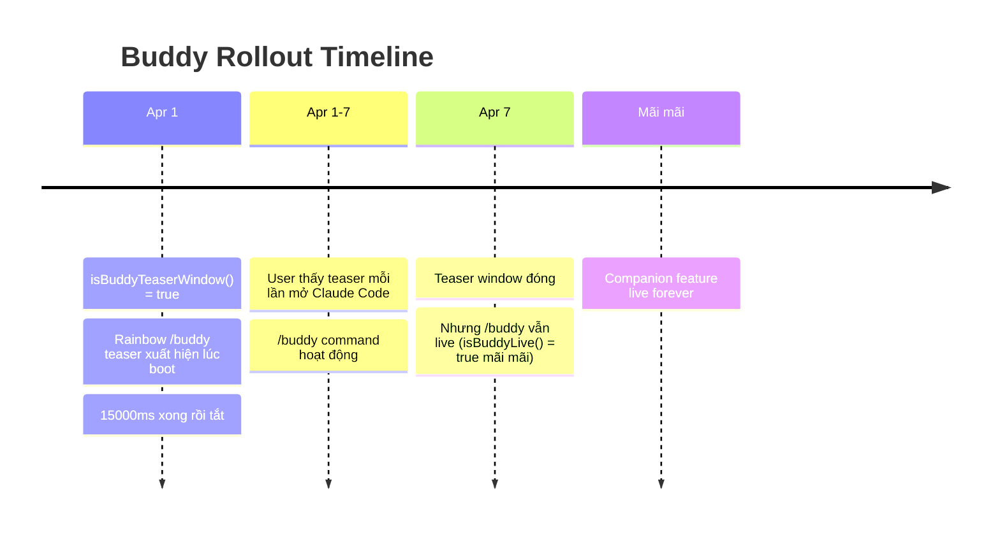

Reason for using **local time** instead of UTC: if using UTC, all users globally receive the teaser at the same UTC time → spike the server load. Use local time → load evenly over 24 hours continuously.

* * *

## 4. Hidden feature #2: UltraPlan --- Multi-agent Planning Engine

### 4.1. What is UltraPlan?


`/ultraplan` is Claude Code's strongest slash command, but the most hidden. Instead of Claude Code planning itself, it **teleports the task to the cloud**, where **multiple agents run in parallel** for up to 30 minutes to create a comprehensive plan.

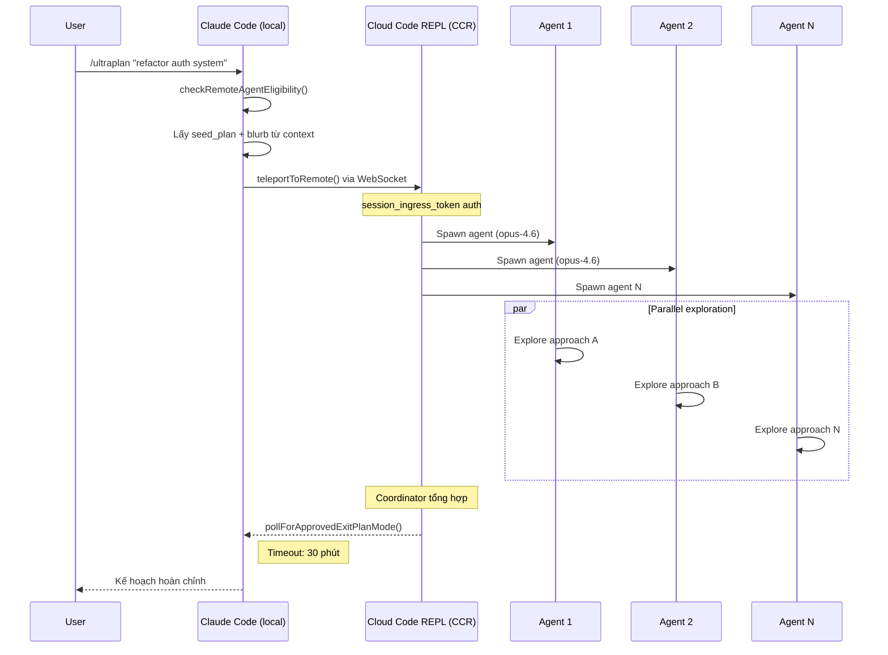

### 4.2. CCR Session architecture

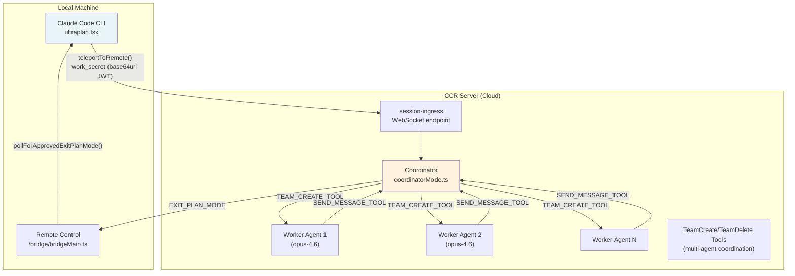

### 4.3. WorkSecret --- Session authentication mechanism

```typescript
type WorkSecret = {
  version: number
  session_ingress_token: string  // JWT cho WebSocket auth
  api_base_url: string           // CCR server URL
  sources: Array<{
    type: string
    git_info?: { type: string; repo: string; ref?: string; token?: string }
  }>
  auth: Array<{ type: string; token: string }>
  claude_code_args?: Record<string, string> | null
  mcp_config?: unknown | null
  environment_variables?: Record<string, string> | null
  use_code_sessions?: boolean   // CCR v2 selector
}
```

WorkSecret is **base64url-encoded** and passed through `--work-secret` flag when spawning child process. Flow:

    1. /ultraplan trigger
    2. CLI retrieves work_secret from bridge API
    3. Decode base64url → JSON → validate version === 1
    4. buildSdkUrl(api_base_url, sessionId)
       → wss://host/v1/session_ingress/ws/{id} (production)
       → ws://host/v2/session_ingress/ws/{id} (localhost)
    5. Connect WebSocket with session_ingress_token

### 4.4. Anti-self-trigger technique

```typescript
// Phrasing deliberately avoids the feature name because
// the remote CCR CLI runs keyword detection on raw input before
// any tag stripping, and a bare "ultraplan" in the prompt would
// self-trigger as /ultraplan, which is filtered out of headless mode
// as "Unknown skill"

// prompt.txt là <system-reminder> để CCR browser ẩn scaffolding
// nhưng model vẫn thấy full text
const _rawPrompt = require('../utils/ultraplan/prompt.txt');
```

Problem: CCR runs a different Claude Code CLI (headless). If the prompt contains the word "ultraplan", the CLI will trigger `/ultraplan` on itself → infinite loop. Solution: wrap prompt in `<system-reminder>` tags and phrasing avoid keywords.

    User → /ultraplan "build auth"
             │
             ▼
    CCR (headless CC) receives prompt:
      <system-reminder>
        Create a detailed plan for: build auth
        [Do not use the word "ultraplan" here]
      </system-reminder>
             │
             ▼ CCR browser strips <system-reminder> from UI
      Model sees: "Create a detailed plan..."
      CCR filter: sees "ultraplan" → filtered reason "Unknown skill"? Are not!
                  because the word "ultraplan" is NOT in the actual prompt

* * *

## 5. Bridge System --- Remote Code Sessions

### 5.1. Overview

Bridge is a system that allows Claude Code to **receive tasks from multiple sessions at the same time** from the claude.ai web interface. A developer can assign multiple repo tasks to Claude Code running on the local machine.

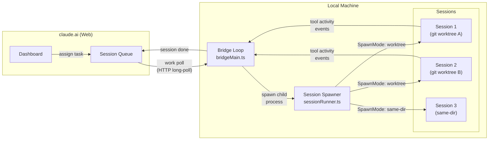

### 5.2. SpawnMode --- 3 ways to manage working directory

```typescript
type SpawnMode = 'single-session' | 'worktree' | 'same-dir'
```

| SpawnMode | Description | Use when |
| ---------------- | ------------------------------------------------- | -------------------------------- |
| `single-session` | 1 session in cwd, the bridge stops when the session is finished | Simple remote control |
| `worktree`       | Each session has a separate (isolated) git worktree | Safe parallel multi-task |
| `same-dir`       | All common sessions cwd | May conflict, use with caution |

### 5.3. Backoff & Reconnect logic

```typescript
const DEFAULT_BACKOFF: BackoffConfig = {
  connInitialMs: 2_000,      // thử lại lần đầu sau 2s
  connCapMs: 120_000,        // tối đa wait 2 phút giữa các lần retry
  connGiveUpMs: 600_000,     // bỏ cuộc sau 10 phút
  generalInitialMs: 500,
  generalCapMs: 30_000,
  generalGiveUpMs: 600_000,  // 10 phút
}
```

More intelligent **sleep detection**:

```typescript
function pollSleepDetectionThresholdMs(backoff: BackoffConfig): number {
  return backoff.connCapMs * 2  // = 240_000ms = 4 phút
}
```

If the gap between 2 polls exceeds 4 minutes → the system assumes the machine has gone to sleep. When wake up, error budget is reset instead of accumulating.

### 5.4. Session ID compatibility layer

```typescript
// CCR v2 compat layer gây ra mismatch session IDs:
// - công việc poll trả về "session_xxxx" (v1 format)
// - worker thực tế dùng "cse_xxxx" (v2 format)
// Cả hai cùng UUID body, chỉ khác prefix

export function sameSessionId(a: string, b: string): boolean {
  if (a === b) return true
  const aBody = a.slice(a.lastIndexOf('_') + 1)
  const bBody = b.slice(b.lastIndexOf('_') + 1)
  return aBody.length >= 4 && aBody === bBody
}
```

For example: `session_abc123` and `cse_staging_abc123` considered **same session**.

* * *

## 6. Task System --- Multi-agent architecture

### 6.1. All Task types

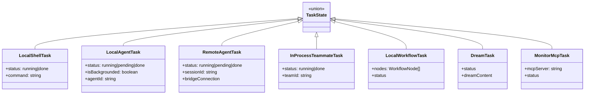

### 6.2. Coordinator Mode --- Multi-agent coordination

```typescript
export function isCoordinatorMode(): boolean {
  if (feature('COORDINATOR_MODE')) {
    return isEnvTruthy(process.env.CLAUDE_CODE_COORDINATOR_MODE)
  }
  return false
}
```

Coordinator mode is a special mode where a Claude Code instance plays the role of **orchestrator** --- it is used `TeamCreateTool` to generate worker agents, `SendMessageTool` to communicate with them, and `TeamDeleteTool` to cleanup.

    Coordinator (CLAUDE_CODE_COORDINATOR_MODE=1)
        │
        ├─ TEAM_CREATE_TOOL → spawn Worker 1
        ├─ TEAM_CREATE_TOOL → spawn Worker 2
        │
        ├─ SEND_MESSAGE_TOOL → "Research approach A"
        ├─ SEND_MESSAGE_TOOL → "Research approach B"
        │
        │ [Workers operate in parallel]
        │
        ├─ receive results from Worker 1
        ├─ receive results from Worker 2
        │
        ├─ synthesis
        ├─ TEAM_DELETE_TOOL → cleanup Worker 1
        ├─ TEAM_DELETE_TOOL → cleanup Worker 2
        └─ return final plan

* * *

## 7. Anti-Canary Obfuscation --- Internal codename protection technique

### 7.1. Problem

Anthropic has a CI/CD pipeline that runs **canary detection**: scan output bundle to detect if internal model codename (like `tengu`, `opus46`, etc.) leaked into the public artifact.

Problem: **A species name in the Buddy system matches an internal model codename**. If you leave the string literal, the scanner will report an error every time you build.

### 7.2. Solution

```typescript
// buddy/types.ts
const c = String.fromCharCode

// Mỗi species được encode bằng hex charcode
export const duck     = c(0x64,0x75,0x63,0x6b)             as 'duck'
export const goose    = c(0x67,0x6f,0x6f,0x73,0x65)         as 'goose'
export const octopus  = c(0x6f,0x63,0x74,0x6f,0x70,0x75,0x73) as 'octopus'
// ... 18 species đều bị encode tương tự
```

**Why encode ALL 18 species, not just the conflicted one?**

```typescript
// Comment giải thích:
// "All species encoded uniformly; `as` casts are type-position only (erased pre-bundle)."
```

If we only encode one species, we immediately know which species is the internal codename → reverse engineer the model codename. Encode all the same → can't tell which one is in conflict.

### 7.3. Mechanism diagram

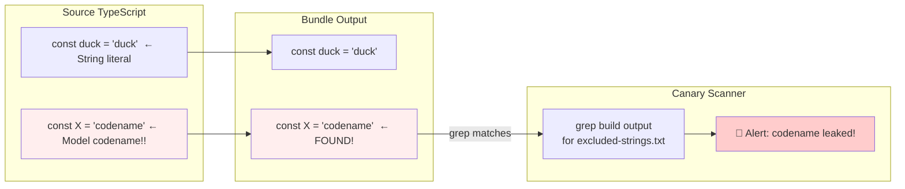

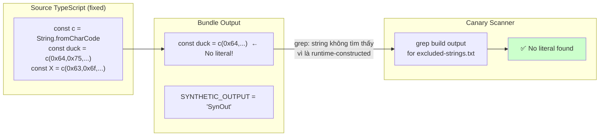

The Canary check still works for the actual **codename** (which is still a string literal elsewhere), while the species animal is encoded to avoid false positives.

* * *

## 8. Full list of hidden slash commands

    commands/
    ├── ultraplan.tsx 🚀 Multi-agent planning (30 min cloud)
    ├── buddy/ 🐾 Virtual pet system
    ├── stickers/ 🎨 StickerMule redirect
    ├── teleport/ 📡 Teleport session to remote
    ├── voice/ 🎤 Voice input
    ├── thinkback/ 🔄 Replay thinking steps
    ├── thinkback-play/ ▶️ Play back thinking animation
    ├── bughunter/ 🐛 Auto bug hunting agent
    ├── ctx_viz/ 📊 Context window visualization
    ├── heapdump/ 🔍 V8 heap dump (debug memory)
    ├── perf-issue/ ⚡ Report perf issue with profile
    ├── sandbox-toggle/ 🔒 Toggle sandbox mode
    ├── rewind/ ⏪ Rewind conversation to checkpoint
    ├── dream/ 💭 (DreamTask system)
    ├── share/ 🔗 Share session
    ├── insights/ 📈 Usage insights
    ├── brief/ 📝 Summarize conversation
    ├── compact/ 🗜️ Compact context window
    ├── ultraplan.tsx 📋 UltraPlan
    ├── advisor/ 🤖 Model advisor setting
    ├── desktop/ 🖥️ Desktop integration
    ├── mobile/ 📱 Mobile companion
    ├── good-claude/ 👍 Mark good response
    ├── ant-trace/ 🔬 Internal Anthropic tracing
    └── ...

**Special: `/stickers`**

```typescript
export async function call(): Promise<LocalCommandResult> {
  const url = 'https://www.stickermule.com/claudecode'
  await openBrowser(url)
  return { type: 'text', value: 'Opening sticker page in browser...' }
}
```

A gentle marketing Easter Egg. Type `/stickers` → browser opens Claude Code sticker shop.

* * *

## 9. Feature Flag System --- GrowthBook + Statsig

### 9.1. Two parallel feature flags systems

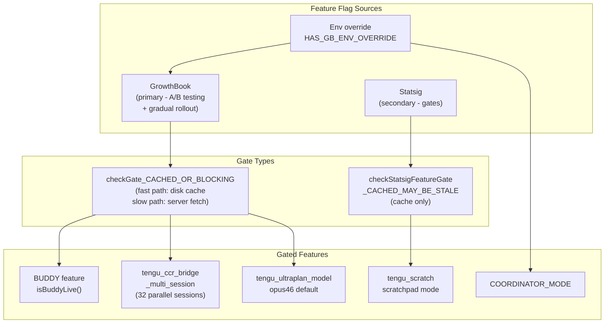

### 9.2. Rollout strategy for multi-session Bridge

```typescript
/**
 * GrowthBook gate cho multi-session spawn modes.
 * Rollout staged via targeting rules: ants first, then gradual external.
 * Uses BLOCKING check (không dùng stale cache) để không từ chối nhầm.
 */
async function isMultiSessionSpawnEnabled(): Promise<boolean> {
  return checkGate_CACHED_OR_BLOCKING('tengu_ccr_bridge_multi_session')
}

const SPAWN_SESSIONS_DEFAULT = 32  // max 32 sessions song song
```

Anthropic rolls out multi-session to internal users ("ants") first, then gradually rolls out to external users. This is best practice: Anthropic himself was the first guinea pig.

* * *

## 10. Implementation details worth learning

### 10.1. safeFilenameId --- Path traversal prevention

```typescript
export function safeFilenameId(id: string): string {
  // Sanitize session ID cho filename, ngăn path traversal (../, /)
  return id.replace(/[^a-zA-Z0-9_-]/g, '_')
}
```

Simple but true. Session IDs from the server are not trusted --- must be sanitized before being used as a file name.

### 10.2. PermissionRequest --- Per-invocation tool permission

```typescript
// Control request từ child CLI khi cần permission cho tool cụ thể
type PermissionRequest = {
  type: 'control_request'
  request_id: string
  request: {
    subtype: 'can_use_tool'
    tool_name: string
    input: Record<string, unknown>  // Parameters của tool call
    tool_use_id: string
  }
}
```

Bridge forward permission request to the server (claude.ai UI) for the user to approve/deny **each specific tool invocation**, not the entire tool class. Granular permission model.

### 10.3. SessionActivity --- Real-time status display

```typescript
const TOOL_VERBS: Record<string, string> = {
  Read: 'Reading',
  Write: 'Writing',
  Edit: 'Editing',
  MultiEdit: 'Editing',
  Bash: 'Running',
  Glob: 'Searching',
  Grep: 'Searching',
  WebFetch: 'Fetching',
  WebSearch: 'Searching',
  Task: 'Running task',
}
// STATUS_UPDATE_INTERVAL_MS = 1_000
```

Dashboard updates every 1 second with processing verbs: "Reading package.json", "Editing src/auth.ts" --- Small UX but worth learning.

* * *

## 11. Conclusion: Lessons learned

### About product design

Buddy/Companion is an example of **smart gamification**: not a discrete mini-game, but a companion that integrates naturally into the workflow. Roll from userId → permanent companion → user has attachment. Rarity system → social sharing ("I have legendary capybara"). Speech bubble → companion feeling of "presence" without ruin focus.

### Technically

**3 techniques you should apply immediately:**

1. **Speculative I/O**: Kick off async operations as soon as the app starts loading, before the results are needed. Claude Code saves 175ms/startup this way.

2. **Seeded PRNG for deterministic randomness**: When you want random but reproducible (avatar, companion, test data), Mulberry32 + userId seed is the correct pattern.

3. **Canary detection in CI/CD**: Scanning build artifacts for leaked secrets/codenames is an effective and cheap layer of protection.

### About security

> **Guidelines**: Code in the npm package is **public**. No matter how minified or obfuscated, it can still be reverse engineered.

Anthropic knows this---that's why:

- Secrets are in the server-side config (GrowthBook), not in the bundle
- Session tokens are fetched dynamically, no hard-code
- Canary detection CI pipeline

If you are shipping an npm package with sensitive business logic: assume that the adversary can read your code and design the appropriate security model.

* * *

_The article is based on direct analysis of source code extracted from npm package `@anthropic-ai/claude-code` v2.1.89 (released March 31, 2026). All code snippets are from public artifacts on npm registry._
