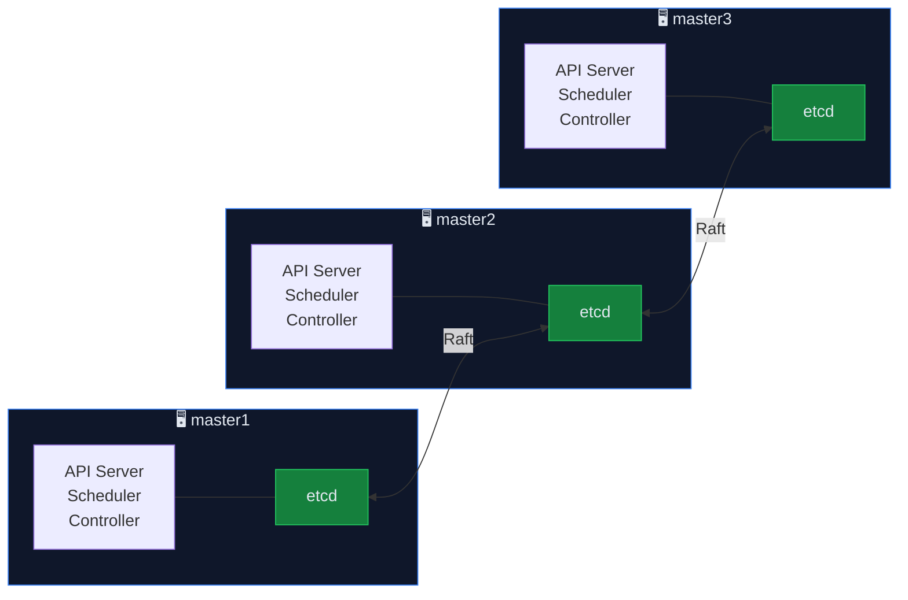
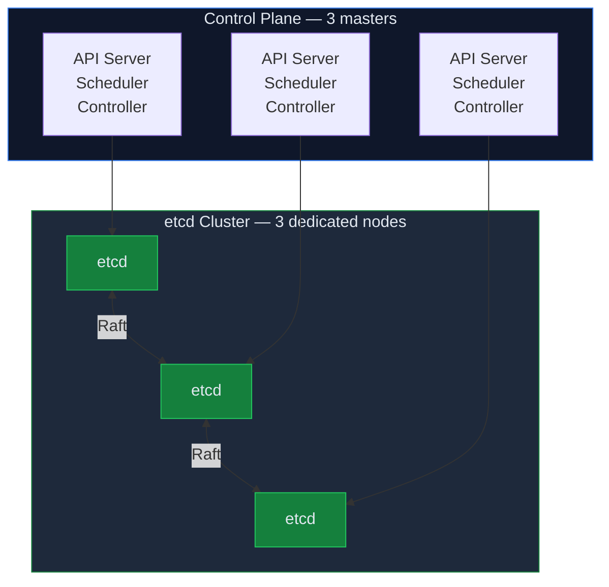

<svg xmlns="http://www.w3.org/2000/svg" viewBox="0 0 1200 340" style="max-width: 100%; height: auto; border-radius: 12px; margin-bottom: 1.5rem;">
  <defs>
    <linearGradient id="bg-8567" x1="0%" y1="0%" x2="100%" y2="100%">
      <stop offset="0%" style="stop-color:#0a1628"/>
      <stop offset="100%" style="stop-color:#1e293b"/>
    </linearGradient>
  </defs>

  <!-- Background -->
  <rect width="1200" height="340" rx="12" fill="url(#bg-8567)"/>

  <!-- Decorations -->
  <g>
    <circle cx="840" cy="210" r="18" fill="#38bdf8" opacity="0.05"/>
    <circle cx="1080" cy="270" r="8" fill="#38bdf8" opacity="0.05"/>
    <circle cx="820" cy="70" r="28" fill="#38bdf8" opacity="0.05"/>
    <circle cx="1060" cy="130" r="18" fill="#38bdf8" opacity="0.05"/>
    <circle cx="800" cy="190" r="8" fill="#38bdf8" opacity="0.05"/>
    <circle cx="750" cy="80" r="1.5" fill="#38bdf8" opacity="0.15"/>
    <circle cx="750" cy="108" r="1.5" fill="#38bdf8" opacity="0.15"/>
    <circle cx="750" cy="136" r="1.5" fill="#38bdf8" opacity="0.15"/>
    <circle cx="750" cy="164" r="1.5" fill="#38bdf8" opacity="0.15"/>
    <circle cx="778" cy="80" r="1.5" fill="#38bdf8" opacity="0.15"/>
    <circle cx="778" cy="108" r="1.5" fill="#38bdf8" opacity="0.15"/>
    <circle cx="778" cy="136" r="1.5" fill="#38bdf8" opacity="0.15"/>
    <circle cx="778" cy="164" r="1.5" fill="#38bdf8" opacity="0.15"/>
    <circle cx="806" cy="80" r="1.5" fill="#38bdf8" opacity="0.15"/>
    <circle cx="806" cy="108" r="1.5" fill="#38bdf8" opacity="0.15"/>
    <circle cx="806" cy="136" r="1.5" fill="#38bdf8" opacity="0.15"/>
    <circle cx="806" cy="164" r="1.5" fill="#38bdf8" opacity="0.15"/>
    <circle cx="834" cy="80" r="1.5" fill="#38bdf8" opacity="0.15"/>
    <circle cx="834" cy="108" r="1.5" fill="#38bdf8" opacity="0.15"/>
    <circle cx="834" cy="136" r="1.5" fill="#38bdf8" opacity="0.15"/>
    <circle cx="834" cy="164" r="1.5" fill="#38bdf8" opacity="0.15"/>
    <circle cx="862" cy="80" r="1.5" fill="#38bdf8" opacity="0.15"/>
    <circle cx="862" cy="108" r="1.5" fill="#38bdf8" opacity="0.15"/>
    <circle cx="862" cy="136" r="1.5" fill="#38bdf8" opacity="0.15"/>
    <circle cx="862" cy="164" r="1.5" fill="#38bdf8" opacity="0.15"/>
    <circle cx="890" cy="80" r="1.5" fill="#38bdf8" opacity="0.15"/>
    <circle cx="890" cy="108" r="1.5" fill="#38bdf8" opacity="0.15"/>
    <circle cx="890" cy="136" r="1.5" fill="#38bdf8" opacity="0.15"/>
    <circle cx="890" cy="164" r="1.5" fill="#38bdf8" opacity="0.15"/>
    <line x1="600" y1="170" x2="1100" y2="250" stroke="#38bdf8" stroke-width="0.5" opacity="0.1"/>
    <line x1="650" y1="200" x2="1050" y2="270" stroke="#38bdf8" stroke-width="0.5" opacity="0.08"/>
    <polygon points="941.650635094611,107.5 941.650635094611,132.5 920,145 898.349364905389,132.5 898.349364905389,107.5 920,95" fill="none" stroke="#38bdf8" stroke-width="1" opacity="0.12"/>
  </g>

  <!-- Accent bar -->
  <rect x="60" y="50" width="4" height="60" rx="2" fill="#38bdf8"/>

  <!-- Category badge -->
  <rect x="80" y="50" width="121" height="28" rx="14" fill="#38bdf8" opacity="0.15"/>
  <text x="92" y="69" font-family="system-ui,-apple-system,sans-serif" font-size="13" font-weight="600" fill="#38bdf8">🔒 DevSecOps — Lesson 6</text>

  <!-- Title -->
  <text x="60" y="140" font-family="system-ui,-apple-system,sans-serif" font-size="34" font-weight="700" fill="#f1f5f9">
      <tspan x="60" dy="0">LESSON 6: INITIALIZING KUBERNETES HA CONTROL</tspan>
      <tspan x="60" dy="42">FIRST PLANE</tspan>
  </text>

  <!-- Series subtitle -->
  <text x="60" y="244" font-family="system-ui,-apple-system,sans-serif" font-size="15" fill="#94a3b8" opacity="0.8">Deploy Microservices On-Premises with Kubernetes HA</text>

  <!-- Section -->
  <text x="60" y="268" font-family="system-ui,-apple-system,sans-serif" font-size="13" fill="#64748b" opacity="0.6">Part 2: Kubernetes HA Cluster with kubeadm__HTMLTAG_62___

  <!-- xDev watermark -->
  <text x="1140" y="320" font-family="system-ui,-apple-system,sans-serif" font-size="12" fill="#475569" text-anchor="end" opacity="0.4">xdev.asia</text>
</svg>

<h2 id="muc-tieu-bai-hoc">🎯 LESSON OBJECTIVE__HTMLTAG_68___

After completing this lesson, you will:

<ul>
<li>✅ Create kubeadm configuration file for HA topology__HTMLTAG_73___
<li>✅ Successfully initialized the first control plane</li>
<li>✅ Understand certificate structure and certificate rotation__HTMLTAG_77___
<li>✅ Copy kubeconfig and access cluster using kubectl</li>
<li>✅ Understanding stacked etcd topology vs external etcd</li>
</ul>

<h2 id="phan-1-ha-topologies">PART 1: KUBERNETES HA TOPOLOGIES</h2>

<h3 id="11-stacked-etcd-vs-external-etcd">1.1. Stacked etcd vs External etcd</h3>

**Option A: Stacked etcd** (Recommended for most cases)

> ✅ Few servers · ✅ Simple · ❌ etcd + API coupled

**Option B: External etcd**

> ✅ Isolation · ✅ Independent scaling · ❌ Needs 6 servers

👉 <strong>Choose Stacked etcd</strong> for this course — simple, good enough for most production workloads. External etcd is only needed for very large clusters (100+ nodes).

<h2 id="phan-2-kubeadm-config">PART 2: CREATE KUBEADM CONFIGURATION</h2>

<h3 id="21-kubeadm-config-yaml">2.1. kubeadm-config.yaml details</h3>
<pre><code class="language-bash"># Trên master1, tạo config file:
cat > /root/kubeadm-config.yaml << 'EOF'
---
apiVersion: kubeadm.k8s.io/v1beta4
kind: InitConfiguration
localAPIEndpoint:
  advertiseAddress: "10.10.20.11"     # IP của master1 trên cluster network
  bindPort: 6443
nodeRegistration:
  name: master1
  criSocket: unix:///run/containerd/containerd.sock
  taints:
    - key: "node-role.kubernetes.io/control-plane"
      effect: "NoSchedule"

---
apiVersion: kubeadm.k8s.io/v1beta4
kind: ClusterConfiguration
kubernetesVersion: "v1.31.0"          # Exact version
clusterName: "production"
controlPlaneEndpoint: "10.10.20.100:6443"   # ← VIP (HAProxy)!
certificatesDir: /etc/kubernetes/pki

networking:
  podSubnet: "10.244.0.0/16"         # Pod CIDR (cho Cilium)
  serviceSubnet: "10.96.0.0/12"      # Service CIDR
  dnsDomain: "cluster.local"

etcd:
  local:
    dataDir: /var/lib/etcd
    extraArgs:
      listen-metrics-urls: "http://0.0.0.0:2381"    # Prometheus metrics

apiServer:
  extraArgs:
    authorization-mode: "Node,RBAC"
    enable-admission-plugins: "NodeRestriction,PodSecurity"
    audit-log-path: "/var/log/kubernetes/audit.log"
    audit-log-maxage: "30"
    audit-log-maxbackup: "10"
    audit-log-maxsize: "100"
    event-ttl: "4h"
    # Encryption at rest (thêm sau khi tạo encryption config)
    # encryption-provider-config: "/etc/kubernetes/encryption-config.yaml"
  extraVolumes:
    - name: audit-log
      hostPath: /var/log/kubernetes
      mountPath: /var/log/kubernetes
      pathType: DirectoryOrCreate

controllerManager:
  extraArgs:
    bind-address: "0.0.0.0"          # Cho Prometheus scrape
    terminated-pod-gc-threshold: "100"

scheduler:
  extraArgs:
    bind-address: "0.0.0.0"          # Cho Prometheus scrape

---
apiVersion: kubelet.config.k8s.io/v1beta1
kind: KubeletConfiguration
cgroupDriver: systemd                 # Match containerd SystemdCgroup
containerRuntimeEndpoint: unix:///run/containerd/containerd.sock
evictionHard:
  memory.available: "500Mi"
  nodefs.available: "10%"
  imagefs.available: "15%"
systemReserved:
  cpu: "500m"
  memory: "1Gi"
kubeReserved:
  cpu: "500m"
  memory: "1Gi"
maxPods: 110                          # Default 110, tăng nếu cần
serializeImagePulls: false            # Parallel image pulls

---
apiVersion: kubeproxy.config.k8s.io/v1alpha1
kind: KubeProxyConfiguration
mode: "ipvs"                          # IPVS mode (better than iptables)
ipvs:
  strictARP: true                     # Required cho MetalLB
  scheduler: "rr"                     # Round-robin
EOF
</code></pre>

<h3 id="22-giai-thich-cac-tham-so-quan-trong">2.2. Important parameters explained</h3><!--kg-card-begin: html-->
<table>
<thead>
<tr>
<th>Parameters</th>
<th>Value</th>
<th>Meaning</th>
</tr>
</thead>
<tbody>
<tr>
<td>controlPlaneEndpoint</td>
<td>10.10.20.100:6443</td>
<td>HAProxy VIP — ALL components connect through here</td>
</tr>
<tr>
<td>podSubnet</td>
<td>10.244.0.0/16</td>
<td>CIDR for pod IPs (65,534 pods max)</td>
</tr>
<tr>
<td>serviceSubnet</td>
<td>10.96.0.0/12</td>
<td>CIDR for ClusterIP services (1,048,574 IPs)</td>
</tr>
<tr>
<td>mode: ipvs</td>
<td>kube-proxy</td>
<td>IPVS load balancing (better than iptables when many services)</td>
</tr>
<tr>
<td>strictARP: true</td>
<td>kube-proxy</td>
<td>Required for MetalLB L2 mode</td>
</tr>
<tr>
<td>cgroupDriver: systemd</td>
<td>kubelet</td>
<td>Match containerd SystemdCgroup = true</td>
</tr>
</tbody>
</table>
<!--kg-card-end: html-->

⚠️ <strong>CRITICAL:</strong> <code>controlPlaneEndpoint</code> MUST point to VIP (HAProxy), NOT master1's IP. This is a key element for HA.

<h2 id="phan-3-kubeadm-init">PART 3: CLUSTER INITIALIZATION</h2>

<h3 id="31-tao-audit-log-directory">3.1. Create audit log directory</h3>
<pre><code class="language-bash"># Trên master1:
mkdir -p /var/log/kubernetes
</code></pre>

<h3 id="32-chay-kubeadm-init">3.2. Run kubeadm init</h3>
<pre><code class="language-bash"># Trên master1:
kubeadm init --config /root/kubeadm-config.yaml --upload-certs

# Output (giữ lại CẨN THẬN):
# ────────────────────────────────────────────────────────────
# Your Kubernetes control-plane has initialized successfully!
#
# To start using your cluster, you need to run the following as a regular user:
#   mkdir -p $HOME/.kube
#   sudo cp -i /etc/kubernetes/admin.conf $HOME/.kube/config
#   sudo chown $(id -u):$(id -g) $HOME/.kube/config
#
# You can now join any number of control-plane node by running:
#   kubeadm join 10.10.20.100:6443 --token abcdef.0123456789abcdef \
#     --discovery-token-ca-cert-hash sha256:... \
#     --control-plane --certificate-key &lt;CERTIFICATE_KEY&gt;
#
# Then you can join any number of worker nodes by running:
#   kubeadm join 10.10.20.100:6443 --token abcdef.0123456789abcdef \
#     --discovery-token-ca-cert-hash sha256:...
# ────────────────────────────────────────────────────────────
</code></pre>

⚠️ <strong>RECALL immediately:</strong>

<ul>
<li><code>--token</code>: Used for join nodes (expires after 24 hours)</li>
<li><code>--discovery-token-ca-cert-hash</code>: SHA256 hash of CA cert</li>
<li><code>--certificate-key</code>: Used to join control-plane nodes (expires after 2 hours)</li>
</ul>

<h3 id="33-setup-kubeconfig">3.3. Setup kubeconfig</h3>
<pre><code class="language-bash"># Trên master1:
mkdir -p $HOME/.kube
cp -i /etc/kubernetes/admin.conf $HOME/.kube/config
chown $(id -u):$(id -g) $HOME/.kube/config

# Verify cluster
kubectl get nodes
# Output:
# NAME      STATUS     ROLES           AGE   VERSION
# master1   NotReady   control-plane   30s   v1.31.0
# ← NotReady vì chưa cài CNI (Cilium sẽ fix ở Bài 8)

# Kiểm tra tất cả system pods
kubectl get pods -n kube-system
# Output:
# NAME                              READY   STATUS    RESTARTS   AGE
# coredns-xxx-xxx                   0/1     Pending   0          30s  ← Pending vì chưa có CNI
# coredns-xxx-xxx                   0/1     Pending   0          30s
# etcd-master1                      1/1     Running   0          35s
# kube-apiserver-master1            1/1     Running   0          35s
# kube-controller-manager-master1   1/1     Running   0          35s
# kube-scheduler-master1            1/1     Running   0          35s

# Kiểm tra etcd health
kubectl -n kube-system exec etcd-master1 -- etcdctl \
  --endpoints=https://127.0.0.1:2379 \
  --cacert=/etc/kubernetes/pki/etcd/ca.crt \
  --cert=/etc/kubernetes/pki/etcd/server.crt \
  --key=/etc/kubernetes/pki/etcd/server.key \
  endpoint health
# Output: https://127.0.0.1:2379 is healthy: successfully committed proposal
</code></pre>

<h2 id="phan-4-certificates-deep-dive">PART 4: CERTIFICATE STRUCTURE</h2>

<h3 id="41-kien-truc-certificates">4.1. Architecture Certificates</h3>
<pre><code>
/etc/kubernetes/pki/
├── ca.crt                  ─── Kubernetes CA (root cert)
├── ca.key                  ─── CA private key (PROTECT!)
├── apiserver.crt           ─── API Server cert
├── apiserver.key
├── apiserver-kubelet-client.crt
├── apiserver-kubelet-client.key
├── apiserver-etcd-client.crt
├── apiserver-etcd-client.key
├── front-proxy-ca.crt      ─── Front Proxy CA
├── front-proxy-ca.key
├── front-proxy-client.crt
├── front-proxy-client.key
├── sa.pub                  ─── Service Account public key
├── sa.key                  ─── Service Account private key
└── etcd/
    ├── ca.crt              ─── etcd CA
    ├── ca.key
    ├── server.crt          ─── etcd server cert
    ├── server.key
    ├── peer.crt            ─── etcd peer cert
    ├── peer.key
    ├── healthcheck-client.crt
    └── healthcheck-client.key
</code></pre>

<h3 id="42-kiem-tra-certificate-expiry">4.2. Check Certificate Expiry</h3>
<pre><code class="language-bash"># Xem tất cả cert expiry:
kubeadm certs check-expiration
# Output:
# CERTIFICATE                EXPIRES                  RESIDUAL TIME
# admin.conf                 Apr 02, 2027 07:00 UTC   364d
# apiserver                  Apr 02, 2027 07:00 UTC   364d
# apiserver-etcd-client      Apr 02, 2027 07:00 UTC   364d
# ...
# ca                         Mar 30, 2036 07:00 UTC   9y   ← CA valid 10 years
# etcd-ca                    Mar 30, 2036 07:00 UTC   9y

# ⚠️ Certificates mặc định valid 1 NĂM (trừ CA: 10 năm)
# Phải renew trước khi expire!

# Renew tất cả certs:
# kubeadm certs renew all
# (Sẽ học chi tiết ở Bài 46: Nâng cấp Cluster)
</code></pre>

<h2 id="phan-5-verify-ha-readiness">PART 5: VERIFY HA READINESS</h2>

<h3 id="51-kiem-tra-api-server-qua-vip">5.1. Check API Server via VIP</h3>
<pre><code class="language-bash"># Verify API server accessible qua VIP (HAProxy):
curl -sk https://10.10.20.100:6443/healthz
# Output: ok

# Kiểm tra HAProxy backend status:
curl -s http://lb1:9000/stats\;csv | grep k8s-api
# master1 → UP, master2 → DOWN, master3 → DOWN (chưa join)

# API server accessible trực tiếp:
curl -sk https://10.10.20.11:6443/healthz
# Output: ok
</code></pre>

<h3 id="52-luu-join-commands">5.2. Save join commands (important!)</h3>
<pre><code class="language-bash"># Lưu join commands vào file:
cat > /root/join-commands.sh << 'CMDS'
# === Join Control Plane nodes (master2, master3) ===
# Certificate key expires in 2 HOURS!
kubeadm join 10.10.20.100:6443 \
  --token &lt;TOKEN&gt; \
  --discovery-token-ca-cert-hash sha256:&lt;HASH&gt; \
  --control-plane \
  --certificate-key &lt;CERT_KEY&gt;

# === Join Worker nodes ===
kubeadm join 10.10.20.100:6443 \
  --token &lt;TOKEN&gt; \
  --discovery-token-ca-cert-hash sha256:&lt;HASH&gt;
CMDS

# Nếu token hết hạn, tạo mới:
kubeadm token create --print-join-command
# Output: kubeadm join 10.10.20.100:6443 --token NEW_TOKEN --discovery-token-ca-cert-hash sha256:HASH

# Nếu certificate-key hết hạn, upload certs lại:
kubeadm init phase upload-certs --upload-certs
# Output: Using certificate key: NEW_CERTIFICATE_KEY
</code></pre>

<h2 id="key-takeaways">💡 KEY TAKEAWAYS</h2>
<ol>
<li><strong>controlPlaneEndpoint</strong> must point to VIP (HAProxy), not specific IP</li>
<li><strong>Stacked etcd</strong>good enough for most deployments, etcd running on the control plane</li>
<li><strong>--upload-certs</strong> flag automatically distribute certificates for join control-plane</li>
<li><strong>Token expires in 24 hours</strong>, certificate-key expires in 2 hours — must save and join nodes soon</li>
<li><strong>ipvs mode + strictARP</strong> for kube-proxy is a requirement for MetalLB</li>
<li><strong>Node status NotReady</strong> is normal before installing CNI (Cilium)</li>
</ol>

<h2 id="bai-tap">🎯 EXERCISE</h2>

<h3 id="bt1">Exercise 1: Init control plane__HTMLTAG_243___
<ul>
<li>Create kubeadm-config.yaml on master1</li>
<li>Run kubeadm init --config --upload-certs</li>
<li>Setup kubeconfig, verify kubectl get nodes</li>
<li>RECALL join commands</li>
</ul>

<h3 id="bt2">Exercise 2: Verify certificates</h3>
<ul>
<li>List all certificates in /etc/kubernetes/pki/</li>
<li>Run kubeadm certs check-expiration</li>
<li>Verify API server via VIP: curl -sk https://VIP:6443/healthz</li>
</ul>

<h2 id="bai-tiep-theo">📚 NEXT POST</h2>

In <strong>Lesson 7: Join Control Plane and Worker Nodes</strong>, we will join master2, master3 to the HA control plane and join worker nodes to the cluster.
