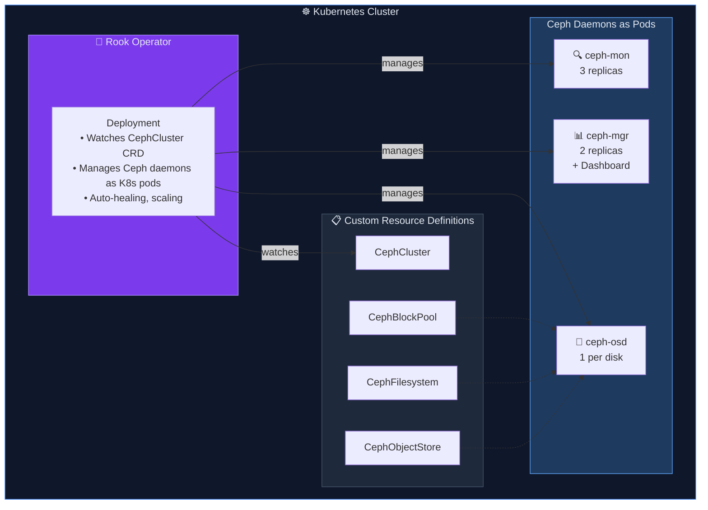
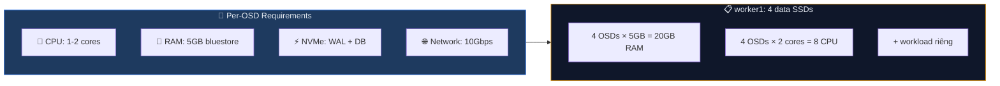
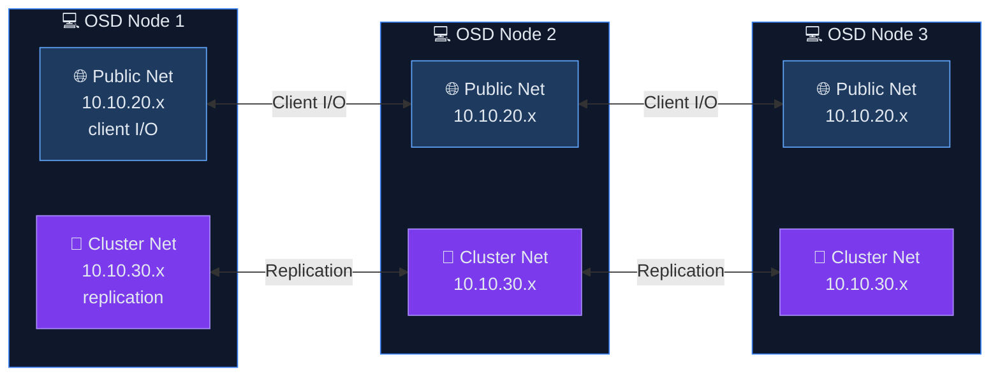
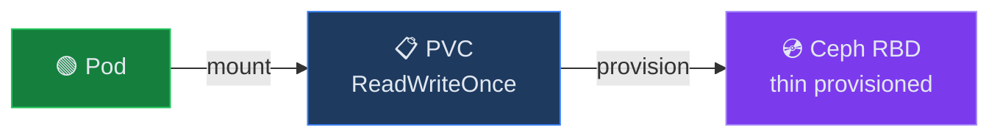
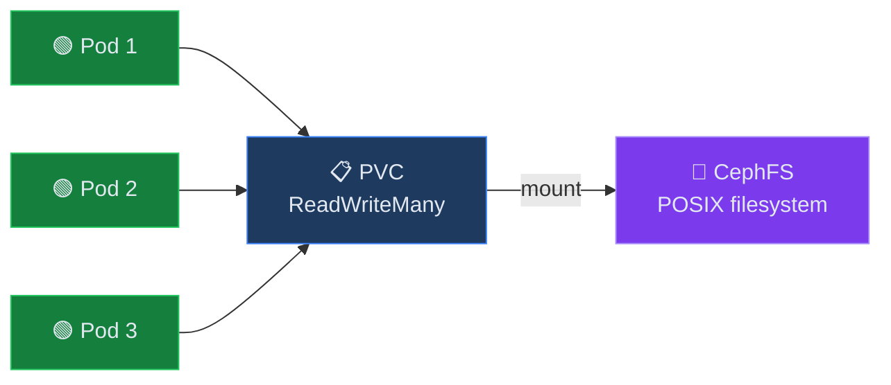

<svg xmlns="http://www.w3.org/2000/svg" viewBox="0 0 1200 340" style="max-width: 100%; height: auto; border-radius: 12px; margin-bottom: 1.5rem;">
  <defs>
    <linearGradient id="bg-7557" x1="0%" y1="0%" x2="100%" y2="100%">
      <stop offset="0%" style="stop-color:#0a1628"/>
      <stop offset="100%" style="stop-color:#1e293b"/>
    </linearGradient>
  </defs>

  <!-- Background -->
  <rect width="1200" height="340" rx="12" fill="url(#bg-7557)"/>

  <!-- Decorations -->
  <g>
    <circle cx="788" cy="234" r="26" fill="#fbbf24" opacity="0.09"/>
    <circle cx="976" cy="42" r="20" fill="#fbbf24" opacity="0.13"/>
    <circle cx="664" cy="110" r="14" fill="#fbbf24" opacity="0.07"/>
    <circle cx="852" cy="178" r="8" fill="#fbbf24" opacity="0.11"/>
    <circle cx="1040" cy="246" r="32" fill="#fbbf24" opacity="0.05"/>
    <circle cx="750" cy="80" r="1.5" fill="#fbbf24" opacity="0.15"/>
    <circle cx="750" cy="108" r="1.5" fill="#fbbf24" opacity="0.15"/>
    <circle cx="750" cy="136" r="1.5" fill="#fbbf24" opacity="0.15"/>
    <circle cx="750" cy="164" r="1.5" fill="#fbbf24" opacity="0.15"/>
    <circle cx="778" cy="80" r="1.5" fill="#fbbf24" opacity="0.15"/>
    <circle cx="778" cy="108" r="1.5" fill="#fbbf24" opacity="0.15"/>
    <circle cx="778" cy="136" r="1.5" fill="#fbbf24" opacity="0.15"/>
    <circle cx="778" cy="164" r="1.5" fill="#fbbf24" opacity="0.15"/>
    <circle cx="806" cy="80" r="1.5" fill="#fbbf24" opacity="0.15"/>
    <circle cx="806" cy="108" r="1.5" fill="#fbbf24" opacity="0.15"/>
    <circle cx="806" cy="136" r="1.5" fill="#fbbf24" opacity="0.15"/>
    <circle cx="806" cy="164" r="1.5" fill="#fbbf24" opacity="0.15"/>
    <circle cx="834" cy="80" r="1.5" fill="#fbbf24" opacity="0.15"/>
    <circle cx="834" cy="108" r="1.5" fill="#fbbf24" opacity="0.15"/>
    <circle cx="834" cy="136" r="1.5" fill="#fbbf24" opacity="0.15"/>
    <circle cx="834" cy="164" r="1.5" fill="#fbbf24" opacity="0.15"/>
    <circle cx="862" cy="80" r="1.5" fill="#fbbf24" opacity="0.15"/>
    <circle cx="862" cy="108" r="1.5" fill="#fbbf24" opacity="0.15"/>
    <circle cx="862" cy="136" r="1.5" fill="#fbbf24" opacity="0.15"/>
    <circle cx="862" cy="164" r="1.5" fill="#fbbf24" opacity="0.15"/>
    <circle cx="890" cy="80" r="1.5" fill="#fbbf24" opacity="0.15"/>
    <circle cx="890" cy="108" r="1.5" fill="#fbbf24" opacity="0.15"/>
    <circle cx="890" cy="136" r="1.5" fill="#fbbf24" opacity="0.15"/>
    <circle cx="890" cy="164" r="1.5" fill="#fbbf24" opacity="0.15"/>
    <line x1="600" y1="74" x2="1100" y2="154" stroke="#fbbf24" stroke-width="0.5" opacity="0.1"/>
    <line x1="650" y1="104" x2="1050" y2="174" stroke="#fbbf24" stroke-width="0.5" opacity="0.08"/>
    <polygon points="949.1147367097487,109.5 949.1147367097487,138.5 924,153 898.8852632902513,138.5 898.8852632902513,109.50000000000001 924,95" fill="none" stroke="#fbbf24" stroke-width="1" opacity="0.12"/>
  </g>

  <!-- Accent bar -->
  <rect x="60" y="50" width="4" height="60" rx="2" fill="#fbbf24"/>

  <!-- Category badge -->
  <rect x="80" y="50" width="121" height="28" rx="14" fill="#fbbf24" opacity="0.15"/>
  <text x="92" y="69" font-family="system-ui,-apple-system,sans-serif" font-size="13" font-weight="600" fill="#fbbf24">🔒 DevSecOps — Lesson 11</text>

  <!-- Title -->
  <text x="60" y="140" font-family="system-ui,-apple-system,sans-serif" font-size="34" font-weight="700" fill="#f1f5f9">
      <tspan x="60" dy="0">LESSON 11: DISTRIBUTED STORAGE ARCHITECTURE WITH</tspan>
      <tspan x="60" dy="42">ROOK-CEPH</tspan>
  </text>

  <!-- Series subtitle -->
  <text x="60" y="244" font-family="system-ui,-apple-system,sans-serif" font-size="15" fill="#94a3b8" opacity="0.8">Deploy Microservices On-Premises with Kubernetes HA</text>

  <!-- Section -->
  <text x="60" y="268" font-family="system-ui,-apple-system,sans-serif" font-size="13" fill="#64748b" opacity="0.6">Part 3: Distributed Storage — Rook-Ceph</text>

  <!-- xDev watermark -->
  <text x="1140" y="320" font-family="system-ui,-apple-system,sans-serif" font-size="12" fill="#475569" text-anchor="end" opacity="0.4">xdev.asia</text>
</svg>

<h2 id="muc-tieu-bai-hoc">🎯 LESSON OBJECTIVE__HTMLTAG_68___
<p>After completing this lesson, you will:</p>
<ul>
<li>✅ Understand Ceph architecture: RADOS, OSD, MON, MDS, MGR</li>
<li>✅ Understand CRUSH algorithm and data placement</li>
<li>✅ Compare Rook-Ceph vs Longhorn vs OpenEBS vs local-path</li>
<li>✅ Planning hardware and network for Ceph cluster</li>
<li>✅ Understand 3 types of storage: Block (RBD), Filesystem (CephFS), Object (RGW)</li>
</ul>

<hr>

<h2 id="phan-1-ceph-architecture">PART 1: CEPH ARCHITECTURE OVERVIEW</h2>

<h3 id="11-cac-thanh-phan-ceph">1.1. Ceph</h3> components
```mermaid
graph TB
    subgraph CLIENT["🖥️ CLIENT ACCESS"]
        RBD["💿 RBD<br/>Block Storage"]
        CephFS["📁 CephFS<br/>Filesystem"]
        RGW["🌐 RADOS Gateway<br/>Object / S3-compat"]
    end

    subgraph LIB["📚 LIBRADOS API"]
        librados["Unified Storage API"]
    end

    subgraph RADOS["⚙️ RADOS LAYER"]
        MON["🔍 MON<br/>Monitor<br/>3 nodes"]
        MGR["📊 MGR<br/>Manager<br/>2 nodes"]
        MDS["📂 MDS<br/>Metadata Server<br/>CephFS only"]
        OSD["💾 OSD<br/>Object Storage<br/>Daemon"]
    end

    subgraph CRUSH["🗺️ CRUSH MAP"]
        crush_algo["Data placement algorithm — no lookup table!"]
    end

    RBD --> librados
    CephFS --> librados
    RGW --> librados
    librados --> MON
    librados --> MGR
    librados --> MDS
    librados --> OSD
    OSD --> crush_algo

    style CLIENT fill:#0f172a,stroke:#3b82f6,color:#e2e8f0
    style LIB fill:#1e3a5f,stroke:#60a5fa,color:#e2e8f0
    style RADOS fill:#1e293b,stroke:#3b82f6,color:#e2e8f0
    style CRUSH fill:#7c3aed,stroke:#a78bfa,color:#e2e8f0
```<!--kg-card-begin: html-->
<table>
<thead>
<tr>
<th>Component</th>
<th>Role</th>
<th>Min HA</th>
</tr>
</thead>
<tbody>
<tr>
<td>MON (Monitor)</td>
<td>Cluster map, quorum, authentication</td>
<td>3 (odd number)</td>
</tr>
<tr>
<td>MGR (Manager)</td>
<td>Metrics, dashboard, orchestration</td>
<td>2 (active-standby)</td>
</tr>
<tr>
<td>OSD (Object Storage Daemon)</td>
<td>Actual data storage, replication</td>
<td>3+ (1 per disk)</td>
</tr>
<tr>
<td>MDS (Metadata Server)</td>
<td>Metadata for CephFS (only needed when using CephFS)</td>
<td>2 (active-standby)</td>
</tr>
<tr>
<td>RGW (RADOS Gateway)</td>
<td>S3/Swift API for object storage</td>
<td>2+ (behind LB)</td>
</tr>
</tbody>
</table>
<!--kg-card-end: html-->

<h3 id="12-crush-algorithm">1.2. CRUSH Algorithm</h3>
```mermaid
graph TD
    subgraph STEP1["1️⃣ Object → Pool → PG"]
        OBJ["📄 photo.jpg"] -->|"hash() mod num_PGs"| PG["PG 3.1a"]
    end

    subgraph STEP2["2️⃣ CRUSH Map quyết định OSD set"]
        PG2["PG 3.1a"] -->|"CRUSH()"| OSDSET["OSD Set"]
    end

    subgraph STEP3["3️⃣ Replicate tới 3 OSDs"]
        OSD5["💾 osd.5<br/>PRIMARY<br/>worker1"]
        OSD12["💾 osd.12<br/>REPLICA<br/>worker2"]
        OSD8["💾 osd.8<br/>REPLICA<br/>worker3"]
    end

    PG --> PG2
    OSDSET --> OSD5
    OSDSET --> OSD12
    OSDSET --> OSD8

    style STEP1 fill:#0f172a,stroke:#3b82f6,color:#e2e8f0
    style STEP2 fill:#1e3a5f,stroke:#60a5fa,color:#e2e8f0
    style STEP3 fill:#15803d,stroke:#4ade80,color:#e2e8f0
    style OSD5 fill:#15803d,stroke:#22c55e,color:#e2e8f0
    style OSD12 fill:#1e3a5f,stroke:#3b82f6,color:#e2e8f0
    style OSD8 fill:#1e3a5f,stroke:#3b82f6,color:#e2e8f0
```

> ✅ No need to lookup table → Scale to exabytes
> ✅ Failure domain aware (rack, host, datacenter)
> ✅ Client directly calculates data location

<hr>

<h2 id="phan-2-rook-la-gi">PART 2: ROOK — CEPH OPERATOR FOR KUBERNETES</h2>

<h3 id="21-rook-architecture">2.1. Rook Architecture</h3>


<h3 id="22-so-sanh-storage">2.2. Compare Storage Solutions</h3><!--kg-card-begin: html-->
<table>
<thead>
<tr>
<th>Criteria</th>
<th>Rook-Ceph</th>
<th>Longhorn</th>
<th>OpenEBS</th>
<th>local-path</th>
</tr>
</thead>
<tbody>
<tr>
<td>Block storage</td>
<td>✅ RBD</td>
<td>✅</td>
<td>✅</td>
<td>❌</td>
</tr>
<tr>
<td>Filesystem (RWX)</td>
<td>✅ CephFS</td>
<td>❌ (NFS hack)</td>
<td>❌</td>
<td>❌</td>
</tr>
<tr>
<td>Object (S3)</td>
<td>✅ RGW</td>
<td>❌</td>
<td>❌</td>
<td>❌</td>
</tr>
<tr>
<td>Replication</td>
<td>3-way</td>
<td>3-way</td>
<td>3-way</td>
<td>❌</td>
</tr>
<tr>
<td>Performance</td>
<td>Excellent__HTMLTAG_222___
<td>Good</td>
<td>Good</td>
<td>Best (local)</td>
</tr>
<tr>
<td>Complexity</td>
<td>High</td>
<td>Low</td>
<td>Average</td>
<td>Very low</td>
</tr>
<tr>
<td>Min nodes</td>
<td>3</td>
<td>3</td>
<td>3</td>
<td>1</td>
</tr>
<tr>
<td>CNCF</td>
<td>Graduated</td>
<td>Incubating</td>
<td>Sandbox</td>
<td>-</td>
</tr>
<tr>
<td>Best for</td>
<td>Production</td>
<td>Small clusters</td>
<td>Dev/test</td>
<td>Single node</td>
</tr>
</tbody>
</table>
<!--kg-card-end: html-->

<p>👉 <strong>Select Rook-Ceph</strong> for production on-premises: unified storage (Block + FS + Object), proven at scale, CNCF Graduated.</p>

<hr>

<h2 id="phan-3-planning-ceph">PART 3: PLANNING HARDWARE FOR CEPH</h2>

<h3 id="31-osd-node-sizing">3.1. OSD Node Sizing</h3>


<h3 id="32-capacity-planning">3.2. Capacity Planning</h3>
<pre><code class="language-bash"># Ceph usable capacity formula:
# Usable = Raw Capacity × (1 / Replication Factor) × Pool Utilization Target

# Ví dụ:
# 3 workers × 4 SSDs × 500GB = 6,000 GB Raw
# Replication Factor = 3 (data replicate 3 bản)
# Usable = 6,000 / 3 = 2,000 GB
# ⚠️ Ceph khuyến nghị KHÔNG vượt 85% → 2,000 × 0.85 = 1,700 GB usable

# Cho lab (mỗi worker 1 SSD 100GB):
# 3 × 100GB = 300GB Raw → 100GB usable → 85GB safe
</code></pre>

<h3 id="33-network-planning">3.3. Network Planning</h3>


> ⚠️ Cluster network: 10Gbps minimum so recovery does not impact client I/O

<hr>

<h2 id="phan-4-storage-types">PART 4: 3 TYPES OF STORAGE</h2>

<h3 id="41-block-rbd">4.1. Block Storage (RBD)</h3>


> ✅ Database (PostgreSQL, MySQL) · ✅ Stateful applications · ✅ High IOPS
> ⚠️ ReadWriteOnce — only 1 pod mount at a time<h3 id="42-filesystem-cephfs">4.2. Filesystem Storage (CephFS)</h3>


> ✅ Shared file storage (multiple pods read/write together) · ✅ Content management · ✅ AI/ML training data

<h3 id="43-object-rgw">4.3. Object Storage (RGW)</h3>


> ✅ Backup storage · ✅ Log archives · ✅ MinIO/AWS S3 replacement

<hr>

<h2 id="key-takeaways">💡 KEY TAKEAWAYS</h2>
<ol>
<li><strong>Ceph</strong> = unified storage: Block + Filesystem + Object in 1 cluster</li>
<li><strong>CRUSH algorithm</strong>: calculate data position without lookup table → scale infinite__HTMLTAG_314___
<li><strong>Rook Operator</strong>: manage Ceph lifecycle on K8s with CRDs</li>
<li><strong>5GB RAM per OSD</strong>: plan memory carefully for storage nodes</li>
<li><strong>2 networks</strong>: Public (client) + Cluster (replication) to separate traffic</li>
<li><strong>Replication 3x</strong>: Raw capacity / 3 = usable capacity</li>
</ol>

<hr>

<h2 id="bai-tap">🎯 EXERCISE</h2>

<h3 id="bt1">Exercise 1: Capacity Planning</h3>
<ul>
<li>Calculate usable capacity for: 5 nodes × 6 SSDs × 1TB, replication=3</li>
<li>Calculate RAM required for Ceph (5GB OSD each)</li>
<li>Draw network topology for Ceph cluster</li>
</ul>

<h3 id="bt2">Exercise 2: Prepare disks__HTMLTAG_346___
<ul>
<li>Identify unused disk on worker nodes: <code>lsblk</code></li>
<li>Verify disk without partition: <code>wipefs -a /dev/sdX</code></li>
<li>Prepare the disk for Lesson 12</li>
</ul>

<hr>

<h2 id="bai-tiep-theo">📚 NEXT POST</h2>
<p>In <strong>Lesson 12: Installing Rook-Ceph Operator and CephCluster</strong>, we will deploy Rook Operator and create CephCluster on K8s.</p>