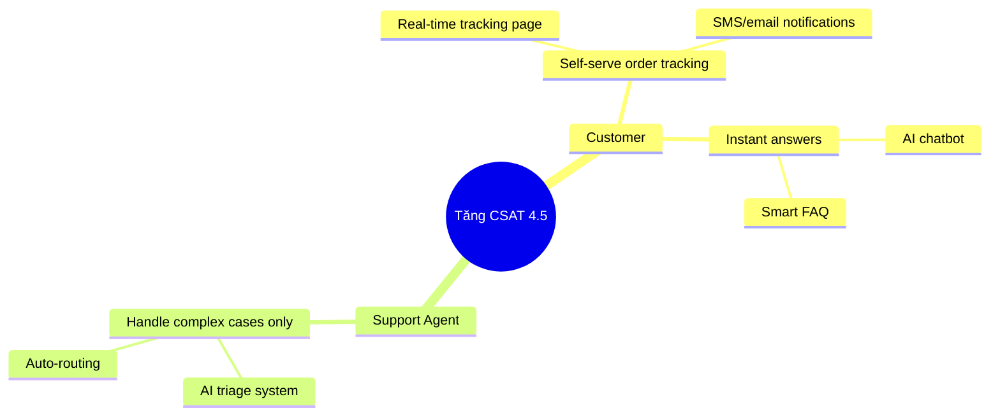

製品開発でよくある anti-pattern のひとつが **feature factory** です。team はその feature が business goal にどう影響するかを明確にしないまま、feature を作り続けます。Impact Mapping は、BA と team がこのループから抜け出すための technique です。

## Impact Mappingとは？

Impact Mapping は Gojko Adzic が考案した strategic planning technique で、**WHY -> WHO -> HOW -> WHAT** という構造の visual map を作ります。

```
                    [GOAL]
                       |
        ┌──────────────┼──────────────┐
        ↓              ↓              ↓
    [Actor 1]      [Actor 2]      [Actor 3]
        |              |              |
    ┌───┴───┐      ┌───┴───┐      ┌───┴───┐
    ↓       ↓      ↓       ↓      ↓       ↓
[Impact] [Impact] [Impact][Impact][Impact][Impact]
    |       |
┌───┴┐  ┌───┴┐
↓    ↓  ↓    ↓
[Del][Del][Del][Del]
```

| Level | 問い | 例 |
|-------|---------|-------|
| **Goal (WHY)** | なぜこれをやるのか？ | Q3 revenue を 20% 増やす |
| **Actors (WHO)** | 誰が goal に影響するのか？ | Customer、Sales team、Support |
| **Impacts (HOW)** | どのように behavior が変わる必要があるのか？ | Customer が self-serve するようになる |
| **Deliverables (WHAT)** | その impact を作るために何を build するのか？ | AI chatbot、Self-service portal |

## なぜBAにImpact Mappingが重要なのか？

### 従来の問題

- Stakeholder が feature を request -> BA が document 化 -> Dev が build -> feature は delivered されたが business goal は達成できない
- Team が「なぜこれを作るのか」を理解していない
- Prioritization が business value ではなく "squeaky wheel" で決まる

### Impact Mappingが解決すること

- **Traceability**: すべての deliverable を business goal まで trace できる
- **Scope management**: goal を壊さずに scope を cut しやすい
- **Alignment**: team 全員が WHY を理解できる
- **Out-of-scope decisions**: goal に map できない feature に "no" と言いやすい

## AIプロジェクトでImpact Mapを作る方法

### Step 1: Goal（WHY）を定義する

Goal は **business outcome** でなければならず、output ではありません。

❌ **良くない**: "AI chatbot を立ち上げる"
✅ **良い**: "6か月で support tickets を 40% 減らす"

❌ **良くない**: "recommendation engine を実装する"
✅ **良い**: "average order value を 15% 上げる"

**Goal の書き方**: [Metric] [Direction] [Value] [Timeframe]

### Step 2: Actors（WHO）を特定する

Goal に影響できる人・system をすべて洗い出します。

**Primary Actors**（goal を直接達成する人たち）:

- End users（customers、employees）
- Business stakeholders

**Secondary Actors**（primary actors を支える人たち）:

- Internal teams（support、sales、ops）
- External partners

**Off-stage Actors**（間接的に影響する人たち）:

- Regulators
- Competitors
- External systems/APIs

### Step 3: Impacts（HOW）を定義する

各 actor に対して、**「goal を達成するには何を違う形で行う必要があるか？」** と問います。

Impact は **behavior change** であり、feature ではありません。

❌ "chatbot を使う"（action であって behavior change ではない）
✅ "hotline に電話しなくても自分で問題解決できる"

❌ "recommendation email を受け取る"
✅ "これまで知らなかった商品を追加購入する"

**Impact の template**: "[Actor] will [verb] [behavior change]"

### Step 4: Deliverables（WHAT）をブレインストーミングする

各 impact に対して、**「その impact を起こすために何を build できるか？」** と考えます。

この段階は brainstorming です。まだ絞り込まず、多くの options を列挙します。

- AI features
- UX improvements
- Process changes
- Content/documentation
- Integrations

**検討すべき AI-specific deliverables:**

- Conversational AI（chatbot、voice assistant）
- Recommendation engine
- Predictive analytics dashboard
- Automated classification/routing
- AI-assisted search
- Personalization engine

### Step 5: Impact Mapを使ってPrioritizeする

Map ができたら次を確認します。

1. **Critical path を見つける**: どの deliverable が goal に最大の impact を与えるか？
2. **Confidence を見積もる**: その deliverable が impact を生むとどれだけ信じられるか？
3. **Effort を考える**: high impact / low effort か？
4. **Slice する**: もっと小さく deliver して hypothesis を検証できるか？

## 実例: AI Customer Support

**Scenario**: E-commerce が customer experience を改善したい

**Impact Map:**

```
GOAL: Tăng CSAT từ 3.2 → 4.5 trong Q3 2026

WHO: Customer
HOW: 
  - Nhận câu trả lời trong < 2 phút (không phải 24h)
  - Tự track order status mà không cần chat
  - Hiểu chính sách return rõ ràng ngay lần đầu
WHAT:
  - AI chatbot với instant response
  - Order tracking self-service
  - AI-powered FAQ with clear policy explanations

WHO: Support Agent
HOW:
  - Dành thời gian cho complex cases thay vì repetitive Q&A
  - Có context đầy đủ khi escalation xảy ra
WHAT:
  - AI triage & routing system
  - AI-generated conversation summary cho escalations
  - Suggested response templates

WHO: Product Manager  
HOW:
  - Biết pain points thực sự của customer
  - Prioritize roadmap dựa trên impact
WHAT:
  - AI analytics dashboard từ chat data
  - Automated pattern detection từ negative feedback
```

## Agile SprintsにおけるImpact Mapping

Impact Mapping は project の最初に **一度だけ** 行うことが多いですが、BA は次を行うべきです。

1. **四半期ごとに review する** - business goal は変わっていないか？
2. **各 release 後に update する** - 期待した impacts を deliver できたか？
3. **Backlog filter として使う** - 新しい story は map 上の impact に結び付くべき
4. **Sprint review で提示する** - "この sprint でどの impact を達成したか" を stakeholder に示す

## Impact Mapping vs User Story Mapping

| | Impact Mapping | User Story Mapping |
|--|---|---|
| **Focus** | Business outcomes | User journey/workflow |
| **Level** | Strategic | Tactical |
| **When** | Early planning、quarterly review | Sprint planning |
| **Output** | Prioritized impacts & deliverables | Prioritized story backlog |
| **Used by** | BA + Product + Business | BA + Dev + QA |

**Best practice**: Impact Mapping で scope と priority を定義し、User Story Mapping で delivery を計画します。

## Impact Mapを作るツール

| Tool | 使い方 |
|------|-----------|
| **Miro** | Template 付きの digital whiteboard |
| **Mermaid diagram** | Code-based で Git 管理しやすい |
| **FigJam** | Figma team 向け collaborative tool |
| **Draw.io / Lucidchart** | Formal diagrams |
| **Sticky notes** | Stakeholders との workshop |

**Mermaid template:**


## Impact Mappingでよくある失敗

1. **Goal が曖昧すぎる**: "Improve customer experience" -> 測定できない
2. **Secondary actors を無視する**: internal teams の behavior change を忘れる
3. **WHAT に直行する**: HOW を飛ばすと deliverables に narrative がなくなる
4. **Launch 後に review しない**: 一度作って放置すると価値がなくなる
5. **WHAT を詳細にしすぎる**: Impact Map は strategic view、詳細は user stories に持たせる

## まとめ

Impact Mapping は AI 時代の BA に特に有効です。AI features は **ROI が不明確** になりやすく、business need ではなく "trend" で build されがちだからです。すべての AI feature を measurable impact を持つ具体的な business goal に結び付ければ、次が可能になります。

- Executives に AI investment を justify できる
- Business case のない features を cut できる
- Data science team と product team の priorities を align できる
- 意味のある形で success を測定できる

まずは 1 つの goal と 2〜3 人の actors から始めてください。最初から perfect map を作ろうとしないことです。