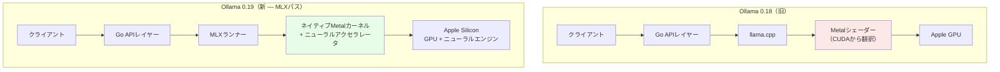
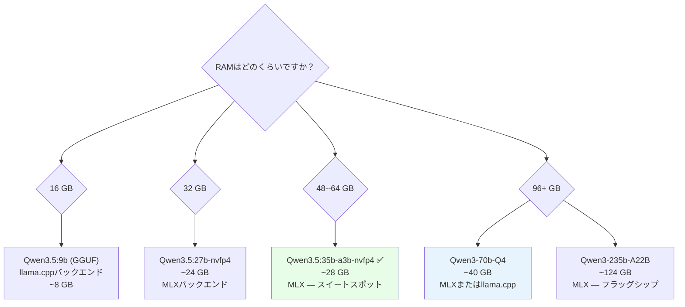
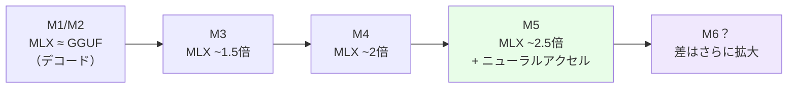

2026年3月30日、Ollamaはプレビュー版 **v0.19** をリリースしました。過去2年間のどんな機能よりも大きなインパクトを持つ、静かな変更とともに：**Apple Silicon向けMLXバックエンド**の追加です。

実際の結果は？**デコード速度93%向上**。**プリフィル速度57%向上**。M4 Pro上でQwen3.5-35B-A3BのようなMoEモデルを比較すると、MLX対旧Ollamaは**130 tok/s 対 43 tok/s** ——**3倍以上**の差です。

本記事では、なぜこのことが起きるのか、技術レベルでどのように機能するのか、そして今日すぐ設定して実行する方法を分析します。

* * *

## 1. MLXとは何か、なぜ重要なのか？

**MLX**はAppleの研究チームが開発したオープンソースの機械学習フレームワークです。核心的な差別化要因はAPIや機能ではなく、**根本からの設計哲学**にあります：MLXはApple Siliconのユニファイドメモリアーキテクチャを_中心に_構築されています。

他のフレームワーク（PyTorch、TensorFlow）はmacOSに移植されたもの——CPU RAMとGPU VRAMが分離した世界向けに設計され、後からMetalバックエンドが追加されました。MLXにはそのような過去の制約がありません。

### 主な技術的特徴

-   **最初からユニファイドメモリ**：配列はCPUとGPU間の共有メモリに存在——コピーなし、転送オーバーヘッドなし
-   **遅延計算**：結果が要求されたときにのみ実際に計算が実行され、グローバルなグラフ最適化が可能
-   **動的グラフ**：入力のshapeを変更しても遅い再コンパイルが発生しない
-   **操作ごとのマルチデバイス**：各操作でCPUまたはGPUを個別に指定可能
-   **馴染みのあるAPI**：PythonのAPIはNumPyに準拠、`mlx.nn`はPyTorchに準拠

**2026年初頭時点**：GitHubスター数24.9k、HuggingFaceで4,316の事前変換済みモデル（mlx-communityorg）、72リリースを経たバージョンv0.31.1。WWDC 2025では、AppleがMLXに3つの専用セッションを充てました——Apple Silicon上でのLLM推論における優先フレームワークとしての地位を確立しています。

* * *

## 2. Ollama 0.19：MLXバックエンドはどのように機能するか

### 2.1. モデルフォーマットに基づく自動ルーティング

v0.19以降、Ollamaはモデルフォーマットに基づいてバックエンドを自動的に選択します——**追加設定は不要**：

    GGUFファイル        →  llama.cpp（Metalバックエンド）   ← 従来通り
    safetensorsファイル →  MLXバックエンド                  ← 新規

`--backend mlx`フラグは不要です。設定変更も不要です。MLXネイティブモデル（safetensors）をプルすると、Ollama 0.19が自動的にMLXを使用します。

### 2.2. 内部で何が変わったか

v0.19以前、Mac上のOllamaは基本的にMetalバックエンドを持つ**llama.cppを呼び出すGoラッパー**でした。このGoラッパー層は大幅なパフォーマンスを消費していました——実際のベンチマークでは：

-   Raw llama.cpp（Ollamaラッパーなし）：**89.4 tok/s**
-   Ollamaとllama.cppバックエンド：**43.5 tok/s**（rawと比較して約51%の損失！）
-   MLX直接（mlx-lm）：**~130 tok/s**
-   **Ollama 0.19とMLX**：**112 tok/s**（Goレイヤーによるオーバーヘッドはまだあるが、mlx-lmにはるかに近い）

アーキテクチャの変化を示す図：



### 2.3. v0.19プレビューでサポートされるアーキテクチャ

Ollama 0.19 MLXランナーは**6つのアーキテクチャ**をサポートします：

-   Gemma 3
-   GLM-4 MoE Lite
-   Llamaシリーズ（全モデル）
-   Qwen 3
-   Qwen 3.5
-   Qwen 3.5 MoE

比較として：llama.cppは数百のアーキテクチャをサポートします。これはプレビューのトレードオフであり、より広いサポートは今後のリリースで提供される予定です。

* * *

## 3. 実際のベンチマーク：具体的な数値

### 3.1. Ollamaからの公式データ（M5、Qwen3.5-35B-A3B）

| メトリック          | Ollama 0.18 (llama.cpp) | Ollama 0.19 (MLX) | 改善 |
| --------------- | ----------------------- | ----------------- | --------- |
| プリフィル (tok/s) | 1,154                   | 1,810             | **+57%**  |
| デコード (tok/s)  | 58                      | 112               | **+93%**  |
| デコード (int4) | ---                     | 134               | **+131%** |

### 3.2. コミュニティベンチマーク（各種チップ）

**M4 Pro MacBook Pro（48GB RAM）**：

| モデル                  | プロンプト評価 (tok/s) | デコード (tok/s) |
| ---------------------- | ------------------- | -------------- |
| qwen3.5:35b-a3b-q4_K_M | 6.6                 | 30.0           |
| qwen3.5:35b-a3b-nvfp4  | 13.2                | 66.5           |
| qwen3.5:35b-a3b-int4   | **59.4**            | **84.4**       |

**Mac mini M4 Pro（64GB）— MLX対旧Ollamaの直接比較、Qwen3-Coder-30B-A3B-Instruct 4ビット**：

| バックエンド            | デコード tok/s | GPU周波数       | RAM使用量    |
| ------------------ | ------------ | -------------- | ----------- |
| MLX-LM             | **~130**     | 346 MHz        | **34.7 GB** |
| Ollama (llama.cpp) | ~43          | 1577 MHz (99%) | 40 GB       |

→ MLXは**3倍速く**、**13%少ないRAM**で、**4.5倍低い周波数**でGPUを動作——発熱少なく、ファン音少なく、省電力。

**M4 Max（128GB）— 同じモデル**：

-   MLX：130 tok/s
-   Ollama llama.cpp：43.5 tok/s
-   Raw llama.cpp（Ollamaなし）：89.4 tok/s

**M1 Max**（注意——MLXは古いチップでプリフィルに弱点あり）：

-   MLX：~13 tok/s実効（時間の94%をプリフィルに費やす）
-   GGUF：~20 tok/s
-   → M1では、プリフィルの多いワークロードにはGGUFが依然として優れている

**M4 Max — Llama 3.2 3B（小型モデル）**：

-   MLX：**1,100 tok/s**以上 — M4 Maxは小型モデルでメモリ帯域幅の飽和点に達する

**M5 — M4との比較でのTTFT改善**：

-   最初のトークンまでの時間：**4.06倍速く**
-   トークン生成：**1.19倍速く**

### 3.3. MLXが優れていない場合

MLXが常に勝つわけではありません：

    ✅ MLXが優れている：長いデコード（コーディングエージェント、テキスト生成）
    ✅ MLXが優れている：MoEモデル（Qwen 3.x A3B）— 最大3倍
    ✅ MLXが優れている：M4/M5チップ
    ✅ MLXが優れている：メモリ節約

    ❌ GGUFが優れている：短い会話（プリフィルの優位性）
    ❌ GGUFが優れている：コンテキスト30K+トークン（llama.cppのFlash Attention）
    ❌ GGUFが優れている：M1（MLXのプリフィルが遅い）
    ❌ GGUFが優れている：サポートされる6つのアーキテクチャ外のモデル

* * *

## 4. なぜユニファイドメモリアーキテクチャが差を生むのか

これはほとんどの記事が省略する部分——**アーキテクチャ的になぜ** MLXがApple Siliconで速いのかです。

### 4.1. ディスクリートGPUシステムの問題

    ┌─────────────────────────────────────────┐
    │            従来のシステム                │
    │                                         │
    │  ┌──────────┐         ┌──────────────┐  │
    │  │   RAM    │ PCIe 4x │  GPU VRAM    │  │
    │  │  64 GB   │◄───────►│  24 GB       │  │
    │  │ ~50 GB/s │         │  ~900 GB/s   │  │
    │  └──────────┘         └──────────────┘  │
    │                                         │
    │  RTX 4090：24GB VRAMの上限               │
    │  70B Q4モデル = ~35GB → 収まらない       │
    └─────────────────────────────────────────┘

RTX 4090のVRAMは24GBです。70Bモデル（Q4量子化で約35GB）は収まりません。レイヤーをRAMにオフロードする必要があり——制限されたPCIe帯域幅（~64 GB/s）を通じて——パフォーマンスが大幅に低下します。

### 4.2. Apple Siliconのユニファイドメモリ

    ┌─────────────────────────────────────────┐
    │         Apple Silicon (M3/M4/M5)        │
    │                                         │
    │  ┌──────────────────────────────────┐   │
    │  │       ユニファイドメモリプール     │   │
    │  │           (32--192 GB)            │   │
    │  │     ~400 GB/s (M4 Max)           │   │
    │  │                                  │   │
    │  │  CPU  ◄──────────────►  GPU      │   │
    │  │  ANE  ◄──────────────►  NPU      │   │
    │  │                                  │   │
    │  │  ゼロコピー、同一アドレス空間      │   │
    │  └──────────────────────────────────┘   │
    │                                         │
    │  M2 Ultra：192GB → 70B Q4が余裕で収まる │
    └─────────────────────────────────────────┘

**PCIeのボトルネックなし**。VRAMの上限なし。テンソル演算はCPUとGPU間で完全にゼロコピーです。MLXは設計段階からこれを活用しています。

### 4.3. 実際のメモリ節約

| モデル               | MLX     | GGUF   | 節約 |
| ------------------- | ------- | ------ | --------- |
| Qwen3-Coder-30B-A3B | 34.7 GB | 40 GB  | **13%**   |
| Qwen3-235B-A22B     | 124 GB  | 133 GB | **7%**    |

### 4.4. M5ニューラルアクセラレータ——ハードウェアの飛躍

AppleはM5の**各GPUコア内に専用のニューラルアクセラレータ**を追加しました——単に速いチップではなく、MLXのコンピュートグラフ専用に設計されたハードウェア回路です。

llama.cpp MetalバックエンドはCUDAパターンから変換されているため、この新しいハードウェアを自動的に活用できません。MLXはできます。なぜならOllamaがネイティブMLXカーネルに直接ルーティングするようになったからです。

* * *

## 5. NVFP4 — 新しい量子化フォーマット

Ollama 0.19は**NVFP4**——NVIDIAの4ビット浮動小数点フォーマット——も導入しています。Mac/MLX上では、FP4計算として動作します（Blackwell GPUは不要）：

-   FP16と比較して**3.5倍のモデルフットプリント削減**
-   FP8より**1.8倍小さい**
-   言語タスクでの精度損失は1%未満
-   NVIDIA GPU推論と**同じ重み**→ デプロイ時の本番パリティ

実際：M4 Pro 48GB上の`qwen3.5:35b-a3b-nvfp4`は**66.5 tok/sデコード**を実現——GGUF Q4（30 tok/s）の2倍です。

* * *

## 6. 実践的なセットアップ — 今すぐ始める

### 6.1. 要件

-   Apple Silicon搭載Mac（M1以降）
-   **32GB以上のユニファイドメモリ**（紹介モデルQwen3.5-35B-A3Bのプレビュー要件）
-   最新のmacOS

### 6.2. Ollama 0.19のインストール

```bash
# https://ollama.com/downloadからダウンロード
# またはすでにインストール済みの場合は更新：
ollama update
```

### 6.3. MLXネイティブモデルのプル

```bash
# コーディングモデル（デフォルトでシンキング有効）
ollama pull qwen3.5:35b-a3b-coding-nvfp4

# チャットモデル（presence penalty有効、過剰な思考が少ない）
ollama pull qwen3.5:35b-a3b-nvfp4
# （重みは再ダウンロードされない——設定のみプル）

# int4フォーマット——デコードが最速
ollama pull qwen3.5:35b-a3b-int4
```

### 6.4. 初回実行

```bash
# 直接チャット
ollama run qwen3.5:35b-a3b-nvfp4

# シンキングモードを無効化（簡単な質問向け）
/set nothink

# API使用（OpenAI互換）
curl http://localhost:11434/v1/chat/completions \
  -H "Content-Type: application/json" \
  -d '{
    "model": "qwen3.5:35b-a3b-nvfp4",
    "messages": [{"role": "user", "content": "Hello"}]
  }'
```

### 6.5. Claude Code / AIコーディングツールとの使用

```bash
# Claude Codeとの統合
ollama launch claude --model qwen3.5:35b-a3b-coding-nvfp4

# 使用中のバックエンドを確認
ollama ps
# 出力に "mlx" または "llama.cpp" が表示される
```

### 6.6. 実際のパフォーマンス確認

CLIで`--verbose`を使用してtok/sを確認：

```bash
ollama run qwen3.5:35b-a3b-nvfp4 --verbose "基本的なREST APIを書いて"
```

以下の行を探してください：

    eval rate:         XX.XX tokens/s   ← デコード速度
    prompt eval rate:  XX.XX tokens/s   ← プリフィル速度

* * *

## 7. RAMに合ったモデルの選び方



**実践的な推奨事項**：

| RAM       | 推奨モデル     | バックエンド | 推定デコード |
| --------- | --------------------- | ------- | ----------- |
| 16 GB     | qwen3.5:9b            | GGUF    | ~40 tok/s   |
| 32 GB     | qwen3.5:27b-nvfp4     | MLX     | ~55 tok/s   |
| 48--64 GB | qwen3.5:35b-a3b-nvfp4 | MLX     | ~66 tok/s   |
| 96+ GB    | qwen3:70b-q4          | MLX     | ~30 tok/s   |
| 128+ GB   | qwen3.5:35b-a3b-int4  | MLX     | ~130 tok/s  |

**注意**：16GBではGGUFを使用します。小型モデルはプリフィルが多い場合にllama.cppの方が適しており、RAMが限られるとMLXのモデル選択も制約されます。

* * *

## 8. Ollama 0.19でのKVキャッシュ改善

MLX以外にも、Ollama 0.19は**KVキャッシュ**システムも大幅に強化しています：

-   **会話間キャッシュの再利用**：複数の会話が同じシステムプロンプト（例：ツール定義）を使用する場合、キャッシュが再利用される——少ないメモリ、速いプリフィル
-   **インテリジェントチェックポイント**：再利用のためにプロンプトの重要な部分を自動的にマーク
-   **スマートな退避**：古いブランチが削除されても、共有プレフィックスはより長く存続

実際に複数の会話を並列管理するコーディングエージェントでは：コンテキストが類似している場合の2回目以降の**TTFTが大幅に削減**されます。

* * *

## 9. より広いMLXエコシステム

Ollamaが統合する前から、8つの競合MLX推論サーバーがすでに存在していました。以下がその全体像です：

| ツール                        | 強み                      | Ollama 0.18比の速度                 |
| --------------------------- | ------------------------------ | ------------------------------------- |
| **mlx-lm**（Apple公式） | 最も安定、LoRAファインチューニング | ~3倍                                   |
| **Rapid-MLX**               | Ollamaのドロップイン代替     | M3 Ultraで2--4.2倍                   |
| **vLLM-MLX**                | 継続的バッチ処理            | スループット3.4倍（5並列）        |
| **oMLX**                    | SSD KVキャッシュ永続化       | TTFT 30--90秒→1--3秒（50Kコンテキスト） |
| **LM Studio**               | GUI + MLX/GGUF自動切り替え  | 同等                            |

Ollamaは使いやすさとモデルライブラリの幅広さをMLXエコシステムにもたらしました——双方にとってメリットのある組み合わせです。

* * *

## 10. 将来を見据えて

最も注目すべきは今日のベンチマーク数値ではなく——**軌跡**です：

Apple Siliconの新世代（M3 → M4 → M5）ごとに、MLX専用のハードウェアが追加されています。M5の各GPUコア内のニューラルアクセラレータはその最も明確な例：TTFTはたった1世代で4倍高速化しました。

llama.cpp MetalバックエンドはCUDAパターンから変換されており、この新しいハードウェアを自動的には活用できません。MLXはできます。OllamaがネイティブMLXカーネルに直接ルーティングするようになったからです。

**予測される結果**：パフォーマンスの差は新チップ世代ごとに_拡大_します。今日ローカルでAIを実行するMacユーザーは、正しいアーキテクチャに投資しています。



* * *

## まとめ

Ollama 0.19 + MLXは通常のアップデートではありません。これは「CUDAパターンをMetalに変換する」から「ネイティブApple Silicon推論」へのアーキテクチャ的な転換であり、その結果は**公式ベンチマークで57〜93%の高速化**、**実際のMoEモデルで3倍の高速化**、そしてリソース消費の削減です。

**今すぐ始めましょう**：

1.  Ollamaを0.19に更新
2.  `ollama pull qwen3.5:35b-a3b-nvfp4`（48GB以上のRAMがある場合）
3.  `--verbose`で実行して実機のtok/sを確認
4.  旧GGUFモデルと比較——その差が全てを語るでしょう

* * *

_参考資料：Ollama 0.19リリースノート（2026年3月30日）、Apple MLX GitHub（ml-explore/mlx v0.31.1）、Ars Technica "Running local models on Macs gets faster with Ollama's MLX support"（2026年3月）、HackerNewsディスカッション、r/LocalLLM & r/LocalLLaMAコミュニティベンチマーク。_
