## 1. 背景: 閉じられた npm パッケージのソース コードを読み取る方法は?

クロード・コード (`@anthropic-ai/claude-code`) は、Anthropic の有名な AI コーディング エージェント ツールであり、**npm パッケージ** として配布されています。特別な点: Anthropic **オリジナルの TypeScript ソース コードは開きません** --- Bun でビルドされたバンドルのみを出荷します。

＃＃＃１．１． npm バンドルが読み取り可能なのはなぜですか?

**ツリーシェイク ESM** スタイルの Bun バンドルの Claude コード --- 最大のマングリングを備えた Terser のような重い難読化ツールは使用しません。結果: 関数名、変数名、モジュール構造はほぼそのまま残ります。 TypeScript ソース内のコメントは、ビルド プロセス後もそのまま残ります。

    npm install @anthropic-ai/claude-code
    # → 解凍時: 43MB、ファイル数 19 のみ、メインバンドル ~40MB

抽出パイプラインの概要:

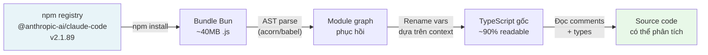

結果: 数百のファイル `.ts` / `.tsx` 明確なディレクトリ構造、完全な技術コメント、および完全なタイプの注釈が含まれています。クローズドソースの npm パッケージでこれほど多くのことが明らかになることは非常にまれです。

> **技術的なメモ:** これはハッキングではありません。 npm に公開すると、コードは公開アーティファクトになります。 npm パッケージのリバース エンジニアリングは、結果を使用する際に ToS または著作権に違反しない限り合法です。

＃＃＃１．２．復元されたフォルダー構造

    クロードコードコード/
    §── main.tsx ← メインエントリポイント
    §── QueryEngine.ts ← コア会話ループ
    §── buddy/ ← 🐾 バーチャルペットシステム (NEW!)
    │ §── コンパニオン.ts ← ロールロジック(PRNG+レアリティ)
    │ §── CompanionSprite.tsx ← ASCII レンダラー (Ink/React)
    │ §── sprites.ts ← 18種×3フレーム
    │ §── types.ts ← 種族・レアリティ・ステータスタイプ
    │ §──prompt.ts ← LLM コンパニオンの紹介
    │ └── useBuddyNotification.tsx ← ティザーウィンドウ
    §── Bridge/ ← リモートセッションシステム
    │ §── BridgeMain.ts ← ブリッジループ（再接続・バックオフ）
    │ §── sessionRunner.ts ← 子プロセススポナー
    │ §── workSecret.ts ← JWT + WebSocket URL
    │ └─ types.ts ← プロトコルの種類
    §── コマンド/
    │ §── Ultraplan.tsx ← 🚀 マルチエージェントプランニング
    │ §── ステッカー/ ← イースターエッグ: StickerMule
    │ └── [35以上のコマンド]
    §── コーディネーター/
    │ └─ coordinatorMode.ts ← マルチエージェントコーディネーター
    └── タスク/
        §── LocalAgentTask/ ← サブエージェント（ローカル）
        §── RemoteAgentTask/ ← サブエージェント（クラウドCCR）
        §── DreamTask/ ← バックグラウンド非同期タスク
        └── InProcessTeammateTask/ ← インプロセスエージェント

* * *

## 2. クロードコードの全体的なアーキテクチャ

＃＃＃２．１．技術スタック

特定の機能に入る前に、Claude Code が何に基づいて構築されているかを明確に理解する必要があります。

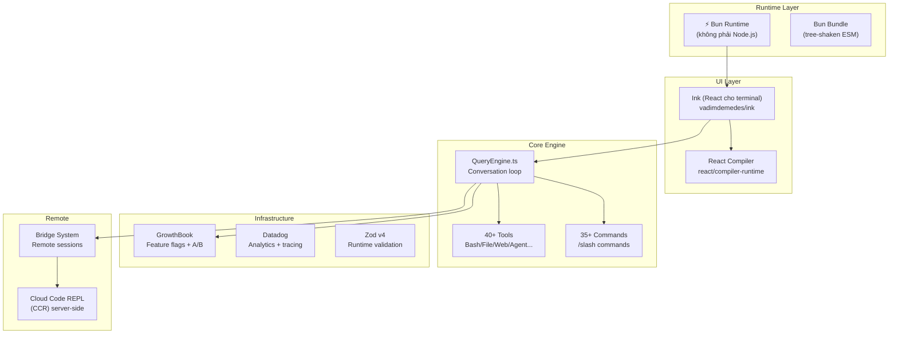

＃＃＃２．２．起動の最適化 --- ミリ秒単位まで

ファイルの先頭を見てください `main.tsx`:

```typescript
// Side-effects chạy NGAY khi file được import:
// 1. profileCheckpoint --- bắt đầu đo thời gian
// 2. startMdmRawRead --- fire MDM subprocesses (plutil/reg query) song song
//    với 135ms còn lại của import chain
// 3. startKeychainPrefetch --- fire cả 2 macOS keychain reads song song
//    (~65ms tiết kiệm trên mỗi lần khởi động macOS)

profileCheckpoint('main_tsx_entry');
startMdmRawRead();        // parallel: đọc MDM config
startKeychainPrefetch();  // parallel: đọc keychain OAuth tokens
```

これは I/O の「投機的実行」です。ファイルのロードが開始されるとすぐに、3 つの副作用が並行して発生します。JS が残りの 135 ミリ秒のインポート チェーンを解析している間、すべての副作用が実行されます。インポートが完了すると、結果が完成します。

```mermaid
gantt
    title Startup Timeline Claude Code (macOS, ước tính)
    dateFormat X
    axisFormat %Lms

    section Sequential (cũ)
    Parse imports          : 0, 135
    Keychain read #1       : 135, 200
    Keychain read #2       : 200, 265
    MDM read               : 265, 310
    App ready              : 310, 315

    section Parallel (thực tế)
    Parse imports          : 0, 135
    Keychain #1 + #2 + MDM : crit, 0, 65
    App ready              : 135, 140
```

結果: ブートごとに **~175ms 節約**。開発者の入力による `claude` 毎日何十回も --- これが本当の UX の勝利です。

* * *

## 3. 隠し機能 #1: 「バディ」システム --- ターミナル内の仮想ペット

これは最も衝撃的な発見です。フォルダの奥深くに隠されている `buddy/` は完全な **バーチャル ペット コンパニオン** システムであり、端末に直接組み込まれています。

＃＃＃３．１．バディはどんな感じですか？


コンパニオンは入力ボックスの隣に座っており、時々吹き出しが表示されます。 UI 全体は、Ink (React ターミナル) 経由で **ASCII アート** を使用してレンダリングされます。

    ╭───────────────────╮
    │ これをコーディングするのは実は楽しい :3 │
    ╰───────────────────╯
                  │
        __
      <(· )___    ← companion (duck, frame 0)
       (  ._>
        `--´
    ───────────────────────────────────
      > |                              ← input cursor

Ba frame idle animation (tick mỗi 500ms):

    Frame 0 (rest):    Frame 1 (fidget):   Frame 2 (move):
        __                 __                  __
      <(· )___           <(· )___            <(· )___
       (  ._>             (  ._>              (  .__>
        `――´               `--´~              `――´

＃＃＃３．２．独自のスプライトを持つ 18 種

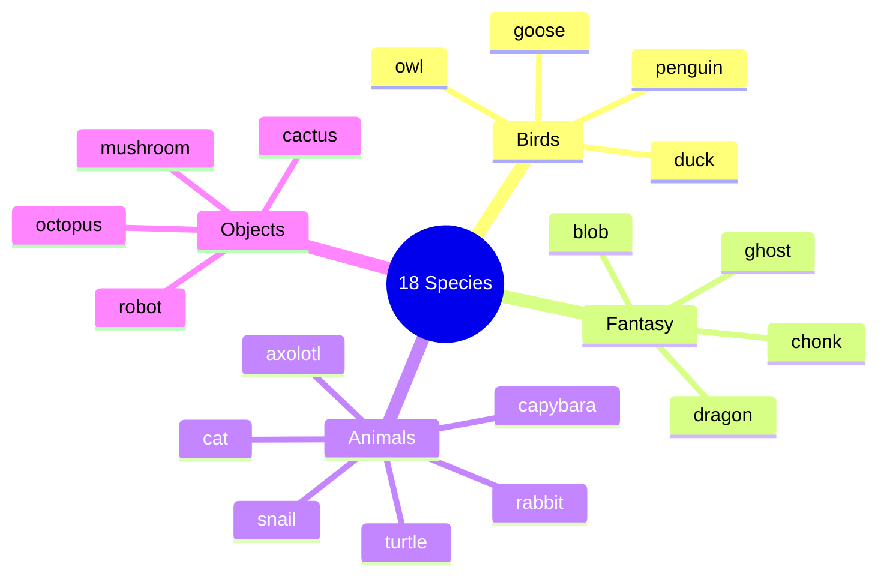

各種族には5行×12文字×3フレームのスプライトセットがあります。ガチョウの例:

    フレーム 0: フレーム 1: フレーム 2:
         ({E}> ({E}> ({E}>>
         ||               ||               ||
       _(__)_ _(__)_ _(__)_
        ^^^^ ^^^^ ^^^^

_(`{E}` は目のプレースホルダーです --- レンダリング時に目のタイプの文字に置き換えられます)_

＃＃＃３．３．パイプライン誕生の伴侶 --- 詳細分析

これは最も重要な技術的な部分です。各ユーザーには **永続的なコンパニオンがあり、userId によって完全に識別されます**。

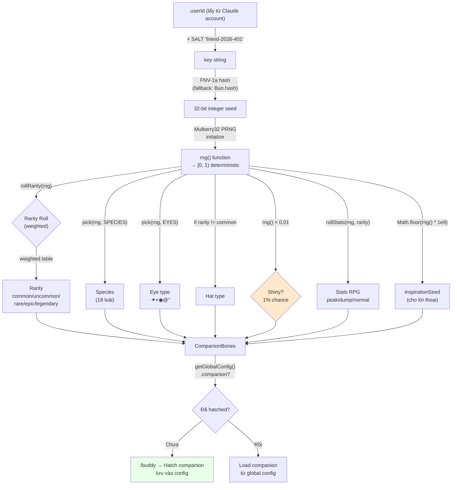

＃＃＃３．４． Mulberry32 PRNG --- なぜそれを選んだのですか?

```typescript
function mulberry32(seed: number): () => number {
  let a = seed >>> 0
  return function () {
    a |= 0
    a = (a + 0x6d2b79f5) | 0          // additive step
    let t = Math.imul(a ^ (a >>> 15), 1 | a)
    t = (t + Math.imul(t ^ (t >>> 7), 61 | t)) ^ t
    return ((t ^ (t >>> 14)) >>> 0) / 4294967296
  }
}
```

代わりに Mulberry32 を使用する理由 `Math.random()`?

|               | `Math.random()` |マルベリー32 |
| ------------- | --------------- | ------------------------ |
|シード | ❌ 不可能 | ✅ はい |
|決定論的 | ❌ | ✅ 同じシード → 同じ結果 |
|サイズ |内蔵 |コードは約 10 行 |
|スピード |速い |同等の高速 |
|使用例 |一般的なランダム | **シードロール** |

と `Math.random()`, クロード・コードを再起動するたびに、異なるコンパニオンが獲得されます。 Mulberry32 + userId シードを使用すると、コンパニオンはアバターのように**永遠にあなたのもの**になります。

＃＃＃３．５。レアリティシステム --- 確率デコード


ソース コードでは RARITY_WEIGHTS を直接宣言していませんが、下限値と rollRarity ロジックから分布を推測できます。

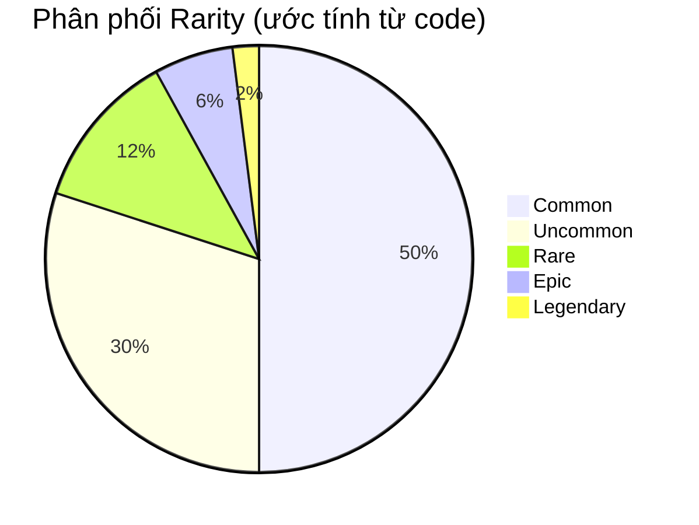

**比率別の統計フロア:**

    共通 ░░░░░░░░░░ フロア: 5 (ステータス範囲: 5-75)
    アンコモン ░░░░░░░░░░░░░░░ フロア: 15 (ステータス範囲: 15-85)
    レア ░░░░░░░░░░░░░░░░░░░░ フロア: 25 (ステータス範囲: 25-95)
    エピック ░░░░░░░░░░░░░░░░░░░░░░░░░ フロア: 35 (ステータス範囲: 35-100)
    レジェンド ░░░░░░░░░░░░░░░░░░░░░░░░░░░░░░ フロア: 50 (ステータス範囲: 50-100)

伝説のピークステータスに到達可能 `min(100, 50 + 50 + rand*30) = 100` --- **キャップアウト**!

＃＃＃３．６．吹き出しとインタラクティブシステム

    吹き出しのレンダリング方法 (CompanionSprite.tsx):

      ╭─────────────────╮
      │ コンテンツを 30 文字/行で折り返す。 │
      │ 斜体のテキスト、フェード時の dimColor │
      ╰───────────────╯
                   ↑ 尻尾: 「上」または「下」

    バブルのライフサイクル:
      ┌─────────┐ ┌─────────┐ ┌─────────┐
      │ addNotif │───▶│ BUBBLE_SHOW = 20 │───▶│ FADE_WINDOW │
      │ (トリガー) │ │ ティック (~10 秒) │ │ = 6 ティック │
      ━━━━━━━━━━━━━━━━━━┘ ━━━━━━━━┘ ━━━━━━┬────────┘
                                                           │ dimColor=true
                                                           ▼
                                                     ┌─────────┐
                                                     │ 隠れた泡 │
                                                     ━─────────┘

ユーザーがチャットでコンパニオンを**名前**で呼ぶと、LLM がシステム プロンプトとともに挿入されます。

```typescript
`When the user addresses ${name} directly (by name), 
its bubble will answer. Your job in that moment is to 
stay out of the way: respond in ONE line or less.
Don't explain that you're not ${name} --- they know.`
```

賢いデザイン: クロード (メイン LLM) **コンパニオンのふりをしません** -- ユーザーがコンパニオンと話すときにのみ「沈黙」します。コンパニオンは、別のプロンプト コンテキストによって駆動される独自の吹き出しを介して応答します。

＃＃＃３．７． `/buddy pet` --- 浮かぶハートのアニメーション 5 フレーム

```typescript
const PET_HEARTS = [
  `   ♥    ♥   `,   // frame 0: 2 tim xa nhau
  `  ♥  ♥   ♥  `,   // frame 1: tim dày hơn
  ` ♥   ♥  ♥   `,   // frame 2: tim trải rộng
  `♥  ♥      ♥ `,   // frame 3: tim bay ra hai bên
  '·    ·   ·  ',   // frame 4: fade thành dấu chấm
];
// PET_BURST_MS = 2500ms tổng → ~500ms/frame
```

視覚化:

    t=0ms: t=500ms: t=1000ms: t=1500ms: t=2000ms:
      ♥ ♥ ♥ ♥ ♥ ♥ ♥ ♥ ♥ ♥ ♥ · · ·
      以下のコンパニオンスプライト

＃＃＃３．８。ティーザー ウィンドウとロールアウト ロジック

```typescript
// Local date, not UTC --- 24h rolling wave across timezones.
// Teaser window: April 1-7, 2026 only. Command stays live forever after.
export function isBuddyTeaserWindow(): boolean {
  if ("external" === 'ant') return true;  // Anthropic internal: luôn true
  const d = new Date();
  return d.getFullYear() === 2026 && d.getMonth() === 3 && d.getDate() <= 7;
}
```

ロールアウトに関する非常に興味深い設計上の決定は次のとおりです。

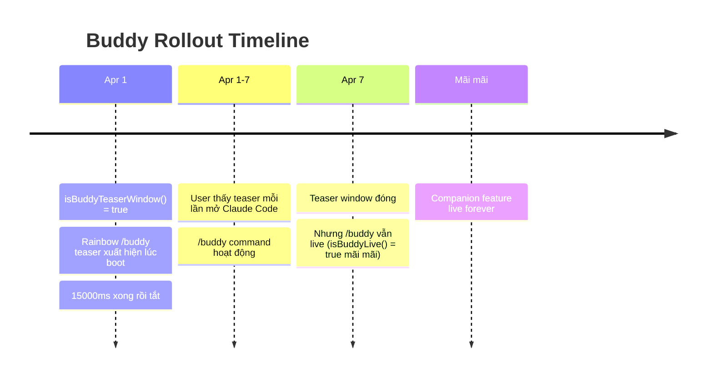

UTC ではなく **現地時間** を使用する理由: UTC を使用すると、すべてのユーザーがグローバルに同じ UTC 時間でティーザーを受信するため、サーバーの負荷が急増します。現地時間を使用 → 24 時間継続して均等にロードします。

* * *

## 4. 隠れた機能 #2: UltraPlan --- マルチエージェント計画エンジン

＃＃＃４．１．ウルトラプランとは何ですか?


`/ultraplan` クロード コードの最強のスラッシュ コマンドですが、最も隠されています。 Claude Code 自体が計画を立てるのではなく、**タスクをクラウドにテレポート**し、**複数のエージェントが最大 30 分間並行して実行**され、包括的な計画を作成します。

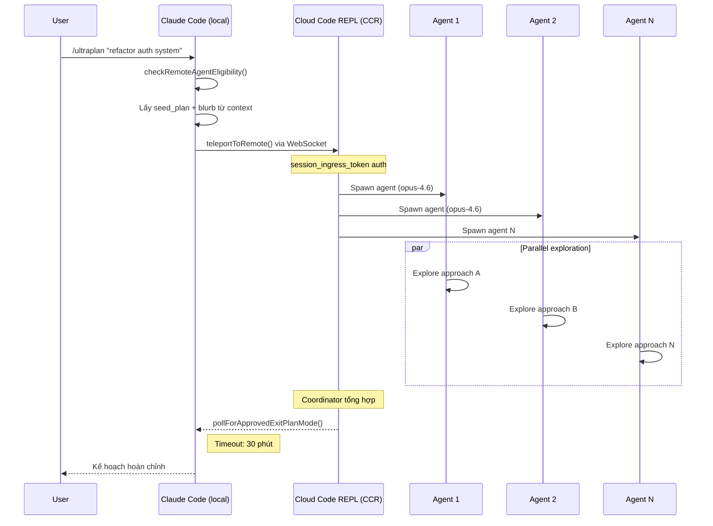

＃＃＃４．２． CCR セッションのアーキテクチャ

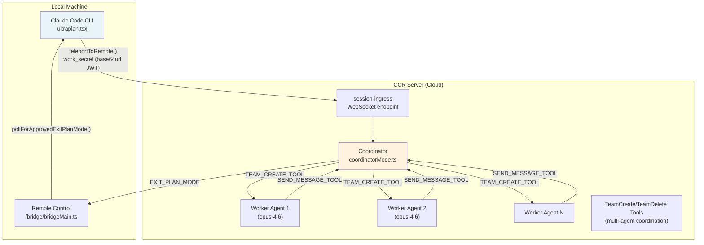

＃＃＃４．３． WorkSecret --- セッション認証メカニズム

```typescript
type WorkSecret = {
  version: number
  session_ingress_token: string  // JWT cho WebSocket auth
  api_base_url: string           // CCR server URL
  sources: Array<{
    type: string
    git_info?: { type: string; repo: string; ref?: string; token?: string }
  }>
  auth: Array<{ type: string; token: string }>
  claude_code_args?: Record<string, string> | null
  mcp_config?: unknown | null
  environment_variables?: Record<string, string> | null
  use_code_sessions?: boolean   // CCR v2 selector
}
```

WorkSecret は **base64url エンコード**されており、パススルーされます `--work-secret` 子プロセスを生成するときのフラグ。フロー:

    1. /ultraplan トリガー
    2. CLI はブリッジ API から work_secret を取得します
    3.base64urlをデコード→JSON→バージョンを検証 === 1
    4. buildSdkUrl(api_base_url, sessionId)
       → wss://host/v1/session_ingress/ws/{id} (運用環境)
       → ws://host/v2/session_ingress/ws/{id} (ローカルホスト)
    5. WebSocketをsession_ingress_tokenで接続する

＃＃＃４．４．アンチセルフトリガーテクニック

```typescript
// Phrasing deliberately avoids the feature name because
// the remote CCR CLI runs keyword detection on raw input before
// any tag stripping, and a bare "ultraplan" in the prompt would
// self-trigger as /ultraplan, which is filtered out of headless mode
// as "Unknown skill"

// prompt.txt là <system-reminder> để CCR browser ẩn scaffolding
// nhưng model vẫn thấy full text
const _rawPrompt = require('../utils/ultraplan/prompt.txt');
```

問題: CCR は別のクロード コード CLI (ヘッドレス) を実行します。プロンプトに「ultraplan」という単語が含まれている場合、CLI がトリガーされます。 `/ultraplan` 自分自身→無限ループ。解決策: プロンプトをラップ `<system-reminder>` タグとフレーズはキーワードを避けてください。

    ユーザー → /ultraplan "認証をビルド"
             │
             ▼
    CCR (ヘッドレス CC) は次のプロンプトを受け取ります。
      <system-reminder>
        次の詳細な計画を作成します: 認証の構築
        [ここでは「ウルトラプラン」という言葉を使用しないでください]
      </system-reminder>
             │
             ▼CCRブラウザストリップ <system-reminder> UIから
      モデルには「詳細な計画を作成...」が表示されます。
      CCR フィルター: 「ウルトラプラン」→フィルターされた理由「不明なスキル」を参照?そうではありません！
                  実際のプロンプトには「ultraplan」という単語が含まれていないため、

* * *

## 5. ブリッジ システム --- リモート コード セッション

＃＃＃５．１．概要

Bridge は、Claude Code が claude.ai Web インターフェイスから **同時に複数のセッションからタスクを受信**できるようにするシステムです。開発者は、ローカル マシン上で実行されているクロード コードに複数のリポジトリ タスクを割り当てることができます。

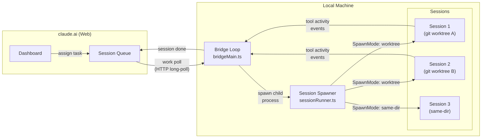

＃＃＃５．２． SpawnMode --- 作業ディレクトリを管理する 3 つの方法

```typescript
type SpawnMode = 'single-session' | 'worktree' | 'same-dir'
```

|スポーンモード |説明 | | の場合に使用します。
| ---------------- | -------------------------------------------------- | -------------------------------- |
| `single-session` | cwd で 1 セッション、セッションが終了するとブリッジが停止します。シンプルなリモコン |
| `worktree`       |各セッションには個別の (分離された) git worktree があります。安全な並列マルチタスク |
| `same-dir`       |すべての共通セッション cwd |競合する可能性があるため、注意して使用してください。

＃＃＃５．３．バックオフと再接続ロジック

```typescript
const DEFAULT_BACKOFF: BackoffConfig = {
  connInitialMs: 2_000,      // thử lại lần đầu sau 2s
  connCapMs: 120_000,        // tối đa wait 2 phút giữa các lần retry
  connGiveUpMs: 600_000,     // bỏ cuộc sau 10 phút
  generalInitialMs: 500,
  generalCapMs: 30_000,
  generalGiveUpMs: 600_000,  // 10 phút
}
```

よりインテリジェントな **睡眠検出**:

```typescript
function pollSleepDetectionThresholdMs(backoff: BackoffConfig): number {
  return backoff.connCapMs * 2  // = 240_000ms = 4 phút
}
```

2 つのポーリング間の間隔が 4 分を超える場合 → システムはマシンがスリープ状態になったとみなします。ウェイクアップすると、エラー バジェットは蓄積されずにリセットされます。

＃＃＃５．４．セッション ID 互換性レイヤー

```typescript
// CCR v2 compat layer gây ra mismatch session IDs:
// - công việc poll trả về "session_xxxx" (v1 format)
// - worker thực tế dùng "cse_xxxx" (v2 format)
// Cả hai cùng UUID body, chỉ khác prefix

export function sameSessionId(a: string, b: string): boolean {
  if (a === b) return true
  const aBody = a.slice(a.lastIndexOf('_') + 1)
  const bBody = b.slice(b.lastIndexOf('_') + 1)
  return aBody.length >= 4 && aBody === bBody
}
```

たとえば: `session_abc123` そして `cse_staging_abc123` **同じセッション**とみなされます。

* * *

## 6. タスクシステム --- マルチエージェントアーキテクチャ

＃＃＃６．１．すべてのタスクタイプ

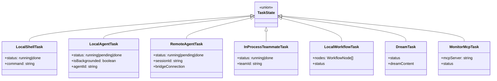

＃＃＃６．２．コーディネーターモード --- マルチエージェント調整

```typescript
export function isCoordinatorMode(): boolean {
  if (feature('COORDINATOR_MODE')) {
    return isEnvTruthy(process.env.CLAUDE_CODE_COORDINATOR_MODE)
  }
  return false
}
```

コーディネーター モードは、クロード コード インスタンスが **オーケストレーター** の役割を果たす特別なモードです --- これが使用されます `TeamCreateTool` ワーカーエージェントを生成するには、 `SendMessageTool` 彼らとコミュニケーションを取るため、そして `TeamDeleteTool` 掃除に。

    コーディネーター (CLAUDE_CODE_COORDINATOR_MODE=1)
        │
        §─ TEAM_CREATE_TOOL → ワーカー 1 をスポーン
        §─ TEAM_CREATE_TOOL → ワーカー 2 をスポーン
        │
        §─ SEND_MESSAGE_TOOL → 「リサーチアプローチA」
        §─ SEND_MESSAGE_TOOL → 「リサーチアプローチB」
        │
        │ [ワーカーは並行して動作します]
        │
        §─ ワーカー 1 から結果を受け取る
        §─ Worker 2 から結果を受け取る
        │
        §─ 合成
        §─ TEAM_DELETE_TOOL → ワーカー 1 をクリーンアップ
        §─ TEAM_DELETE_TOOL → Worker 2 のクリーンアップ
        └─ 最終計画書を返却

* * *

## 7. 対カナリア難読化 --- 内部コードネーム保護技術

＃＃＃７．１．問題

Anthropic には **カナリア検出** を実行する CI/CD パイプラインがあります。出力バンドルをスキャンして、内部モデルのコード名 ( `tengu`、 `opus46`、など）が公共の遺物に漏洩しました。

問題: **Buddy システム内の種名が内部モデルのコード名と一致します**。文字列リテラルのままにすると、スキャナーはビルドするたびにエラーを報告します。

＃＃＃７．２．解決策

```typescript
// buddy/types.ts
const c = String.fromCharCode

// Mỗi species được encode bằng hex charcode
export const duck     = c(0x64,0x75,0x63,0x6b)             as 'duck'
export const goose    = c(0x67,0x6f,0x6f,0x73,0x65)         as 'goose'
export const octopus  = c(0x6f,0x63,0x74,0x6f,0x70,0x75,0x73) as 'octopus'
// ... 18 species đều bị encode tương tự
```

**なぜ競合する種だけでなく、18 種すべてをコード化するのでしょうか?**

```typescript
// Comment giải thích:
// "All species encoded uniformly; `as` casts are type-position only (erased pre-bundle)."
```

1 つの種のみをコード化する場合、どの種が内部コードネームであるかがすぐにわかり、モデルのコードネームをリバース エンジニアリングします。すべて同じにエンコードする → どれが競合しているのかわかりません。

＃＃＃７．３．機構図

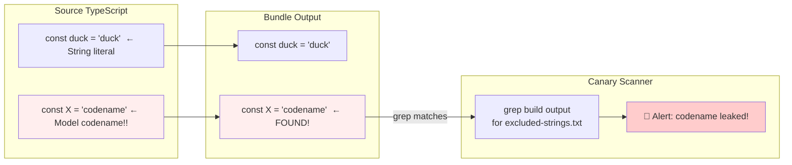

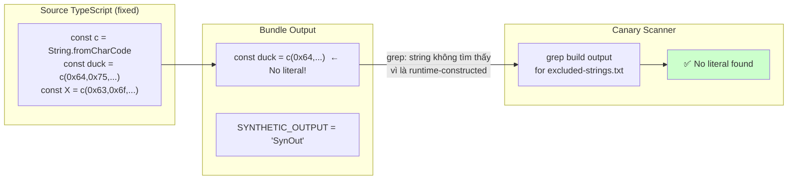

Canary チェックは実際の **コード名** (他の場所ではまだ文字列リテラルである) に対して引き続き機能しますが、動物の種は誤検知を避けるためにエンコードされています。

* * *

## 8. 隠しスラッシュコマンドの完全なリスト

    コマンド/
    §── Ultraplan.tsx 🚀 マルチエージェントプランニング (30 分クラウド)
    §── buddy/ 🐾 バーチャルペットシステム
    §── ステッカー/ 🎨 StickerMule リダイレクト
    §── teleport/ 📡 セッションをリモートにテレポートします
    §── 音声/ 🎤 音声入力
    §── thinkback/ 🔄 思考ステップを再生する
    §── thinkback-play/ ▶️ 思考アニメーションを再生する
    §── bughunter/ 🐛 自動バグハンティングエージェント
    §── ctx_viz/ 📊 コンテキストウィンドウの視覚化
    §── heapdump/ 🔍 V8 ヒープダンプ (デバッグメモリ)
    §── perf-issue/ ⚡ プロフィールを使用して perf の問題を報告する
    §── Sandbox-toggle/ 🔒 サンドボックス モードを切り替えます
    §── rewind/ ⏪ 会話をチェックポイントまで巻き戻す
    §── dream/ 💭 (DreamTask システム)
    §── シェア/ 🔗 シェアセッション
    §── インサイト/ 📈 使用状況のインサイト
    §── 簡潔/ 📝 会話の要約
    §── コンパクト/ 🗜️ コンパクトなコンテキストウィンドウ
    §── Ultraplan.tsx 📋 UltraPlan
    §── アドバイザー/ 🤖 モデルアドバイザー設定
    §── デスクトップ/ 🖥️ デスクトップ統合
    §── モバイル/ 📱 モバイルコンパニオン
    §── Good-claude/ 👍 良い反応をマークする
    §── ant-trace/ 🔬 内部人類トレース
    ━──

**特別: `/stickers`**

```typescript
export async function call(): Promise<LocalCommandResult> {
  const url = 'https://www.stickermule.com/claudecode'
  await openBrowser(url)
  return { type: 'text', value: 'Opening sticker page in browser...' }
}
```

優しいマーケティングのイースターエッグ。種類 `/stickers` →ブラウザでクロードコードステッカーショップが開きます。

* * *

## 9. 機能フラグ システム --- GrowthBook + Statsig

＃＃＃９．１． 2 つの並列フィーチャー フラグ システム

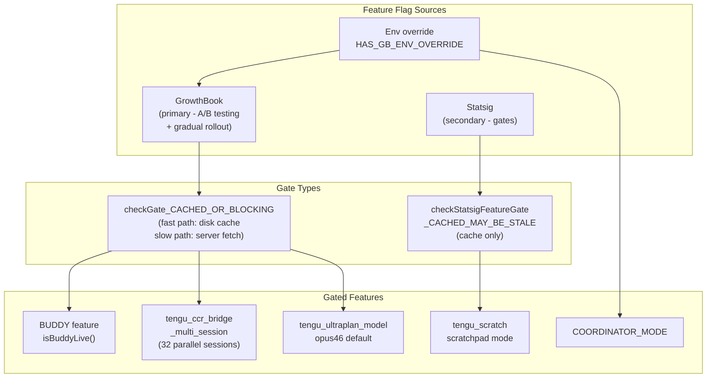

＃＃＃９．２．マルチセッション Bridge のロールアウト戦略

```typescript
/**
 * GrowthBook gate cho multi-session spawn modes.
 * Rollout staged via targeting rules: ants first, then gradual external.
 * Uses BLOCKING check (không dùng stale cache) để không từ chối nhầm.
 */
async function isMultiSessionSpawnEnabled(): Promise<boolean> {
  return checkGate_CACHED_OR_BLOCKING('tengu_ccr_bridge_multi_session')
}

const SPAWN_SESSIONS_DEFAULT = 32  // max 32 sessions song song
```

Anthropic は、マルチセッションを最初に内部ユーザー (「アリ」) にロールアウトし、次に徐々に外部ユーザーにロールアウトします。これがベスト プラクティスです。Anthropic 自身が最初のモルモットでした。

* * *

## 10. 学ぶ価値のある実装の詳細

### 10.1。 safeFilenameId --- パス トラバーサルの防止

```typescript
export function safeFilenameId(id: string): string {
  // Sanitize session ID cho filename, ngăn path traversal (../, /)
  return id.replace(/[^a-zA-Z0-9_-]/g, '_')
}
```

シンプルですが真実です。サーバーからのセッション ID は信頼されません --- ファイル名として使用する前にサニタイズする必要があります。

### 10.2。 PermissionRequest --- 呼び出しごとのツール権限

```typescript
// Control request từ child CLI khi cần permission cho tool cụ thể
type PermissionRequest = {
  type: 'control_request'
  request_id: string
  request: {
    subtype: 'can_use_tool'
    tool_name: string
    input: Record<string, unknown>  // Parameters của tool call
    tool_use_id: string
  }
}
```

ユーザーがツール クラス全体ではなく、**特定のツールの呼び出しごと**を承認/拒否できるように、アクセス許可リクエストをサーバー (claude.ai UI) に転送します。きめ細かな許可モデル。

### 10.3。 SessionActivity --- リアルタイムのステータス表示

```typescript
const TOOL_VERBS: Record<string, string> = {
  Read: 'Reading',
  Write: 'Writing',
  Edit: 'Editing',
  MultiEdit: 'Editing',
  Bash: 'Running',
  Glob: 'Searching',
  Grep: 'Searching',
  WebFetch: 'Fetching',
  WebSearch: 'Searching',
  Task: 'Running task',
}
// STATUS_UPDATE_INTERVAL_MS = 1_000
```

ダッシュボードは 1 秒ごとに処理動詞で更新されます: 「package.json の読み取り」、「src/auth.ts の編集」 --- 小さな UX ですが、学ぶ価値があります。

* * *

## 11. 結論: 学んだ教訓

### プロダクトデザインについて

Buddy/Companion は **スマート ゲーミフィケーション** の一例です。個別のミニゲームではなく、ワークフローに自然に統合されるコンパニオンです。 userId → 永久コンパニオン → ユーザーがアタッチメントを持つというロールです。レアリティシステム→ソーシャルシェア（「伝説のカピバラがいます」）。吹き出し→台無しフォーカスのない「存在感」のコンパニオン感。

### 技術的に

**すぐに実践すべき 3 つのテクニック:**

1. **投機的 I/O**: アプリの読み込みが開始されるとすぐに、結果が必要になる前に非同期操作を開始します。 Claude Code はこの方法で 1 回の起動あたり 175 ミリ秒を節約します。

2. **決定的ランダム性のためのシード PRNG**: ランダムだが再現可能 (アバター、コンパニオン、テスト データ) が必要な場合は、Mulberry32 + userId シードが正しいパターンです。

3. **CI/CD でのカナリア検出**: ビルド アーティファクトをスキャンして漏洩したシークレット/コード名を検出することは、効果的で安価な保護層です。

### セキュリティについて

> **ガイドライン**: npm パッケージ内のコードは **パブリック**です。どんなに縮小または難読化しても、リバース エンジニアリングは可能です。

Anthropic はこれを知っています --- だからこそ:

- シークレットはバンドルではなく、サーバー側の設定 (GrowthBook) にあります。
- セッション トークンは動的に取得され、ハードコードは不要です
- カナリア検出 CI パイプライン

機密性の高いビジネス ロジックを含む npm パッケージを出荷する場合: 敵対者がコードを読み取り、適切なセキュリティ モデルを設計できると想定してください。

* * *

_この記事は、npm パッケージから抽出されたソース コードの直接分析に基づいています。 `@anthropic-ai/claude-code` v2.1.89 (2026 年 3 月 31 日リリース)。すべてのコード スニペットは、npm レジストリの公開アーティファクトからのものです。_
