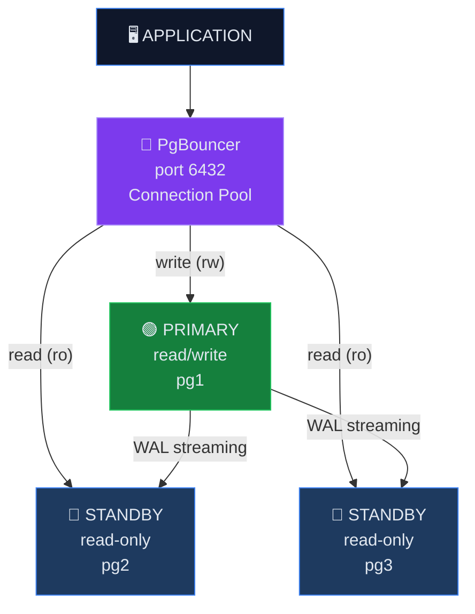
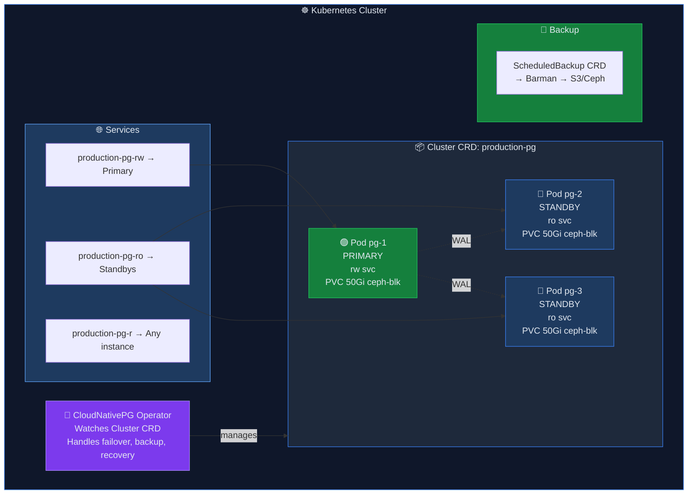
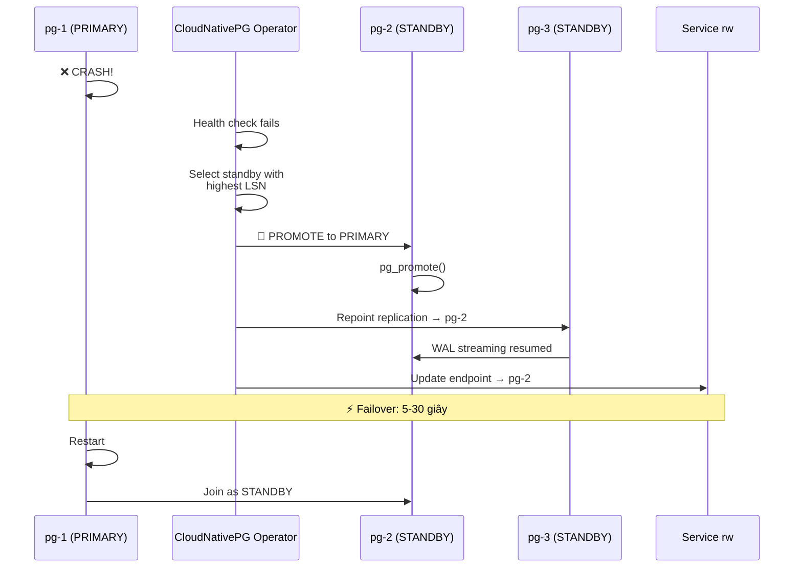

<h2 id="muc-tieu-bai-hoc">🎯 MỤC TIÊU BÀI HỌC</h2>

Sau khi hoàn thành bài học này, bạn sẽ:

<ul>
<li>✅ Hiểu PostgreSQL streaming replication</li>
<li>✅ So sánh Patroni vs CloudNativePG vs PGO (CrunchyData)</li>
<li>✅ Hiểu synchronous vs asynchronous replication</li>
<li>✅ Kiến trúc HA: primary-standby, failover, fencing</li>
<li>✅ Connection pooling với PgBouncer</li>
</ul>

<h2 id="phan-1-postgresql-replication">PHẦN 1: POSTGRESQL REPLICATION</h2>

<h3 id="11-streaming-replication">1.1. Streaming Replication</h3>

> ✅ Primary: nhận writes, stream WAL tới standbys
> ✅ Standby: replay WAL, serve read queries
> ✅ Failover: promote standby thành primary

<h3 id="12-sync-vs-async">1.2. Synchronous vs Asynchronous</h3>

<!--kg-card-begin: html-->
<table>
<thead>
<tr>
<th>Mode</th>
<th>Synchronous</th>
<th>Asynchronous</th>
</tr>
</thead>
<tbody>
<tr>
<td>Data safety</td>
<td>Zero data loss (RPO=0)</td>
<td>Potential data loss</td>
</tr>
<tr>
<td>Write latency</td>
<td>Higher (wait for standby ACK)</td>
<td>Lower (don't wait)</td>
</tr>
<tr>
<td>Throughput</td>
<td>Lower</td>
<td>Higher</td>
</tr>
<tr>
<td>Network dependency</td>
<td>Strong (latency affects writes)</td>
<td>Weak</td>
</tr>
<tr>
<td>Best for</td>
<td>Financial, critical data</td>
<td>Most applications</td>
</tr>
</tbody>
</table>
<!--kg-card-end: html-->

<h2 id="phan-2-so-sanh-operators">PHẦN 2: SO SÁNH POSTGRESQL OPERATORS</h2>

<!--kg-card-begin: html-->
<table>
<thead>
<tr>
<th>Tiêu chí</th>
<th>CloudNativePG</th>
<th>Patroni (Zalando)</th>
<th>PGO (CrunchyData)</th>
</tr>
</thead>
<tbody>
<tr>
<td>Architecture</td>
<td>K8s-native operator</td>
<td>Sidecar + DCS</td>
<td>K8s operator</td>
</tr>
<tr>
<td>Failover</td>
<td>K8s controller</td>
<td>Raft-like via DCS</td>
<td>K8s controller</td>
</tr>
<tr>
<td>DCS dependency</td>
<td>❌ Không cần (dùng K8s)</td>
<td>✅ Cần etcd/Consul/K8s</td>
<td>❌ Không cần</td>
</tr>
<tr>
<td>Backup</td>
<td>Barman (S3/local)</td>
<td>WAL-G, pgBackRest</td>
<td>pgBackRest</td>
</tr>
<tr>
<td>Connection pooling</td>
<td>PgBouncer built-in</td>
<td>Cần setup riêng</td>
<td>PgBouncer built-in</td>
</tr>
<tr>
<td>CNCF</td>
<td>Sandbox</td>
<td>Community</td>
<td>Community</td>
</tr>
<tr>
<td>License</td>
<td>Apache 2.0</td>
<td>MIT</td>
<td>Apache 2.0</td>
</tr>
<tr>
<td>Complexity</td>
<td>Thấp</td>
<td>Trung bình</td>
<td>Trung bình</td>
</tr>
</tbody>
</table>
<!--kg-card-end: html-->

👉 <strong>Chọn CloudNativePG</strong>: K8s-native, không cần external DCS, CNCF project, backup tích hợp, đơn giản hơn Patroni trên K8s.

<h2 id="phan-3-cloudnativepg-architecture">PHẦN 3: CLOUDNATIVEPG ARCHITECTURE</h2>

<h3 id="31-failover-flow">3.1. Failover Flow</h3>

<h2 id="phan-4-pgbouncer">PHẦN 4: CONNECTION POOLING — PGBOUNCER</h2>

<pre><code>
Tại sao cần PgBouncer?

Không có PgBouncer:
App (1000 connections) → PostgreSQL (1000 processes!)
→ Memory: 1000 × 10MB = 10GB
→ Context switching overhead
→ Performance drop

Có PgBouncer:
App (1000 connections) → PgBouncer (pool 50 connections) → PostgreSQL (50 processes)
→ Memory: 50 × 10MB = 500MB
→ 20× ít processes
→ Better performance

PgBouncer modes:
- session:      1:1 mapping (least pooling)
- transaction:  Release after each transaction (recommended)
- statement:    Release after each statement (most aggressive)
</code></pre>

<h2 id="phan-5-storage-considerations">PHẦN 5: STORAGE CONSIDERATIONS</h2>

<pre><code class="language-bash"># PostgreSQL trên Ceph RBD:
# ✅ PVC (ceph-block) cho data directory
# ✅ Separate PVC cho WAL (optional, higher IOPS)
# ⚠️ ext4 filesystem (CloudNativePG default)
# ⚠️ fsync = on (DO NOT disable!)

# PostgreSQL storage parameters:
# - shared_buffers: 25% RAM
# - effective_cache_size: 75% RAM
# - wal_buffers: 64MB
# - checkpoint_completion_target: 0.9
# - random_page_cost: 1.1 (SSD)
# - effective_io_concurrency: 200 (SSD)
</code></pre>

<h2 id="key-takeaways">💡 KEY TAKEAWAYS</h2>
<ol>
<li><strong>CloudNativePG</strong>: K8s-native, không cần etcd/Consul, failover tự động</li>
<li><strong>Streaming replication</strong>: Primary → Standby qua WAL streaming</li>
<li><strong>Synchronous</strong> cho zero data loss, <strong>asynchronous</strong> cho throughput</li>
<li><strong>PgBouncer</strong>: Connection pooling giảm 20× database processes</li>
<li><strong>Ceph RBD</strong> (ReadWriteOnce) phù hợp cho database PV</li>
<li><strong>3 services</strong>: rw (primary), ro (standbys), r (any instance)</li>
</ol>

<h2 id="bai-tap">🎯 BÀI TẬP</h2>

<h3 id="bt1">Bài tập 1: Research</h3>
<ul>
<li>Đọc CloudNativePG documentation</li>
<li>So sánh 3 operators: CNPG vs Patroni vs PGO</li>
<li>Quyết định sync vs async cho use case của bạn</li>
</ul>

<h2 id="bai-tiep-theo">📚 BÀI TIẾP THEO</h2>

Trong <strong>Bài 17: Deploy CloudNativePG Operator và PostgreSQL Cluster</strong>, chúng ta sẽ cài CloudNativePG và tạo PostgreSQL cluster 3 instances.

