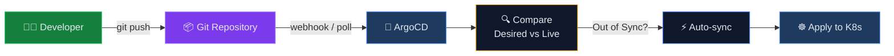
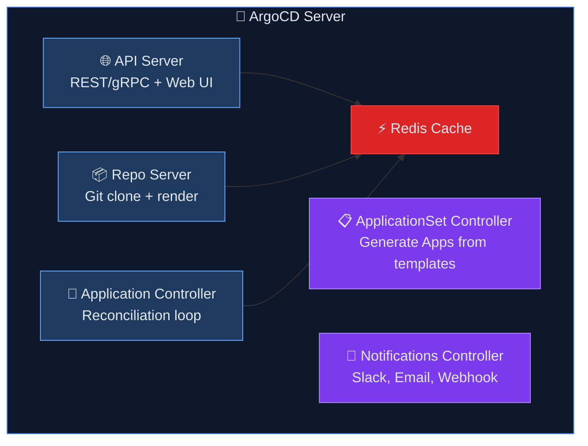

<svg xmlns="http://www.w3.org/2000/svg" viewBox="0 0 1200 340" style="max-width: 100%; height: auto; border-radius: 12px; margin-bottom: 1.5rem;">
  <defs>
    <linearGradient id="bg-4740" x1="0%" y1="0%" x2="100%" y2="100%">
      <stop offset="0%" style="stop-color:#0a1628"/>
      <stop offset="100%" style="stop-color:#1e293b"/>
    </linearGradient>
  </defs>

  <!-- Background -->
  <rect width="1200" height="340" rx="12" fill="url(#bg-4740)"/>

  <!-- Decorations -->
  <g>
    <circle cx="1073" cy="209" r="26" fill="#c084fc" opacity="0.14"/>
    <circle cx="1046" cy="182" r="35" fill="#c084fc" opacity="0.13"/>
    <circle cx="1019" cy="155" r="14" fill="#c084fc" opacity="0.12000000000000001"/>
    <circle cx="992" cy="128" r="23" fill="#c084fc" opacity="0.11"/>
    <circle cx="965" cy="101" r="32" fill="#c084fc" opacity="0.1"/>
    <circle cx="750" cy="80" r="1.5" fill="#c084fc" opacity="0.15"/>
    <circle cx="750" cy="108" r="1.5" fill="#c084fc" opacity="0.15"/>
    <circle cx="750" cy="136" r="1.5" fill="#c084fc" opacity="0.15"/>
    <circle cx="750" cy="164" r="1.5" fill="#c084fc" opacity="0.15"/>
    <circle cx="778" cy="80" r="1.5" fill="#c084fc" opacity="0.15"/>
    <circle cx="778" cy="108" r="1.5" fill="#c084fc" opacity="0.15"/>
    <circle cx="778" cy="136" r="1.5" fill="#c084fc" opacity="0.15"/>
    <circle cx="778" cy="164" r="1.5" fill="#c084fc" opacity="0.15"/>
    <circle cx="806" cy="80" r="1.5" fill="#c084fc" opacity="0.15"/>
    <circle cx="806" cy="108" r="1.5" fill="#c084fc" opacity="0.15"/>
    <circle cx="806" cy="136" r="1.5" fill="#c084fc" opacity="0.15"/>
    <circle cx="806" cy="164" r="1.5" fill="#c084fc" opacity="0.15"/>
    <circle cx="834" cy="80" r="1.5" fill="#c084fc" opacity="0.15"/>
    <circle cx="834" cy="108" r="1.5" fill="#c084fc" opacity="0.15"/>
    <circle cx="834" cy="136" r="1.5" fill="#c084fc" opacity="0.15"/>
    <circle cx="834" cy="164" r="1.5" fill="#c084fc" opacity="0.15"/>
    <circle cx="862" cy="80" r="1.5" fill="#c084fc" opacity="0.15"/>
    <circle cx="862" cy="108" r="1.5" fill="#c084fc" opacity="0.15"/>
    <circle cx="862" cy="136" r="1.5" fill="#c084fc" opacity="0.15"/>
    <circle cx="862" cy="164" r="1.5" fill="#c084fc" opacity="0.15"/>
    <circle cx="890" cy="80" r="1.5" fill="#c084fc" opacity="0.15"/>
    <circle cx="890" cy="108" r="1.5" fill="#c084fc" opacity="0.15"/>
    <circle cx="890" cy="136" r="1.5" fill="#c084fc" opacity="0.15"/>
    <circle cx="890" cy="164" r="1.5" fill="#c084fc" opacity="0.15"/>
    <line x1="600" y1="79" x2="1100" y2="159" stroke="#c084fc" stroke-width="0.5" opacity="0.1"/>
    <line x1="650" y1="109" x2="1050" y2="179" stroke="#c084fc" stroke-width="0.5" opacity="0.08"/>
    <polygon points="1058.444863728671,212 1058.444863728671,246 1029,263 999.555136271329,246 999.555136271329,212 1029,195" fill="none" stroke="#c084fc" stroke-width="1" opacity="0.12"/>
  </g>

  <!-- Accent bar -->
  <rect x="60" y="50" width="4" height="60" rx="2" fill="#c084fc"/>

  <!-- Category badge -->
  <rect x="80" y="50" width="121" height="28" rx="14" fill="#c084fc" opacity="0.15"/>
  <text x="92" y="69" font-family="system-ui,-apple-system,sans-serif" font-size="13" font-weight="600" fill="#c084fc">🔒 DevSecOps — Bài 28</text>

  <!-- Title -->
  <text x="60" y="140" font-family="system-ui,-apple-system,sans-serif" font-size="34" font-weight="700" fill="#f1f5f9">
      <tspan x="60" dy="0">BÀI 28: GITOPS VỚI ARGOCD — KIẾN TRÚC VÀ</tspan>
      <tspan x="60" dy="42">CÀI ĐẶT</tspan>
  </text>

  <!-- Series subtitle -->
  <text x="60" y="244" font-family="system-ui,-apple-system,sans-serif" font-size="15" fill="#94a3b8" opacity="0.8">Deploy Microservices On-Premises với Kubernetes HA</text>

  <!-- Section -->
  <text x="60" y="268" font-family="system-ui,-apple-system,sans-serif" font-size="13" fill="#64748b" opacity="0.6">Phần 7: GitOps với ArgoCD, Helm &amp; Vault</text>

  <!-- xDev watermark -->
  <text x="1140" y="320" font-family="system-ui,-apple-system,sans-serif" font-size="12" fill="#475569" text-anchor="end" opacity="0.4">xdev.asia</text>
</svg>

<h2 id="muc-tieu-bai-hoc">🎯 MỤC TIÊU BÀI HỌC</h2>
<ul>
<li>✅ Hiểu GitOps principles và workflow</li>
<li>✅ Kiến trúc ArgoCD: components, sync flow</li>
<li>✅ Cài đặt ArgoCD HA trên Kubernetes</li>
<li>✅ Cấu hình Git repositories và SSH keys</li>
<li>✅ RBAC và SSO integration</li>
<li>✅ So sánh ArgoCD vs FluxCD</li>
</ul>

<h2 id="phan-1-gitops">PHẦN 1: GITOPS PRINCIPLES</h2>

> **GitOps Core Principles:**
> 1. **Declarative**: Desired state described in Git
> 2. **Versioned**: Git history = deployment history
> 3. **Automated**: Changes auto-applied (or approved)
> 4. **Self-healing**: Drift detection + auto-correction

<!--kg-card-begin: html-->
<table>
<thead>
<tr><th>Feature</th><th>ArgoCD</th><th>FluxCD</th></tr>
</thead>
<tbody>
<tr><td>Architecture</td><td>Centralized (UI + API)</td><td>Decentralized (per-cluster)</td></tr>
<tr><td>UI</td><td>Rich Web UI</td><td>CLI only (+ Weave GitOps UI)</td></tr>
<tr><td>Multi-cluster</td><td>Native (single pane)</td><td>Per-cluster agents</td></tr>
<tr><td>Helm Support</td><td>Yes (template rendering)</td><td>Yes (HelmRelease CRD)</td></tr>
<tr><td>Kustomize</td><td>Yes</td><td>Yes (native)</td></tr>
<tr><td>RBAC</td><td>Built-in, per-project</td><td>K8s RBAC</td></tr>
<tr><td>SSO</td><td>OIDC, SAML, LDAP</td><td>Via K8s auth</td></tr>
<tr><td>Best For</td><td>Central platform teams</td><td>Distributed teams</td></tr>
</tbody>
</table>
<!--kg-card-end: html-->

<h2 id="phan-2-architecture">PHẦN 2: KIẾN TRÚC ARGOCD</h2>

<h2 id="phan-3-install">PHẦN 3: CÀI ĐẶT ARGOCD HA</h2>

<pre><code class="language-bash"># Create namespace:
kubectl create namespace argocd

# Install ArgoCD HA:
helm repo add argo https://argoproj.github.io/argo-helm
helm repo update

helm install argocd argo/argo-cd \
  --namespace argocd \
  --version 7.3.0 \
  -f argocd-values.yaml
</code></pre>

<h3 id="31-values">3.1. ArgoCD Values (Production)</h3>
<pre><code class="language-yaml"># argocd-values.yaml:
global:
  domain: argocd.myapp.com

controller:
  replicas: 2
  resources:
    requests:
      cpu: 500m
      memory: 512Mi
    limits:
      cpu: "2"
      memory: 2Gi

server:
  replicas: 2
  resources:
    requests:
      cpu: 200m
      memory: 256Mi
  ingress:
    enabled: true
    ingressClassName: istio
    hostname: argocd.myapp.com
    tls: true

repoServer:
  replicas: 2
  resources:
    requests:
      cpu: 200m
      memory: 256Mi

redis:
  enabled: true

applicationSet:
  replicas: 2

notifications:
  enabled: true

configs:
  params:
    server.insecure: false
  
  rbac:
    policy.default: role:readonly
    policy.csv: |
      p, role:admin, applications, *, */*, allow
      p, role:admin, clusters, *, *, allow
      p, role:admin, repositories, *, *, allow
      p, role:admin, projects, *, *, allow
      p, role:developer, applications, get, */*, allow
      p, role:developer, applications, sync, */*, allow
      p, role:developer, logs, get, */*, allow
      g, admin-team, role:admin
      g, dev-team, role:developer
  
  repositories:
    infra-repo:
      url: git@github.com:myorg/k8s-manifests.git
      sshPrivateKeySecret:
        name: repo-ssh-key
        key: sshPrivateKey
</code></pre>

<pre><code class="language-bash"># Deploy:
helm install argocd argo/argo-cd -n argocd -f argocd-values.yaml

# Get initial admin password:
kubectl -n argocd get secret argocd-initial-admin-secret \
  -o jsonpath='{.data.password}' | base64 -d

# Install ArgoCD CLI:
curl -sSL -o argocd https://github.com/argoproj/argo-cd/releases/latest/download/argocd-linux-amd64
chmod +x argocd && sudo mv argocd /usr/local/bin/

# Login:
argocd login argocd.myapp.com --grpc-web

# Add Git repository:
argocd repo add git@github.com:myorg/k8s-manifests.git \
  --ssh-private-key-path ~/.ssh/id_rsa
</code></pre>

<h2 id="phan-4-app">PHẦN 4: TẠO ARGOCD APPLICATION</h2>

<pre><code class="language-yaml"># argocd-app-order.yaml:
apiVersion: argoproj.io/v1alpha1
kind: Application
metadata:
  name: order-service
  namespace: argocd
  finalizers:
    - resources-finalizer.argocd.argoproj.io
spec:
  project: production
  
  source:
    repoURL: git@github.com:myorg/k8s-manifests.git
    targetRevision: main
    path: apps/order-service/overlays/production
  
  destination:
    server: https://kubernetes.default.svc
    namespace: default
  
  syncPolicy:
    automated:
      prune: true              # Delete resources not in Git
      selfHeal: true           # Auto-fix drift
      allowEmpty: false
    syncOptions:
      - CreateNamespace=true
      - PrunePropagationPolicy=foreground
      - PruneLast=true
    retry:
      limit: 5
      backoff:
        duration: 5s
        factor: 2
        maxDuration: 3m
</code></pre>

<h3 id="41-project">4.1. ArgoCD Project</h3>
<pre><code class="language-yaml"># argocd-project.yaml:
apiVersion: argoproj.io/v1alpha1
kind: AppProject
metadata:
  name: production
  namespace: argocd
spec:
  description: "Production applications"
  
  sourceRepos:
    - "git@github.com:myorg/k8s-manifests.git"
    - "https://charts.bitnami.com/bitnami"
  
  destinations:
    - namespace: "default"
      server: https://kubernetes.default.svc
    - namespace: "messaging"
      server: https://kubernetes.default.svc
    - namespace: "database"
      server: https://kubernetes.default.svc
  
  clusterResourceWhitelist:
    - group: ""
      kind: Namespace
  
  namespaceResourceBlacklist:
    - group: ""
      kind: ResourceQuota
    - group: ""
      kind: LimitRange
  
  roles:
    - name: developer
      policies:
        - p, proj:production:developer, applications, get, production/*, allow
        - p, proj:production:developer, applications, sync, production/*, allow
      groups:
        - dev-team
</code></pre>

<h2 id="phan-5-applicationset">PHẦN 5: APPLICATIONSET (MULTI-APP GENERATION)</h2>

<pre><code class="language-yaml"># Generate apps from directory structure:
apiVersion: argoproj.io/v1alpha1
kind: ApplicationSet
metadata:
  name: microservices
  namespace: argocd
spec:
  generators:
    - git:
        repoURL: git@github.com:myorg/k8s-manifests.git
        revision: main
        directories:
          - path: "apps/*/overlays/production"
  
  template:
    metadata:
      name: "{{path[1]}}"
    spec:
      project: production
      source:
        repoURL: git@github.com:myorg/k8s-manifests.git
        targetRevision: main
        path: "{{path}}"
      destination:
        server: https://kubernetes.default.svc
        namespace: default
      syncPolicy:
        automated:
          prune: true
          selfHeal: true
</code></pre>

<h2 id="phan-6-notifications">PHẦN 6: NOTIFICATIONS</h2>

<pre><code class="language-yaml"># Slack notification:
apiVersion: v1
kind: ConfigMap
metadata:
  name: argocd-notifications-cm
  namespace: argocd
data:
  service.slack: |
    token: $slack-token
  
  template.app-sync-succeeded: |
    message: |
      ✅ Application {{.app.metadata.name}} has been successfully synced.
      Revision: {{.app.status.sync.revision}}
    slack:
      attachments: |
        [{
          "color": "#18be52",
          "title": "{{.app.metadata.name}} synced",
          "fields": [{
            "title": "Sync Status",
            "value": "{{.app.status.sync.status}}",
            "short": true
          }]
        }]
  
  trigger.on-sync-succeeded: |
    - when: app.status.sync.status == 'Synced'
      send: [app-sync-succeeded]
  
  trigger.on-sync-failed: |
    - when: app.status.sync.status == 'OutOfSync'
      send: [app-sync-failed]
</code></pre>

<h2 id="key-takeaways">💡 KEY TAKEAWAYS</h2>
<ol>
<li><strong>GitOps</strong>: Git là single source of truth cho infrastructure</li>
<li><strong>ArgoCD</strong>: Declarative CD, auto-sync, drift detection, rich UI</li>
<li><strong>HA install</strong>: 2+ replicas cho controller, server, repo-server</li>
<li><strong>Projects</strong>: RBAC boundaries, limit repos/namespaces per team</li>
<li><strong>ApplicationSet</strong>: Generate hundreds of apps from templates</li>
<li><strong>Self-heal</strong>: Auto-revert manual kubectl changes</li>
</ol>

<h2 id="bai-tap">🎯 BÀI TẬP</h2>

<h3 id="bt1">Bài tập 1: ArgoCD Setup</h3>
<ul>
<li>Install ArgoCD HA</li>
<li>Add Git repo, create Project</li>
<li>Deploy sample app via ArgoCD Application</li>
<li>Manually edit deployment → watch self-heal</li>
</ul>

<h3 id="bt2">Bài tập 2: ApplicationSet</h3>
<ul>
<li>Create directory-based ApplicationSet</li>
<li>Add new service → auto-discover & deploy</li>
</ul>

<h2 id="bai-tiep-theo">📚 BÀI TIẾP THEO</h2>

Trong <strong>Bài 29: Helm Charts cho Microservices — Template, Values, Dependencies</strong>, chúng ta sẽ build reusable Helm charts cho toàn bộ microservices stack.

