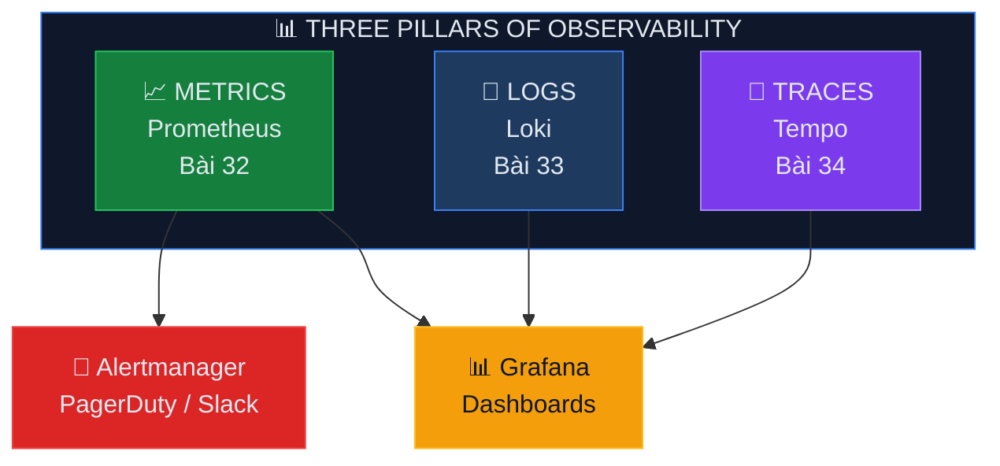

<svg xmlns="http://www.w3.org/2000/svg" viewBox="0 0 1200 340" style="max-width: 100%; height: auto; border-radius: 12px; margin-bottom: 1.5rem;">
  <defs>
    <linearGradient id="bg-308" x1="0%" y1="0%" x2="100%" y2="100%">
      <stop offset="0%" style="stop-color:#0a1628"/>
      <stop offset="100%" style="stop-color:#1e293b"/>
    </linearGradient>
  </defs>

  <!-- Background -->
  <rect width="1200" height="340" rx="12" fill="url(#bg-308)"/>

  <!-- Decorations -->
  <g>
    <circle cx="1003" cy="79" r="36" fill="#c084fc" opacity="0.14"/>
    <circle cx="906" cy="182" r="35" fill="#c084fc" opacity="0.13"/>
    <circle cx="809" cy="285" r="34" fill="#c084fc" opacity="0.12000000000000001"/>
    <circle cx="712" cy="128" r="33" fill="#c084fc" opacity="0.11"/>
    <circle cx="615" cy="231" r="32" fill="#c084fc" opacity="0.1"/>
    <circle cx="750" cy="80" r="1.5" fill="#c084fc" opacity="0.15"/>
    <circle cx="750" cy="108" r="1.5" fill="#c084fc" opacity="0.15"/>
    <circle cx="750" cy="136" r="1.5" fill="#c084fc" opacity="0.15"/>
    <circle cx="750" cy="164" r="1.5" fill="#c084fc" opacity="0.15"/>
    <circle cx="778" cy="80" r="1.5" fill="#c084fc" opacity="0.15"/>
    <circle cx="778" cy="108" r="1.5" fill="#c084fc" opacity="0.15"/>
    <circle cx="778" cy="136" r="1.5" fill="#c084fc" opacity="0.15"/>
    <circle cx="778" cy="164" r="1.5" fill="#c084fc" opacity="0.15"/>
    <circle cx="806" cy="80" r="1.5" fill="#c084fc" opacity="0.15"/>
    <circle cx="806" cy="108" r="1.5" fill="#c084fc" opacity="0.15"/>
    <circle cx="806" cy="136" r="1.5" fill="#c084fc" opacity="0.15"/>
    <circle cx="806" cy="164" r="1.5" fill="#c084fc" opacity="0.15"/>
    <circle cx="834" cy="80" r="1.5" fill="#c084fc" opacity="0.15"/>
    <circle cx="834" cy="108" r="1.5" fill="#c084fc" opacity="0.15"/>
    <circle cx="834" cy="136" r="1.5" fill="#c084fc" opacity="0.15"/>
    <circle cx="834" cy="164" r="1.5" fill="#c084fc" opacity="0.15"/>
    <circle cx="862" cy="80" r="1.5" fill="#c084fc" opacity="0.15"/>
    <circle cx="862" cy="108" r="1.5" fill="#c084fc" opacity="0.15"/>
    <circle cx="862" cy="136" r="1.5" fill="#c084fc" opacity="0.15"/>
    <circle cx="862" cy="164" r="1.5" fill="#c084fc" opacity="0.15"/>
    <circle cx="890" cy="80" r="1.5" fill="#c084fc" opacity="0.15"/>
    <circle cx="890" cy="108" r="1.5" fill="#c084fc" opacity="0.15"/>
    <circle cx="890" cy="136" r="1.5" fill="#c084fc" opacity="0.15"/>
    <circle cx="890" cy="164" r="1.5" fill="#c084fc" opacity="0.15"/>
    <line x1="600" y1="69" x2="1100" y2="149" stroke="#c084fc" stroke-width="0.5" opacity="0.1"/>
    <line x1="650" y1="99" x2="1050" y2="169" stroke="#c084fc" stroke-width="0.5" opacity="0.08"/>
    <polygon points="1057.1051177665154,197 1057.1051177665154,241 1019,263 980.8948822334847,241 980.8948822334847,197 1019,175" fill="none" stroke="#c084fc" stroke-width="1" opacity="0.12"/>
  </g>

  <!-- Accent bar -->
  <rect x="60" y="50" width="4" height="60" rx="2" fill="#c084fc"/>

  <!-- Category badge -->
  <rect x="80" y="50" width="121" height="28" rx="14" fill="#c084fc" opacity="0.15"/>
  <text x="92" y="69" font-family="system-ui,-apple-system,sans-serif" font-size="13" font-weight="600" fill="#c084fc">🔒 DevSecOps — Bài 32</text>

  <!-- Title -->
  <text x="60" y="140" font-family="system-ui,-apple-system,sans-serif" font-size="34" font-weight="700" fill="#f1f5f9">
      <tspan x="60" dy="0">BÀI 32: PROMETHEUS STACK — MONITORING</tspan>
      <tspan x="60" dy="42">INFRASTRUCTURE</tspan>
  </text>

  <!-- Series subtitle -->
  <text x="60" y="244" font-family="system-ui,-apple-system,sans-serif" font-size="15" fill="#94a3b8" opacity="0.8">Deploy Microservices On-Premises với Kubernetes HA</text>

  <!-- Section -->
  <text x="60" y="268" font-family="system-ui,-apple-system,sans-serif" font-size="13" fill="#64748b" opacity="0.6">Phần 8: Observability — Prometheus, Loki, Tempo</text>

  <!-- xDev watermark -->
  <text x="1140" y="320" font-family="system-ui,-apple-system,sans-serif" font-size="12" fill="#475569" text-anchor="end" opacity="0.4">xdev.asia</text>
</svg>

<h2 id="muc-tieu-bai-hoc">🎯 MỤC TIÊU BÀI HỌC</h2>
<ul>
<li>✅ Deploy kube-prometheus-stack (Prometheus + Grafana + Alertmanager)</li>
<li>✅ ServiceMonitor và PodMonitor cho service discovery</li>
<li>✅ Recording rules cho pre-computed metrics</li>
<li>✅ Alerting rules và Alertmanager routing</li>
<li>✅ Thanos cho long-term storage</li>
<li>✅ Custom application metrics</li>
</ul>

<h2 id="phan-1-architecture">PHẦN 1: OBSERVABILITY ARCHITECTURE</h2>

<h2 id="phan-2-install">PHẦN 2: INSTALL KUBE-PROMETHEUS-STACK</h2>

<pre><code class="language-bash"># Create namespace:
kubectl create namespace monitoring

# Install kube-prometheus-stack:
helm repo add prometheus-community https://prometheus-community.github.io/helm-charts
helm repo update

helm install prometheus prometheus-community/kube-prometheus-stack \
  --namespace monitoring \
  -f prometheus-values.yaml
</code></pre>

<pre><code class="language-yaml"># prometheus-values.yaml:
prometheus:
  prometheusSpec:
    replicas: 2
    retention: 30d
    retentionSize: 50GB
    
    resources:
      requests:
        cpu: "1"
        memory: 2Gi
      limits:
        cpu: "4"
        memory: 8Gi
    
    storageSpec:
      volumeClaimTemplate:
        spec:
          storageClassName: ceph-block
          accessModes: ["ReadWriteOnce"]
          resources:
            requests:
              storage: 100Gi
    
    # Scrape all ServiceMonitors in any namespace:
    serviceMonitorSelectorNilUsesHelmValues: false
    podMonitorSelectorNilUsesHelmValues: false
    ruleSelectorNilUsesHelmValues: false

    # External labels (for Thanos):
    externalLabels:
      cluster: production
      environment: production

grafana:
  replicas: 2
  persistence:
    enabled: true
    storageClassName: ceph-block
    size: 10Gi
  
  adminPassword: ""   # Use existing secret
  admin:
    existingSecret: grafana-admin-secret
  
  dashboardProviders:
    dashboardproviders.yaml:
      apiVersion: 1
      providers:
        - name: default
          orgId: 1
          folder: ""
          type: file
          disableDeletion: false
          editable: true
          options:
            path: /var/lib/grafana/dashboards/default
  
  datasources:
    datasources.yaml:
      apiVersion: 1
      datasources:
        - name: Prometheus
          type: prometheus
          url: http://prometheus-kube-prometheus-prometheus:9090
          isDefault: true
        - name: Loki
          type: loki
          url: http://loki.monitoring:3100
        - name: Tempo
          type: tempo
          url: http://tempo.monitoring:3100

alertmanager:
  alertmanagerSpec:
    replicas: 3
    storage:
      volumeClaimTemplate:
        spec:
          storageClassName: ceph-block
          resources:
            requests:
              storage: 5Gi
  
  config:
    global:
      resolve_timeout: 5m
    
    route:
      receiver: 'slack-default'
      group_by: ['alertname', 'namespace']
      group_wait: 30s
      group_interval: 5m
      repeat_interval: 4h
      routes:
        - match:
            severity: critical
          receiver: 'pagerduty-critical'
          group_wait: 10s
        - match:
            severity: warning
          receiver: 'slack-warnings'
    
    receivers:
      - name: 'slack-default'
        slack_configs:
          - api_url: 'https://hooks.slack.com/services/xxx'
            channel: '#alerts'
            title: '{{ .GroupLabels.alertname }}'
            text: '{{ range .Alerts }}{{ .Annotations.summary }}{{ end }}'
      
      - name: 'slack-warnings'
        slack_configs:
          - api_url: 'https://hooks.slack.com/services/xxx'
            channel: '#warnings'
      
      - name: 'pagerduty-critical'
        pagerduty_configs:
          - service_key: 'xxx'
</code></pre>

<pre><code class="language-bash"># Verify:
kubectl -n monitoring get pods
# prometheus-kube-prometheus-prometheus-0    2/2   Running
# prometheus-kube-prometheus-prometheus-1    2/2   Running
# prometheus-grafana-xxx                     3/3   Running
# alertmanager-kube-prometheus-alertmanager-0  2/2 Running
# prometheus-kube-state-metrics-xxx          1/1   Running
# prometheus-node-exporter-xxx (per node)    1/1   Running
</code></pre>

<h2 id="phan-3-servicemonitor">PHẦN 3: SERVICEMONITOR & PODMONITOR</h2>

<pre><code class="language-yaml"># Custom ServiceMonitor cho ứng dụng:
apiVersion: monitoring.coreos.com/v1
kind: ServiceMonitor
metadata:
  name: order-service-monitor
  namespace: monitoring
  labels:
    release: prometheus    # Must match Prometheus selector
spec:
  namespaceSelector:
    matchNames:
      - default
  selector:
    matchLabels:
      app: order-service
  endpoints:
    - port: metrics
      interval: 15s
      path: /metrics
      scrapeTimeout: 10s
</code></pre>

<h2 id="phan-4-alerting-rules">PHẦN 4: ALERTING RULES</h2>

<pre><code class="language-yaml"># custom-alerts.yaml:
apiVersion: monitoring.coreos.com/v1
kind: PrometheusRule
metadata:
  name: microservice-alerts
  namespace: monitoring
spec:
  groups:
    - name: microservice.rules
      rules:
        # High error rate:
        - alert: HighErrorRate
          expr: |
            sum(rate(http_requests_total{status=~"5.."}[5m])) by (service)
            /
            sum(rate(http_requests_total[5m])) by (service)
            > 0.05
          for: 5m
          labels:
            severity: critical
          annotations:
            summary: "High error rate on {{ $labels.service }}"
            description: "Error rate > 5% for 5 minutes"

        # High latency:
        - alert: HighLatencyP99
          expr: |
            histogram_quantile(0.99,
              sum(rate(http_request_duration_seconds_bucket[5m])) by (le, service)
            ) > 2
          for: 5m
          labels:
            severity: warning
          annotations:
            summary: "P99 latency > 2s on {{ $labels.service }}"

        # Pod restarts:
        - alert: PodRestartLoop
          expr: rate(kube_pod_container_status_restarts_total[15m]) > 0
          for: 10m
          labels:
            severity: warning
          annotations:
            summary: "Pod {{ $labels.pod }} restart loop"

        # Disk pressure:
        - alert: NodeDiskPressure
          expr: |
            (node_filesystem_avail_bytes{mountpoint="/"} / 
             node_filesystem_size_bytes{mountpoint="/"}) < 0.1
          for: 5m
          labels:
            severity: critical
          annotations:
            summary: "Node {{ $labels.instance }} disk < 10%"

    - name: sla.rules
      rules:
        # SLO: 99.9% availability:
        - record: slo:availability:ratio
          expr: |
            1 - (
              sum(rate(http_requests_total{status=~"5.."}[30d]))
              /
              sum(rate(http_requests_total[30d]))
            )

        - alert: SLOBudgetBurning
          expr: slo:availability:ratio < 0.999
          for: 1h
          labels:
            severity: critical
          annotations:
            summary: "SLO budget burning: {{ $value | humanizePercentage }}"
</code></pre>

<h2 id="phan-5-grafana-dashboards">PHẦN 5: GRAFANA DASHBOARDS</h2>

<pre><code class="language-bash"># Essential Grafana dashboards to import:
# 1. K8s Cluster Overview:     ID: 315
# 2. Node Exporter Full:       ID: 1860  
# 3. K8s Pod Monitoring:       ID: 6417
# 4. NGINX Ingress:            ID: 9614
# 5. CoreDNS:                  ID: 5926
# 6. etcd:                     ID: 3070
</code></pre>

<pre><code class="language-yaml"># USE (Utilization, Saturation, Errors) Dashboard panels:
# 
# CPU Utilization:
# sum(rate(container_cpu_usage_seconds_total{namespace="default"}[5m])) by (pod)
#
# Memory Utilization:
# container_memory_working_set_bytes{namespace="default"} / 
# container_spec_memory_limit_bytes{namespace="default"}
#
# Network Errors:
# sum(rate(container_network_receive_errors_total[5m])) by (pod)
#
# Request Rate (RED method):
# sum(rate(http_requests_total{namespace="default"}[5m])) by (service)
#
# Error Rate:
# sum(rate(http_requests_total{status=~"5.."}[5m])) by (service)
# / sum(rate(http_requests_total[5m])) by (service)
#
# Duration:
# histogram_quantile(0.99, sum(rate(http_request_duration_seconds_bucket[5m])) by (le, service))
</code></pre>

<h2 id="phan-6-thanos">PHẦN 6: THANOS (LONG-TERM STORAGE)</h2>

<pre><code class="language-yaml"># Thanos sidecar cho Prometheus:
prometheus:
  prometheusSpec:
    thanos:
      image: quay.io/thanos/thanos:v0.35.0
      objectStorageConfig:
        existingSecret:
          name: thanos-objstore-config
          key: objstore.yml

# thanos-objstore-config:
apiVersion: v1
kind: Secret
metadata:
  name: thanos-objstore-config
  namespace: monitoring
stringData:
  objstore.yml: |
    type: S3
    config:
      bucket: thanos-metrics
      endpoint: ceph-rgw.storage:8080
      access_key: thanos
      secret_key: thanos-secret
      insecure: true
</code></pre>

<h2 id="key-takeaways">💡 KEY TAKEAWAYS</h2>
<ol>
<li><strong>kube-prometheus-stack</strong>: Complete monitoring in one Helm chart</li>
<li><strong>ServiceMonitor</strong>: Auto-discover targets, no manual scrape config</li>
<li><strong>RED method</strong>: Rate, Error, Duration cho mọi service</li>
<li><strong>Alertmanager</strong>: Route alerts by severity to Slack/PagerDuty</li>
<li><strong>Recording rules</strong>: Pre-compute expensive queries</li>
<li><strong>Thanos</strong>: Long-term storage (months/years) on object storage</li>
</ol>

<h2 id="bai-tap">🎯 BÀI TẬP</h2>

<h3 id="bt1">Bài tập 1: Monitoring Setup</h3>
<ul>
<li>Deploy kube-prometheus-stack</li>
<li>Create ServiceMonitor cho app</li>
<li>Build RED method Grafana dashboard</li>
</ul>

<h3 id="bt2">Bài tập 2: Alerting</h3>
<ul>
<li>Create alert rules (error rate, latency, pod restart)</li>
<li>Configure Alertmanager → Slack</li>
<li>Trigger alert, verify notification</li>
</ul>

<h2 id="bai-tiep-theo">📚 BÀI TIẾP THEO</h2>

Trong <strong>Bài 33: Loki — Centralized Logging</strong>, chúng ta sẽ setup centralized log aggregation với Grafana Loki.

