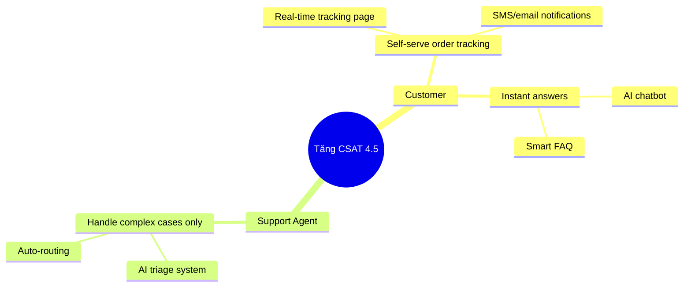

產品開發中最常見的 anti-pattern 之一，就是 **feature factory**。team 一直在 build features，卻不清楚這些 feature 對 business goal 有什麼影響。Impact Mapping 就是幫助 BA 與 team 擺脫這種循環的 technique。

## Impact Mapping 是什麼？

Impact Mapping 是 Gojko Adzic 提出的 strategic planning technique，會建立一張依照 **WHY -> WHO -> HOW -> WHAT** 結構呈現的 visual map：

```
                    [GOAL]
                       |
        ┌──────────────┼──────────────┐
        ↓              ↓              ↓
    [Actor 1]      [Actor 2]      [Actor 3]
        |              |              |
    ┌───┴───┐      ┌───┴───┐      ┌───┴───┐
    ↓       ↓      ↓       ↓      ↓       ↓
[Impact] [Impact] [Impact][Impact][Impact][Impact]
    |       |
┌───┴┐  ┌───┴┐
↓    ↓  ↓    ↓
[Del][Del][Del][Del]
```

| Level | 問題 | 範例 |
|-------|---------|-------|
| **Goal (WHY)** | 我們為什麼要做這件事？ | Q3 revenue 提高 20% |
| **Actors (WHO)** | 誰會影響這個 goal？ | Customer、Sales team、Support |
| **Impacts (HOW)** | 他們的 behavior 要如何改變？ | Customer 更常自助完成流程 |
| **Deliverables (WHAT)** | 我們要 build 什麼來產生這個 impact？ | AI chatbot、Self-service portal |

## 為什麼 Impact Mapping 對 BA 很重要？

### 傳統問題：

- Stakeholder 提出 feature request -> BA document -> Dev build -> Feature delivered，但 business goal 沒有達成
- Team 不知道自己為什麼要 build 這個功能
- Prioritization 依賴 "squeaky wheel"，而不是 business value

### Impact Mapping 解決：

- **Traceability**：每個 deliverable 都能 trace 回 business goal
- **Scope management**：更容易 cut scope，卻不傷害 goal
- **Alignment**：team 每個人都理解 WHY
- **Out-of-scope decisions**：對無法 map 回 goal 的 feature，更容易說「不」

## 如何為AI專案建立Impact Map

### Step 1: 定義 Goal（WHY）

Goal 必須是 **business outcome**，而不是 output：

❌ **不理想**："Launch an AI chatbot"
✅ **理想**："6 個月內將 support tickets 降低 40%"

❌ **不理想**："Implement recommendation engine"
✅ **理想**："平均訂單金額提高 15%"

**Goal 寫法公式**：[Metric] [Direction] [Value] [Timeframe]

### Step 2: Identify Actors（WHO）

列出所有可能影響 goal 的人或系統：

**Primary Actors**（直接達成 goal 的角色）：

- End users（customers、employees）
- Business stakeholders

**Secondary Actors**（支援 primary actors 的角色）：

- Internal teams（support、sales、ops）
- External partners

**Off-stage Actors**（間接影響者）：

- Regulators
- Competitors
- External systems/APIs

### Step 3: Define Impacts（HOW）

對每個 actor 問：**「要讓 goal 達成，他們必須做出什麼不同的行為？」**

Impact 必須是 **behavior change**，不是 feature：

❌ "使用 chatbot"（這是 action，不是 behavior change）
✅ "不用打 hotline 也能自行解決問題"

❌ "收到 recommendation email"
✅ "購買原本不知道的額外商品"

**Impact 寫法**："[Actor] will [verb] [behavior change]"

### Step 4: Brainstorm Deliverables（WHAT）

對每個 impact 問：**「我們可以 build 什麼來產生這個 impact？」**

這是 brainstorming 階段，先列出多種選項，不先過濾：

- AI features
- UX improvements
- Process changes
- Content/documentation
- Integrations

**值得考慮的 AI-specific deliverables：**

- Conversational AI（chatbot、voice assistant）
- Recommendation engine
- Predictive analytics dashboard
- Automated classification/routing
- AI-assisted search
- Personalization engine

### Step 5: 用Impact Map做Prioritize

Map 完成之後：

1. **找出 critical path**：哪個 deliverable 對 goal 影響最大？
2. **估算 confidence**：我們有多大把握它真的會產生那個 impact？
3. **考量 effort**：這是不是 high impact / low effort？
4. **切小驗證**：能不能先 deliver 一個更小的 slice 來驗證 hypothesis？

## 實例：AI Customer Support

**Scenario**：E-commerce 想改善 customer experience

**Impact Map：**

```
GOAL: Tăng CSAT từ 3.2 → 4.5 trong Q3 2026

WHO: Customer
HOW: 
  - Nhận câu trả lời trong < 2 phút (không phải 24h)
  - Tự track order status mà không cần chat
  - Hiểu chính sách return rõ ràng ngay lần đầu
WHAT:
  - AI chatbot với instant response
  - Order tracking self-service
  - AI-powered FAQ with clear policy explanations

WHO: Support Agent
HOW:
  - Dành thời gian cho complex cases thay vì repetitive Q&A
  - Có context đầy đủ khi escalation xảy ra
WHAT:
  - AI triage & routing system
  - AI-generated conversation summary cho escalations
  - Suggested response templates

WHO: Product Manager  
HOW:
  - Biết pain points thực sự của customer
  - Prioritize roadmap dựa trên impact
WHAT:
  - AI analytics dashboard từ chat data
  - Automated pattern detection từ negative feedback
```

## Impact Mapping 在 Agile Sprints 中的用法

Impact Mapping 通常在 project 一開始 **做一次**，但 BA 應該：

1. **每季 review** - business goal 有沒有變？
2. **每次 release 後更新** - Map 是否真的 deliver 了預期 impacts？
3. **拿來做 backlog filter** - 每個新 story 都應該 map 到 map 裡的某個 impact
4. **在 sprint review 中展示** - 告訴 stakeholders：「這個 sprint 達成了哪個 impact？」

## Impact Mapping vs User Story Mapping

| | Impact Mapping | User Story Mapping |
|--|---|---|
| **Focus** | Business outcomes | User journey/workflow |
| **Level** | Strategic | Tactical |
| **When** | Early planning、quarterly review | Sprint planning |
| **Output** | Prioritized impacts & deliverables | Prioritized story backlog |
| **Used by** | BA + Product + Business | BA + Dev + QA |

**Best practice**：用 Impact Mapping 定義 scope 與 priority，再用 User Story Mapping 規劃 delivery。

## 建立Impact Map的工具

| Tool | 使用方式 |
|------|-----------|
| **Miro** | 附 template 的 digital whiteboard |
| **Mermaid diagram** | Code-based，可用 Git 版本管理 |
| **FigJam** | 適合 Figma team 協作 |
| **Draw.io / Lucidchart** | 正式 diagram 工具 |
| **Sticky notes** | 用於 stakeholder workshop |

**Mermaid template：**


## 做Impact Mapping常見的錯誤

1. **Goal 太模糊**："Improve customer experience" -> 無法衡量
2. **忽略 secondary actors**：忘記 internal teams 也需要改變 behavior
3. **直接跳到 WHAT**：少了 HOW，deliverables 就沒有清楚 narrative
4. **Launch 後不 review**：做一次就放著，價值會快速消失
5. **WHAT 太細**：Impact Map 是 strategic view，細節應留給 user stories

## 結論

Impact Mapping 對 AI 時代的 BA 特別有力，因為 AI features 常常 **ROI 不明確**，也很容易因為「趨勢」而 build，而不是因為 business need。當你把每個 AI feature 都 map 到一個具體且可衡量 impact 的 business goal 時，你就可以：

- 向 executives justify AI investment
- Cut 掉沒有 business case 的 features
- 讓 data science 與 product teams 在 priorities 上 align
- 用更有意義的方式衡量 success

先從一個 goal 和 2-3 個 actors 開始，不要一開始就追求 perfect map。