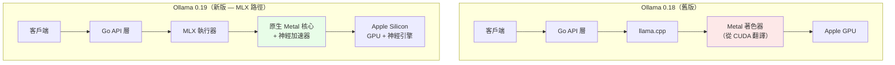
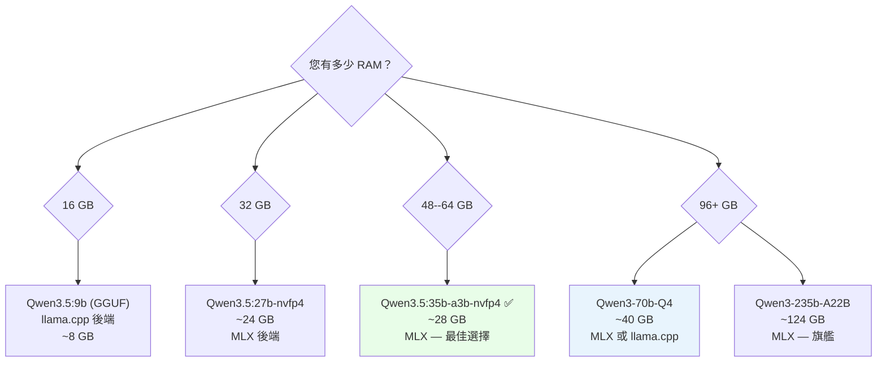
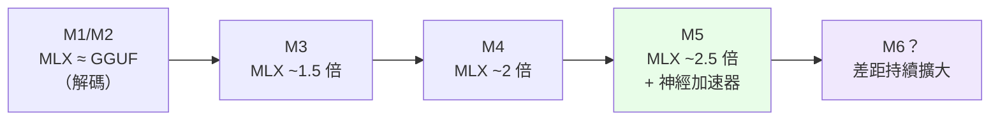

2026 年 3 月 30 日，Ollama 發布了預覽版 **v0.19**，其中包含了一個影響力遠超過去兩年任何功能的靜默變更：**適用於 Apple Silicon 的 MLX 後端**。

實際結果如何？**解碼速度提升 93%**。**預填充速度提升 57%**。在 M4 Pro 上比較 Qwen3.5-35B-A3B 等 MoE 模型，MLX 對比舊版 Ollama 是 **130 tok/s 對 43 tok/s**——**超過 3 倍的差距**。

本文分析這一切為何發生、在技術層面如何運作，以及如何設定以便今天就開始使用。

* * *

## 1. MLX 是什麼，為何重要？

**MLX** 是 Apple 研究團隊開發的開源機器學習框架。核心差異化因素不在於 API 或功能——而在於**從根本出發的設計哲學**：MLX 是_圍繞_ Apple Silicon 統一記憶體架構所構建的。

其他框架（PyTorch、TensorFlow）是移植到 macOS 的——它們最初為 CPU RAM 與 GPU VRAM 分離的世界所設計，後來才加入 Metal 後端。MLX 不帶有這樣的歷史包袱。

### 主要技術特性

-   **從一開始就採用統一記憶體**：陣列存在於 CPU 與 GPU 之間的共享記憶體中——無需複製，無傳輸開銷
-   **延遲計算**：僅在需要結果時才實際執行運算，實現全域圖最佳化
-   **動態圖**：更改輸入形狀不會觸發緩慢的重新編譯
-   **逐操作多設備**：每個操作可分別指定 CPU 或 GPU
-   **熟悉的 API**：Python API 遵循 NumPy，`mlx.nn` 遵循 PyTorch

**截至 2026 年初**：GitHub 星數 24.9k，HuggingFace 上有 4,316 個預轉換模型（mlx-community org），版本 v0.31.1，共 72 個版本。在 WWDC 2025 上，Apple 為 MLX 專門安排了 3 個議題——確立其作為 Apple Silicon 上 LLM 推論優先框架的地位。

* * *

## 2. Ollama 0.19：MLX 後端如何運作

### 2.1. 基於模型格式的自動路由

從 v0.19 起，Ollama 根據模型格式自動選擇後端——**無需額外設定**：

    GGUF 檔案         →  llama.cpp（Metal 後端）  ← 同以往
    safetensors 檔案  →  MLX 後端                  ← 全新功能

無需 `--backend mlx` 旗標。無需更改設定。若您拉取 MLX 原生模型（safetensors），Ollama 0.19 會自動使用 MLX。

### 2.2. 底層發生了什麼變化

v0.19 之前，Mac 上的 Ollama 本質上是**呼叫 llama.cpp 的 Go 包裝器**（搭配 Metal 後端）。這個 Go 包裝器層消耗了大量效能——實測數據顯示：

-   原始 llama.cpp（不含 Ollama 包裝器）：**89.4 tok/s**
-   Ollama 搭配 llama.cpp 後端：**43.5 tok/s**（與原始相比損失約 51%！）
-   MLX 直接使用（mlx-lm）：**~130 tok/s**
-   **Ollama 0.19 搭配 MLX**：**112 tok/s**（Go 層仍有些開銷，但已更接近 mlx-lm）

架構變化示意圖：



### 2.3. v0.19 預覽版支援的架構

Ollama 0.19 MLX 執行器支援 **6 種架構**：

-   Gemma 3
-   GLM-4 MoE Lite
-   Llama 系列（全部）
-   Qwen 3
-   Qwen 3.5
-   Qwen 3.5 MoE

相比之下：llama.cpp 支援數百種架構。這是預覽版的取捨——更廣泛的支援將在後續版本中提供。

* * *

## 3. 實際效能測試：具體數據

### 3.1. Ollama 官方數據（M5、Qwen3.5-35B-A3B）

| 指標          | Ollama 0.18 (llama.cpp) | Ollama 0.19 (MLX) | 提升幅度 |
| --------------- | ----------------------- | ----------------- | --------- |
| 預填充 (tok/s) | 1,154                   | 1,810             | **+57%**  |
| 解碼 (tok/s)  | 58                      | 112               | **+93%**  |
| 解碼 int4 | ---                     | 134               | **+131%** |

### 3.2. 社群效能測試（各種晶片）

**M4 Pro MacBook Pro（48GB RAM）**：

| 模型                  | 提示評估 (tok/s) | 解碼 (tok/s) |
| ---------------------- | ------------------- | -------------- |
| qwen3.5:35b-a3b-q4_K_M | 6.6                 | 30.0           |
| qwen3.5:35b-a3b-nvfp4  | 13.2                | 66.5           |
| qwen3.5:35b-a3b-int4   | **59.4**            | **84.4**       |

**Mac mini M4 Pro（64GB）— MLX 對比舊版 Ollama 直接比較，Qwen3-Coder-30B-A3B-Instruct 4 位元**：

| 後端            | 解碼 tok/s | GPU 頻率       | RAM 使用量    |
| ------------------ | ------------ | -------------- | ----------- |
| MLX-LM             | **~130**     | 346 MHz        | **34.7 GB** |
| Ollama (llama.cpp) | ~43          | 1577 MHz (99%) | 40 GB       |

→ MLX **快 3 倍**，**少用 13% RAM**，GPU 以**低 4.5 倍的頻率**運作——更少發熱、更少風扇聲、更省電。

**M4 Max（128GB）— 同一模型**：

-   MLX：130 tok/s
-   Ollama llama.cpp：43.5 tok/s
-   原始 llama.cpp（不含 Ollama）：89.4 tok/s

**M1 Max**（注意——MLX 在舊晶片上的預填充有弱點）：

-   MLX：~13 tok/s 實效（94% 的時間花在預填充上）
-   GGUF：~20 tok/s
-   → 對 M1 而言，GGUF 在預填充密集的工作負載上仍然更好

**M4 Max — Llama 3.2 3B（小型模型）**：

-   MLX：超過 **1,100 tok/s** — M4 Max 在小型模型上達到記憶體頻寬飽和點

**M5 — 與 M4 相比的 TTFT 改善**：

-   首個令牌時間：**快 4.06 倍**
-   令牌生成速度：**快 1.19 倍**

### 3.3. MLX 並非總是更好的情況

MLX 並非永遠獲勝：

    ✅ MLX 更好：長解碼（程式代理、文字生成）
    ✅ MLX 更好：MoE 模型（Qwen 3.x A3B）——最多 3 倍
    ✅ MLX 更好：M4/M5 晶片
    ✅ MLX 更好：節省記憶體

    ❌ GGUF 更好：短對話（預填充優勢）
    ❌ GGUF 更好：超過 30K 令牌的上下文（llama.cpp 的 Flash Attention）
    ❌ GGUF 更好：M1（MLX 預填充較慢）
    ❌ GGUF 更好：不在 6 個支援架構之內的模型

* * *

## 4. 為何統一記憶體架構造就差異

這是大多數文章略過的部分——**從架構角度分析為何** MLX 在 Apple Silicon 上更快。

### 4.1. 獨立 GPU 系統的問題

    ┌─────────────────────────────────────────┐
    │              傳統系統                    │
    │                                         │
    │  ┌──────────┐         ┌──────────────┐  │
    │  │   RAM    │ PCIe 4x │  GPU VRAM    │  │
    │  │  64 GB   │◄───────►│  24 GB       │  │
    │  │ ~50 GB/s │         │  ~900 GB/s   │  │
    │  └──────────┘         └──────────────┘  │
    │                                         │
    │  RTX 4090：24GB VRAM 上限                │
    │  70B Q4 模型 = ~35GB → 放不下           │
    └─────────────────────────────────────────┘

RTX 4090 有 24GB VRAM。70B 模型（Q4 量化約 35GB）放不下。必須將層卸載到 RAM——通過受限的 PCIe 頻寬（~64 GB/s）——效能急劇下降。

### 4.2. Apple Silicon 的統一記憶體

    ┌─────────────────────────────────────────┐
    │         Apple Silicon (M3/M4/M5)        │
    │                                         │
    │  ┌──────────────────────────────────┐   │
    │  │         統一記憶體池              │   │
    │  │           (32--192 GB)            │   │
    │  │     ~400 GB/s (M4 Max)           │   │
    │  │                                  │   │
    │  │  CPU  ◄──────────────►  GPU      │   │
    │  │  ANE  ◄──────────────►  NPU      │   │
    │  │                                  │   │
    │  │  零複製，相同位址空間             │   │
    │  └──────────────────────────────────┘   │
    │                                         │
    │  M2 Ultra：192GB → 70B Q4 輕鬆裝得下   │
    └─────────────────────────────────────────┘

**無 PCIe 瓶頸**。無 VRAM 上限。張量運算在 CPU 與 GPU 之間完全零複製。MLX 從設計之初就善用了這一點。

### 4.3. 實際記憶體節省

| 模型               | MLX     | GGUF   | 節省 |
| ------------------- | ------- | ------ | --------- |
| Qwen3-Coder-30B-A3B | 34.7 GB | 40 GB  | **13%**   |
| Qwen3-235B-A22B     | 124 GB  | 133 GB | **7%**    |

### 4.4. M5 神經加速器——硬體飛躍

Apple 在 M5 的**每個 GPU 核心內**加入了**專用神經加速器**——不只是更快的晶片，而是專為 MLX 計算圖設計的硬體電路。

llama.cpp Metal 後端從 CUDA 模式翻譯而來，無法自動利用這個新硬體。MLX 可以，因為 Ollama 現在直接路由到原生 MLX 核心。

* * *

## 5. NVFP4——全新量化格式

Ollama 0.19 還引入了 **NVFP4**——NVIDIA 的 4 位元浮點格式。在 Mac/MLX 上，它以 FP4 計算方式運作（無需 Blackwell GPU）：

-   與 FP16 相比**模型體積縮小 3.5 倍**
-   比 FP8 **小 1.8 倍**
-   語言任務精度損失不到 1%
-   與 NVIDIA GPU 推論使用**相同權重** → 部署時的生產一致性

實際效果：M4 Pro 48GB 上的 `qwen3.5:35b-a3b-nvfp4` 實現 **66.5 tok/s 解碼**——是 GGUF Q4（30 tok/s）的兩倍。

* * *

## 6. 實作設定——立即開始

### 6.1. 需求

-   搭載 Apple Silicon 的 Mac（M1 或更新）
-   **32GB 以上統一記憶體**（所介紹模型 Qwen3.5-35B-A3B 的預覽需求）
-   最新版 macOS

### 6.2. 安裝 Ollama 0.19

```bash
# 前往 https://ollama.com/download 下載
# 或如已安裝則更新：
ollama update
```

### 6.3. 拉取 MLX 原生模型

```bash
# 程式碼模型（預設啟用思考模式）
ollama pull qwen3.5:35b-a3b-coding-nvfp4

# 對話模型（啟用 presence penalty，減少過度思考）
ollama pull qwen3.5:35b-a3b-nvfp4
# （不會重新下載權重——僅拉取設定）

# int4 格式——解碼最快
ollama pull qwen3.5:35b-a3b-int4
```

### 6.4. 首次執行

```bash
# 直接對話
ollama run qwen3.5:35b-a3b-nvfp4

# 停用思考模式（適合簡單問題）
/set nothink

# 使用 API（OpenAI 相容）
curl http://localhost:11434/v1/chat/completions \
  -H "Content-Type: application/json" \
  -d '{
    "model": "qwen3.5:35b-a3b-nvfp4",
    "messages": [{"role": "user", "content": "Hello"}]
  }'
```

### 6.5. 與 Claude Code / AI 程式設計工具搭配使用

```bash
# 與 Claude Code 整合
ollama launch claude --model qwen3.5:35b-a3b-coding-nvfp4

# 確認正在使用的後端
ollama ps
# 輸出將顯示 "mlx" 或 "llama.cpp"
```

### 6.6. 查看實際效能

在 CLI 中使用 `--verbose` 查看 tok/s：

```bash
ollama run qwen3.5:35b-a3b-nvfp4 --verbose "請寫一個基本的 REST API"
```

尋找以下輸出：

    eval rate:         XX.XX tokens/s   ← 解碼速度
    prompt eval rate:  XX.XX tokens/s   ← 預填充速度

* * *

## 7. 依 RAM 選擇合適的模型



**實用建議**：

| RAM       | 推薦模型     | 後端 | 預估解碼速度 |
| --------- | --------------------- | ------- | ----------- |
| 16 GB     | qwen3.5:9b            | GGUF    | ~40 tok/s   |
| 32 GB     | qwen3.5:27b-nvfp4     | MLX     | ~55 tok/s   |
| 48--64 GB | qwen3.5:35b-a3b-nvfp4 | MLX     | ~66 tok/s   |
| 96+ GB    | qwen3:70b-q4          | MLX     | ~30 tok/s   |
| 128+ GB   | qwen3.5:35b-a3b-int4  | MLX     | ~130 tok/s  |

**注意**：16GB 使用 GGUF，因為小型模型在預填充密集情況下更適合 llama.cpp，且有限的 RAM 也限制了 MLX 的模型選擇。

* * *

## 8. Ollama 0.19 的 KV 快取改進

除 MLX 外，Ollama 0.19 也大幅升級了 **KV 快取**系統：

-   **跨對話快取重複使用**：若多個對話使用相同系統提示（例如工具定義），快取將被重複使用——更少記憶體，更快預填充
-   **智慧型檢查點**：自動標記提示中的重要位置以供重複使用
-   **更聰明的驅逐機制**：即使舊分支被刪除，共享前綴仍能保留更久

實際用於管理多個並行對話的程式代理：在上下文相似時，第二次起的請求 **TTFT 大幅降低**。

* * *

## 9. 更廣泛的 MLX 生態系統

在 Ollama 整合之前，已有 8 個競爭性的 MLX 推論伺服器。以下是全貌：

| 工具                        | 強項                      | 相對 Ollama 0.18 的速度                 |
| --------------------------- | ------------------------------ | ------------------------------------- |
| **mlx-lm**（Apple 官方） | 最穩定，支援 LoRA 微調 | ~3 倍                                   |
| **Rapid-MLX**               | Ollama 的直接替代品     | M3 Ultra 上 2--4.2 倍                   |
| **vLLM-MLX**                | 連續批次處理            | 吞吐量 3.4 倍（5 個並行）        |
| **oMLX**                    | SSD KV 快取持久化       | TTFT 從 30--90 秒 → 1--3 秒（50K 上下文） |
| **LM Studio**               | GUI + 自動 MLX/GGUF 切換  | 相當                            |

Ollama 為 MLX 生態系統帶來了易用性和廣泛的模型庫——雙贏的組合。

* * *

## 10. 展望未來

最值得關注的不是今天的效能數字——而是**發展軌跡**：

每一代新的 Apple Silicon（M3 → M4 → M5）都帶來了更多專用於 MLX 的硬體。M5 每個 GPU 核心內的神經加速器是最清楚的例子：TTFT 僅在一個世代就提升了 4 倍。

llama.cpp Metal 後端從 CUDA 模式翻譯而來——無法自動利用這個新硬體。MLX 可以，因為 Ollama 現在直接路由到原生 MLX 核心。

**預測結果**：效能差距將隨每一代新晶片而_擴大_。今天在本地執行 AI 的 Mac 使用者正在正確的架構上投資。



* * *

## 總結

Ollama 0.19 + MLX 不是普通的更新。這是從「將 CUDA 模式翻譯為 Metal」到「原生 Apple Silicon 推論」的架構性轉變——結果是**官方測試提升 57–93%**，**實際 MoE 模型快 3 倍**，以及資源消耗降低。

**立即開始**：

1.  將 Ollama 更新至 0.19
2.  `ollama pull qwen3.5:35b-a3b-nvfp4`（若 RAM ≥ 48GB）
3.  使用 `--verbose` 執行以查看實機 tok/s
4.  與舊版 GGUF 模型比較——差異不言而喻

* * *

_資料來源：Ollama 0.19 發布說明（2026 年 3 月 30 日）、Apple MLX GitHub（ml-explore/mlx v0.31.1）、Ars Technica "Running local models on Macs gets faster with Ollama's MLX support"（2026 年 3 月）、HackerNews 討論、r/LocalLLM 及 r/LocalLLaMA 社群效能測試。_
