## 1.背景：如何閱讀封閉的npm套件的原始碼？

克勞德碼（`@anthropic-ai/claude-code`）是 Anthropic 著名的 AI 編碼代理工具，以 **npm 套件** 的形式發布。特別之處：Anthropic **不開放原始 TypeScript 原始碼** --- 他們只提供使用 Bun 建置的捆綁包。

### 1.1。為什麼 npm 套件可讀？

以 **tree-shaken ESM** 風格捆綁 Claude 代碼 --- 不使用像 Terser 這樣具有最大程度破壞的重型混淆器。結果：函數名、變數名和模組結構幾乎完好無損。 TypeScript 來源中的註解在建置過程後也保持不變。

    npm install @anthropic-ai/claude-code
    # → 解壓縮後：43MB，只有 19 個文件，主包 ~40MB

提取管道概述：

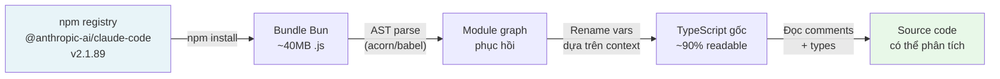

結果：數百個文件 `.ts` / `.tsx` 目錄結構清晰，技術註解完整，類型註解完整。一個閉源 npm 包能夠透露這麼多信息，這是非常罕見的。

> **技術說明：** 這不是駭客攻擊。當您發佈到 npm 時，程式碼就是公共工件。只要您在使用結果時不違反 ToS 或版權，對 npm 套件進行逆向工程就是合法的。

### 1.2。恢復的資料夾結構

    克勞德代碼代碼/
    ├── main.tsx ← 主入口點
    ├── QueryEngine.ts ← 核心對話循環
    ├── buddy/ ← 🐾 虛擬寵物系統（新！）
    │ ├──companion.ts ← 滾動邏輯（PRNG + 稀有度）
    │ ├── CompanionSprite.tsx ← ASCII 渲染器 (Ink/React)
    │ ├── sprites.ts ← 18種×3幀
    │ ├── types.ts ← 物種/稀有度/統計類型
    │ ├── Prompt.ts ← LLM 配對介紹
    │ └── useBuddyNotification.tsx ← Teaser 窗口
    ├── 橋接/ ← 遠端會話系統
    │ ├──bridgeMain.ts ← 橋接循環（重連/退避）
    │ ├── sessionRunner.ts ← 子進程產生器
    │ ├── workSecret.ts ← JWT + WebSocket URL
    │ └── types.ts ← 協定類型
    ├── 命令/
    │ ├── ultraplan.tsx ← 🚀 多智能體規劃
    │ ├── 貼紙/ ← 彩蛋：StickerMule
    │ └── [35+指令]
    ├── 協調員/
    │ └── coordinatorMode.ts ← 多智能體協調器
    └── 任務/
        ├── LocalAgentTask/ ← 子代理程式（本地）
        ├── RemoteAgentTask/ ← 子代理（雲CCR）
        ├── DreamTask/ ← 後台非同步任務
        └── InProcessTeammateTask/ ← 進程內代理

** **

## 2.Claude Code整體架構

### 2.1。技術堆疊

在討論具體功能之前，有必要清楚地了解 Claude Code 是基於什麼構建的：

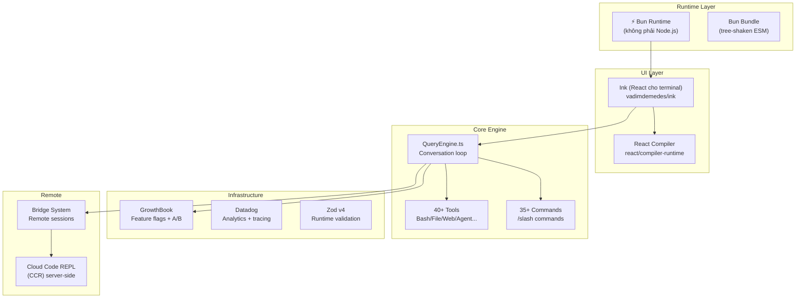

### 2.2。啟動優化－精確到每毫秒

查看文件的開頭 `main.tsx`:

```typescript
// Side-effects chạy NGAY khi file được import:
// 1. profileCheckpoint --- bắt đầu đo thời gian
// 2. startMdmRawRead --- fire MDM subprocesses (plutil/reg query) song song
//    với 135ms còn lại của import chain
// 3. startKeychainPrefetch --- fire cả 2 macOS keychain reads song song
//    (~65ms tiết kiệm trên mỗi lần khởi động macOS)

profileCheckpoint('main_tsx_entry');
startMdmRawRead();        // parallel: đọc MDM config
startKeychainPrefetch();  // parallel: đọc keychain OAuth tokens
```

這是 I/O 的「推測執行」：一旦檔案開始加載，就會並行觸發 3 個副作用 --- 當 JS 解析剩餘的 135 毫秒導入鏈時，所有副作用都會運行。導入完成後，結果就準備好了。

```mermaid
gantt
    title Startup Timeline Claude Code (macOS, ước tính)
    dateFormat X
    axisFormat %Lms

    section Sequential (cũ)
    Parse imports          : 0, 135
    Keychain read #1       : 135, 200
    Keychain read #2       : 200, 265
    MDM read               : 265, 310
    App ready              : 310, 315

    section Parallel (thực tế)
    Parse imports          : 0, 135
    Keychain #1 + #2 + MDM : crit, 0, 65
    App ready              : 135, 140
```

結果：**每次啟動節省了 175 毫秒**。隨著開發人員打字 `claude` 每天幾十次——這是真正的使用者體驗勝利。

** **

## 3.隱藏功能#1：「好友」系統---終端機中的虛擬寵物

這是最令人震驚的發現。隱藏在資料夾深處 `buddy/` 是一個完整的**虛擬寵物伴侶**系統，直接嵌入到終端中。

### 3.1。巴迪長什麼樣？


同伴坐在輸入框旁邊，有時會出現對話氣泡。整個 UI 透過 Ink（React 終端）使用 **ASCII art** 進行渲染：

    ╭──────────────────────────────────╮
    │ 編碼其實很有趣：3 │
    ╰──────────────────────────────────╯
                  │
        __
      <(· )___    ← companion (duck, frame 0)
       (  ._>
        `--´
    ───────────────────────────────────
      > |                              ← input cursor

Ba frame idle animation (tick mỗi 500ms):

    Frame 0 (rest):    Frame 1 (fidget):   Frame 2 (move):
        __                 __                  __
      <(· )___           <(· )___            <(· )___
       (  ._>             (  ._>              (  .__>
        `--´               `--´~              `--´

### 3.2。 18 個擁有自己精靈的物種

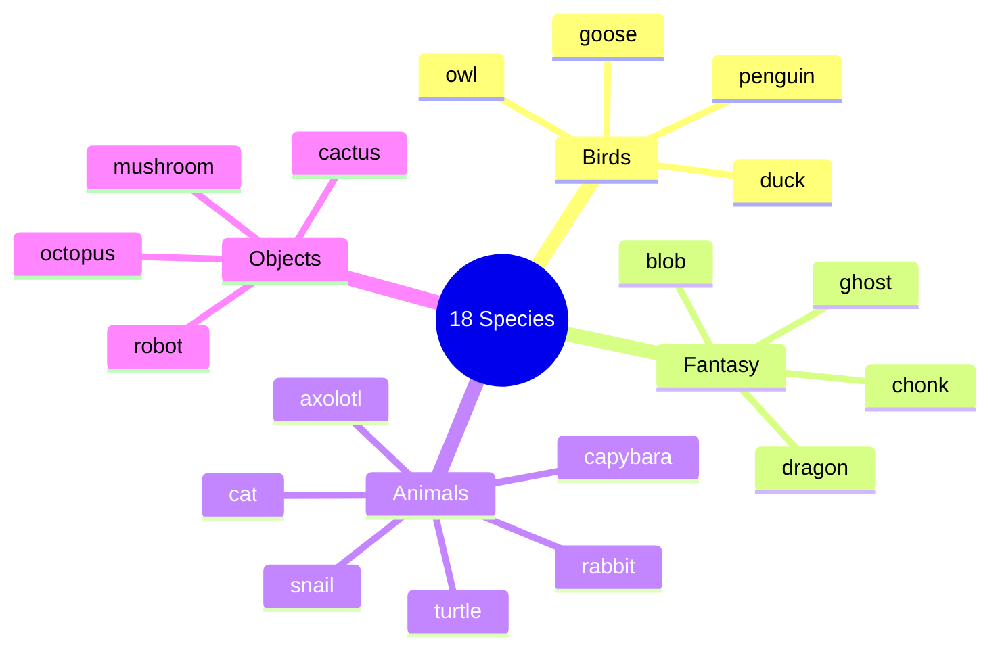

每個物種都有一個 5 行 × 12 個字元 × 3 幀的精靈集。鵝範例：

    幀 0： 幀 1： 幀 2：
         ({E}> ({E}> ({E}>>
         || || ||
       _(__)_ _(__)_ _(__)_
        ^^^^ ^^^^ ^^^^

_(`{E}` 是眼睛的佔位符 --- 渲染時替換為眼睛類型字元）_

### 3.3。管道誕生伴侶---詳解

這是最重要的技術部分。每個使用者都有**一個永久同伴，完全由他們的 userId 標識**：

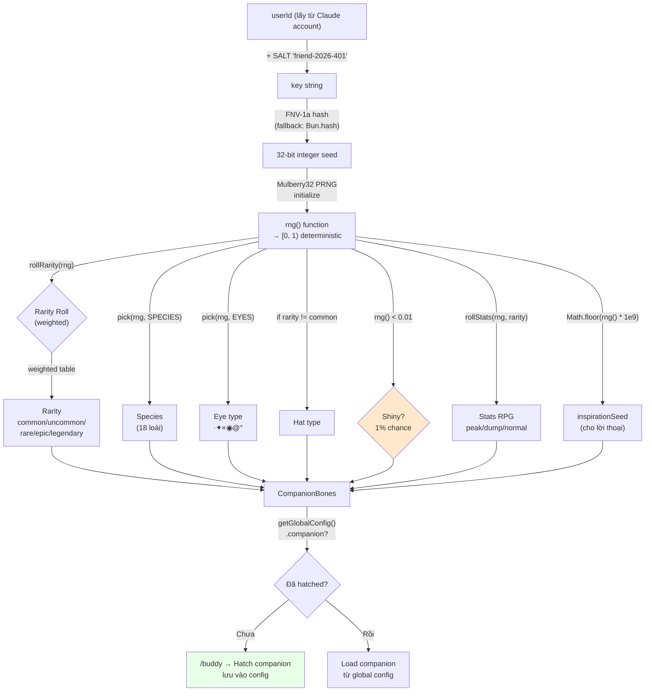

### 3.4。 Mulberry32 PRNG --- 為什麼選擇它？

```typescript
function mulberry32(seed: number): () => number {
  let a = seed >>> 0
  return function () {
    a |= 0
    a = (a + 0x6d2b79f5) | 0          // additive step
    let t = Math.imul(a ^ (a >>> 15), 1 | a)
    t = (t + Math.imul(t ^ (t >>> 7), 61 | t)) ^ t
    return ((t ^ (t >>> 14)) >>> 0) / 4294967296
  }
}
```

為什麼選擇 Mulberry32 `Math.random()`？

| | `Math.random()` |桑葚32 |
| ------------- | ---------------- | -------------------------- |
|種子| ❌不可能| ✅ 是的 |
|確定性| ❌ | ✅ 相同的種子 → 相同的結果 |
|尺寸|內建 |約 10 行程式碼 |
|速度|快|等價快|
|使用案例 |一般隨機| **種子卷** |

與 `Math.random()`，每次重新啟動克勞德代碼時，您都會獲得不同的同伴。有了 Mulberry32 + userId 種子，伴侶就**永遠屬於你** --- 就像一個化身。

### 3.5。稀有度系統---機率解碼


原始碼沒有直接宣告RARITY_WEIGHTS，但是從下限值和rollRarity邏輯，我們可以推斷出分佈：

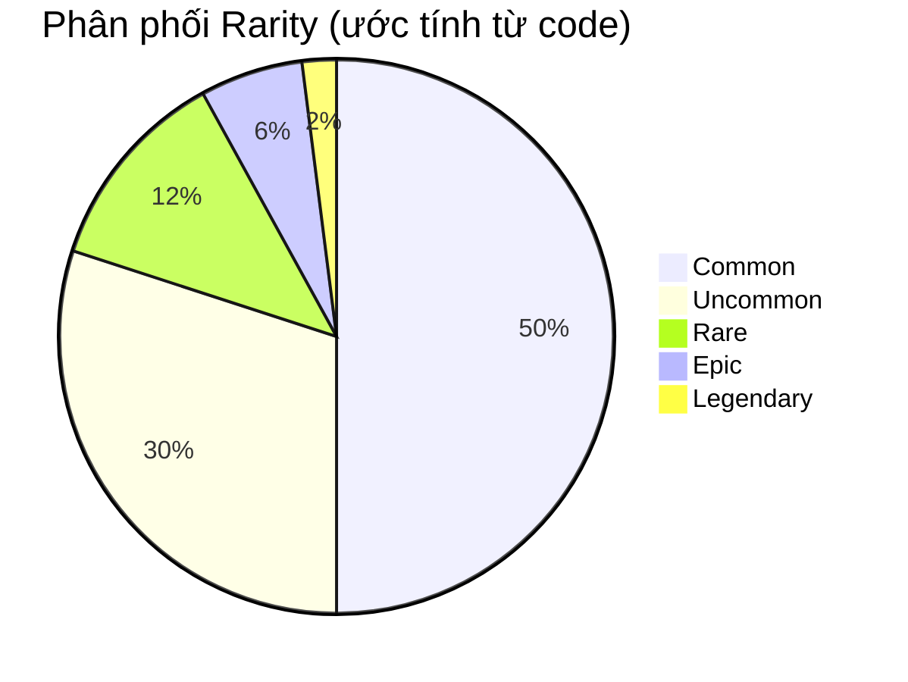

**依比例統計樓層：**

    普通 ░░░░░░░░░░ 樓層：5（統計範圍：5-75）
    罕見 ░░░░░░░░░░░░░░░樓層：15（統計範圍：15-85）
    罕見 ░░░░░░░░░░░ 樓層：25（統計範圍：25-95）
    史詩 ░░░░░░░░░░░░░░░░░░░░░░░░░樓層：35（統計範圍：35-100）
    傳奇 ░░░░░░░░░░░░░░░░░░░░░░░░░░░░100) 統計

可以達到傳奇的巔峰狀態 `min(100, 50 + 50 + rand*30) = 100` --- **上限**！

### 3.6。語音氣泡與互動系統

    語音氣泡如何渲染（CompanionSprite.tsx）：

      ╭──────────────────────────────────╮
      │ 以 30 個字元/行換行內容。 │
      │ 斜體文本，淡入淡出時顏色變暗 │
      ╰──────────────────────────────────╯
                   ↑ 尾部：“頂部”或“底部”

    氣泡生命週期：
      ┌──────────────┐ ┐────────────────────┐ ┌────────────┐
      │ addNotif │────▶│ BUBBLE_SHOW = 20 │────▶│ FADE_WINDOW │
      │ (觸發) │ │ 滴答聲 (~10 秒) │ │ = 6 滴答聲 │
      └──────────────┘ └────────────────────┘ └──────┬────────┘
                                                           │ 暗色=true
                                                           ▼
                                                     ┌────────────┐
                                                     │ 隱藏的氣泡 │
                                                     └────────────┘

當使用者在聊天中**透過名字**呼叫同伴時，LLM 會被注入系統提示：

```typescript
`When the user addresses ${name} directly (by name), 
its bubble will answer. Your job in that moment is to 
stay out of the way: respond in ONE line or less.
Don't explain that you're not ${name} --- they know.`
```

巧妙的設計：Claude（主要法學碩士）**不會假裝自己是同伴**——他只在使用者與同伴交談時「沉默」。在另一個提示情境的驅動下，同伴透過自己的語音氣泡進行回應。

### 3.7。 `/buddy pet` --- 5個漂浮的心形動畫幀

```typescript
const PET_HEARTS = [
  `   ♥    ♥   `,   // frame 0: 2 tim xa nhau
  `  ♥  ♥   ♥  `,   // frame 1: tim dày hơn
  ` ♥   ♥  ♥   `,   // frame 2: tim trải rộng
  `♥  ♥      ♥ `,   // frame 3: tim bay ra hai bên
  '·    ·   ·  ',   // frame 4: fade thành dấu chấm
];
// PET_BURST_MS = 2500ms tổng → ~500ms/frame
```

可視化：

    t=0ms： t=500ms： t=1000ms： t=1500ms： t=2000ms：
      ♥ ♥ ♥ ♥ ♥ ♥ ♥ ♥ ♥ ♥ ♥ · · ·
      下面的同伴精靈

### 3.8。 Teaser 視窗和卷展邏輯

```typescript
// Local date, not UTC --- 24h rolling wave across timezones.
// Teaser window: April 1-7, 2026 only. Command stays live forever after.
export function isBuddyTeaserWindow(): boolean {
  if ("external" === 'ant') return true;  // Anthropic internal: luôn true
  const d = new Date();
  return d.getFullYear() === 2026 && d.getMonth() === 3 && d.getDate() <= 7;
}
```

這是關於推出的一個非常有趣的設計決策：

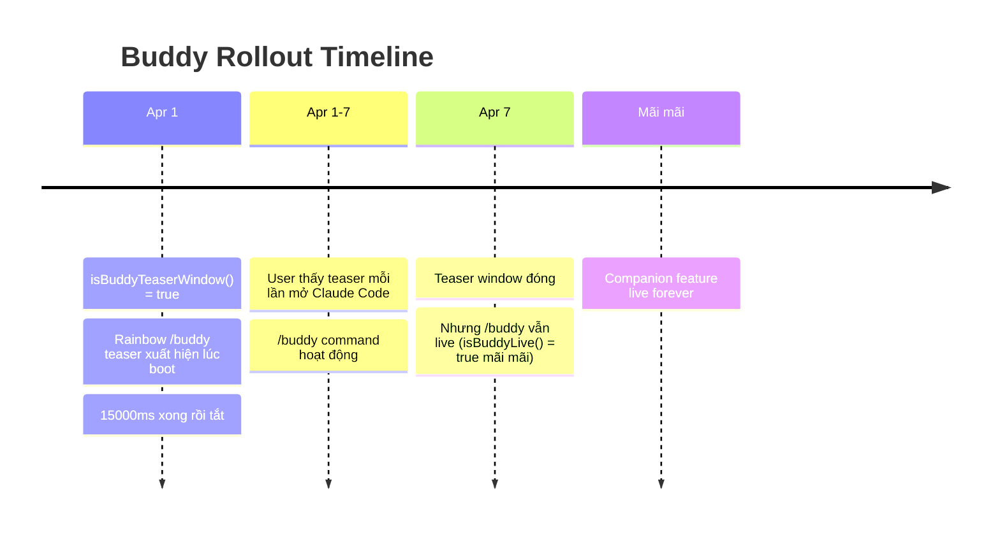

使用**本地時間**而不是 UTC 的原因：如果使用 UTC，全球所有用戶都會在同一 UTC 時間接收預告片 → 會導致伺服器負載激增。使用當地時間→連續24小時均勻負載。

** **

## 4.隱藏功能#2：UltraPlan --- 多智能體規劃引擎

### 4.1。什麼是UltraPlan？


`/ultraplan` 是克勞德·科德最強的斜線命令，但也是最隱密的。它不是 Claude Code 自行規劃，而是**將任務傳送到雲端**，其中**多個代理並行運行**長達 30 分鐘以創建全面的計劃。

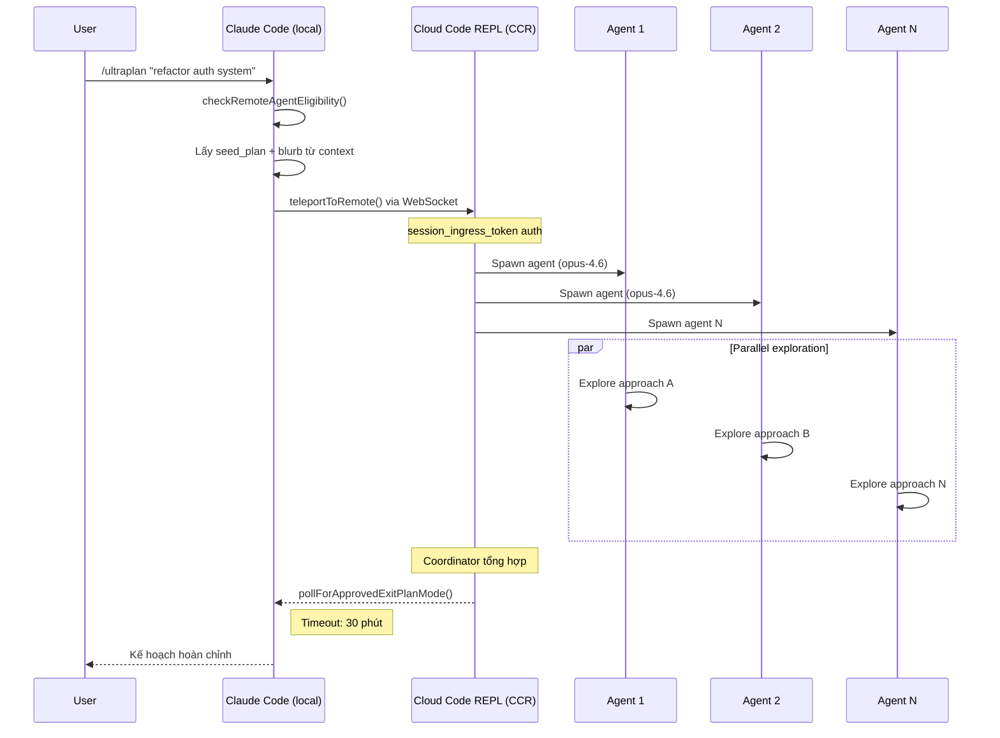

### 4.2。 CCR 會話架構

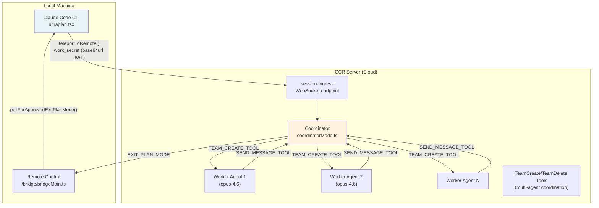

### 4.3。 WorkSecret --- Session認證機制

```typescript
type WorkSecret = {
  version: number
  session_ingress_token: string  // JWT cho WebSocket auth
  api_base_url: string           // CCR server URL
  sources: Array<{
    type: string
    git_info?: { type: string; repo: string; ref?: string; token?: string }
  }>
  auth: Array<{ type: string; token: string }>
  claude_code_args?: Record<string, string> | null
  mcp_config?: unknown | null
  environment_variables?: Record<string, string> | null
  use_code_sessions?: boolean   // CCR v2 selector
}
```

WorkSecret是**base64url編碼**並透過 `--work-secret` 生成子進程時的標誌。流程：

    1./ultraplan觸發器
    2. CLI 從橋接 API 檢索 work_secret
    3. 解碼base64url → JSON → 驗證版本 === 1
    4. buildSdkUrl(api_base_url, sessionId)
       → wss://host/v1/session_ingress/ws/{id} （生產）
       → ws://host/v2/session_ingress/ws/{id} (本機)
    5. 使用session_ingress_token連接WebSocket

### 4.4。防自觸發技術

```typescript
// Phrasing deliberately avoids the feature name because
// the remote CCR CLI runs keyword detection on raw input before
// any tag stripping, and a bare "ultraplan" in the prompt would
// self-trigger as /ultraplan, which is filtered out of headless mode
// as "Unknown skill"

// prompt.txt là <system-reminder> để CCR browser ẩn scaffolding
// nhưng model vẫn thấy full text
const _rawPrompt = require('../utils/ultraplan/prompt.txt');
```

問題：CCR 運行不同的 Claude Code CLI（無頭）。如果提示包含「ultraplan」一詞，CLI 將觸發 `/ultraplan` 自身 → 無限循環。解決方案：將提示包起來 `<system-reminder>` 標籤和措辭避免關鍵字。

    使用者 → /ultraplan“建置身份驗證”
             │
             ▼
    CCR（無頭CC）收到提示：
      <system-reminder>
        建立詳細計劃：建置身份驗證
        [這裡不要使用「ultraplan」這個字]
      </system-reminder>
             │
             ▼ CCR 瀏覽器條 <system-reminder> 從使用者介面
      模型看到：“創建詳細計劃......”
      CCR過濾器：看到「ultraplan」→過濾原因「未知技能」？不是！
                  因為「ultraplan」一詞不在實際提示中

** **

## 5. 橋接系統 --- 遠端程式碼會話

### 5.1。概述

Bridge 是一個允許 Claude Code 從 claude.ai Web 介面**同時接收來自多個會話的任務**的系統。開發人員可以將多個儲存庫任務指派給在本機電腦上執行的 Claude Code。

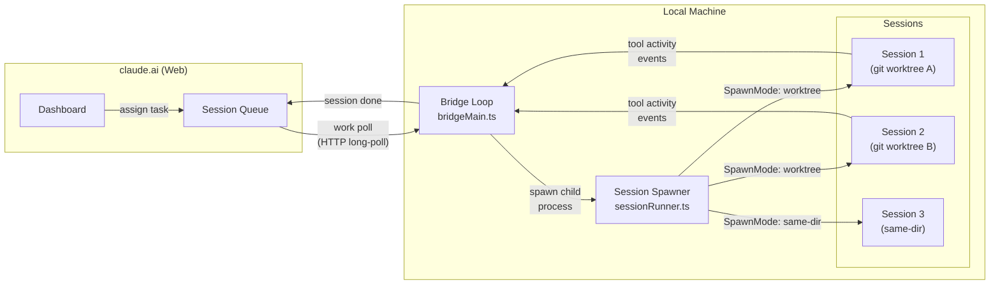

### 5.2。 SpawnMode --- 管理工作目錄的 3 種方法

```typescript
type SpawnMode = 'single-session' | 'worktree' | 'same-dir'
```

|生成模式 |描述 |使用時 |
| ---------------- |------------------------------------------------ |-------------------------------- |
| `single-session` | cwd 中的 1 個會話，會話完成後橋會停止 |簡單的遠端控制|
| `worktree`       |每個會話都有一個單獨的（隔離的）git worktree |安全並行多任務|
| `same-dir`       |所有公共會話 cwd |可能有衝突，謹慎使用|

### 5.3。退避和重新連接邏輯

```typescript
const DEFAULT_BACKOFF: BackoffConfig = {
  connInitialMs: 2_000,      // thử lại lần đầu sau 2s
  connCapMs: 120_000,        // tối đa wait 2 phút giữa các lần retry
  connGiveUpMs: 600_000,     // bỏ cuộc sau 10 phút
  generalInitialMs: 500,
  generalCapMs: 30_000,
  generalGiveUpMs: 600_000,  // 10 phút
}
```

更聰明的**睡眠檢測**：

```typescript
function pollSleepDetectionThresholdMs(backoff: BackoffConfig): number {
  return backoff.connCapMs * 2  // = 240_000ms = 4 phút
}
```

如果 2 次輪詢之間的間隔超過 4 分鐘 → 系統假定電腦已進入睡眠狀態。喚醒時，錯誤預算將被重置而不是累積。

### 5.4。會話ID相容層

```typescript
// CCR v2 compat layer gây ra mismatch session IDs:
// - công việc poll trả về "session_xxxx" (v1 format)
// - worker thực tế dùng "cse_xxxx" (v2 format)
// Cả hai cùng UUID body, chỉ khác prefix

export function sameSessionId(a: string, b: string): boolean {
  if (a === b) return true
  const aBody = a.slice(a.lastIndexOf('_') + 1)
  const bBody = b.slice(b.lastIndexOf('_') + 1)
  return aBody.length >= 4 && aBody === bBody
}
```

例如： `session_abc123` 和 `cse_staging_abc123` 被視為**同一會話**。

** **

## 6.任務系統---多智能體架構

### 6.1。所有任務類型

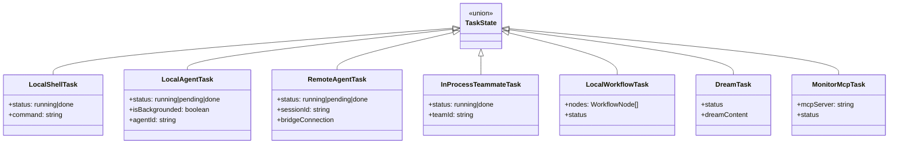

### 6.2。 Coordinator模式---多Agent協調

```typescript
export function isCoordinatorMode(): boolean {
  if (feature('COORDINATOR_MODE')) {
    return isEnvTruthy(process.env.CLAUDE_CODE_COORDINATOR_MODE)
  }
  return false
}
```

協調器模式是一種特殊模式，其中 Claude Code 實例扮演 **協調器** 的角色 --- 它被使用 `TeamCreateTool` 生成工人代理， `SendMessageTool` 與他們溝通，並且 `TeamDeleteTool` 進行清理。

    協調員（CLAUDE_CODE_COORDINATOR_MODE=1）
        │
        ├─ TEAM_CREATE_TOOL → 產生 Worker 1
        ├─ TEAM_CREATE_TOOL → 產生工人 2
        │
        ├─ SEND_MESSAGE_TOOL → “研究方法A”
        ├─ SEND_MESSAGE_TOOL → “研究方法B”
        │
        │ 【工人並行作業】
        │
        ├─ 接收Worker 1的結果
        ├─ 接收Worker 2的結果
        │
        ├─ 合成
        ├─ TEAM_DELETE_TOOL → 清理Worker 1
        ├─ TEAM_DELETE_TOOL → 清理Worker 2
        └─ 回傳最終計劃

** **

## 7. 反金絲雀混淆---內部代號保護技術

### 7.1。問題

Anthropic 有一個運行 **金絲雀檢測** 的 CI/CD 管道：掃描輸出包以檢測內部模型代號（例如 `tengu`, `opus46`等）洩漏到公共工件中。

問題：**好友系統中的物種名稱與內部模型代號相符**。如果您保留字串文字，掃描器將在您每次建置時報告錯誤。

### 7.2。解決方案

```typescript
// buddy/types.ts
const c = String.fromCharCode

// Mỗi species được encode bằng hex charcode
export const duck     = c(0x64,0x75,0x63,0x6b)             as 'duck'
export const goose    = c(0x67,0x6f,0x6f,0x73,0x65)         as 'goose'
export const octopus  = c(0x6f,0x63,0x74,0x6f,0x70,0x75,0x73) as 'octopus'
// ... 18 species đều bị encode tương tự
```

**為什麼要對所有 18 個物種進行編碼，而不僅僅是衝突的物種？ **

```typescript
// Comment giải thích:
// "All species encoded uniformly; `as` casts are type-position only (erased pre-bundle)."
```

如果我們只對一個物種進行編碼，我們立即知道哪個物種是內部代號→對模型代號進行逆向工程。編碼全部相同 → 無法判斷哪一個有衝突。

### 7.3。機構圖

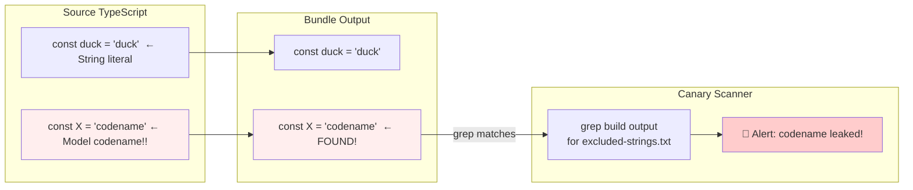

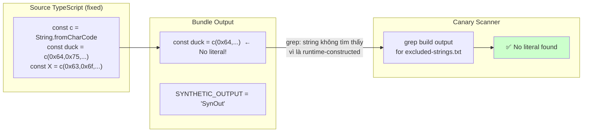

金絲雀檢查仍然適用於實際的**代號**（在其他地方仍然是字串文字），而物種動物則被編碼以避免誤報。

** **

## 8. 隱藏斜線指令的完整列表

    命令/
    ├── ultraplan.tsx 🚀 多智能體規劃（30 分鐘雲）
    ├── 好友/🐾 虛擬寵物系統
    ├── Stickers/ 🎨 StickerMule 重定向
    ├── teleport/ 📡 將會話傳送到遠端
    ├── 語音/ 🎤 語音輸入
    ├── 回想/🔄 重播思考步驟
    ├── thinkback-play/ ▶️ 回放思考動畫
    ├── bughunter/ 🐛 自動 bug 狩獵代理
    ├── ctx_viz/ 📊 上下文視窗視覺化
    ├── heapdump/ 🔍 V8 堆轉儲（調試記憶體）
    ├── perf-issue/ ⚡ 使用設定檔報告效能問題
    ├── sandbox-toggle/ 🔒 切換沙箱模式
    ├── 快退/ ⏪ 將對話快退到檢查點
    ├── 夢想/💭（DreamTask系統）
    ├── 分享/ 🔗 分享會
    ├── 見解/ 📈 使用見解
    ├── 簡短/📝 總結對話
    ├── 緊湊/ 🗜️ 緊湊上下文窗口
    ├── ultraplan.tsx 📋 UltraPlan
    ├── Advisor/ 🤖 模型顧問設置
    ├── 桌面/ 🖥️ 桌面集成
    ├── 手機/📱 手機伴侶
    ├── good-claude/👍 標記良好的回應
    ├── ant-trace/ 🔬 內部人類追踪
    └── ...

**特別： `/stickers`**

```typescript
export async function call(): Promise<LocalCommandResult> {
  const url = 'https://www.stickermule.com/claudecode'
  await openBrowser(url)
  return { type: 'text', value: 'Opening sticker page in browser...' }
}
```

溫和的營銷復活節彩蛋。類型 `/stickers` → 瀏覽器開啟 Claude Code 貼圖商店。

** **

## 9. 特徵標誌系統 --- GrowthBook + Statsig

### 9.1。兩個並行的特徵標誌系統

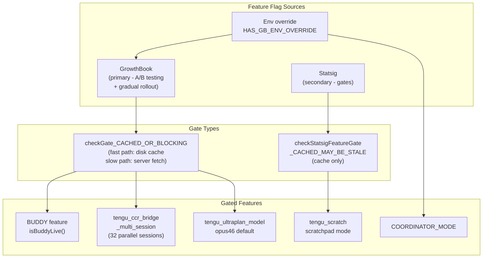

### 9.2。多會話 Bridge 的推出策略

```typescript
/**
 * GrowthBook gate cho multi-session spawn modes.
 * Rollout staged via targeting rules: ants first, then gradual external.
 * Uses BLOCKING check (không dùng stale cache) để không từ chối nhầm.
 */
async function isMultiSessionSpawnEnabled(): Promise<boolean> {
  return checkGate_CACHED_OR_BLOCKING('tengu_ccr_bridge_multi_session')
}

const SPAWN_SESSIONS_DEFAULT = 32  // max 32 sessions song song
```

Anthropic 首先向內部使用者（「螞蟻」）推出多會話，然後逐漸向外部使用者推出。這是最佳實踐：Anthropic 本人就是第一隻小白鼠。

** **

## 10.值得學習的實作細節

### 10.1。 safeFilenameId --- 防止路徑遍歷

```typescript
export function safeFilenameId(id: string): string {
  // Sanitize session ID cho filename, ngăn path traversal (../, /)
  return id.replace(/[^a-zA-Z0-9_-]/g, '_')
}
```

簡單但真實。來自伺服器的會話 ID 不受信任 --- 在用作檔案名稱之前必須進行清理。

### 10.2。 PermissionRequest --- 每次呼叫工具權限

```typescript
// Control request từ child CLI khi cần permission cho tool cụ thể
type PermissionRequest = {
  type: 'control_request'
  request_id: string
  request: {
    subtype: 'can_use_tool'
    tool_name: string
    input: Record<string, unknown>  // Parameters của tool call
    tool_use_id: string
  }
}
```

將權限請求橋轉發到伺服器（claude.ai UI），以便使用者批准/拒絕**每個特定工具呼叫**，而不是整個工具類別。細化權限模型。

### 10.3。 SessionActivity---即時狀態顯示

```typescript
const TOOL_VERBS: Record<string, string> = {
  Read: 'Reading',
  Write: 'Writing',
  Edit: 'Editing',
  MultiEdit: 'Editing',
  Bash: 'Running',
  Glob: 'Searching',
  Grep: 'Searching',
  WebFetch: 'Fetching',
  WebSearch: 'Searching',
  Task: 'Running task',
}
// STATUS_UPDATE_INTERVAL_MS = 1_000
```

儀表板每 1 秒更新一次處理動詞：「讀取 package.json」、「編輯 src/auth.ts」 --- 小 UX 但值得學習。

** **

## 11. 結論：經驗教訓

### 關於產品設計

Buddy/Companion 是**智慧遊戲化**的一個範例：不是一個離散的迷你遊戲，而是一個自然整合到工作流程中的伴侶。從userId捲動→永久同伴→使用者有附件。稀有度系統→社交分享（「我有傳奇水豚」）。語音氣泡→同伴的「存在感」而不會破壞焦點。

### 技術上

**您應該立即應用的 3 種技巧：**

1. **推測性 I/O**：應用程式開始載入後，在需要結果之前立即啟動非同步操作。 Claude Code 以這種方式節省了 175 毫秒/啟動時間。

2. **確定性隨機性的種子 PRNG**：當您想要隨機但可重複的（頭像、同伴、測試資料）時，Mulberry32 + userId 種子是正確的模式。

3. **CI/CD 中的金絲雀偵測**：掃描建置工件以尋找洩漏的秘密/代號是一種有效且便宜的保護層。

### 關於安全

> **指南**：npm 套件中的程式碼是 **公開**。無論多麼縮小或混淆，它仍然可以被逆向工程。

人類知道這一點——這就是為什麼：

- 秘密位於伺服器端配置（GrowthBook）中，而不是在捆綁包中
- 會話令牌是動態取得的，沒有硬編碼
- 金絲雀偵測CI管道

如果您正在交付具有敏感業務邏輯的 npm 套件：假設對手可以讀取您的程式碼並設計適當的安全模型。

** **

_本文基於直接分析npm套件中提取的源碼 `@anthropic-ai/claude-code` v2.1.89（2026 年 3 月 31 日發布）。所有程式碼片段均來自 npm 註冊表上的公共工件。 _
